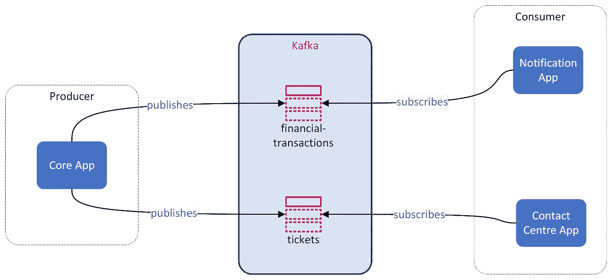
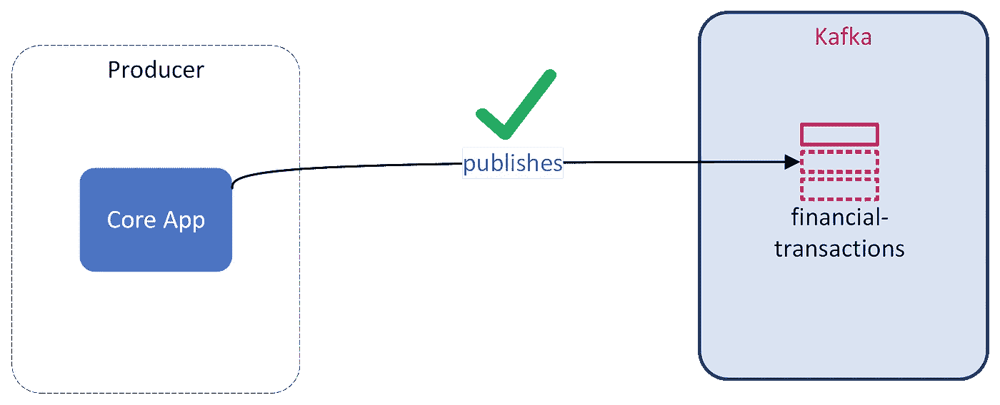
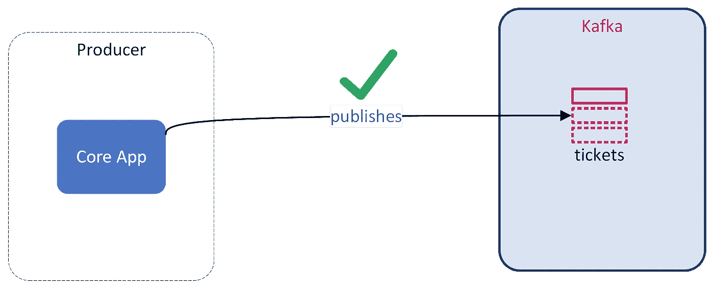
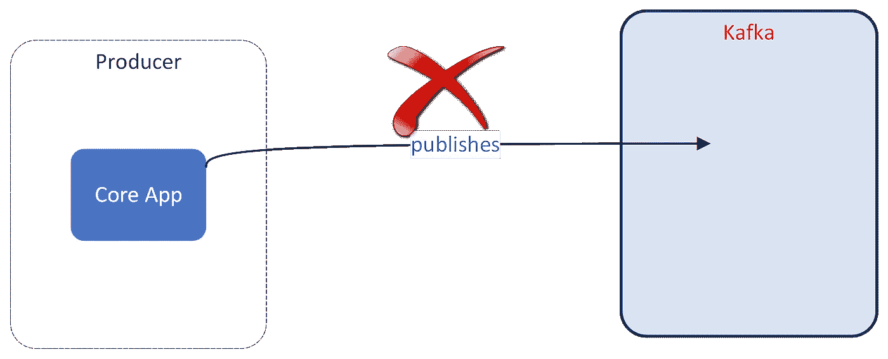
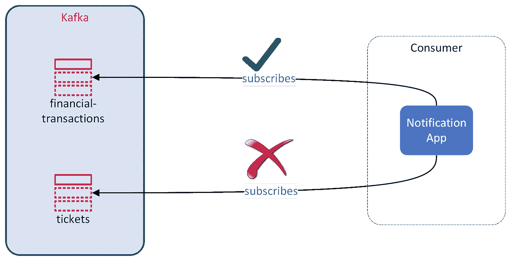
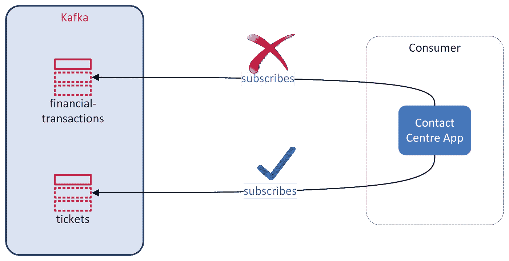

# 用户在 Kafka 上的简单 authN 和 authZ

> 原文：<https://blog.devgenius.io/simple-authn-and-authz-on-kafka-for-users-a557066a097c?source=collection_archive---------9----------------------->

[在之前的文章](/apache-kafka-on-kubernetes-using-strimzi-27d47b6b13bc)中，我们使用 [Strimzi](https://strimzi.io/) 创建了一个简单的 [Apache Kafka](https://kafka.apache.org/) 集群。该群集没有应用任何身份验证或授权。这在本地开发环境中是可以的，但在生产环境中是不可接受的。

安全性可以以多种方式应用:

*   基础架构层—通过实施网络策略、入口规则、相互 TLS 等
*   应用层—使用相互 TLS、oauth、SCRAM 等

> 相互 TLS 兼具基础设施和应用层安全性。它提供了非常强大的安全性，但是如果没有合适的解决方案，可能会有很大的运营开销。

Strimzi 提供了各种保护 Kafka 集群的方法。

**认证**:

*   相互 TLS
*   急停-SHA-512
*   OAUTH 2.0 令牌

**授权**:

*   简单授权
*   OAUTH 2.0 基于令牌的授权
*   开放策略代理
*   自定义授权

> OPA 是 CNCF 孵化项目，是非常强大的政策引擎。它在基于 Kubernetes 和不基于 Kubernetes 的环境中都变得非常流行。将来，我会写一篇关于使用 Strimzi 在 Kafka 中启用 OPA 的文章。

在本文中，我们将介绍以下安全访问 Kafka 集群的机制

*   认证—使用紧急停堆 SHA-512
*   授权—简单授权

作为实施的一部分，我们希望实现几件事情:

*   制作人 app，姑且称之为*核心 App* ，写一个包含客户所有金融交易的话题`financial-transactions`。
*   一个消费 app，姑且称之为*通知 App* ，可以从一个话题`financial-transactions`中读取。它使用这些数据，并向执行金融交易的帐户的所有者发送通知
*   *核心 App* 也写入一个主题`tickets`，其中登记了客户所有人为联络中心团队提出的所有支持请求。
*   一个消费者应用程序，姑且称之为*联络中心应用程序*，观察主题`tickets`中的消息，并为运营人员启动工作流程。

银行系统是一个复杂的领域，会涉及到多种服务。然而，这里的目标是尽可能简单地解释安全模式。这里提到了一个非常简单的场景。

我们的建筑的鸟瞰图如下所示。



整体架构

安全架构目标:

*   仅允许核心应用发布到主题`financial-transactions`
*   仅允许核心应用发布到主题`tickets`
*   只有通知应用程序才允许阅读主题`financial-transactions`
*   仅允许联络中心 App 读取主题`tickets`
*   核心 App 的系统用户为`core-app-usr-1`
*   通知 App 的系统用户为`notification-app-usr-1`
*   联络中心 App 的系统用户为`contact-centre-usr-1`

作为本文的一部分，我将假设您具备以下条件:

*   安全的 Kubernetes 集群
*   簇中的 Strimzi 算子
*   到集群的连接

您可以阅读文章[Apache Kafka on Kubernetes](/apache-kafka-on-kubernetes-using-strimzi-27d47b6b13bc)并了解如何在 Kubernetes 集群上安装 Strimzi。本文中的示例代码依赖于该文章中的各种基础设施和应用程序组件以及指令。

> ***相关文章列表*** :
> 
> [第 1 部分——使用 Strimzi 的 Kubernetes 上的 Apache Kafka](/apache-kafka-on-kubernetes-using-strimzi-27d47b6b13bc)
> 
> [第 2 部分—针对外部用户的 Kafka 上的简单 authN 和 authZ](/simple-authn-and-authz-on-kafka-for-users-a557066a097c)

# Strimzi 运算符管理的 Kafka 实例

我们将在专用名称空间`core-kafka-cluster`创建一个安全集群。

```
kubectl create namespace core-kafka-cluster
```

我们假设 Strimzi 操作符安装在名称空间`strimzi`中。让我们创建角色绑定以允许管理 Kafka 集群。

绑定到集群角色`strimzi-cluster-operator-namespaced`:

```
cat <<EOF | kubectl create -n core-kafka-cluster -f - 
apiVersion: rbac.authorization.k8s.io/v1
kind: RoleBinding
metadata:
  name: strimzi-cluster-operator
  labels:
    app: strimzi
subjects:
  - kind: ServiceAccount
    name: strimzi-cluster-operator
    namespace: strimzi
roleRef:
  kind: ClusterRole
  name: strimzi-cluster-operator-namespaced
  apiGroup: rbac.authorization.k8s.io
EOF
```

绑定到集群角色`strimzi-entity-operator`:

```
cat <<EOF | kubectl create -n core-kafka-cluster -f -
apiVersion: rbac.authorization.k8s.io/v1
kind: RoleBinding
metadata:
  name: strimzi-cluster-operator-entity-operator-delegation
  labels:
    app: strimzisubjects:
  - kind: ServiceAccount
    name: strimzi-cluster-operator
    namespace: strimzi
roleRef:
  kind: ClusterRole
  name: strimzi-entity-operator
  apiGroup: rbac.authorization.k8s.io
EOF
```

现在我们将创建操作符来管理名称空间`core-kafka-cluster`中的集群:

```
cat <<EOF | kubectl create -n strimzi -f - 
apiVersion: apps/v1
kind: Deployment
metadata:
  name: strimzi-cluster-operator-core-kafka-cluster
  labels:
    app: strimzi
spec:
  replicas: 1
  selector:
    matchLabels:
      name: strimzi-cluster-operator
      strimzi.io/kind: cluster-operator
  template:
    metadata:
      labels:
        name: strimzi-cluster-operator
        strimzi.io/kind: cluster-operator
    spec:
      serviceAccountName: strimzi-cluster-operator
      volumes:
        - name: strimzi-tmp
          emptyDir:
            medium: Memory
            sizeLimit: 1Mi
        - name: co-config-volume
          configMap:
            name: strimzi-cluster-operator
      containers:
        - name: strimzi-cluster-operator
          image: quay.io/strimzi/operator:0.27.0
          ports:
            - containerPort: 8080
              name: http
          args:
            - /opt/strimzi/bin/cluster_operator_run.sh
          volumeMounts:
            - name: strimzi-tmp
              mountPath: /tmp
            - name: co-config-volume
              mountPath: /opt/strimzi/custom-config/
          env:
            - name: STRIMZI_NAMESPACE
              value: core-kafka-cluster
            - name: STRIMZI_FULL_RECONCILIATION_INTERVAL_MS
              value: "120000"
            - name: STRIMZI_OPERATION_TIMEOUT_MS
              value: "300000"
            - name: STRIMZI_DEFAULT_TLS_SIDECAR_ENTITY_OPERATOR_IMAGE
              value: quay.io/strimzi/kafka:0.27.0-kafka-3.0.0
            - name: STRIMZI_DEFAULT_KAFKA_EXPORTER_IMAGE
              value: quay.io/strimzi/kafka:0.27.0-kafka-3.0.0
            - name: STRIMZI_DEFAULT_CRUISE_CONTROL_IMAGE
              value: quay.io/strimzi/kafka:0.27.0-kafka-3.0.0
            - name: STRIMZI_DEFAULT_TLS_SIDECAR_CRUISE_CONTROL_IMAGE
              value: quay.io/strimzi/kafka:0.27.0-kafka-3.0.0
            - name: STRIMZI_KAFKA_IMAGES
              value: |
                2.8.0=quay.io/strimzi/kafka:0.27.0-kafka-3.0.0
                2.8.1=quay.io/strimzi/kafka:0.27.0-kafka-3.0.0
                3.0.0=quay.io/strimzi/kafka:0.27.0-kafka-3.0.0
            - name: STRIMZI_KAFKA_CONNECT_IMAGES
              value: |
                2.8.0=quay.io/strimzi/kafka:0.27.0-kafka-3.0.0
                2.8.1=quay.io/strimzi/kafka:0.27.0-kafka-3.0.0
                3.0.0=quay.io/strimzi/kafka:0.27.0-kafka-3.0.0
            - name: STRIMZI_KAFKA_MIRROR_MAKER_IMAGES
              value: |
                2.8.0=quay.io/strimzi/kafka:0.27.0-kafka-3.0.0
                2.8.1=quay.io/strimzi/kafka:0.27.0-kafka-3.0.0
                3.0.0=quay.io/strimzi/kafka:0.27.0-kafka-3.0.0
            - name: STRIMZI_KAFKA_MIRROR_MAKER_2_IMAGES
              value: |
                2.8.0=quay.io/strimzi/kafka:0.27.0-kafka-3.0.0
                2.8.1=quay.io/strimzi/kafka:0.27.0-kafka-3.0.0
                3.0.0=quay.io/strimzi/kafka:0.27.0-kafka-3.0.0
            - name: STRIMZI_DEFAULT_TOPIC_OPERATOR_IMAGE
              value: quay.io/strimzi/operator:0.27.0
            - name: STRIMZI_DEFAULT_USER_OPERATOR_IMAGE
              value: quay.io/strimzi/operator:0.27.0
            - name: STRIMZI_DEFAULT_KAFKA_INIT_IMAGE
              value: quay.io/strimzi/operator:0.27.0
            - name: STRIMZI_DEFAULT_KAFKA_BRIDGE_IMAGE
              value: quay.io/strimzi/kafka-bridge:0.21.2
            - name: STRIMZI_DEFAULT_JMXTRANS_IMAGE
              value: quay.io/strimzi/jmxtrans:0.27.0
            - name: STRIMZI_DEFAULT_KANIKO_EXECUTOR_IMAGE
              value: quay.io/strimzi/kaniko-executor:0.27.0
            - name: STRIMZI_DEFAULT_MAVEN_BUILDER
              value: quay.io/strimzi/maven-builder:0.27.0
            - name: STRIMZI_OPERATOR_NAMESPACE
              valueFrom:
                fieldRef:
                  fieldPath: metadata.namespace
            - name: STRIMZI_FEATURE_GATES
              value: ""
          livenessProbe:
            httpGet:
              path: /healthy
              port: http
            initialDelaySeconds: 10
            periodSeconds: 30
          readinessProbe:
            httpGet:
              path: /ready
              port: http
            initialDelaySeconds: 10
            periodSeconds: 30
          resources:
            limits:
              cpu: 1000m
              memory: 384Mi
            requests:
              cpu: 200m
              memory: 384Mi
  strategy:
    type: Recreate
EOF
```

操作员窗格成功运行后，我们将创建一个具有以下属性的 Kafka 集群:

*   监听端口`9094`上的外部流量
*   使用`SCRAM-SHA-512`验证用户
*   使用`Simple`授权策略
*   (对于本地开发人员)监听器类型为`nodeport`

```
cat <<EOF | kubectl create -n core-kafka-cluster -f -
apiVersion: kafka.strimzi.io/v1beta2
kind: Kafka
metadata:
  name: kafka
spec:
  kafka:
    version: 3.0.0
    replicas: 3
    listeners:
      - name: plain
        port: 9092
        type: internal
        tls: false
      - name: tls
        port: 9093
        type: internal
        tls: true
        authentication:
          type: tls
      - name: external
        port: 9094
        type: nodeport # Listening on one of the K8s node
        tls: false # TLS is disabled to keep example simple
        authentication: 
           type: scram-sha-512 # Case sensitive declaration of authenitcation type
    authorization:
       type: simple # Instructing Kafka to use Simple authorization policies
    storage:
      type: ephemeral
      volumes:
      - id: 0
        type: ephemeral
        size: 1Gi
        deleteClaim: false
    config:
      offsets.topic.replication.factor: 1
      transaction.state.log.replication.factor: 1
      transaction.state.log.min.isr: 1
      default.replication.factor: 1
      min.insync.replicas: 1
  zookeeper:
    replicas: 3
    storage:
      type: ephemeral
      size: 1Gi
      deleteClaim: false
  entityOperator:
    topicOperator: {}
    userOperator: {}
EOF
```

我们需要 Kafka 集群做好准备。一旦 Kafka 集群启动并运行，执行下面的命令来获得我们将需要的引导服务器列表。

```
kubectl -n core-kafka-cluster get kafkas.kafka.strimzi.io kafka -o jsonpath='{.status.listeners[?(@.type=="external")].bootstrapServers}'
```

这将为您提供类似下面的输出，包含 Kafka 经纪人的列表:

```
192.168.64.22:30108,192.168.64.23:30108
```

我们将使用示例输出作为本文其余部分的代理列表。

# 保护主题

## 创建主题

让我们执行下面的命令来创建三个主题`financial-transactions`、`tickets`和`assets`。

```
cat <<EOF | kubectl create -n core-kafka-cluster -f -
---
apiVersion: kafka.strimzi.io/v1beta2
kind: KafkaTopic
metadata:
  name: financial-transactions 
  labels:
    strimzi.io/cluster: kafka
spec:
  partitions: 2
  replicas: 1
  config:
    retention.ms: 900000
    segment.bytes: 1073741824
---
apiVersion: kafka.strimzi.io/v1beta2
kind: KafkaTopic
metadata:
  name: tickets 
  labels:
    strimzi.io/cluster: kafka
spec:
  partitions: 2
  replicas: 1
  config:
    retention.ms: 900000
    segment.bytes: 1073741824
---
apiVersion: kafka.strimzi.io/v1beta2
kind: KafkaTopic
metadata:
  name: assets 
  labels:
    strimzi.io/cluster: kafka
spec:
  partitions: 2
  replicas: 1
  config:
    retention.ms: 900000
    segment.bytes: 1073741824
---
EOF
```

## 为核心应用程序用户配置访问权限

现在，我们将为核心应用程序创建一个用户，其安全目标如下:

*   可以写到题目`financial-transactions`
*   可以写主题`tickets`
*   我不能阅读这些题目中的任何一个
*   应用程序的用户 id 为`core-app-usr-1`

```
cat <<EOF | kubectl create -n core-kafka-cluster -f -
apiVersion: kafka.strimzi.io/v1beta2
kind: KafkaUser
metadata:
  name: core-app-usr-1 # Name of the user
  labels:
    strimzi.io/cluster: kafka # Name of the Kafka cluster
spec:
  authentication:
    type: scram-sha-512
  authorization:
    type: simple  # Authorization policy, must match with whats defined during cluster creation
    acls:
      - resource:
          type: topic # Type of Kafka resource
          name: tickets # Name of the Kafka resource
          patternType: literal # Matching rule
        operation: Write # Permitted operation
        type: allow # Always defaults to allow, optional field.
      - resource:
          type: topic
          name: financial-transactions
          patternType: literal
        operation: Write
EOF
```

> 注意:您可以在[strim zi ACL rule schema reference](https://strimzi.io/docs/operators/latest/using.html#type-AclRule-reference)阅读更多关于支持的 ACL 规则的信息。

## 配置通知应用程序的访问权限

现在，我们将为通知应用程序创建 usr，其安全目标如下:

*   可以从题目`financial-transactions`中阅读
*   可以作为消费群体阅读`notification-app`
*   应用程序的用户 id`notification-app-usr-1`

```
cat <<EOF | kubectl create -n core-kafka-cluster -f -
apiVersion: kafka.strimzi.io/v1beta2
kind: KafkaUser
metadata:
  name: notification-app-usr-1 # The notification app user
  labels:
    strimzi.io/cluster: kafka
spec:
  authentication:
    type: scram-sha-512
  authorization:
    type: simple
    acls:
      - resource:
          type: topic
          name: financial-transactions
          patternType: literal
        operation: Read
      - resource:
          type: group # Resource type is consumer group
          name: notification-app # Name of the consumer group
          patternType: literal # Exact matching of pattern
        operation: Read
EOF
```

## 配置联系中心应用程序的访问权限

现在，我们将为联络中心应用程序创建用户，其安全目标如下:

*   可以阅读题目`tickets`
*   可以解读为消费群体`contact-centre-app`
*   应用程序的用户 id`contact-centre-app-usr-1`

```
cat <<EOF | kubectl create -n core-kafka-cluster -f -
apiVersion: kafka.strimzi.io/v1beta2
kind: KafkaUser
metadata:
  name: contact-centre-app-usr-1 # The contact centre app user
  labels:
    strimzi.io/cluster: kafka
spec:
  authentication:
    type: scram-sha-512
  authorization:
    type: simple  
    acls:
      - resource:
          type: topic
          name: tickets
          patternType: literal
        operation: Read
      - resource:
          type: group 
          name: contact-centre-app
          patternType: literal
        operation: Read
EOF
```

## 用户访问信息

如果在此阶段之前一切正常，那么您可以通过执行以下命令来查看在集群上创建的用户列表:

```
kubectl -n core-kafka-cluster  get kafkausers.kafka.strimzi.io
```

所有用户都应持有标题`READY`下的值`true`。

在 Strimzi 创建用户的过程中，它为每个用户生成认证秘密(即密码)和 [JAAS](https://en.wikipedia.org/wiki/Java_Authentication_and_Authorization_Service) 令牌。安全配置存储在 Kubernetes 的秘密资源中，其中资源的名称与用户名相同。

执行以下命令为用户获取 JAAS 令牌`core-app-usr-1`

```
kubectl -n core-kafka-cluster get secrets core-app-usr-1 -o jsonpath='{.data.sasl\.jaas\.config}'
```

这些将探测一个`base64`编码的 JAAS 令牌，如下所示:

```
b3JnLmFwYWNoZS5rYWZrYS5jb21tb24uc2VjdXJpdHkuc2NyYW0uU2NyYW1Mb2dpbk1vZHVsZSByZXF1aXJlZCB1c2VybmFtZT0iY29yZS1hcHAtdXNyLTEiIHBhc3N3b3JkPSJkVXlZU0d5SVZ4VXIiOw==
```

在与 Kafka 集群交互时，应用程序的用户将需要此令牌。可以通过执行以下命令来解码该值:

```
echo -n b3JnLmFwYWNoZS5rYWZrYS5jb21tb24uc2VjdXJpdHkuc2NyYW0uU2NyYW1Mb2dpbk1vZHVsZSByZXF1aXJlZCB1c2VybmFtZT0iY29yZS1hcHAtdXNyLTEiIHBhc3N3b3JkPSJkVXlZU0d5SVZ4VXIiOw== | base64 -d
```

输出如下所示:

```
org.apache.kafka.common.security.scram.ScramLoginModule required username="core-app-usr-1" password="dUyYSGyIVxUr";
```

> 注意:在生产环境中，可以执行以下操作:
> 
> 1.集群管理员或 Kafka 管理员读取秘密并安全地存储它们(比如说在 [Hashicorp Vault](https://www.vaultproject.io) )并将它们作为环境值注入到生产者/消费者应用中。
> 
> 2.创建 Kubernetes ACL 策略(例如，使用 [OPA](https://www.openpolicyagent.org) 和 [Gatekeeper](https://open-policy-agent.github.io/gatekeeper/website/docs/) )并使秘密对相同集群中的另一个名称空间中托管的生产者/消费者应用可用。
> 
> 第二种方法没有操作开销，秘密永远不会离开平台。

# 测试安全控制

我们将通过使用来自官方 Kafka 下载页面的 Kafka shell 脚本来测试所应用的安全性。

## 客户端配置文件

让我们为用户`core-app-usr-1`创建客户机配置。

```
# Create client config file
cat <<EOF > core-app-usr-1.properties 
sasl.jaas.config=org.apache.kafka.common.security.scram.ScramLoginModule required username="core-app-usr-1" password="dUyYSGyIVxUr";
security.protocol=SASL_PLAINTEXT
sasl.mechanism=SCRAM-SHA-512
EOF
```

密钥`sasl.jaas.config`保存从 Kubernetes 秘密中提取的 JAAS 配置，该秘密在名称空间`core-kafka-cluster`中被命名为`core-app-usr-1`。

对于用户`notification-app-usr-1`和`contact-centre-app-usr-1`，需要重复同样的操作。

在我的 Linux 机器上运行的一个方便的命令是:

```
cat <<EOF > core-app-usr-1.properties
sasl.jaas.config=`kubectl -n core-kafka-cluster get secrets core-app-usr-1 -o jsonpath='{.data.sasl\.jaas\.config}' | base64 -d`
security.protocol=SASL_PLAINTEXT
sasl.mechanism=SCRAM-SHA-512
EOF
```

## 发布主题为“金融交易”的核心应用程序



核心 app 是制作人 app，会发布到两个话题。让我们在终端上执行下面的命令来连接并发布到主题`financial-transactions`:

```
./bin/kafka-console-producer.sh --broker-list 192.168.64.22:30108,192.168.64.23:30108 --producer.config core-app-usr-1.properties --topic financial-transactions
```

其中，` 192.168.64.22:30108，192.168.64.23:30108 '是卡夫卡经纪人列表。

您还可以执行这个更复杂的命令来动态获取代理列表:

```
./bin/kafka-console-producer.sh --broker-list `kubectl -n core-kafka-cluster get kafkas.kafka.strimzi.io kafka -o jsonpath='{.status.listeners[?(@.type=="external")].bootstrapServers}'` --producer.config core-app-usr-1.properties --topic financial-transactions
```

一旦连接上，键入任意数量的消息到主题`financial-transactions`。

## 发布为主题“票证”的核心应用程序



现在，在另一个终端中，让我们将核心应用程序用户连接到主题`tickets`:

```
./bin/kafka-console-producer.sh --broker-list `kubectl -n core-kafka-cluster get kafkas.kafka.strimzi.io kafka -o jsonpath='{.status.listeners[?(@.type=="external")].bootstrapServers}'` --producer.config core-app-usr-1.properties --topic tickets
```

一旦连接到主题，输入任意数量的消息。

## 发布主题为“资产”的核心应用程序



现在，在另一个终端中，让我们将核心应用程序用户连接到主题`assets`:

```
./bin/kafka-console-producer.sh --broker-list `kubectl -n core-kafka-cluster get kafkas.kafka.strimzi.io kafka -o jsonpath='{.status.listeners[?(@.type=="external")].bootstrapServers}'` --producer.config core-app-usr-1.properties --topic assets
```

一旦连接到主题`assets`，输入消息。您会注意到下面的错误消息。

```
ERROR [Producer clientId=console-producer] Topic authorization failed for topics [assets] (org.apache.kafka.clients.Metadata)
```

这里发生了什么？

在创建用户`core-app-usr-1`时，我们授予它写主题`financial-transactions`和`tickets`的权限。但是主题`assets`没有规则。假设用户存在于 Kafka 上，它*认证*用户，但是它*不授权*用户。

因此，你可以看到，只有合法的应用程序可以发布到主题`assets`，即使他们有权访问集群。

## 从主题中作为通知应用程序阅读



现在让我们使用客户机配置文件`notification-app-usr-1.properties`作为消费者进行连接。

```
./bin/kafka-console-consumer.sh --bootstrap-server `kubectl -n core-kafka-cluster get kafkas.kafka.strimzi.io kafka -o jsonpath='{.status.listeners[?(@.type=="external")].bootstrapServers}'` --consumer.config notification-app-usr-1.properties --topic financial-transactions --from-beginning
```

您将收到类似于下面的错误消息:

```
ERROR Error processing message, terminating consumer process:  (kafka.tools.ConsoleConsumer$)
org.apache.kafka.common.errors.GroupAuthorizationException: Not authorized to access group: console-consumer-78145
```

那么为什么会出现这个错误信息呢？

嗯，我们声明了一个策略，消费者应用程序用户`notification-app-usr-1`可以收听`financial-transactions`，但它只能在消费者组`notification-app`下连接时收听。当用户群信息在连接期间缺失时，Kafka 会创建一个动态用户群(在本例中为`console-consumer-78145`)，而我们的 Kafka 集群策略会拒绝它。

因此，让我们通过执行以下命令来修复它:

```
./bin/kafka-console-consumer.sh --bootstrap-server `kubectl -n core-kafka-cluster get kafkas.kafka.strimzi.io kafka -o jsonpath='{.status.listeners[?(@.type=="external")].bootstrapServers}'` --consumer.config notification-app-usr-1.properties --topic financial-transactions --from-beginning --group notification-app
```

现在，您将在控制台上看到关于主题`financial-transactions`的所有消息。

> 本文中使用的主题的 TTL 是 15 分钟，所以消息可能已经自动过期。只需在与主题`financial-transactions`相关的生产者用户`core-app-usr-1`连接的控制台中输入额外信息。

## 主题阅读作为联络中心应用程序



现在让我们使用客户端配置文件`contact-centre-app-usr-1.properties`作为消费者进行连接。

```
./bin/kafka-console-consumer.sh --bootstrap-server `kubectl -n core-kafka-cluster get kafkas.kafka.strimzi.io kafka -o jsonpath='{.status.listeners[?(@.type=="external")].bootstrapServers}'` --consumer.config contact-centre-app-usr-1.properties --topic financial-transactions --from-beginning --group contact-centre-app
```

您将收到类似于下面的错误消息:

```
ERROR [Consumer clientId=consumer-contact-centre-app-1, groupId=contact-centre-app] Topic authorization failed for topics [financial-transactions] (org.apache.kafka.clients.Metadata)
```

那么为什么会出现这个错误信息呢？

嗯，在针对`contact-centre-usr-1`的 ACL 策略中，只允许作为消费者组`contact-centre-app`进行身份验证，并读取主题为`tickets`的消息。没有允许它读取主题`financial-transactions`的策略。

因此，让我们通过执行下面的命令使它从正确的主题中读取:

```
./bin/kafka-console-consumer.sh --bootstrap-server `kubectl -n core-kafka-cluster get kafkas.kafka.strimzi.io kafka -o jsonpath='{.status.listeners[?(@.type=="external")].bootstrapServers}'` --consumer.config contact-centre-app-usr-1.properties --topic tickets --from-beginning --group contact-centre-app
```

现在，您将在控制台上看到主题`tickets`的所有消息。

# 摘要

瞧啊。您已经使用 authn/authz 策略作为代码 IaC 模拟了一个安全的 Kafka 集群。本文还展示了我们如何在所有 Kafka 资源中实施良好的实践，并在应用程序在不同环境之间移动时一致地定义跨不同环境的安全策略。全部通过 Strimzi 运算简化。