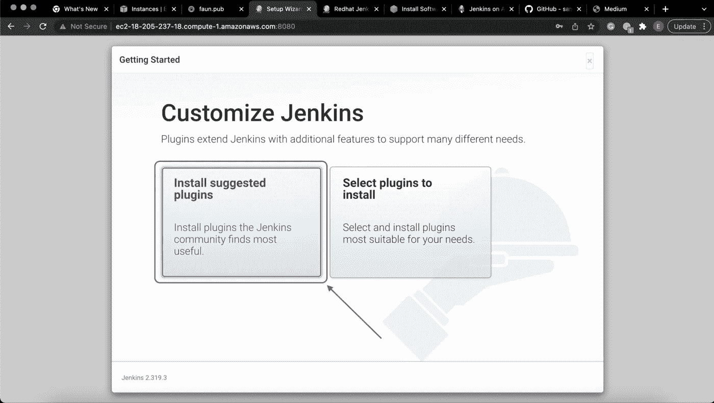

# 使用 Jenkins 的新手的简单 CI/CD 指南。第二部分

> 原文：<https://blog.devgenius.io/simple-ci-cd-for-newbies-using-jenkins-part-2-e9fbe9d1e54?source=collection_archive---------5----------------------->


如果你错过了第一篇文章，这里有一个链接:

[**使用 Jenkins 的新手简易 CI/CD 指南。第一部分**](https://medium.com/@uerosuo/simple-ci-cd-guide-for-newbies-using-jenkins-part-1-f04c43a206d6)

**安装詹金斯:**

使用以下命令添加 Jenkins 存储库并从 Jenkins CI 导入密钥文件，以便从软件包中启用 Jenkins 安装:

```
[ec2-user ~]$ sudo wget -O /etc/yum.repos.d/jenkins.repo \[https://pkg.jenkins.io/redhat-stable/jenkins.repo](https://pkg.jenkins.io/redhat-stable/jenkins.repo)[ec2-user ~]$ sudo rpm --import [https://pkg.jenkins.io/redhat-stable/jenkins.io.key](https://pkg.jenkins.io/redhat-stable/jenkins.io.key)
```


**安装詹金斯**

在添加了 Jenkins 库和密钥文件之后，您需要为 Enterprise**Linux**(**EPEL**)库启用 **Extra** 包。- [**亚马逊**](https://docs.aws.amazon.com/AWSEC2/latest/UserGuide/add-repositories.html)

启用“EPEL”后，使用以下命令继续安装 Jenkins:

```
[ec2-user ~]$ sudo yum install jenkins
```


**安装詹金斯**

安装过程将会运行，并在完成时给出提示。

运行以下命令启动 Jenkins 并确认其状态:

```
[ec2-user ~]$ sudo systemctl start jenkins[ec2-user ~]$ sudo systemctl status jenkins
```


**首发詹金斯**

# 配置 Jenkins

Jenkins 现已安装并运行，请继续配置 Jenkins。为此，请使用浏览器通过管理控制台连接到 Jenkins:

回到您的亚马逊(AWS)帐户，复制公共 IPv4 DNS 地址:


**公共 IPv4 DNS 地址**

`http://<your_server_public_DNS_address>:8080`

将地址粘贴到您最喜欢的浏览器上，然后启动

```
[http://ec2-18-205-237-18.compute-1.amazonaws.com:8080](http://ec2-18-205-237-18.compute-1.amazonaws.com:8080)
```

这将打开 Jenkins 配置页面，帮助您入门。

运行以下命令在终端上显示初始密码:

```
[ec2-user ~]$ sudo cat /var/lib/jenkins/secrets/initialAdminPassword
```


**初始密码显示命令**

执行命令后，复制显示的字母数字键:


**初始密码显示**

将从您的终端复制的密码粘贴到 Jenkins 配置页面上提供的字段中，然后单击继续。


**詹金斯配置页面**

在“入门”页面上，单击“安装建议的插件”来初始化所需的插件，以帮助执行项目。



**入门页面**

安装将运行一段时间，之后，它将加载 Jenkins 管理控制台。


**插件安装**

安装完成后，您会看到下面的提示。创建第一个管理员用户。


**创建第一个管理员用户页面**


**入门**

登录控制台后，配置 **Java** path、 **Maven** 和 **Git** :

点击控制台页面左侧的**管理詹金斯**。


**詹金斯仪表板**

点击**全局刀具配置**按钮。


**添加 JDK**

**添加 JDK** → **添加 Java 路径** → **取消勾选自动安装框并保存**。


**添加 JDK**

输入变量，如下所示:

```
**Name:**Java**JAVA_HOME:**/usr/lib/jvm/java
```

**Git** 一旦安装到实例上，就会被自动配置。


**添加 Git**

对于 Maven，输入下面的变量并取消选中自动安装按钮:

```
**Name:**Maven**MAVEN_HOME:**var/lib/maven/apache-maven-3.8.2
```


**添加美芬**

点击**保存**并进入**仪表盘**。

**安装插件**:

```
**Manage Jenkins** → **Manage Plugins** → **Available**
```


**詹金斯仪表盘**

在搜索框中输入“ **Deploy** ”，勾选结果旁边的框，选择 **Install without restart** 。


**插件管理器**

**设置 Tomcat 凭证:**

要使任何构建能够在 Tomcat 服务器上部署，您需要设置一个凭证。

```
**Manage Jenkins** → **Manage credentials**
```


**管理詹金斯**

```
**Global credentials** → **Add credentials**
```


**凭证**

输入以下信息:

```
**Username: admin
password: admin
ID: Admin
Description: Tomcat Admin**
```


**詹金斯/雄猫凭证**

点击**确定。**

**安装 Tomcat:**

运行以下命令来安装 **Tomcat** :

```
[ec2-user ~]$ cd ~[ec2-user ~]$ sudo mkdir tomcat && cd tomcat[ec2-user ~]$ sudo wget [tar.gz](https://dlcdn.apache.org/tomcat/tomcat-8/v8.5.76/bin/apache-tomcat-8.5.76.tar.gz)[ec2-user ~]$ sudo tar -xvzf apache-tomcat-8.5.76.tar.gz && cd apache-tomcat-8.5.76
```

这将成功运行安装过程，并在完成时给出提示。


**Tomcat 配置**

安装完成后，我们进入配置阶段。

**配置 Tomcat** :

Tomcat 最初通过端口 8080 连接，这恰好是 Jenkins 的默认端口连接器。

为了成功连接和配置 **Tomcat** ，我们需要从将连接器**端口**从 8080 → 8090 开始。

```
[ec2-user ~] → tomcat → apache-tomcat-8.5.76 → conf → server.xml
```

运行以下命令编辑连接器端口:

```
[ec2-user ~]$ cd tomcat[ec2-user ~]$ ls[ec2-user ~]$ cd apache-tomcat-8.5.76[ec2-user ~]$ ls[ec2-user ~]$ cd conf[ec2-user ~]$ ls[ec2-user ~]$ vim server.xml
```


**Tomcat 配置**

这将打开文本编辑器，按下键盘上的**“I”**键以启用**插入模式**，一旦启用，您将在页面底部看到 **—插入—** ，使用以下变量进行编辑:

```
8080 → 8090
```


**Tomcat 配置**

编辑完成后，使用以下命令保存并退出:

**“ESC”**键将退出插入模式，并且**“:wq”**将保存并退出。

现在我们可以通过 **8090** 端口连接到 **Tomcat 服务器**。


**Tomcat**

上面确认了 Tomcat 的成功安装，Tomcat 的版本显示在屏幕的左上方。

默认情况下，管理器只能由运行在 Tomcat 机器上的浏览器访问。现在，为了完全管理和访问服务器上的所有服务，我们需要修改限制，还需要分配**角色、权限**和**访问权限**，否则我们将得到如下所示的 **403 访问被拒绝**错误消息:


**403 访问被拒绝**

还记得我们添加了 **Tomcat 凭证**关于 **Jenkins** 的信息吗？是的，我们还需要在服务器上提供相同的信息(匹配)以在部署期间授予用户访问权限，以及提供其他有用的信息以授予他们对服务器的访问/权限。

**配置 Tomcat 用户:**

```
[ec2-user ~] → tomcat → apache-tomcat-8.5.76 → conf → tomcat-users.xml
```

运行这些命令来配置 **Tomcat 用户**:

```
[ec2-user ~]$ cd tomcat[ec2-user ~]$ ls[ec2-user ~]$ cd apache-tomcat-8.5.76[ec2-user ~]$ ls[ec2-user ~]$ cd conf[ec2-user ~]$ ls[ec2-user ~]$ vim tomcat-users.xml
```


**Tomcat 用户**

这将打开文本编辑器，按下键盘上的**“I”**键以启用**插入模式**，一旦启用，您将在页面底部看到 **—插入—** ，使用以下变量进行编辑:

```
<role rolename="manager-gui"/>
<role rolename="manager-script"/>
<role rolename="manager-jmx"/>
<role rolename="manager-status"/>
<role rolename="admin"/>
<user username="admin" password="admin" roles="admin,manager-gui,manager-script,manager-jmx,manager-status"/>
<user username="deployer" password="deployer" roles="manager-script"/>
<user username="tomcat" password="s3cret" roles="manager-gui"/>
```


**配置 Tomcat 用户**

编辑完成后，使用以下命令保存并退出:

**“ESC”**键将退出插入模式，**“:wq”**将保存并退出。

既然已经设置了角色，您就可以完全访问 Tomcat 服务器上的导航。提供所需凭证后，您可以访问**服务器状态**、**管理器应用**和**主机管理器**页面。


**雄猫**

**修改 Tomcat 限制:**

我们将通过注释掉默认 IP 地址来修改管理器的 **context.xml** 文件。当我带你完成这些步骤时，请和我呆在一起:

在您的终端上，运行以下命令:

```
[ec2-user ~]$ find / -name context.xml
```

这个命令将给出包含 **context.xml** 文件的位置列表，这是一个简单的定位器，它将帮助定位文件，而不必全力以赴地搜索它。


**Tomcat 配置**

```
[ec2-user ~]$ vim /root/tomcat/apache-tomcat-8.5.76/webapps/host-manager/META-INF/context.xml
```

这将打开文本编辑器，按下键盘上的**“I”**键以启用**插入模式**，一旦启用，您将在页面底部看到 **—插入—** ，使用以下变量进行编辑:

```
<!--  <Valve className="org.apache.catalina.valves.RemoteAddrValve"
  allow="127\.\d+\.\d+\.\d+|::1|0:0:0:0:0:0:0:1" /> -->
```

如下图所示:


**Tomcat 配置**

编辑完成后，使用以下命令保存并退出:

**“ESC”**键将退出插入模式，**“:wq”**将保存并退出。

```
[ec2-user ~]$ vim /root/tomcat/apache-tomcat-8.5.76/webapps/host-manager/META-INF/context.xml
```

这将打开文本编辑器，按下键盘上的**“I”**键以启用**插入模式**，一旦启用，您将在页面底部看到 **—插入—** ，使用以下变量进行编辑:

```
<!--  <Valve className="org.apache.catalina.valves.RemoteAddrValve"
  allow="127\.\d+\.\d+\.\d+|::1|0:0:0:0:0:0:0:1" /> -->
```

如下图所示:


**Tomcat 配置**

编辑完成后，使用以下命令保存并退出:

**“ESC”**键将退出插入模式，**“:wq”**将保存并退出。

现在，您必须关闭并再次启动您的 Tomcat 服务器。

运行这些命令:

```
[ec2-user ~]$ cd ~[ec2-user ~]$ cd ..[ec2-user ~]$ cd bin[ec2-user ~]$ shutdown.sh[ec2-user ~]$ startup.sh
```

现在，您可以不受任何限制地再次登录到 Tomcat 服务器，为您提供 **Admin/Manager** 访问权限。

请点击下面的链接查看本系列的结尾部分:

[**使用 Jenkins 的新手简单 CI/CD 指南。Part.3\.**](https://medium.com/@uerosuo/simple-ci-cd-guide-for-newbies-using-jenkins-part-3-2c06924db897)

现在，请记住，这篇文章不仅面向软件领域的专家，即使是新手也可以加入并学到很多东西，这就是为什么我试图用外行和专业术语将一切都讲清楚，所以如果您有任何问题，可以通过[**Twitter**](https://twitter.com/xsuox1)**联系我，或者通过**[**GitHub**](https://github.com/uerosuo)**找到我。**

**感谢阅读❤️**

如果你对这个话题有任何想法，请留下评论——我乐于学习和探索知识。

**点击订阅按钮，了解更多关于 DevOps 和云的内容。**