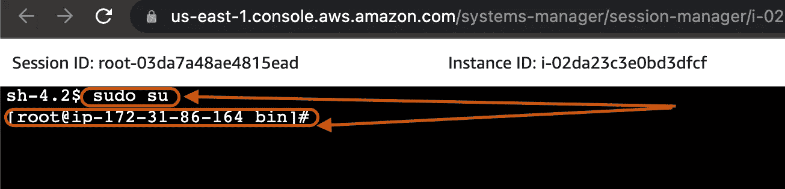

# 使用 Jenkins 的新手的简单 CI/CD 指南。第一部分。

> 原文：<https://blog.devgenius.io/simple-ci-cd-guide-for-newbies-using-jenkins-part-1-f04c43a206d6?source=collection_archive---------2----------------------->


在本文中，我将向您展示如何在 EC2 实例上使用 Jenkins 创建 CI/CD，并在 Tomcat 服务器上部署应用程序。在这个项目中，我将使用各种 DevOps 工具，如 Git，Jenkins，Maven，Java，AWS EC2 实例，Tomcat，PollSCM 等。

待办事项列表:

*   启动 EC2 实例。
*   在 EC2 实例上安装和创建 Java 环境。
*   安装 Git。
*   在 EC2 实例上安装和配置 Jenkins。
*   安装和配置 Maven。
*   安装和配置 Tomcat。
*   创建 web 应用程序。
*   通过 Tomcat 服务器部署应用程序/web 应用程序。

**步骤 1:启动 EC2 实例:-**

登录 AWS 账户，点击页面右上角的**服务**菜单，会出现下拉菜单，选择**计算**会弹出一个子菜单，选择 **EC2** ，如下图所示。这将把您带到 **EC2** 实例页面。


**亚马逊控制台**

继续进行**启动实例**。


**启动实例**

**启动实例**

进入实例页面后，第一步是选择 Amazon 机器映像(AMI)，这是设置 EC2 实例的第一步。选择自由层 **Amazon Linux 2 AMI (HVM) —内核 5.10，SSD 卷类型。**


选择一个 AMI

然后，第二步是选择实例类型，确保选中标记为“Free Tier Eligible”的框，现在单击屏幕右下角的**Next:Configure Instance Details**按钮。


**选择实例类型**

第三步**“配置实例详细信息”**将保留默认设置，并继续下一步。


**配置实例详细信息**

第四步是**“添加存储”**，也将保持默认设置不变。继续点击页面右下角的**添加标签**按钮，进入下一步。


**添加存储器**

第五步是**“添加标签”，**我们将向实例添加一个标签。点击**键**选项正下方的**添加标签**按钮。


**添加标签**

在**添加标签**页面上，将空字段标记如下**关键字:**名称，**值:** Jenkins_Server。点击**下一步:配置安全组**

在第六步**“配置安全组”**中，点击**添加规则。**


**配置安全组**

现在，我们将打开几个端口，使我们能够连接到我们不同的服务器。**添加类型**:自定义 TCP，**协议:** TCP，**端口范围** :8080，**添加类型**:自定义 TCP，**协议** : TCP，**端口范围** : 8090，**添加类型** : HTTP，**协议** : TCP，**端口范围** :80。点击**查看并启动。**

查看并**启动**该 **EC2 实例。**


**审查实例**

点击**发射**按钮。


**选择密钥对**

选择现有的**键对**或创建新的**键对**。


**创建新的密钥对**

如上图所示创建一个新的**键对**并**启动**。

检查**启动状态**并滚动点击**查看实例**按钮。


**发射状态**

**第二步:安装 Java，Maven&Jenkins/Creating:-**

**安装 Java:**

首先，您运行 **Root 用户**命令，允许您(Root 访问)进行细微的更改。

```
$ sudo su
```



**根权限**

获得 **Root 访问权限**后，运行下面的命令检查实例上是否已经安装了 Java:

```
[ec2-user ~]$ which java
```

下面的结果显示实例上没有安装 Java。


**哪个 Java**

现在，我们安装 java，运行代码:

```
[ec2-user ~]$ sudo yum list | grep openjdk
```

这将打印一个 Java 版本列表，选择一个并安装你最喜欢的。为此，我选择了列表中的第一个。

运行以下命令进行安装:

```
[ec2-user ~]$ sudo yum install java-1.8.0-openjdk.x86_64 -y
```


**安装 Java**

这将处理安装过程，一旦完成，就继续安装 Maven。

**安装 Maven:**

在**根**文件夹中创建一个 **Maven** 目录，一旦这个目录被创建，你就可以下载并安装 Maven。

运行以下命令:

```
[ec2-user ~]$ sudo mkdir -p /var/lib/maven && cd /var/lib/maven[ec2-user ~]$ sudo wget [apache-maven-3.8.5-bin.tar.gz](https://dlcdn.apache.org/maven/maven-3/3.8.5/binaries/apache-maven-3.8.5-bin.tar.gz)[ec2-user ~]$ sudo tar -xvzf apache-maven-3.8.5-bin.tar.gz
```

**注意:**复制链接地址。


**安装 Maven**

这将处理安装，一旦完成，就继续创建环境/路径。

**创建环境/路径:**

运行以下命令创建环境变量:

```
[ec2-user ~]$ cd ~[ec2-user ~]$ ls -la[ec2-user ~]$ sudo vim .bash_profile
```

上面的命令将:

*   将目录更改为上一个目录。
*   列出当前工作目录的内容，包括(隐藏文件)。
*   打开文本编辑器。


**维姆。Bash_Profile**

这将打开文本编辑器，按下键盘上的 **"i"** 键启用**插入模式**，启用后你会在页面底部看到 **-插入-** ，使用以下变量进行编辑:

```
**JAVA_HOME**=/usr/lib/jvm/java-1.8.0-openjdk-1.8.0.312.b07-1.amzn2.0.2.x86_64/jre**M2_HOME**=/var/lib/maven/apache-maven-3.8.5**M2**=$M2_HOME/bin**PATH**=$PATH:$JAVA_HOME:$M2_HOME:$M2:$HOME/bin
```


**设置环境变量**

编辑完成后，使用以下命令保存并退出:

**“ESC”**键将退出插入模式，并且**“:wq”**将保存并退出。

```
$ esc$ :wq
```

现在，运行以下命令来验证路径/环境是否已成功发送:

```
[ec2-user ~]$ sudo .bash_profile[ec2-user ~]$ echo $PATH
```

这将显示 Java 和 Maven 路径，这表明环境已经更新。如果它没有显示/揭示 Java 和 Maven 路径，那么一定是哪里出错了。你必须检查并再试一次。


**Java 和 Maven $PATH**

上图清楚地显示了变量已经成功发送。

**安装 Git:**

运行此命令以查看该实例上可用的版本(如果有):

```
[ec2-user ~]$ git --version
```


**Git 版本**

上图表明已经安装了 Git。如果您得到下面的结果:


**Git 版本**

如果您得到上面的提示，运行这个命令来安装 **Git:**

```
[ec2-user ~]$ sudo yum install git -y
```

这将运行安装过程，并在完成后发送提示。


**Git 安装**

请点击下面的链接查看第二和第三部分:

[**新手使用 Jenkins 的简单 CI/CD。Part.2\.**](https://medium.com/@uerosuo/simple-ci-cd-for-newbies-using-jenkins-part-2-e9fbe9d1e54)

[**新手使用 Jenkins 的简单 CI/CD 指南。Part.3\.**](https://medium.com/@uerosuo/simple-ci-cd-guide-for-newbies-using-jenkins-part-3-2c06924db897)

现在，请记住，这篇文章不仅仅是为软件领域的专家准备的，即使是新手也可以加入并学到很多东西，这就是为什么我试图用外行和专业的术语把一切都讲清楚，所以如果你有任何问题，可以通过[**Twitter**](https://twitter.com/xsuox1)**联系我，或者通过**[**GitHub**](https://github.com/uerosuo)**找到我。**

**感谢阅读❤️**

如果你对这个话题有任何想法，请留下评论——我乐于学习和探索知识。

**点击订阅按钮，了解更多关于开发运维及云的内容。**