# 使用 Jenkins 的新手的简单 CI/CD 指南。第三部分

> 原文：<https://blog.devgenius.io/simple-ci-cd-guide-for-newbies-using-jenkins-part-3-2c06924db897?source=collection_archive---------7----------------------->

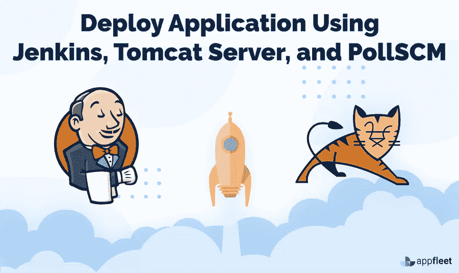

[**使用 Jenkins 的新手简单 CI/CD 指南。第一部分**](https://medium.com/@uerosuo/simple-ci-cd-guide-for-newbies-using-jenkins-part-1-f04c43a206d6)

[**使用 Jenkins 的新手简易 CI/CD 指南。**part . 2 .](https://medium.com/@uerosuo/simple-ci-cd-for-newbies-using-jenkins-part-2-e9fbe9d1e54)

**代码提交，构建&测试，部署:**

**构建项目:**

导航到 Github 并复制存储库 URL。我从 Valaxy Technologies 获得了一个库，我们将在本文中使用它。

你也可以这样做。

**Git 存储库 URL:**

```
[https://github.com/uerosuo/hello-world.git](https://github.com/uerosuo/hello-world.git)
```

点击刻有**代码的绿色按钮，**复制下面菜单中显示的 **URL** 。

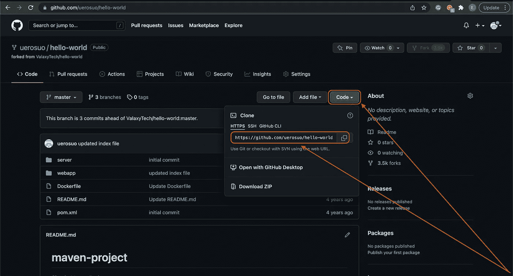

Github

将存储库 URL 复制到剪贴板后。

登录您的 Jenkins，点击新项目:

```
**Dashboard → New Item →**
```

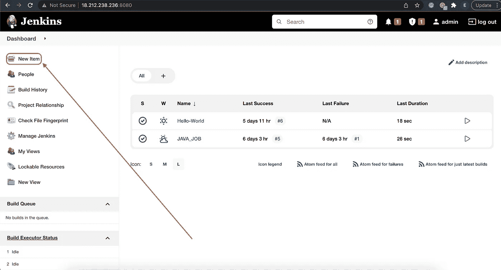

**仪表板**

输入**项目名称**，选择 **Maven** 项目，点击 **OK** 。

```
**Enter an item name (project name) → Maven Project**
```

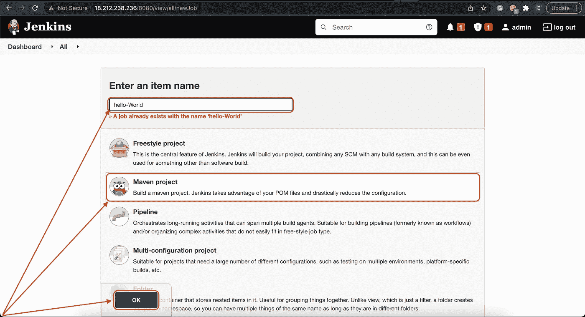

**项目配置**

选择**源代码管理**菜单，勾选 **Git** 框，将 **Git 库 URL** 粘贴到提供的框中:

```
**Source Code Management → Git → Repository URL**
```

**Git 存储库 URL:**

```
[https://github.com/uerosuo/hello-world.git](https://github.com/uerosuo/hello-world.git)
```

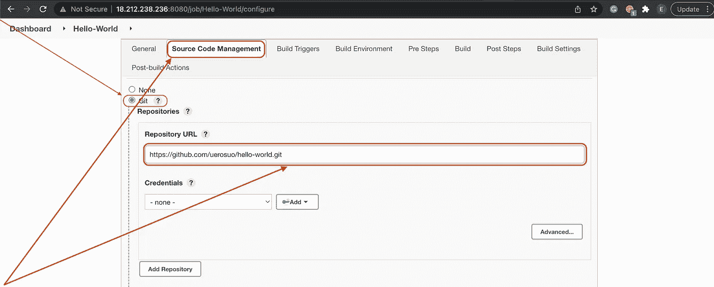

**项目配置**

选择**构建**选项，向下滚动到**目标和选项:**

```
**Build → Goals and options**
```

在提供的框中输入以下信息:

```
**clean install package**
```

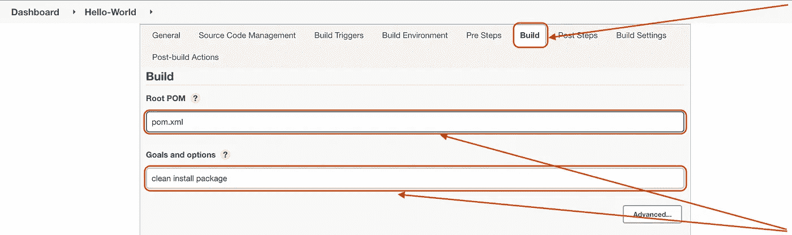

**项目配置**

选择**后期构建动作**选项，向下滚动到**添加后期构建动作**，选择**将 war/ear 部署到容器:**

```
**Post-Build Actions → Add post-build actions**
```

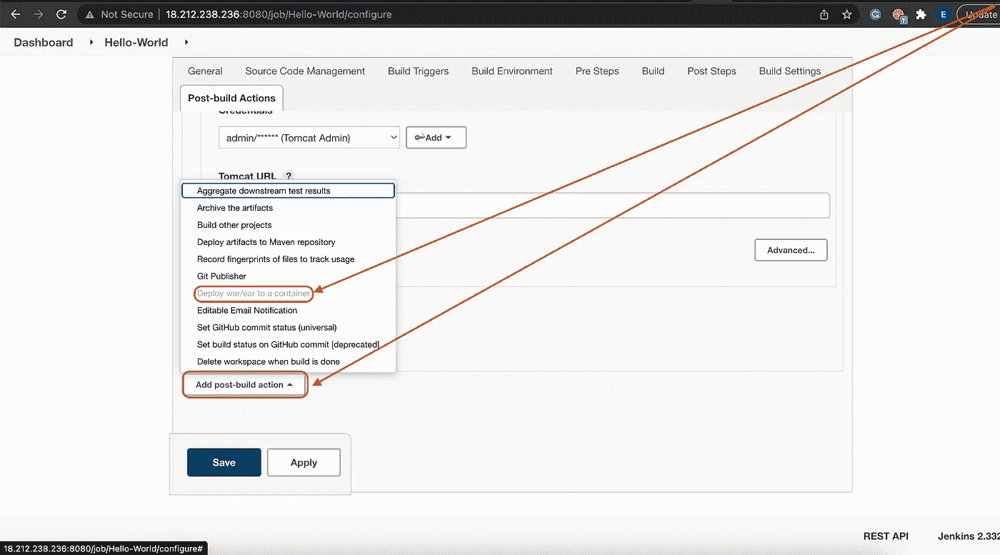

**项目配置**

向下滚动到**添加容器**并选择 **Tomcat 8x 远程**，因为我们将通过 Tomcat 8 服务器进行部署。

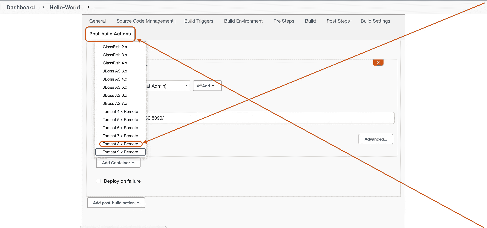

**项目配置**

在**将 war/ear 部署到容器选项下，**在标有 **WAR/EAR 文件:**的框中输入以下信息

```
****/*.war**
```

现在，添加我们在本文前面创建的 **Tomcat 凭证**。

单击箭头并选择:

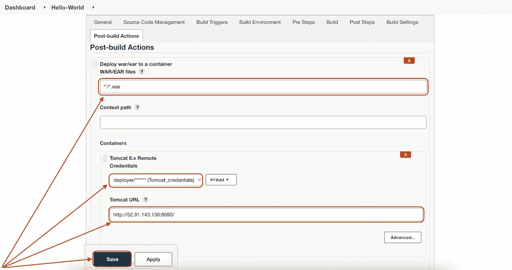

**项目配置**

现在点击**保存**并**构建**项目。

```
**Dashboard → Maven project Hello-World → Build Now**
```

点击**立即构建**按钮，等待 Jenkins 构建项目。

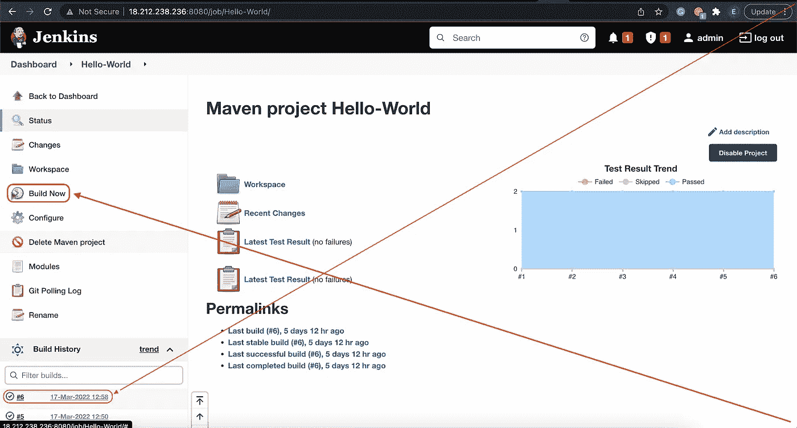

**项目状态**

要检查项目的状态:

```
**Dashboard → Maven project Hello-World → Build History**
```

点击后面带有 **#** 符号的数字。上图中我的是 **#6。**现在点击控制台按钮:

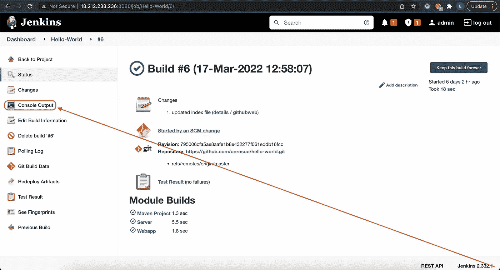

**打造**

这将向您显示项目的状态和构建过程。

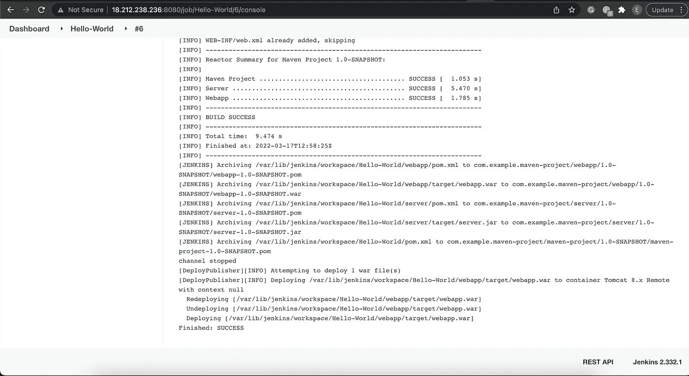

**控制台输出**

项目**构建**成功。

要查看您刚刚构建的 web 应用程序:

复制 Tomcat 的 URL，将其粘贴到您最喜欢的浏览器中，然后访问该页面。

```
[http://18.212.238.236:8090/webapp](http://18.212.238.236:8090/webapp)
```

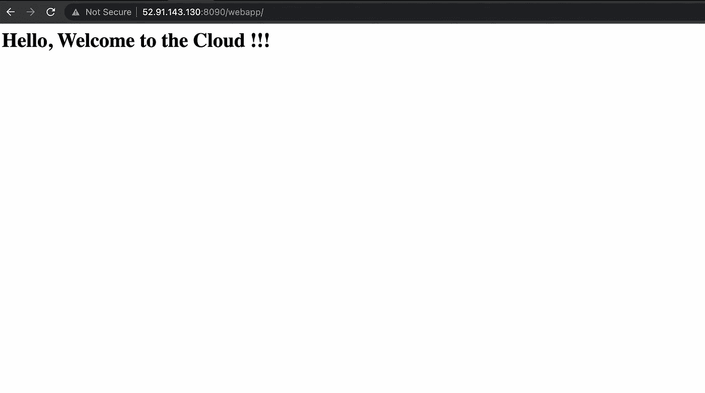

**项目预览**

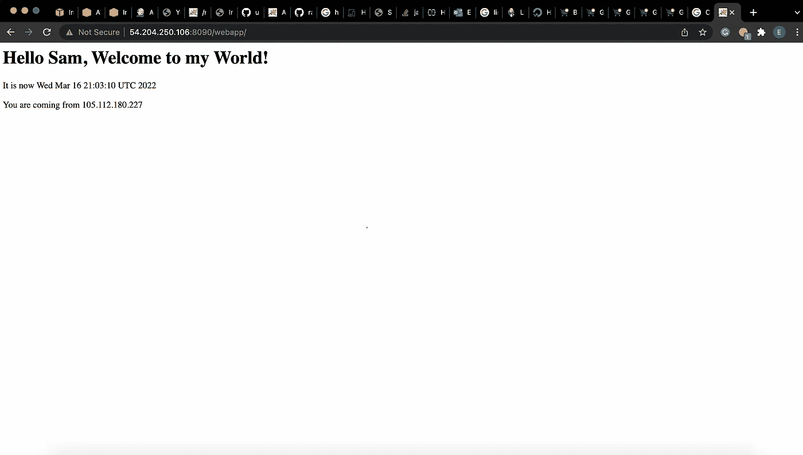

**项目预览**

现在，如果开发人员对代码进行更改/修改会怎么样呢？我们不需要经历试图重新构建的严格过程，你需要做的是运行一个持续集成&持续开发过程(CI/CD)。当 CI/CD 注意到代码中的变化时，它有助于触发构建自动化。

设置**持续整合**和**持续发展:**

```
**Dashboard → Maven project Hello-World → Build Triggers**
```

勾选**轮询 SCM** 框，在提供的**日程**框中输入以下变量:

```
*/2 * * * *
```

这个命令告诉 Jenkins 服务器每两(2)分钟监控一次 Github 存储库，从以前到当前的任何修改/更改都会触发构建自动化。

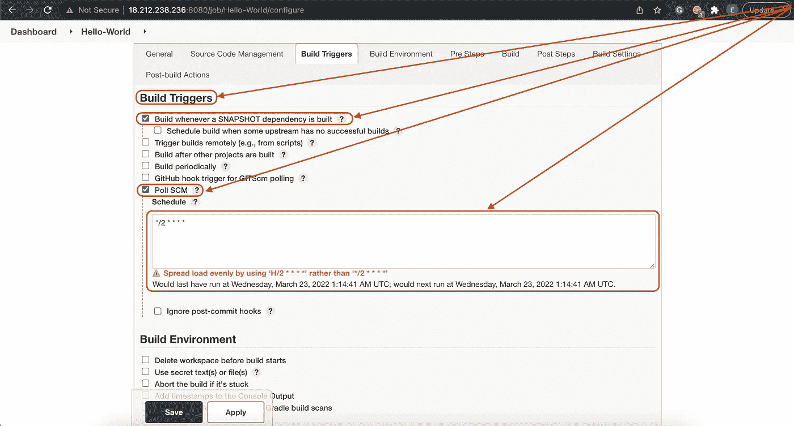

**构建触发器**

**保存**和**应用**所做的更改。

恭喜你！！！！您已经使用 Jenkins 成功创建了您的第一个 CI/CD。

Yaaaaaaay！！！！我们做到了！！！

现在，请记住，这篇文章不仅仅是为软件领域的专家准备的，即使是新手也可以加入并学到很多东西，这就是为什么我试图用外行和专业的术语把一切都讲清楚，所以如果你有任何问题，可以通过[**Twitter**](https://twitter.com/xsuox1)**联系我，或者通过**[**GitHub**](https://github.com/uerosuo)**找到我。**

**感谢阅读❤️**

如果你对这个话题有任何想法，请留下评论——我乐于学习和探索知识。

**点击订阅按钮，了解更多关于开发运维及云的内容。**