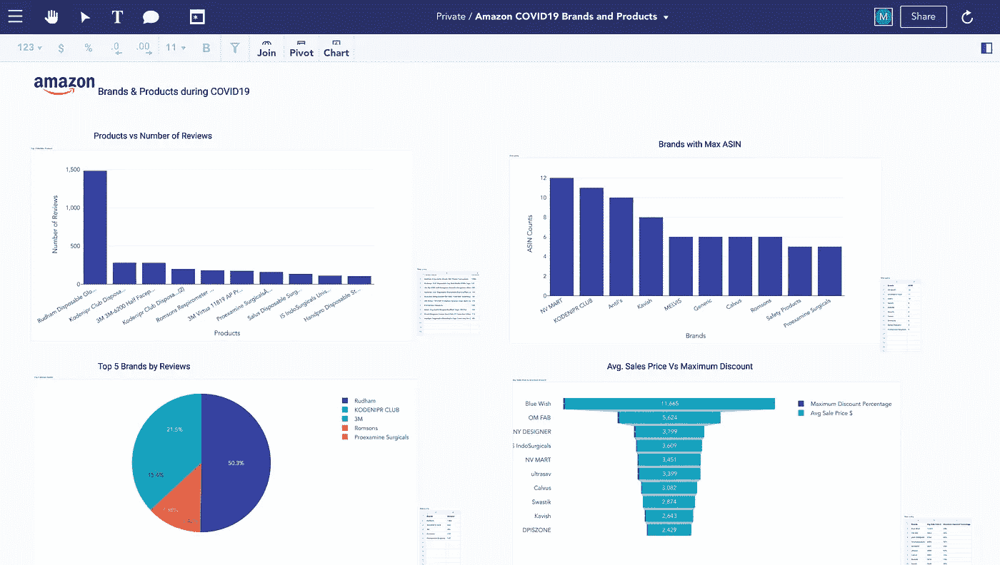
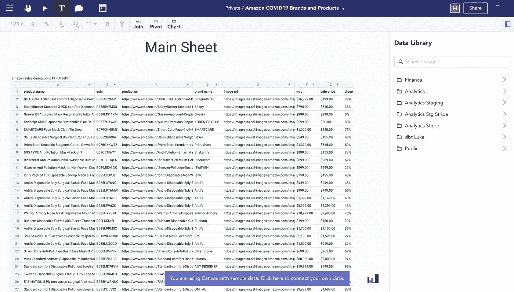
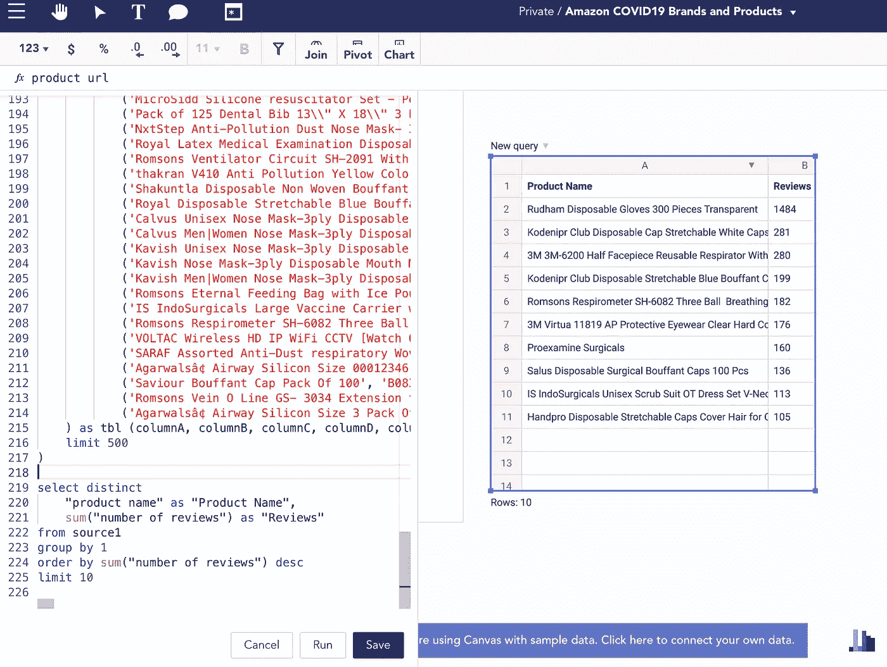
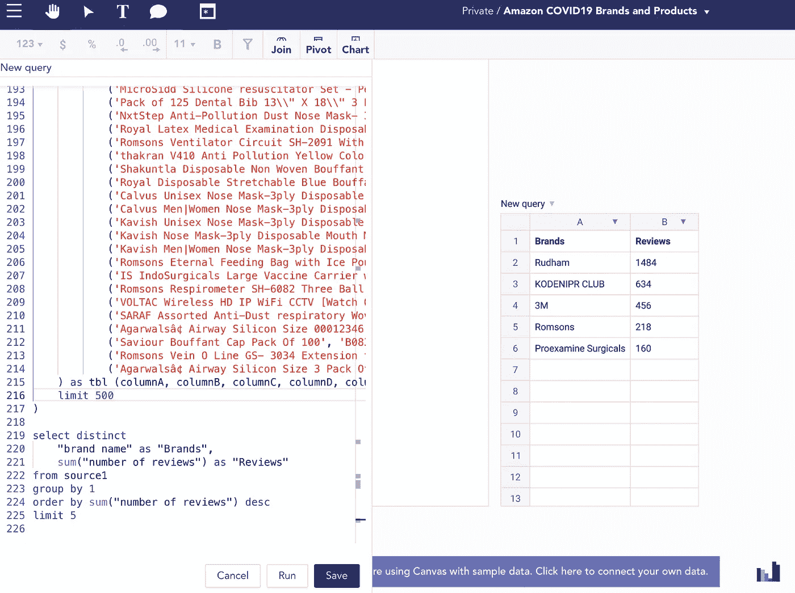
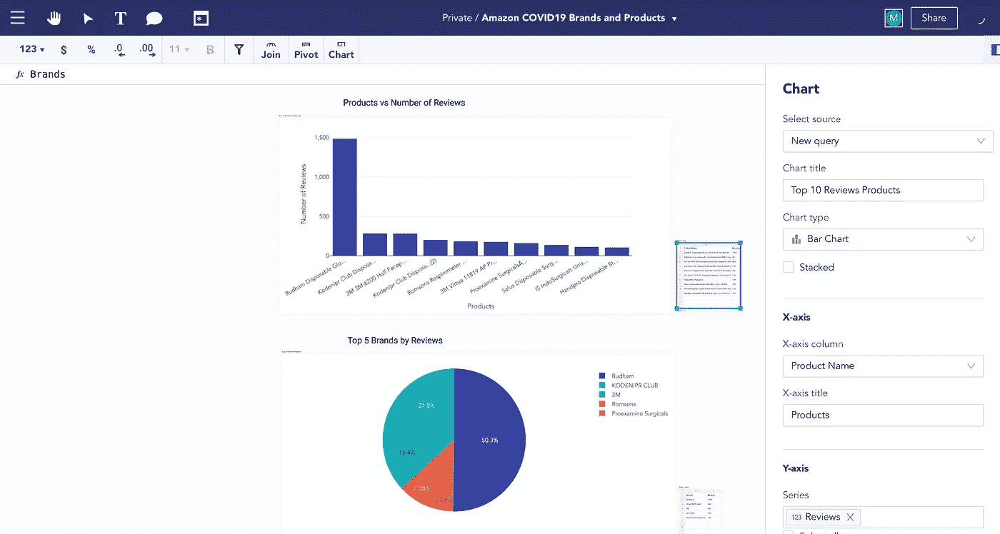
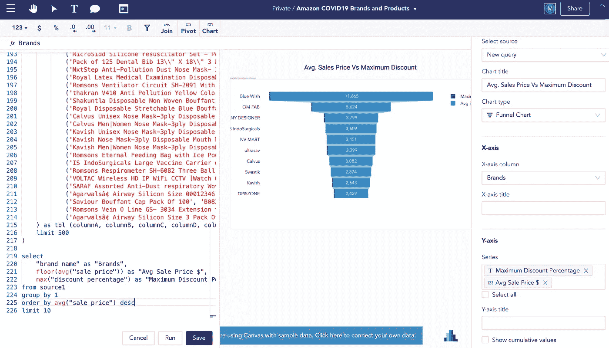
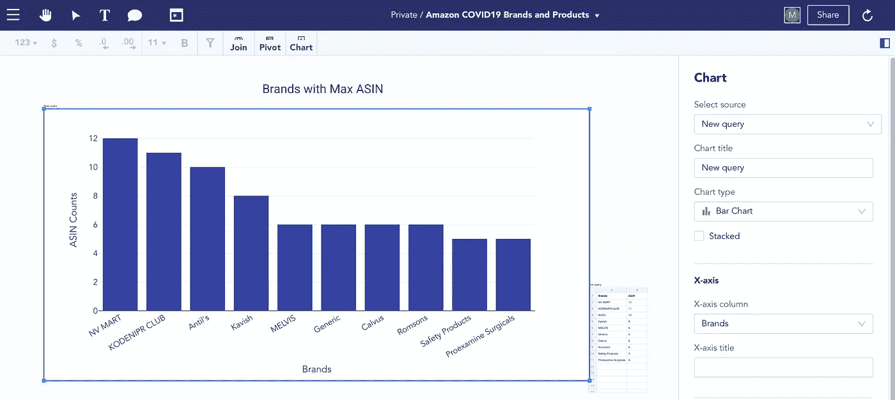

# COVID19 期间亚马逊产品和品牌表现的简单仪表板

> 原文：<https://blog.devgenius.io/simple-dashboard-for-performance-of-amazons-products-and-brands-during-covid19-d509c42f0146?source=collection_archive---------9----------------------->

## 使用 SQL 的强大功能和电子表格技能



在画布上的 COVID19 dashboard 期间，亚马逊品牌和产品表现。作者照片。

新冠肺炎极大地改变了人们的生活。在 COVID19 期间，它改变了我们互动、闲逛和购物的方式。根据[新冠肺炎和电子商务的报告，为了应对疫情，人们现在更多地在网上购物，更依赖互联网获取新闻、健康相关信息和数字娱乐。](https://unctad.org/en/PublicationsLibrary/dtlstictinf2020d1_en.pdf)

作为最知名的在线零售市场之一，[亚马逊](http://www.amazon.com)可以在许多地方以多种语言访问，消费者和公司都在使用它。根据应用程序业务数据，它在 2020 年创造了 3860 亿美元的收入。它是第四家市值达到 1 万亿美元的科技公司，目前有望达到 2 万亿美元。

在这里，我们将探索 COVID19 期间的顶级品牌、产品和销售额。我们将使用来自 [Kaggle](https://www.kaggle.com/datasets/mfalfafa/amazon-sales-during-covid19) 的数据集。

理解并使用本实践教程后，您将能够

1.  创建您自己的 SQL 查询。
2.  创建图表
3.  添加自定义图像

## 资料组

[](https://www.kaggle.com/datasets/mfalfafa/amazon-sales-during-covid19) [## covid19 期间亚马逊销售额

### Kaggle 是世界上最大的数据科学社区，拥有强大的工具和资源来帮助您实现您的数据…

www.kaggle.com](https://www.kaggle.com/datasets/mfalfafa/amazon-sales-during-covid19) 

## 目标

1.  根据评论数量确定前 10 项和前 5 个品牌。

2.按品牌查找平均销售价格和最大折扣。

3.定位最富 ASIN 的品牌。

## 我们开始吧

您将使用 Infinite Canvas Inc .的 [Canvas](https://canvasapp.com/) ，它是免费使用的，允许您使用电子表格技能来自动化报告，并通过连接到您的数据仓库和应用程序与您的团队共享见解。

首先，您将创建一个新的画布，并将数据拖入其中。让我们通过点击左上一行的 **T** 来添加文本- *主表*(如下所示)。


画布上的符号意味着什么。作者照片。

完成后，你会看到这个美丽的床单。



访问画布中的数据。作者照片。

## 对于第一个目标

基于评论数量的前 10 名产品和 5 个品牌

现在，你有了数据，轮到你按照我们的目标工作了。我们的第一个目标是根据评论数量找到前 10 名的产品和品牌。

现在，您将使用 Canvas 的功能来创建定制的 SQL 查询。单击 SQL 编辑器图标来执行此操作。请记住， [Canvas 中的每个动作都会自动生成 SQL 代码。](https://medium.datadriveninvestor.com/automatically-generate-sql-code-with-spreadsheet-89aaa7915f8c)因此，如果您单击主工作表，然后单击 SQL 编辑器，您将看到一个 SQL 代码。您将使用该代码编写剩余的代码。

打开一个新的 SQL 编辑器，输入以下代码，根据评论数量查找排名前 10 的品牌和产品。

```
--Here you will have to add source code copied from the main sheet's SQL editor.--Select top 10 products from number of reviews. select distinct
    "product name" as "Product Name",
    sum("number of reviews") as "Reviews"
from source1 --source1 is main sheet
group by 1
order by sum("number of reviews") desc
limit 10
```

输出:一个新表，包含评论的总和和产品的名称。



SQL 编辑器以及所需的表输出，该表包含作者的评论和产品照片的名称。

类似地，对于基于评论的品牌，在新的 SQL 编辑器中使用以下代码。

```
--Here you will have to add source code copied from the main sheet's SQL editor.--Select top 10 brands from number of reviews.select distinct
    "brand name" as "Brands",
    sum("number of reviews") as "Reviews"
from source1 --source1 is main sheet
group by 1
order by sum("number of reviews") desc
limit
```

输出:包含排名前五的品牌和评论数量的新表。



SQL 编辑器以及包含前五名品牌和评论数量的表的期望输出。作者照片。

让我们把这两张表形象化。便于携带。简单的拖放就可以了。因此，要这样做，只需点击表格和图表(在顶部功能区)。将出现一个侧边栏，允许您编辑图表。
让我们为评论总数和产品名称的表格制作一个条形图，为品牌制作一个饼图。让我们也使用文本工具添加一个图表标题。

所以，输出如下，你也可以把你的元素放在任何你想放的地方。)



从两个不同的表中生成的图表。作者照片。

以下是对 1484 Rudhum 一次性手套 300 件透明的评论最多，其次是对 Kodenipr Club 一次性帽子可拉伸白色帽子-头套头发烹饪和卫生(100 件)的 281 条评论。你可以看出新冠肺炎是一次性手套和帽子如此普遍的原因。

由于这两款产品获得了最高评价，您可以看到基于评价的前两个品牌是 Rudham 和 Kodenipr Club。一个有趣的事情是，我们可以看到，根据品牌，Rudhum 有 1484，正是为其 Rudhum 一次性手套 300 件透明产品。然而，对于 Kodenipr Club 来说，它比他们的最高评级产品高出 634。这表明 Kodenipr 俱乐部的其他产品也很受欢迎。这样，我们完成了第一个目标。

## 对于第二个目标

各品牌的平均销售价格与最大折扣

您也将为此使用 SQL，并选择漏斗图。

```
--Here you will have to add source code copied from the main sheet's SQL editor.select 
"brand name" as "Brands",
floor(avg("sale price")) as "Avg Sale Price $",
max("discount percentage") as "Maximum Discount Percentage"
from source1 --source1 is main sheet
group by 1
order by avg("sale price") desc
limit 10
```

输出:创建漏斗图，显示平均销售价格与最大折扣。



SQL 编辑器以及漏斗图的预期输出，显示平均销售价格与最大折扣。作者照片。

你可以看到像 Blue Wish 和 OM FAB 这样的品牌平均销售价格最高，分别为 11665 美元和 96 美元。分别是。他们还提供最大的折扣，95%和 96%。

## 对于第三个目标

ASIN 最大的品牌

亚马逊上列出的每件商品都被分配了一个亚马逊标准识别号(ASIN)。ASIN 是一个 10 位数的号码，任何想在亚马逊上销售的人都需要有一个 ASIN 号码。即使多个产品来自同一个卖家，每个产品仍然被分配了自己的 ASIN。

在这里，您将通过使用以下 SQL 来计算每个品牌的 ASIN。

```
--Here you will have to add source code copied from the main sheet's SQL editor.select distinct
"brand name" as "Brands",
count("asin") as "ASIN"
from source1
group by 1
order by count("asin") desc
limit 10
```

输出:使用条形图显示具有 ASIN 计数的品牌。



条形图显示具有 ASIN 计数的品牌。作者照片。

如您所见，NV Mart 的 ASIN 12 仅比 Kodenipr Club 高 1。对于在亚马逊销售的每一个品牌来说，他们肯定至少有一个目录——一个 ASIN。

现在让我们添加 Amazon 徽标，并查看完整的仪表板。


亚马逊品牌和产品销售 dashboord 设计在[画布](https://canvasapp.com/)上。

由于创建了这个仪表板，您了解了使用 Canvas 编写 SQL 查询和设计仪表板是多么简单，以便快速了解业务。现在，试一试，让我知道你和 canvas 相处得如何。

*如果想探索自己，你可以连接你的数据，在画布网站* *上注册* [*，几分钟内免费开始探索。我个人很想听听你的想法。(* ***本不*** *)*](https://canvasapp.com/)

[](http://canvasapp.com) [## 画布—可视化来自任何来源的数据，无需 SQL

### Canvas 允许您使用您的电子表格技能来自动化报告，并与您的团队共享漂亮的仪表板。

canvasapp.com](http://canvasapp.com) 

**不断学习，永无止境📚**

> 喜欢这篇文章吗？成为 medium 会员，继续无限制地学习——让您无限制地访问 Medium 上的故事。如果你使用 [***下面的链接***](https://medium.com/@maladeep.upadhaya/membership) ***，对你来说没有额外的费用，*** *我会赚一点佣金，这是一个很好的感谢方式🤗*

如果你对这篇文章有任何疑问，或者想在你的下一个数据科学项目上合作，请在 [LinkedIn](https://www.linkedin.com/in/maladeep/) 上 ping 我🙏


❤:这里还有几篇文章可能会提升你的知识，❤

[](https://towardsdatascience.com/surprisingly-effective-way-to-name-matching-in-python-1a67328e670e) [## 用 Python 命名匹配的惊人有效的方法

### 数据匹配、模糊匹配、重复数据删除

towardsdatascience.com](https://towardsdatascience.com/surprisingly-effective-way-to-name-matching-in-python-1a67328e670e) [](https://towardsdatascience.com/build-your-first-data-visualization-web-app-in-python-using-streamlit-37e4c83a85db) [## 使用 Streamlit 构建您的第一个 Python 数据可视化 Web 应用程序

### 在不到 20 分钟的时间内，使用 Streamlit 视觉表达功能进行自我探索式可视化

towardsdatascience.com](https://towardsdatascience.com/build-your-first-data-visualization-web-app-in-python-using-streamlit-37e4c83a85db) [](https://towardsdatascience.com/little-known-ways-to-make-your-data-visualization-awesome-890d71b6e365) [## 鲜为人知的方法，让你的数据可视化真棒

### 去除多余的部分

towardsdatascience.com](https://towardsdatascience.com/little-known-ways-to-make-your-data-visualization-awesome-890d71b6e365) [](https://medium.com/@maladeep.upadhaya/understand-your-customer-cohort-using-python-40e30a968044) [## 使用 python 了解客户群

### 什么是群组和群组分析，并找出客户保持率

medium.com](https://medium.com/@maladeep.upadhaya/understand-your-customer-cohort-using-python-40e30a968044) [](https://medium.datadriveninvestor.com/automatically-generate-sql-code-with-spreadsheet-89aaa7915f8c) [## 用电子表格自动生成 SQL 代码

### 不使用 SQL，生成 SQL 代码

medium.datadriveninvestor.com](https://medium.datadriveninvestor.com/automatically-generate-sql-code-with-spreadsheet-89aaa7915f8c)