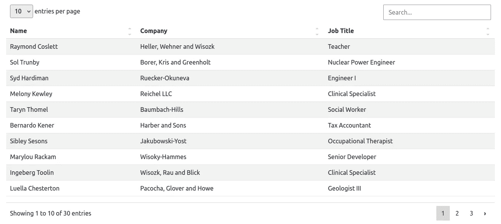

# 简单数据表，数据表的普通 JS 替代品

> 原文：<https://blog.devgenius.io/simple-datatables-a-vanilla-js-alternative-to-datatables-72f116565e39?source=collection_archive---------0----------------------->

在 [Unsplash](https://unsplash.com?utm_source=medium&utm_medium=referral) 上由 [Carlos Muza](https://unsplash.com/@kmuza?utm_source=medium&utm_medium=referral) 拍摄的照片

简单数据表是一个简单而强大的表格插件，类似于更流行的[数据表](https://datatables.net/)插件。在他们的知识库中，创建者将[简单数据表](https://github.com/fiduswriter/Simple-DataTables)描述为:

> 一个轻量级的，可扩展的，无依赖性的 javascript HTML 表格插件。类似于现代浏览器中使用的 jQuery 数据表**，但是没有 jQuery 依赖。**

**如上所述，两者之间的主要区别是简单数据表不需要 jQuery 就能工作。因此，对于那些出于这样或那样的原因想要避免 jQuery 但是需要一个表格插件的人来说，可以看看简单的数据表。**

## **简单数据表功能**

**Simple-DataTables 提供了其他 HTML 表格插件共有的特性，例如*可排序的列、分页、搜索特性、可定制的布局、可定制的标签、可定制的列呈现、导入和导出*等等。**

## **基本用法**

**简单数据表可以通过 CDN 或 JS 包获得，可以通过 npm 或 yarn 安装。为了尽可能简单，本教程将使用 CDN 选项。**

**简单数据表的第一种实例化方式是在现有的表上，即不动态获取数据的表。表格已经被渲染，然后插件在上面被实例化，如下所示。**

**第二种方法是从 json 文件或者更可能是从 api 导入数据。与配备了 jQuery Ajax 特性的数据表相反，简单数据表不能自己执行 api 调用。因此，您需要使用 fetch 或您选择的客户机从 api 获取数据，并在实例化表时将数据传递给 Simple-DataTables 对象，如下所示。**

**上面显示的两种方法将产生以下输出:**

****

**在表实例化过程中传递给 Simple-DataTables 对象的数据需要采用特定的格式。它需要是一个具有两个属性的对象，一个是列标题的数组，一个是包含数据值的数组。如果**

> **注意:如果标题数组的长度和包含数据值的数组的长度不匹配，库将抛出一个异常。**

**插件的创建者已经提供了一种将关联对象从 api 转换成合适格式的方法。在这个例子中，代码被包装到了`convertObject(dataObject)`函数中。下面的例子演示了这一转换过程。**

**处理数据变量时，它会产生如下所示的输出:**

## **将简单数据表发挥到极致**

**简单数据表可以无视它的名字，因为它可以完成相当多的事情。本教程将介绍一些值得注意的特性，主要围绕 columns 选项和 columns 方法。它们包括:**

1.  **列重新排序**
2.  **特定列的删除**
3.  **隐藏列**
4.  **定制渲染**
5.  **隐藏表格标题**

**`columns`选项接受一个对象数组，数组中的每个对象都是由`select`属性中列的索引指定的列的配置。`select`属性接受单个列的整数和涉及多个列的整数数组。**

**`columns()`方法提供了对 columns api 的访问，这有助于快速操作对表列的访问。**

## **列重新排序和删除**

**考虑到上面的例子，如果需要在职位之前显示公司名称，可以使用 DataTable 对象的 columns 方法来实现。**

> **重要的是要注意，无论何时使用`*remove()*`方法删除列，都会按照它们被呈现的顺序对列进行重新索引，并且在对列进行重新索引之后对列执行的操作必须考虑新的索引，这可以在上面涉及`*order()*`方法的操作中看到。**

**瞧，就像柱子被调换了一样。**

****

**`swap`方法也可用于`columns`方法。`swap`方法接受一个参数，即应该切换的列的索引数组。**

## **隐藏列**

**可以在实例化期间使用 Columns 选项和在实例化之后使用 columns 方法来切换列的可见性。这两种方法都利用了列的索引。**

**`show()`方法也可用于`columns()`方法，并可用于使隐藏的列可见。**

## **自定义呈现和隐藏表头**

**要隐藏表头，可以在实例化过程中使用`header`选项。它接受一个布尔值。如果设置为 false，则隐藏标题。**

**通过接受回调的 render 属性，可以在 columns 选项中使用自定义呈现。**

**render 属性中的回调接受三个参数。`data`参数包含单元格的内容。`cell`是 HTMLTableCellElement。`row`引用单元格的父级 HTMLTableRowElement。**

**要访问特定行中的数据，可以使用一种变通方法，即使用包含表数据的变量，并使用可以通过`row`参数获得的索引来访问该行的数据源，如上所示。**

**上面的例子产生了下面的卡片:**

****

## **提示和技巧**

**将对象转换成插件指定的格式的功能应该被提取到一个可重用的函数中，并且可以在各种情况下使用。这将防止代码重复。**

**如果从对象键中提取的标题是 snake_case 格式的，那么最好用空格替换连字符，使表格标题对用户来说更加易读和友好。对于 camelCase，可以使用 regex 来转换头。**

**您还可以更进一步，为`<th>`元素添加样式，以大写标题中的每个单词。**

**如果 DataTable 已经在函数中初始化，如本教程中所做的那样，并且您需要稍后在代码中自定义它或者在初始化函数的范围之外操作它，有一种方法可以解决这个问题。**

**您可以创建一个将被初始化为 null 的全局变量，并在初始化时将 DataTable 对象赋给该全局变量。我确信将来会有工作来防止这样的变通，这个用例以及其他的用例将被原生地覆盖。**

**columns 选项中使用的对象可用的属性可以用作 th 元素中的数据属性，方式类似:**

## **隐藏和删除列的区别**

**虽然这两个功能在视觉上可能服务于相同的目的，但在它们的底层机制中，它们以不同的方式工作并产生不同的结果。主要区别在于，一旦删除了列，除非删除实例并重新初始化表，否则删除是不可逆的。**

**同样，一旦删除了一个或多个列，您就可以基于该列进行模糊搜索。如果一列只是隐藏的，您可以搜索，隐藏的列将在过滤过程中被考虑。**

## **结论**

**数据表的 jQuery 风格有许多不同语言和框架的服务器端库。然而，简单数据表目前还不支持服务器端呈现。**

**尽管这个插件确实有一些小缺点，但它仍然非常强大，涵盖了日常 web 应用程序可能以表格形式呈现的大多数用例。对于那些避免使用 jQuery 但是仍然需要管理他们的表的人，你可以考虑这个插件。**

**这里讨论的特性只是众所周知的冰山一角，关于这个插件还有很多需要学习的，比如固定列宽*，固定表格高度，页脚定制*等等。关于这一切的材料可以在该项目的 [github wiki](https://github.com/fiduswriter/Simple-DataTables/wiki) 中找到。这个教程的完整代码也可以在[这里](https://github.com/kiptoo-korir/simple-datatables-tut)找到。**

****PS:实际上有一个关于添加自定义类到头文件的** [**问题**](https://github.com/fiduswriter/Simple-DataTables/issues/135) **。公共关系也可能正在进行中，从该特定问题的评论。****