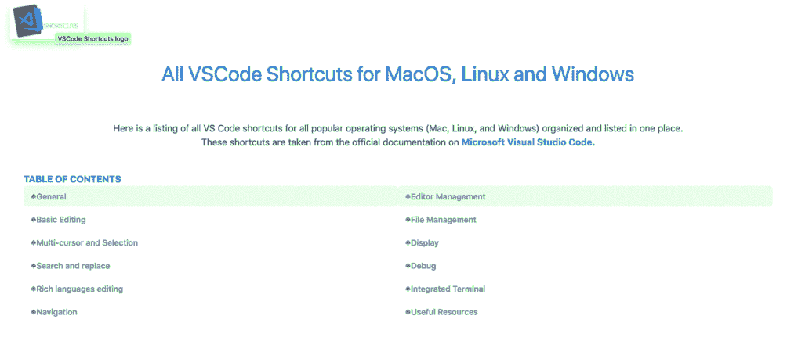

# 如何学习 Mac、Linux 和 Windows 上的所有 VSCode 快捷键

> 原文：<https://blog.devgenius.io/simple-guide-to-learn-all-vscode-shortcuts-on-macos-linux-and-windows-52c220753175?source=collection_archive---------29----------------------->

阿里安·达尔维什在 [Unsplash](https://unsplash.com?utm_source=medium&utm_medium=referral) 上拍摄的照片

当你看到其他程序员在开发过程中快速浏览数百行代码、快速编辑或打开多个标签页，而几乎不触摸鼠标或触摸板时，你会感到害怕吗？

感觉就像你在看一个魔术师表演惊人的技艺，你会立刻认为她天生就是编码的料。你认为尝试这样的壮举是你力所不及的，你将永远无法赶上。

嗯，在这个简短的指南中，我将向您展示我构建的网站，并帮助您了解只需一些日常练习和耐心就可以熟练使用您的 ide。

我使用 VSCode 已经一年多了。当我工作时，我经常根据手头的任务从一个操作系统切换到另一个操作系统。

我主要使用 MacOS，但也不得不在 Ubuntu 和 Windows 上执行一些任务。在所有这些平台上，我都喜欢使用 VSCode。为了查找或了解更多的 VSCode 快捷方式，我通常会去官方文档并查看我当前使用的操作系统的 pdf 文件。我真的不喜欢在不同时间检查 Mac、Linux 和 Windows 的每个文档的想法。我觉得很无聊。

# 更好的参考

我决定创建一个单页网站，在那里我和任何在主流平台上使用 VSCode 的人都可以很容易地学习或参考这些快捷方式。

我花了大约 3 天完成它，因为我有一份全职工作，并利用我的业余时间来工作。我还把它变成了一个 **PWA** (渐进式网络应用程序)，这样它在离线时也能很好地工作，可以安装在你的桌面和手机上。

以下是直播网站:[https://vscode-shortcuts.com/](https://vscode-shortcuts.com/?ref=hackernoon.com)

**快捷键分为 11 个主要部分:**

*   [通用](https://vscode-shortcuts.com/?ref=hackernoon.com#general)
*   [基本编辑](https://vscode-shortcuts.com/?ref=hackernoon.com#basic-editing)
*   [多光标和选择](https://vscode-shortcuts.com/?ref=hackernoon.com#multi-cursor-selection)
*   [搜索并替换](https://vscode-shortcuts.com/?ref=hackernoon.com#search-and-replace)
*   [丰富的语言编辑](https://vscode-shortcuts.com/?ref=hackernoon.com#rich-languages-editing)
*   [导航](https://vscode-shortcuts.com/?ref=hackernoon.com#navigation)
*   [编辑管理](https://vscode-shortcuts.com/?ref=hackernoon.com#editor-management)
*   [文件管理](https://vscode-shortcuts.com/?ref=hackernoon.com#file-management)
*   [显示](https://vscode-shortcuts.com/?ref=hackernoon.com#display)
*   [调试](https://vscode-shortcuts.com/?ref=hackernoon.com#debug)
*   [综合端子](https://vscode-shortcuts.com/?ref=hackernoon.com#integrated-terminal)

您可以在每个部分中轻松搜索，以快速找到您正在寻找的快捷方式。多酷啊！

# 学习它们的最好方法

学习捷径最简单的方法是通过**老套的重复**。你只需确定你想学什么，然后浏览列表，选择一个有助于简化或加快你的工作流程的，练习 10 到 20 分钟。如果你每天都做这个小练习，用不了多久，你就会成为别人渴望成为的代码魔术师。

# Y 的那些最佳 X 列表快捷键呢？

这些清单很棒，我有时也会检查一下。但是，您最了解您的工作流程和您正在处理的上下文，因此最有用的快捷方式也最适合您。

不断学习，别忘了分享。谢谢你