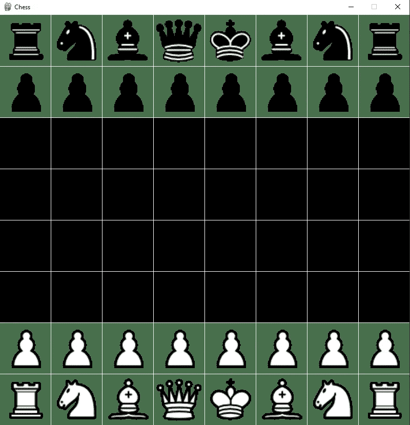
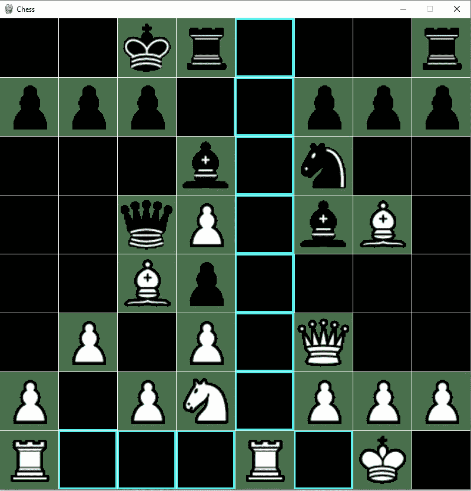

# Python 中简单的交互式象棋 GUI

> 原文：<https://blog.devgenius.io/simple-interactive-chess-gui-in-python-c6d6569f7b6c?source=collection_archive---------0----------------------->

欢迎来到我的 Python 象棋教程系列的第 1 部分！在本教程中，我们将探索如何在 Python 中设置一个交互式 GUI。在第 2 部分中，我们将介绍一个简单的最小最大算法 AI。让我们开始吧！

第二部分:[https://medium . com/dev-genius/simple-min-max-chess-ai-in-python-2910 a 3602641](https://medium.com/dev-genius/simple-min-max-chess-ai-in-python-2910a3602641)

第三部:https://link.medium.com/UzqUcdVzbwb

(另外，如果您只是想获得代码，并运行块 1、块 2 中的复制和粘贴代码以及块 3 中的适当主函数)

```
# importing required librarys
import pygame
import chess
import math

#initialise display
X = 800
Y = 800
scrn = pygame.display.set_mode((X, Y))
pygame.init()

#basic colours
WHITE = (255, 255, 255)
GREY = (128, 128, 128)
YELLOW = (204, 204, 0)
BLUE = (50, 255, 255)
BLACK = (0, 0, 0)

#initialise chess board
b = chess.Board()

#load piece images
pieces = {'p': pygame.image.load('b_pawn.png').convert(),
          'n': pygame.image.load('b_knight.png').convert(),
          'b': pygame.image.load('b_bishop.png').convert(),
          'r': pygame.image.load('b_rook.png').convert(),
          'q': pygame.image.load('b_queen.png').convert(),
          'k': pygame.image.load('b_king.png').convert(),
          'P': pygame.image.load('w_pawn.png').convert(),
          'N': pygame.image.load('w_knight.png').convert(),
          'B': pygame.image.load('w_bishop.png').convert(),
          'R': pygame.image.load('w_rook.png').convert(),
          'Q': pygame.image.load('w_queen.png').convert(),
          'K': pygame.image.load('w_king.png').convert(),

          }
```

我们的第一个代码块是显示器的初始设置。我们初始化我们的屏幕窗口，Pygame，基本颜色，来自象棋模块的棋盘，并为每个棋子加载我们的图像。

为了简单起见，我们从这篇维基百科文章【https://en.wikipedia.org/wiki/Chess_piece中提取了简单的棋子图像，并将其重新缩放至 100x100。这种重新缩放是不必要的，但是它将为显示定义我们的 X 和 Y 变量。作为一个棋盘是 8x8，我们的 X 和 Y 变量分别是 800，800。

```
def update(scrn,board):
    '''
    updates the screen basis the board class
    '''

    for i in range(64):
        piece = board.piece_at(i)
        if piece == None:
            pass
        else:
            scrn.blit(pieces[str(piece)],((i%8)*100,700-(i//8)*100))

    for i in range(7):
        i=i+1
        pygame.draw.line(scrn,WHITE,(0,i*100),(800,i*100))
        pygame.draw.line(scrn,WHITE,(i*100,0),(i*100,800))

    pygame.display.flip()
```

我们的第二个代码块是我们的更新函数，它将根据*国际象棋的输入更新我们的显示。板*类。我们扫描棋盘上的每一个方格，如果找到一个棋子，我们就把它放进去。然后我们简单地在上面画一个网格。看起来是这样的:



给定国际象棋的初始设置时更新函数。

```
def main(BOARD):

    '''
    for human vs human game
    '''
    #make background black
    scrn.fill(BLACK)
    #name window
    pygame.display.set_caption('Chess')

    #variable to be used later
    index_moves = []

    status = True
    while (status):
        #update screen
        update(scrn,BOARD)

        for event in pygame.event.get():

            # if event object type is QUIT
            # then quitting the pygame
            # and program both.
            if event.type == pygame.QUIT:
                status = False

            # if mouse clicked
            if event.type == pygame.MOUSEBUTTONDOWN:
                #remove previous highlights
                scrn.fill(BLACK)
                #get position of mouse
                pos = pygame.mouse.get_pos()

                #find which square was clicked and index of it
                square = (math.floor(pos[0]/100),math.floor(pos[1]/100))
                index = (7-square[1])*8+(square[0])

                # if we are moving a piece
                if index in index_moves: 

                    move = moves[index_moves.index(index)]

                    BOARD.push(move)

                    #reset index and moves
                    index=None
                    index_moves = []

                # show possible moves
                else:
                    #check the square that is clicked
                    piece = BOARD.piece_at(index)
                    #if empty pass
                    if piece == None:

                        pass
                    else:

                        #figure out what moves this piece can make
                        all_moves = list(BOARD.legal_moves)
                        moves = []
                        for m in all_moves:
                            if m.from_square == index:

                                moves.append(m)

                                t = m.to_square

                                TX1 = 100*(t%8)
                                TY1 = 100*(7-t//8)

                                #highlight squares it can move to
                                pygame.draw.rect(scrn,BLUE,pygame.Rect(TX1,TY1,100,100),5)

                        index_moves = [a.to_square for a in moves]

    # deactivates the pygame library
        if BOARD.outcome() != None:
            print(BOARD.outcome())
            status = False
            print(BOARD)
    pygame.quit()

def main_one_agent(BOARD,agent,agent_color):

    '''
    for agent vs human game
    color is True = White agent
    color is False = Black agent
    '''

    #make background black
    scrn.fill(BLACK)
    #name window
    pygame.display.set_caption('Chess')

    #variable to be used later
    index_moves = []

    status = True
    while (status):
        #update screen
        update(scrn,BOARD)

        if BOARD.turn==agent_color:
            BOARD.push(agent(BOARD))
            scrn.fill(BLACK)

        else:

            for event in pygame.event.get():

                # if event object type is QUIT
                # then quitting the pygame
                # and program both.
                if event.type == pygame.QUIT:
                    status = False

                # if mouse clicked
                if event.type == pygame.MOUSEBUTTONDOWN:
                    #reset previous screen from clicks
                    scrn.fill(BLACK)
                    #get position of mouse
                    pos = pygame.mouse.get_pos()

                    #find which square was clicked and index of it
                    square = (math.floor(pos[0]/100),math.floor(pos[1]/100))
                    index = (7-square[1])*8+(square[0])

                    # if we have already highlighted moves and are making a move
                    if index in index_moves: 

                        move = moves[index_moves.index(index)]
                        #print(BOARD)
                        #print(move)
                        BOARD.push(move)
                        index=None
                        index_moves = []

                    # show possible moves
                    else:

                        piece = BOARD.piece_at(index)

                        if piece == None:

                            pass
                        else:

                            all_moves = list(BOARD.legal_moves)
                            moves = []
                            for m in all_moves:
                                if m.from_square == index:

                                    moves.append(m)

                                    t = m.to_square

                                    TX1 = 100*(t%8)
                                    TY1 = 100*(7-t//8)

                                    pygame.draw.rect(scrn,BLUE,pygame.Rect(TX1,TY1,100,100),5)
                            #print(moves)
                            index_moves = [a.to_square for a in moves]

    # deactivates the pygame library
        if BOARD.outcome() != None:
            print(BOARD.outcome())
            status = False
            print(BOARD)
    pygame.quit()

def main_two_agent(BOARD,agent1,agent_color1,agent2):
    '''
    for agent vs agent game

    '''

    #make background black
    scrn.fill(BLACK)
    #name window
    pygame.display.set_caption('Chess')

    #variable to be used later

    status = True
    while (status):
        #update screen
        update(scrn,BOARD)

        if BOARD.turn==agent_color1:
            BOARD.push(agent1(BOARD))

        else:
            BOARD.push(agent2(BOARD))

        scrn.fill(BLACK)

        for event in pygame.event.get():

            # if event object type is QUIT
            # then quitting the pygame
            # and program both.
            if event.type == pygame.QUIT:
                status = False

    # deactivates the pygame library
        if BOARD.outcome() != None:
            print(BOARD.outcome())
            status = False
            print(BOARD)
    pygame.quit()
```

我们最后的代码块是包含 3 个“主”函数的剩余代码块:

*   **main** =两边都要用鼠标输入
*   **main_one_agent** =其中一侧用鼠标输入
*   **main_two_agent** =双方都被代理控制的情况

您现在可能想知道代理函数应该是什么样子。它只是一个接受表单 *chess 的一个输入的函数。棋盘*类并输出一个合法棋步形成*棋步。移动*类。

在这些主要功能中有很多事情正在进行，所以我希望评论能有所帮助(如果没有，给我发消息/评论)。以下是游戏中期显示的一个示例:



最后注意:由于我们使用 python 的象棋模块，所有类型的合法移动都包括在内(阉割，顺便说一句),并有适当的规则。