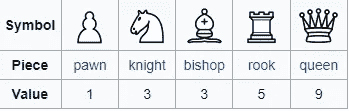
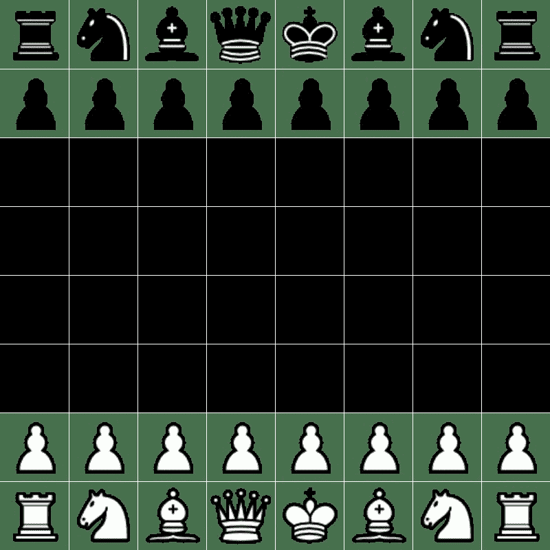

# Python 中的简单最小最大国际象棋人工智能

> 原文：<https://blog.devgenius.io/simple-min-max-chess-ai-in-python-2910a3602641?source=collection_archive---------0----------------------->

欢迎来到我的 Python 象棋教程系列的第 2 部分！在本教程中，我们将探索下棋的最小最大算法的基础。在第 3 部分中，我们将在这个基础上进行改进。让我们开始吧！

第一部分:[https://medium . com/dev-genius/simple-interactive-chess-GUI-in-python-c 6d 6569 f 7 b 6 c](https://medium.com/dev-genius/simple-interactive-chess-gui-in-python-c6d6569f7b6c)

第三部:【https://link.medium.com/UzqUcdVzbwb 

Min Max 是一种搜索算法，可用于确定双人游戏(如国际象棋)中的最佳走法。它的工作原理是考虑两个玩家所有可能的移动(给定一定的“深度”)，并选择最大化当前玩家价值同时最小化对手价值的移动。

在我们的例子中,“价值”一词可以简单地定义为每件物品的价值总和。对此最常见的定义如下:



棋子价值(维基百科)

```
import chess
from Simple_Display import main, main_one_agent, main_two_agent
import random
from copy import deepcopy

#an agent that moves randommly
def random_agent(BOARD):
    return random.choice(list(BOARD.legal_moves))

scoring= {'p': -1,
          'n': -3,
          'b': -3,
          'r': -5,
          'q': -9,
          'k': 0,
          'P': 1,
          'N': 3,
          'B': 3,
          'R': 5,
          'Q': 9,
          'K': 0,
          }
#simple evaluation function
def eval_board(BOARD):
    score = 0
    pieces = BOARD.piece_map()
    for key in pieces:
        score += scoring[str(pieces[key])]

    return score

#this is min_max at depth one
def most_value_agent(BOARD):

    moves = list(BOARD.legal_moves)
    scores = []
    for move in moves:
        #creates a copy of BOARD so we dont
        #change the original class
        temp = deepcopy(BOARD)
        temp.push(move)

        scores.append(eval_board(temp))

    if BOARD.turn == True:
        best_move = moves[scores.index(max(scores))]

    else:
        best_move = moves[scores.index(min(scores))]

    return best_move
```

我们的第一个代码块是最简单形式的最小最大算法。函数 **most_value_agent** 搜索可能的移动列表，并使用 **eval_board** 函数为结果游戏状态分配分数。

你可能会看到，我们并不总是试图最大化这个得分函数，因为它取决于我们是否在寻找黑或白的最佳移动。白色的最佳分数是可能的最大值，而黑色的最佳分数是可能的最小值。我们可以这样做，因为国际象棋是一个零和游戏([https://en.wikipedia.org/wiki/Zero-sum_game](https://en.wikipedia.org/wiki/Zero-sum_game))。

给定这个基础代理，我们可以用一个随机移动的代理来测试它，这是结果。(黑棋随机移动)


深度 1 的最小最大值(白色)与随机移动的代理(黑色)

```
def min_max2(BOARD):
    moves = list(BOARD.legal_moves)
    scores = []

    for move in moves:
        temp = deepcopy(BOARD)
        temp.push(move)
        temp_best_move = most_value_agent(temp)
        temp.push(temp_best_move)
        scores.append(eval_board(temp))

    if BOARD.turn == True:

        best_move = moves[scores.index(max(scores))]

    else:
        best_move = moves[scores.index(min(scores))]

    return best_move

def min_maxN(BOARD,N):
    moves = list(BOARD.legal_moves)
    scores = []

    for move in moves:
        temp = deepcopy(BOARD)
        temp.push(move)

        if N>1:
            temp_best_move = min_maxN(temp,N-1)
            temp.push(temp_best_move)

        scores.append(eval_board(temp))

    if BOARD.turn == True:

        best_move = moves[scores.index(max(scores))]

    else:
        best_move = moves[scores.index(min(scores))]

    return best_move

# a simple wrapper function as the display only gives one imput , BOARD
def play_min_maxN(BOARD):
    N=3
    return min_maxN(BOARD,N)
```

我们的第二个代码块扩展了**most _ value _ agent**,通过进一步搜索，而不仅仅是立即行动。我们的 **min_max2** 函数是深度为 2 的 Min Max 算法，这意味着它预测未来 2 步棋，并使其最有价值的棋步基础成为对手最有价值的棋步。

我们可以递归地实现这个过程到我们想要的任何深度 N。这个实现如 **min_maxN、**所示，带有一个小包装函数 **play_min_maxN** 以代理的形式保存它。

如果我们测试这段代码，我们很快就会发现，计算深度大于 4 的 **min_maxN** 可能需要几分钟。因此，我们将不得不考虑其他方法来提高代理的性能。

与此同时，我们可以看看一个最小最大深度 3(白色)对随机移动代理(黑色)的游戏。



我们可以看到它真的不是很好

看到这一点，我们可以指出几个关键缺陷:

*   人工智能对其实际获胜条件没有概念(将死)
*   它没有像上面那样通过重复来绘画的概念
*   由于深度很低，几乎所有的移动都是同等的，所以总是选择移动列表中的第一个移动(通常是棋盘最右边的一个棋子)
*   因此，它没有一个良好的开放的概念，如占用空间

所有这些想法以及更多内容将在第 3 部分中探讨。