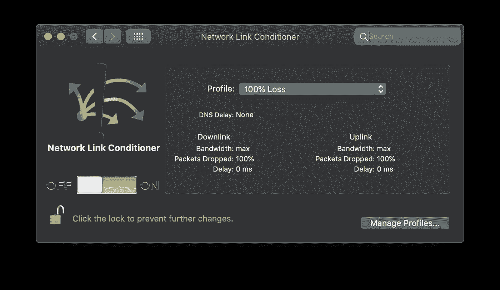

# Swift 和 Combine 中的简单离线缓存

> 原文：<https://blog.devgenius.io/simple-offline-caching-in-swift-and-combine-e940427ad6e4?source=collection_archive---------2----------------------->

# 背景

继上一篇文章之后，我们探索了简单的 JSON 解码。在本帖中，我们将扩展这个简单的网络示例，以包括一些离线缓存，这样，如果我们的网络请求失败，我们仍然可以提供内容。

我听说很多人因为在应用程序中提供数据缓存层而却步。流行的解决方案包括在你的应用程序中放置一个实际的关系数据库来缓存数据，比如使用[核心数据](https://developer.apple.com/documentation/coredata)或[领域](https://realm.io/docs/swift/latest/)。如果您打算利用关系数据库的能力来执行某种任务，这些解决方案是不错的。然而，如果您只是将它们用作缓存层，它们会增加很多复杂性。以下是一些缺点:

*   如果您正在使用内部 API，您可能会尝试复制一个由功能更强大的服务器端 DBMS 驱动的后端数据库结构。
*   无论是映射后端数据库还是只映射返回的 JSON。当结构改变时会发生什么？你需要更新你的解析和数据结构吗？您需要迁移数据吗？
*   您不仅需要确保能够正确地解析和存储数据，还必须确保以相同的方式查询数据，以便获得与从 API 返回的结果相同的结果。
*   如果多个请求需要更新数据会怎么样？处理并发数据更新有其自身的复杂性和头痛。

这只是尝试使用关系数据库作为应用程序的缓存层时所面临的挑战的一个例子。现在，您可以构建一些自定义的缓存层，将内容写入磁盘或库，如 [PINCache](https://github.com/pinterest/PINCache) 。然而，如果我告诉你有一些更简单的东西已经作为标准内置到 iOS 中了呢？

为了帮助解释这一点，我们需要探索 HTTP 缓存头是如何工作的。现在，大多数对 API 请求都会返回一堆 HTTP 头。它们向接收者提供关于请求响应的信息和建议。我们不会把它们都包括在内，但是在这个例子中我们最感兴趣的是[缓存控制](https://www.w3.org/Protocols/rfc2616/rfc2616-sec13.html)头。

> *Cache-control 是一个 HTTP 头，用于在客户端请求和服务器响应中指定浏览器缓存策略。策略包括资源的缓存方式、缓存位置以及到期前的最大期限(即生存时间)*

我们将在此探讨这一陈述中关于到期前最大年龄的部分。大多数 API 会在响应头中指定一个叫做 max-age 的东西。这是接收方认为该信息有效的时间长度(秒)。在这段时间之后，响应应该被认为是陈旧的，并且从源获取新的数据。

默认情况下， [URLSession](https://developer.apple.com/documentation/foundation/urlsession) 和 [URLRequest](https://developer.apple.com/documentation/foundation/urlrequest) 的缓存策略为 [useProtocolCachePolicy](https://developer.apple.com/documentation/foundation/nsurlrequest/cachepolicy/useprotocolcachepolicy) 。这意味着在发出请求时，它们将遵循 HTTP 缓存头。在上述情况下，它将在报头中指定的时间内缓存请求响应。如果您希望使用[其他选项](https://developer.apple.com/documentation/foundation/nsurlrequest/cachepolicy)中的一个，可以忽略此行为。

# 邮递员

为了演示这种行为，我们将使用一个名为 [Postman](https://www.postman.com) 的工具。您可能已经在使用它了，它是开发和测试 API 的一个极好的工具。Postman 提供的服务之一是一种叫做 [Postman Echo](https://docs.postman-echo.com/?version=latest) 的东西。这是一个服务，允许您向它发送各种 URL 参数，并让 postman 以某种响应格式将这些项目回复给您。为了测试我们的示例，我们将使用提供的响应头服务，这允许我们在 url 查询字符串中指定头和值，并在实际的响应头中向我们回放它们。

如果我们点击下面的 URL，您将得到一个响应，其中包含您在 URL 查询参数中发送的指定标题。

`[https://postman-echo.com/response-headers?Cache-Control=max-age=30](https://postman-echo.com/response-headers?Cache-Control=max-age=30)`

我们在`Cache-Control: max-age=30`的响应中得到一个头。这意味着任何处理响应的人都应该在请求新数据之前最多缓存响应 30 秒，如前所述。

我们可以用这个来证明缓存在 URLSession 中是如何工作的。

# URLSession 中的缓存

让我们在下面设置一个关于如何测试这些缓存头的示例:

让我们一步一步地通过这个例子来演示发生了什么:

1.  首先，我们设置我们的 postman echo 请求，我们将它设置为返回 30 秒的缓存头
2.  我们使用标准的[数据任务](https://developer.apple.com/documentation/foundation/urlsession/1407613-datatask)方法发出请求。当我们得到响应时，我们将它转换成一个 [HTTPURLResponse](https://developer.apple.com/documentation/foundation/httpurlresponse) 。HTTPURLResponse 包含一个名为 [allHeaders](https://developer.apple.com/documentation/foundation/httpurlresponse/1417930-allheaderfields) 的字典，该字典包含响应中返回的所有头。然而，这很容易出错，因为字典键是区分大小写的。为了解决这个问题，苹果公司增加了一个名为 [value](https://developer.apple.com/documentation/foundation/httpurlresponse/3240613-value) 的新函数，它接受一个关键字符串，但对标题进行不区分大小写的匹配，所以你不必这样做。
3.  使用第 2 点中的代码，我们获取响应的日期和缓存控制头，并将它们打印到控制台，以便我们可以看到它们是什么。
4.  我们休眠 5 秒钟，然后执行另一个请求。
5.  这里执行与上面相同的请求，并再次获取响应头的值。这将帮助我们了解缓存是如何工作的。

如果我们在操场上运行上面的代码，我们应该在控制台上看到以下内容:

那么，对于我们的请求，这说明了什么呢？

*   前两行显示我们的请求在某个日期和时间执行，第二行显示我们在 postman echo 请求中配置的缓存头。
*   最后两行显示了同样的事情？

这是因为我们在请求头中设置了 30 秒的缓存时间。正如您从上面的第 4 步中所知道的，在每次请求之间，我们会休息 5 秒钟。日期头相同这一事实表明，第二个请求响应实际上与第一个请求的响应相同，它刚刚从缓存中取出。

为了证明这一点，我们可以修改请求，以便我们只缓存响应 3 秒钟，这样当我们休眠 5 秒钟时，来自第一个请求的响应应该被认为是陈旧的，第二个请求应该以新的响应结束。

让我们修改请求中的 URL，将缓存控件设置为 3:

`[https://postman-echo.com/response-headers?Cache-Control=max-age=3](https://postman-echo.com/response-headers?Cache-Control=max-age=3)`

现在，如果我们运行上面的示例，控制台消息应该如下所示:

这和上面怎么不一样。您将注意到的主要区别是请求时间现在不同了。第二个请求时间戳比第一个请求时间戳晚 5 秒。这是因为我们的缓存时间现在是 3 秒，所以第二个请求不再从缓存中提取，实际上是一个具有新响应的新请求。

# 离线和网络调节器

现在你可能会问自己这和离线缓存有什么关系？为了理解我们如何利用这种缓存行为，我们需要抑制我们的请求，使它们失败。我们可以使用的工具之一是网络调节器。这是苹果在[附加工具](https://developer.apple.com/download/more/?q=Additional%20Tools)下载中提供的。

如果您下载了工具并安装了“网络调节器”偏好设置面板，您应该能够从 Mac 偏好设置中启动它。打开后，您应该会看到如下内容:

这个工具允许你在你的 mac 上创建各种网络条件，比如 100%丢包，3G，拨号等。在我们的示例中，我们将使用它来复制一个连接失败，以了解我们如何开始使用 URLSession 的一些属性来访问缓存的请求数据。

如果我们将下面的内容添加到我们的第二个请求回调中，那么我们可以看到请求是否出错:

如果我们再次运行示例，但是这一次一旦我们接收到前两个控制台消息。我们使用 100%损耗激活网络调节器。这将导致第二个请求失败(请求超时可能需要几秒钟)。

如果操作正确，我们应该会在控制台中看到如下内容:

现在我们没有得到第二个请求的响应。相反，我们收到一个错误。这是预期的行为，因为第二个请求确实失败了。在这种情况下，如果我们愿意，我们可以从缓存中获取响应。为此，将下面的代码添加到第二个完成处理程序中:

URLSession 的一部分是 [URLSessionConfiguration](https://developer.apple.com/documentation/foundation/urlsessionconfiguration) 。这是一个为 URLSession 提供所有配置的对象。这里的一个属性是 [URLCache](https://developer.apple.com/documentation/foundation/urlcache) 。这就是奇迹发生的地方。它是来自 URLRequests 的响应的内存和磁盘缓存。它负责存储和删除数据，在我们的示例中，这是通过响应头控制的。

URLCache 上的方法之一是 [cachedResponse](https://developer.apple.com/documentation/foundation/urlcache/1411817-cachedresponse) 。这将为仍然在缓存中的任何 URL 请求返回缓存的响应。

在上面的例子中，我们提取缓存的响应并输出附加的 HTTPURLResponse 的头。如果我们再看一下我们的例子，上面有两个额外的片段，我们应该有如下的内容:

现在，如果我们进行与之前相同的测试:

*   跑操场
*   等待第一个请求完成
*   激活 100%丢包的网络调节器

我们应该在控制台中看到这样的内容:

这里发生了什么？

*   第一个请求成功完成，因此我们可以看到日期和缓存头信息。和以前一样。
*   秒请求失败，因此出现请求超时错误
*   然而，这一次，由于请求失败，我们从缓存中获取之前的请求响应，并从缓存中输出头。

现在我们已经展示了如何从缓存中获取缓存的请求，让我们以一种好的方式包装它，这样我们就可以根据需要重用它

# 包装它

首先，让我们创建一个标准的 swift 示例，然后我们将看看如何在 Combine 中实现这一点，以及实现这一点的一些挑战。

因此，让我们来看一下我们正在做的事情:

1.  我们在 URLSession 上创建了一个与标准的 [dataTask](https://developer.apple.com/documentation/foundation/urlsession/1410330-datatask) 方法相同的方法。但是，我们添加了一个 bool 来控制我们是否希望在收到网络错误时返回缓存的响应。
2.  这里，我们采用了前面例子中使用的例子，并将其应用于该方法。首先，我们检查是否应该根据 cachedResponseOnError 参数返回缓存的响应。然后检查我们是否有一个错误，如果我们有，然后尝试从 URLCache 获取缓存的响应，并返回它的数据和响应对象以及错误。
3.  在上述任何一个失败的情况下，我们简单地返回所有的东西，就像正常的 dataTask 方法返回的一样。

由于完成处理程序返回数据、URLResponse 和错误，所以即使有错误，我们也能够返回数据和响应。在这种情况下，这是一个缺点，因为函数调用方需要知道他们可能会收到一个错误，而且缓存的响应也需要满足这些场景。

# 结合

希望你至少听说过[联合收割机](https://developer.apple.com/documentation/combine)，即使你还没有机会在生产应用中使用它。这是苹果自己版本的反应式框架。那些已经在使用 [RxSwift](https://github.com/ReactiveX/RxSwift) 的人将会感觉如鱼得水。我们不会对什么是组合做太多的详细说明，但是这里有一个关于什么是反应式编程的定义:

> *在计算领域，反应式编程是一种声明式编程范式，关注数据流和变化的传播*

更简单地说，反应式编程使用观察者模式来允许类监控不同的数据流或状态。当这个状态改变时，它发出一个具有新值的事件，该事件可以触发其他流执行工作或更新，例如 UI 代码。如果你熟悉 [KVO](https://developer.apple.com/library/archive/documentation/Cocoa/Conceptual/KeyValueObserving/KeyValueObserving.html) ，你就会明白基本概念。然而，反应式编程远没有 KVO 那么痛苦，也更强大。

现在，上一节中描述的方法在 completionHandler 的情况下工作得很好，因为它允许我们无论发生什么都将所有 3 个项目返回给调用者。然而，在组合流中，流被设计为要么返回值，要么返回错误。

首先让我们看一个简单的例子:

所以让我们来看看这里发生了什么:

1.  首先，我创建了 [dataTaskPublisher 的 typealias。输出](https://developer.apple.com/documentation/foundation/urlsession/datataskpublisher/output)。这主要是由于代码格式的原因，因为字符串很长。这只是元组中的一个数据对象和一个 URLResponse 对象。
2.  这里，我们像以前一样用 cachedResponseOnError 标志设置了我们的函数。我们将返回一个带有类型别名输出的发布者。
3.  首先，我们调用标准的 [dataTaskPublisher](https://developer.apple.com/documentation/foundation/urlsession/3329708-datataskpublisher) 方法来设置我们的请求。我们立即使用新的 [tryCatch](https://developer.apple.com/documentation/combine/publishers/trycompactmap/trycatch(_:)) 链接发布者。这是做什么的？"*通过用另一个发布者替换来自上游发布者的错误或抛出新错误来处理来自上游发布者的错误。*“因此，在这里，我们从 dataTaskPublisher 捕获任何连接错误，我们可以抛出另一个错误，或者将另一个发布者发送到链的下游。
4.  因此，与我们的纯 Swift 示例相同，我们尝试从缓存中获取我们的响应，只是在这里，如果我们在缓存中找不到任何东西，我们只是重新抛出我们在 try catch 块中收到的相同错误，以便可以在下游进一步处理它。
5.  如果我们能够在缓存中找到一个响应，那么我们使用 [Just](https://developer.apple.com/documentation/combine/just) publisher 将新值发送到流中，包装我们缓存的响应。
6.  我们使用类型擦除将类型擦除给任何发布者，因此下游的项目不需要知道类型。关于类型擦除的更多信息，请参见我的[上一篇文章](https://pyartez.github.io/type-erasure/what-is-type-erasure.html)。

现在，让我们采用之前的测试，并对其进行修改，以便我们可以看到实际情况:

正如我们对其他示例所做的那样，让我们一步一步来看看会发生什么。

1.  首先，我们像在 pure Swift 示例中那样创建请求，然后使用新创建的函数创建新的发布者。
2.  现在在 Combine 中，publisher 只在出现不满意的订阅时执行。每当调用接收器函数时都会发生这种情况。第一个闭包是在流完成或抛出错误时调用的(这也终止了流)。每当从流中发布新值时，就会调用第二个闭包。在第一种情况下，我们可以创建一个包含数据和 URLResponse 的元组。像以前一样，我们检查请求的日期标题。
3.  和以前一样，我们休眠 5 秒钟(我们已经设置了使用缓存控制头的超时时间为 3)
4.  这与步骤 2 相同，但是我们更改了输出。

如果我们按照与之前相同的步骤，并在执行步骤 3 时使用网络调节器打开数据包丢失，我们应该会看到如下控制台日志:

现在，这证明我们在第二个请求中返回了缓存的响应，因为我们没有连接，并且我们仍在接收响应。然而，这里的问题是什么？

# 没有错误

如果我们只想显示缓存的数据，上面的实现很好。但是，您可能希望通知用户连接失败，他们正在查看旧的/陈旧的信息。那么我们该如何解决这个问题呢？为了发送缓存的值，那么我们就需要创建一个自定义的错误合并发布器。我们不会在这里讨论这个问题，因为它本身就是一个帖子。

# 结论

我们已经展示了如何利用 URLSession 和 URLCache 的内置功能以及 HTTP 标准头来提供简单和基本的离线缓存。

# 优势

*   实施简单，不需要第三方框架或复杂的关系数据库
*   利用第三方框架并依赖当前可用的标准(HTTP)
*   自动处理并发

# 不足之处

*   依赖于正在使用的 API 中正确使用的缓存控制头
*   需要正确配置 URLSession 缓存策略
*   如果需要，不支持更复杂的缓存要求/规则
*   如果设备内存变满，URLCache 将删除缓存，使用这种方法时要记住这一点

总之，这种方法很简单，为你的应用程序提供了基本的离线功能。如果您对缓存数据有更复杂的需求，那么其他方法可能更合适。

请随意[下载操场](https://github.com/pyartez/blog-samples)并自己玩这些例子

*原载于 2020 年 7 月 1 日*[*https://pyartez . github . io*](https://pyartez.github.io/networking/simple-offline-caching-in-swift-and-combine.html)*。*