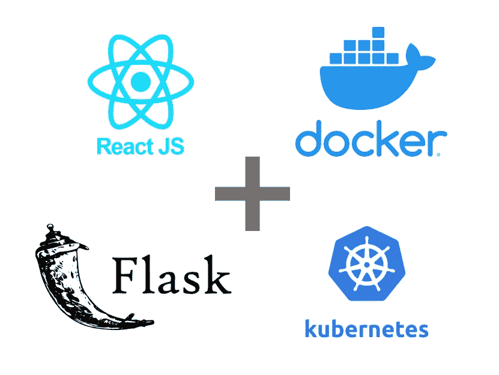

# 带有烧瓶和 Kubernetes 部署的简单 React 应用程序

> 原文：<https://blog.devgenius.io/simple-react-application-with-flask-and-kubernetes-deployment-cb4dc240e8dc?source=collection_archive---------2----------------------->



在我完成数学和数据科学的学习后，我需要一个快速而简单的 Web 应用程序来以适当的格式展示我的工作。许多有价值的库和语言有助于建立一个庞大的可伸缩的 web 应用程序。但在我的情况下，我只是需要一个快速和肮脏的解决方案，它适用于演示和项目的开始。成功启动后，您可以决定是否应该添加或更改一些库。

# **第一步:安装必要的库**

本分步指南中使用的**编程语言**:

*   计算机编程语言
*   java 描述语言
*   Go(针对 Docker 和 Kubernetes)

使用的**框架**:

*   瓶
*   反应堆

对于安装，请遵循他们网站上的在线安装步骤。这里推荐使用 python 的虚拟环境！并为应用程序创建一个文件夹 *my-app* 。对于步骤 2，导航到终端中的应用程序文件夹。

# **第二步:创建一个 React 应用**

为了创建前端文件夹结构，我们需要在终端中使用以下命令。

```
npx create-react-app frontend
```

我们的 react-app 叫做*前端。*设置好前端后，我们的项目文件夹设置应该是这样的:

我的-app
├──前端
│├──readme . MD
│├──node _ modules
│├──package . JSON
│├──。gitignore
│ ├──公立
│ └── src

除了前端，我们还创建了一个后端和 Kubernetes 文件夹。后端文件夹是我们的 flask-server，包括一个./static，。/templates 文件夹和 main.py 文件。Kubernetes 文件夹包括我们用于部署的 Kubernetes 文件。结果应该是这样的:

my-app
├──前端
├──后端
│ ├──静态
│ ├──模板
│└──main . py
└──kubernetes

要让我们的 flask 应用充满活力，请将以下代码粘贴到 main.py 文件中:

```
from flask import Flask, render_template
from flask_cors import CORSapp = Flask(__name__)
CORS(app)@app.route(“/”)
def my_index():
    return render_template(“index.html”, flask_token=”Hello there!”)app.run(host=’0.0.0.0', debug=True)
```

# **第三步:打开 React 网络包**

现在棘手的部分来了。为了通过 flask 服务器服务 react 应用程序，我们需要运行一个命令并更改一些文件。导航到前端目录:

```
npm run eject
```

这个命令解包 react 应用程序的配置文件。我们需要这样做来改变我们的应用程序到后端目录的构建路径，以便 flask 可以服务它。为此，我们需要更改文件:

*   网络包.配置. js
*   paths.js

在前端文件夹中，我们发现了一个新的文件夹 *config* ，我们可以在其中找到这些文件。

打开 paths.js 文件，用下面一行更改 appBuild 条目:

```
appBuild: resolveApp(‘../backend/static/react’),
```

在构建 react-app 之后，我们会注意到所有创建的文件都将位于并保存在这个文件夹中。

现在，让我们打开 webpack.config.js 文件，找到以下代码:

```
new HtmlWebpackPlugin(
       Object.assign(
        {},
        {
          inject: true,
          template: paths.appHtml,
          filename: “../../templates/index.html” //line added
        },
        isEnvProduction
          ? {
              minify: {
                 removeComments: true,
                 collapseWhitespace: true,
                 removeRedundantAttributes: true,
                 useShortDoctype: true,
                 removeEmptyAttributes: true,
                 removeStyleLinkTypeAttributes: true,
                 keepClosingSlash: true,
                 minifyJS: true,
                 minifyCSS: true,
                 minifyURLs: true,
                },
            }
          : undefined
       )
   ),
```

我们添加了带有文件名的行。它是我们后端文件夹中的目录。

react 环境中的最后一个变化是前端目录中的 package.json 文件。我们需要在文件末尾添加一个新的变量主页，这样应用程序就知道在哪里放置 javascript 和 CSS 的链接。在最后一个括号结束之前添加这一行。

```
“homepage”: “/static/react”, 
```

# **步骤 4:运行烧瓶应用程序**

现在我们可以检查一切是否正常工作，flask 是否正确地为 react 应用程序提供服务。

在终端的前端目录中运行

```
npm run build
```

并检查新的输出文件是否保存在 static 和 templates 目录下的后端文件夹中。

如果是这种情况，重定向到终端中的后端目录并运行

```
python main.py
```

通过浏览器进入 [http://localhost:5000](http://localhost:5000) 查看应用程序是否运行。

# **第五步:创建 Dockerfiles**

Dockerfiles，因为我们希望将我们的应用程序部署到 Kubernetes 或任何其他地方。在 docker 文件中准备好您的应用程序总是好的。当我们创建生产构建时，我们需要构建一个 docker 文件。如果您想开发和更改 react 应用程序，您需要运行不同的设置来查看 react 应用程序中的更改。但是在这里，我们希望将我们的应用程序部署到 Kubernetes 集群中，我们在该集群中使用生产就绪的构建。

后端的 docker 文件如下所示:

```
FROM python:3.8.1-slim-buster as builder
WORKDIR /usr/src/appENV PYTHONDONTWRITEBYTECODE 1
ENV PYTHONUNBUFFERED 1RUN apt-get update && \
apt-get install -y — no-install-recommends gcc
RUN pip install — upgrade pip
RUN pip install flake8COPY . /usr/src/app/
COPY ./requirements.txt .RUN pip wheel — no-cache-dir — no-deps — wheel-dir /usr/src/app/wheels -r requirements.txtFROM python:3.8.1-slim-buster
RUN mkdir -p /home/app
RUN addgroup — system app && adduser — system — group appENV HOME=/home/app
ENV APP_HOME=/home/app/backendRUN mkdir $APP_HOMEWORKDIR $APP_HOMERUN apt-get update && apt-get install -y — no-install-recommends netcatCOPY — from=builder /usr/src/app/wheels /wheels
COPY — from=builder /usr/src/app/requirements.txt .RUN pip install — upgrade pip
RUN pip install — no-cache /wheels/*COPY ./entrypoint.prod.sh $APP_HOME
COPY . $APP_HOMERUN chown -R app:app $APP_HOME
USER appENTRYPOINT [“/home/app/backend/entrypoint.sh”]
```

如您所见，Dockerfile 文件相当长。不要害怕它；复制粘贴！但是这里需要提到的一点是，除了 Dockerfile 之外，我们还需要创建两个额外的文件。像 docker 文件一样，将它们放在后端目录中。一个文件是我们虚拟环境的 requirements.txt:

```
pip freeze > requirements.txt 
```

第二个文件是 entrypoint.sh 文件，它处理启动 flask 应用程序的命令。它既可以在 Kubernetes 文件中完成，也可以通过 done 文件完成。这看起来很简单:

```
#!/bin/sh
python main.py
exec “$@”
```

# **第六步:测试并发布 Dockerfile**

创建 docker 文件后，需要对其进行测试和发布。要尝试它，通过命令行构建 Docker 映像(通过终端导航到后端文件夹):

```
docker build -t yourusername/my-app .
```

如果构建成功，您可以快速启动应用程序:

```
docker run -p5000:5000 yourusername/my-app
```

这个命令将在我们的本地环境中创建应用程序，我们可以使用 [http://localhost:5000](http://localhost:5000) 访问它。

如果一切正常，我们需要将我们的图像发布到 Docker 存储库中，以便 Kubernetes 可以找到它:

```
docker login
```

用版本号重新标记图像:

```
docker tag yourusername/my-app yourdockerhubusername/my-app:v1
```

然后推动以下内容:

```
docker push yourdockerhubusername/my-app:v1
```

# **步骤 7:创建 Kubernetes 文件**

当你是 Kubernetes 的初学者时，我建议先看一个教程。如果你不想这样做，复制 Kubernetes 文件，准备好了。

在本文中，我们不会讨论 Kubernetes 集群以及如何启动一个集群。它还依赖于您的 Kubernetes 集群，即您需要的文件。例如，在您的 Kubernetes 文件中需要考虑网络策略或不同的安全问题。但是假设我们有一个相当开放的 Kubernetes 集群在运行。我们首先需要为其中的项目创建一个名称空间。由于我们已经在文件夹结构中创建了一个文件夹 Kubernetes，我们将在其中创建所有文件。

*MyApp-namespace.yaml:*

```
apiVersion: v1
kind: Namespace
metadata:
   name: myapp
   labels:
      name: myapp
```

在这个名称空间下，将为我们的应用程序重新定位空间。现在让我们创建 *MyApp-deployment.yaml:*

```
apiVersion: apps/v1
kind: Deployment
metadata: 
   creationTimestamp: null 
   labels: 
       name: myapp 
   name: myapp   
   namespace: myapp
spec: 
   replicas: 1 
   selector: 
       matchLabels: 
           name: myapp 
       strategy: 
           type: Recreate 
       template: 
           metadata: 
              creationTimestamp: null 
              labels: 
                  name: myapp 
           spec: 
              containers: 
                  — args: 
                      — python
                      — main.py 
                    image: yourdockerhubusername/my-app:v1 
                    name: myapp
                    ports: 
                      — containerPort: 5000 
               restartPolicy: Always
```

对你来说，这个文件中最重要的部分是*图片*行，你需要在这里插入你发布的 Docker 图片的链接。

可能是需要添加一些安全方面的问题，比如 securityContext。

我们要创建的以下文件是 *MyApp-service.yaml* :

```
apiVersion: v1
kind: Service
metadata: 
   creationTimestamp: null 
   labels: 
       name: myapp 
   name: myapp
   namespace: myapp
spec: 
   ports: 
      — name: “5000” 
        port: 5000 
        targetPort: 5000 
   selector: 
      name: myapp
status: loadBalancer: {}
```

我们的部署可以用这个文件在 Kubernetes 集群中“对话”。

最后一步，我们想创建一个 URL，在这个 URL 上我们可以查看我们部署的应用程序。

*MyApp-ingress.yaml:*

```
apiVersion: networking.k8s.io/v1
kind: Ingress
metadata: 
    name: ingress-myapp 
    annotations: 
        nginx.ingress.kubernetes.io/rewrite-target: /$1
spec: 
    rules: 
       — host: myapp.link.com
         http: 
            paths:
               — path: / 
                 pathType: Prefix 
                 backend: 
                     service: 
                         name: myapp
                         port: 
                            number: 5000
```

我们现在创建了一个通过 flask 提供的生产就绪型 react 应用程序，并将其部署在 Kubernetes 集群上。正如我之前提到的，这是一个快速且容易构建的解决方案，如果您想要为拥有超过 1000 名用户的公司提供一个可扩展的解决方案，那么不推荐使用它。然后你需要添加不同的框架和不同于 flask 的服务器。

# **结论**

有了这个简单的工具箱和管道，您可以快速部署您的应用程序进行演示，这样每个人都可以看到您的解决方案和应用程序。当然，您也可以为您的应用程序添加不同的设置，在 Kubernetes 集群中添加其他服务，并通过 Github Actions 添加 CD/CI-Pipeline 来加快部署。