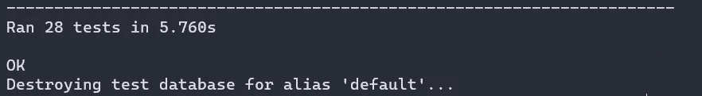

# Django 使用 TDD 的简单 REST API 第一部分

> 原文：<https://blog.devgenius.io/simple-rest-api-with-django-using-tdd-part-i-579c8e71334e?source=collection_archive---------1----------------------->

照片由[吴礼仁](https://unsplash.com/@gohrhyyan?utm_source=medium&utm_medium=referral)在 [Unsplash](https://unsplash.com?utm_source=medium&utm_medium=referral) 上拍摄

> TDD 代表测试驱动开发，这是一个软件开发过程，依赖于在软件完全开发之前将软件需求转换为测试用例。这与先开发软件，后创建测试用例是相对的*。—* 维基百科

大多数独立软件开发人员——包括我在内——因为这样或那样的原因不写测试。每当我构建一个简单的 REST API 或任何应用程序时，我都认为启动 Postman 或浏览器来测试你的端点就足以让我验证功能了。

在多年采用相同的软件开发方法后，我真的厌倦了相同的例行程序，尽管我不是公司的一部分——因为我认为所有这些方法和实践都是在这里进行的——作为一个思想实验，我决定稍微改变一下，看看整个周期是如何呈现的，以及可以提取出什么。

作为概念验证，我们将通过 TDD 使用 **Django** 和 **Djangorestframework** 实现一个简单的租赁服务 REST API。请记住，这里最重要的不是内部结构或系统设计，而是方法，所以让我们深入了解一下。我还假设读者对姜戈和 DRF 很熟悉。

API 将由几个端点组成:

*   可出租房屋的列表视图端点
*   所选房屋的详细视图
*   处理添加的新房屋的 Post 端点。

首先，让我们创建我们的模型。打开您的`models.py`文件并添加以下代码。

这是我们完整的`**House**`模型。对于其他模型的外键引用(`**District**` & `**Options**`)，不要担心，我会提供完整 git 回购的链接。我们现在感兴趣的属性是`**('title', 'price', 'description', 'status', 'furnished')**` **。**

进行并应用迁移，然后我们将直接进入`tests.py`。打开文件并添加以下内容。

现在让我解释一下这是怎么回事。

*   `**Class ModelTest(TestCase):**`创建一个从 Django 测试用例继承而来的`**ModelTest**`测试用例。
*   `**test_house_title_str():**`验证`**House**`模型的字符串表示的测试函数。我们创建一个`**House**`对象，将它存储在`**house**`变量中，然后断言该对象的字符串表示恰好等于其`**name**`属性。很简单的函数，对吧？顺便说一下，字符串表示就是你希望你的对象以字符串形式返回的值。它在你的`**models.py**`中的`**__str__()**`中定义，以防你想知道。
*   `**test_no_of_rooms_less_than_or_equal_to_five():**`验证房间的数量是否小于或等于 5，因为我们提到`**5**` 是房间的最大数量。也要尽最大努力记录你的函数用 Docstring 做了什么，这是我从来不习惯的做法，但我本能地发现自己现在记录了我的函数。

现在使用命令:`**python manage.py test**`运行您的测试并查看结果，您的测试应该通过了。

末端的

这就完成了我们的第一部分。在下一部分中，我们将把重点放在 API 实现上，首先从测试开始。

如果有任何问题，请随时给我发电子邮件，我很乐意帮忙。

干杯。

***第二部分***:[https://python . plain English . io/simple-rest-API-with-django-using-TDD-approach-Part-ii-bfc 03d 62 bdfb](https://python.plainenglish.io/simple-rest-api-with-django-using-tdd-approach-part-ii-bfc03d62bdfb)

https://github.com/godfather68/rental-app-api***GitHub 回购:***