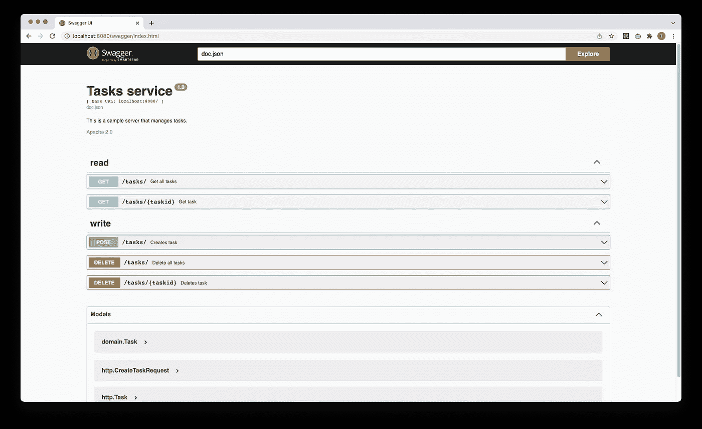

# Golang 中的简单 REST 服务，带有 OpenAPI 规范和 ORM

> 原文：<https://blog.devgenius.io/simple-rest-service-in-golang-with-openapi-spec-and-orm-a447b1086e21?source=collection_archive---------3----------------------->

网上已经有很多关于 REST 服务实现的文章。与此同时，不同的技术和库有更多的组合。我在寻找一个使用 Go 的实现，有易于手动测试的 Swagger UI，在后端有一个数据库，有最少的样板文件。这些是我使用的库:

*   [gorm](https://gorm.io/) 作为 orm 库
*   [蝰蛇](https://github.com/spf13/viper)进行配置管理
*   [gin](https://github.com/gin-gonic/gin) 作为 web 框架
*   从 go 注释中生成 OpenAPI 规范

[**github 上的源代码**](https://github.com/ragoncsa/todo/tree/v0.1.0)

# 包装布局

我使用了本·约翰逊建议的包装布局[。这些是摘自他文章的关键观点:](https://medium.com/@benbjohnson/standard-package-layout-7cdbc8391fc1)

*   拥有一个不依赖于任何其他包的域包(“一种描述数据和流程如何交互的逻辑高级语言”)
*   在其他包中保留依赖项，并复制包名以强制我们自己隔离外部依赖项。例如，通过创建我们自己的“http”包，将确保对“net/http”的引用只驻留在我们的“http”中
*   将共享模拟子包与简单的手写模拟一起使用

根据这些想法，我创建了下面的包:

*   **域:**用于服务接口及其使用的数据结构。
*   **gorm:** 用于通过 orm 抽象的数据库交互。
*   **http** :用于处理 http 流量。这也可以称为 gin，因为这是使用的框架。
*   **mock:** 为用于测试的仿制品。

现在我们有了我们的包布局，让我们看看一些关于实现的细节。

# 领域

这里我们有一个简单的结构，非常适合演示。

我按照 gorm 惯例命名任务中的字段。例如，ID 将成为主键。

# gorm 包

这是与数据库交互的实现。由于使用了 gorm，这不会引入对数据库的直接依赖，这样做的好处是可以在需要时更改数据库。然而，我在这个演示中使用 gorm 的动机更多的是为了减少样板文件。我不想手动定义我的数据库模式，或者手动编写 SQL。这样可以更快地启动和运行一些东西。(尽管 gorm 也支持手写 SQL ，这在构建更复杂的东西时可能会变得很方便。)

Gorm 还[支持数据库迁移](https://gorm.io/docs/migration.html)，这有助于保持模式与代码中的数据结构同步。

# http 包

为了处理 HTTP 请求和实现路由，我们使用了 [Gin Web 框架](https://github.com/gin-gonic/gin)。我发现 Gin 需要的样板文件比 [mux](https://github.com/gorilla/mux) 少。我喜欢你不需要使用一个 [JSON 编码器](https://pkg.go.dev/encoding/json#Encoder)在 HTTP 响应中返回你的 JSON。我还发现模型绑定很方便。下面是一个如何在任务创建的处理程序中使用它的例子

路由在一个中央文件中单独定义，传递一个具有处理程序的接口。

**昂首阔步的杜松子酒**

[Swag](https://github.com/swaggo/swag) 将 Go 注释转换为 Swagger Documentation 2.0。Open API Spec(又名 Swagger spec)的最新版本是 [3.0.3](https://swagger.io/specification/) ，但是我没有找到一个支持 v3 的生成 Spec 的工具。另外，我的目标是让 Swagger UI 可用于手动测试，它可以与 Open API v2 和 v3 一起工作，因此它符合目的。

规范生成也被称为“代码优先方法”。[对 API 的一般建议是首先创建规范](https://smartbear.com/blog/embracing-an-api-design-first-approach/)并从中生成代码，以确保当实现已经完成时，设计问题不会在事后出现。然而，要快速创建小的演示(像这样)，代码优先的方法可能更好。此外，当您需要为现有服务创建规范时，它可能会有好处。

规范生成是由 API 操作上的注释驱动的(在我们的例子中是处理程序实现)

以及数据结构上的标签。

Swag 还支持大多数流行的 go web 框架，如 gin with [gin-swagger](https://github.com/swaggo/gin-swagger) 。这样我们就可以添加一个服务于 Swagger UI 的处理程序。它可以简单地用其他路线来定义。

# 单元测试和模拟

我使用了手写的简单模拟。

因为它在域中实现了 TaskService 接口，所以可以将其传递给 http。TaskService 作为后端，因此可以测试处理程序。

# 一些摩擦:处理日期和时间

唯一一次，当我发现这些组件不能直接使用时，是处理日期和时间。Swag 没有对它的本地支持，所以需要实现编组和解组，并为 time.Time 定义一个包装器。

# 建造和运行

我们可以构建一个安装了 go 二进制文件的容器映像

然后使用 docker-compose 构建一个包含数据库的本地测试环境

# 结论

在这篇文章中，我们介绍了如何用 Go 构建一个简单的 REST 服务。我们从包布局开始，然后实现域逻辑，使用 gorm 添加 ORM 支持，使用 gin 处理 HTTP 流量和路由。我们还使用 swag 生成了 Open API spec，并构建了一个本地测试环境来进行测试。

接下来，我们可以添加某种形式的身份验证和授权、日志记录，也许还可以添加一个部署脚本来部署到云提供商…

如果你对这个话题有什么意见，不要留着给自己，发个评论吧:)谢谢