# 使用 FastAPI、Spring Boot、Kafka 和 MongoDB 的简单 SMS Api 和收集器

> 原文：<https://blog.devgenius.io/simple-sms-api-and-collector-using-fastapi-spring-boot-kafka-and-mongodb-94895feb08c0?source=collection_archive---------2----------------------->

本文只是开发各种复杂集成系统的概念证明，通过 Apache Kafka 的支持，您可以用任何编程语言实现这些系统。

使用 SMPP 协议直接开发与 SMSC 集成的 SMS API 有点复杂。然而，我们可以通过提供一个单独的关注层来降低系统的复杂性，我们可以拯救和分离我们的服务。短信的发送和触发大多是异步的，所以使用 Kafka 作为消息代理非常适合这种情况。有一个 java [库](http://smppapi.sourceforge.net/documentation/user-guide/)支持这个任务，我们可以利用它。

**短信**系统的重要部分有 **CP、MT、MO** 并且可以 DN。

*   CP:内容提供商，即使用该服务的参与者，主要是向他们的客户发送短信，这些短信可以是免费的、收费的或用于活动目的。他们还需要在用户主要通过短代码回复短信时收到通知。
*   移动终端，指的是发送到手机的信息。它由 CP 生成，向用户发送 SMS。
*   MO:移动始发，指的是从移动手机发送的消息。它是由用户回复给特定发件人或短代码的 SMS 时生成的。
*   DN:交付通知，主要触发返回给 CP

**以下是系统的概要设计**:

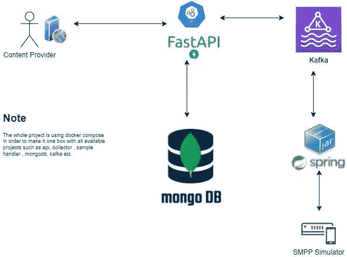

系统 HLD

# 系统组件:

*   API: [**FastAPI**](https://fastapi.tiangolo.com) 作为前台 web 服务允许 CP 触发 rest 格式的短信 API
*   收集器: [**Spring Boot**](https://spring.io/projects/spring-boot) 控制台应用程序，作为守护程序服务不断从 Apache Kafka 获取数据，使用 SMPP 协议转发到 SMSC/模拟器，并从 SMSC/模拟器接收 MO 数据
*   [**MongoDB**](https://www.mongodb.com) :存储日志和配置数据的数据库
*   [**阿帕奇卡夫卡**](https://kafka.apache.org) :消息代理，作为队列向消费者转发消息，并接收来自生产者的消息
*   **SMPP 模拟器**:(感谢 [**硒**](http://www.seleniumsoftware.com) )在我们的电脑上充当 SMSC，这只是为了确保我们可以开发一个不需要连接到真正的 SMSC 的系统
*   **样本处理器**:提供一个样本处理器 web 服务来模拟 CP 服务。
*   [**Docker**](https://www.docker.com) :使用 docker-compose 制作并在我们的电脑上轻松运行

# 顺序图

作为一个系统设计过程，如果我们有序列图就好了，这样我们可以了解系统流程的全貌。

重要的顺序图由两部分组成，MT 流程和 MO 流程:

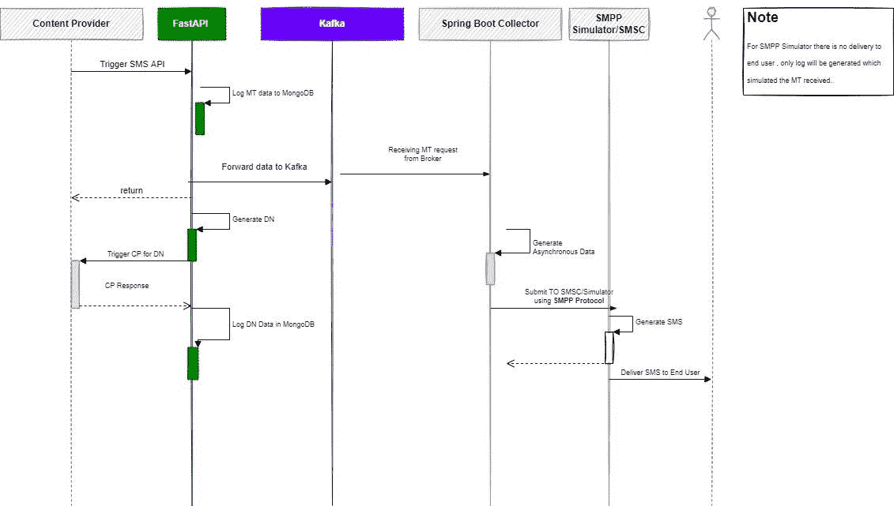

MT 流量

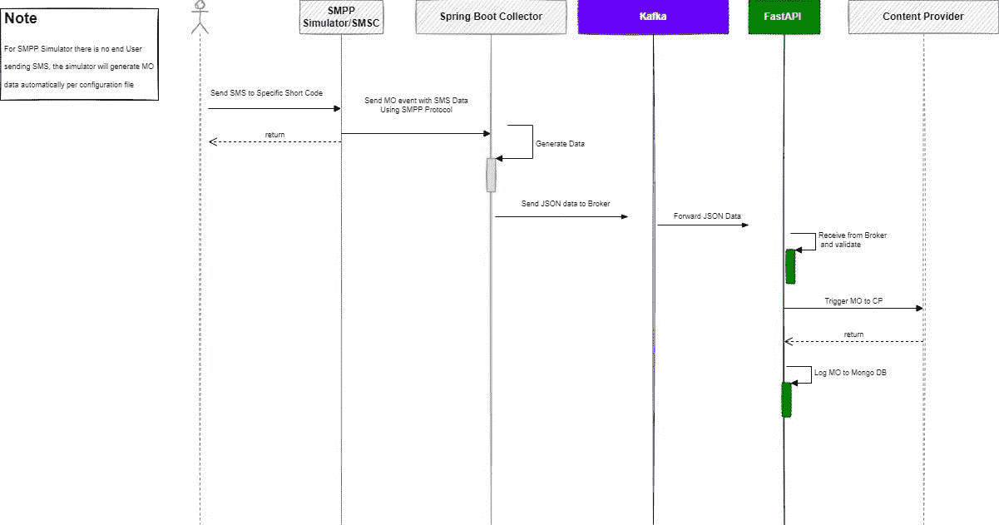

钼流量

**数据存储结构:**

由于该系统主要存储不包含某些事务的日志数据，NoSQL 最适合该系统，所以我使用 **MongoDB** 。

收藏:

*   **content_provider** :存储内容提供商信息，如:用户名、密码、secreteKey、moUrl、dnUrl
*   **mt_logs** :存储 mt 日志信息，如:内容、src、目的地、请求日期等
*   **dn_logs** :存储 dn 日志信息，如:编号、发起者、内容、签名、回调内容、回调状态代码
*   **mo_logs** :存储 mo 日志信息，如:src、dest、content、requestDate、callBackResult、callBackStatusCode

# **实现:**

## FastAPI:

由于 FastAPI 是适用于微服务的高性能 API，所以它非常适合本系统。我将其分为以下项目结构:

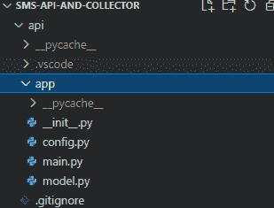

fastapi 项目文件

config.py : **定义一些配置信息，如 mogodb 连接、kafka 和主题**

model.py:文件定义了模型信息，如内容提供者、消息提交、MO 等。

main.py: API 逻辑和一些支持功能，如身份验证、创建回调签名和 web api 消费。

Dockerfile:用于在 docker ( compose)中运行这个项目

## 收集器控制台应用程序:

Springboot 是事实上成熟的企业 Java 框架，它提供了丰富的特性，包括 IoC 和 DI，允许开发人员开发灵活的、可维护的企业级项目。

它由以下几部分组成:

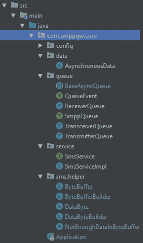

Spring Boot 项目结构

**配置**:基于 **application.properties** 文件的 kafka 配置

**数据**:用于 kafka 和采集器之间的异步数据

**queue** :抽象类 BaseAsyncQueue 为异步内存队列创建抽象，它将允许我们创建一个具体的类来绑定到 SMPP，如发送器、接收器、收发器。控制台应用程序基于这个库[**http://smppapi.sourceforge.net**](http://smppapi.sourceforge.net)与 SMPP 模拟器集成

**SmsService** :处理核心逻辑并监听 Kafka 监听器的 spring boot 服务

Docker 文件:[https://gist . github . com/engleangs/b4c 0222 FBD 040 a 63 e 31 ebc 0 f 8 A8 A8 b 00](https://gist.github.com/engleangs/b4c0222fbd040a63e31ebc0f8a8a8b00)

**SMPP 模拟器**

http://www.seleniumsoftware.com[提供的模拟器](http://www.seleniumsoftware.com)为了轻松启动模拟器，我们可以使用下面的 docker 文件:[https://gist . github . com/engleangs/c 4311 e 9322 CBF 78719 BC 50480 a 976989](https://gist.github.com/engleangs/c4311e9322cbf78719bc50480a976989)

完整的项目可以在这里找到[**https://github.com/engleangs/sms-api-and-collector**](https://github.com/engleangs/sms-api-and-collector)。要启动并运行它，只需确保在将该项目克隆到计算机后，安装 docker 并键入 docker 命令" **docker compose up -d** "。

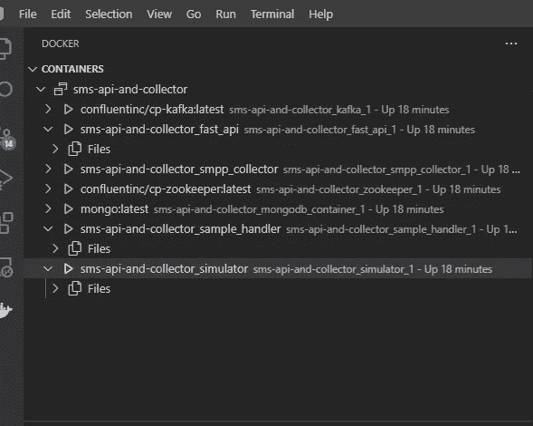

Docker 图像

启动和运行结果，需要首先创建内容提供商，如下存储在数据库中:

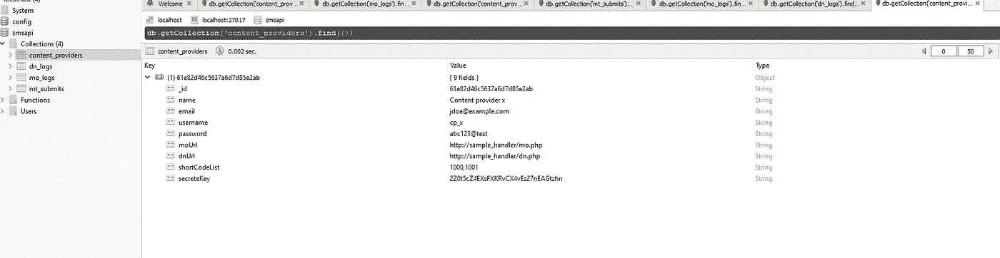

Mongodb 中的数据

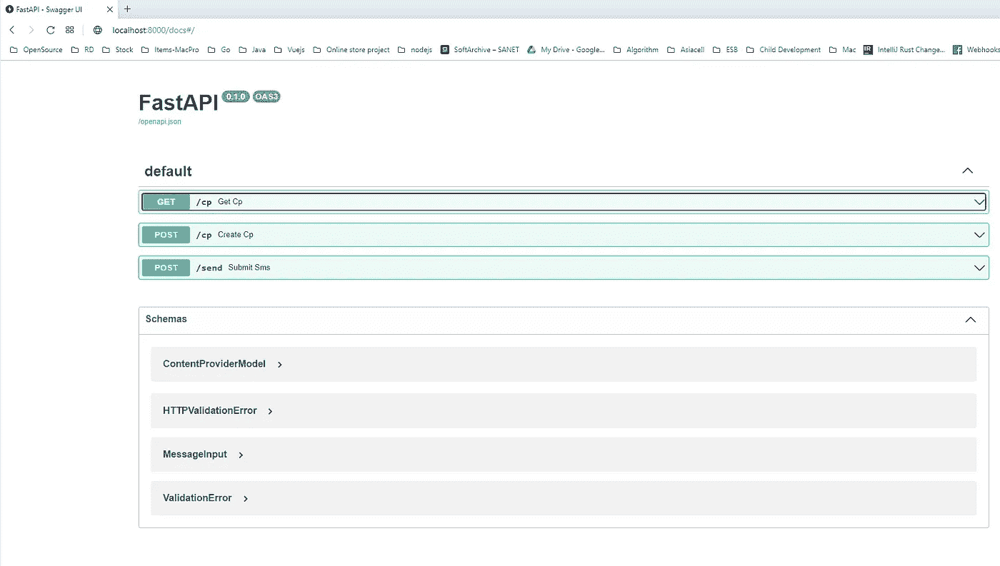

在本地计算机上访问 FastAPi 文档

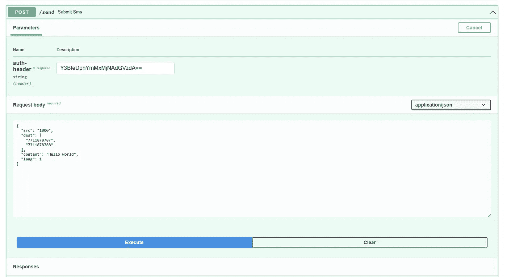

MT API 文档

快速 API 日志

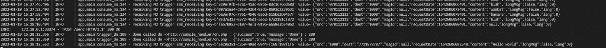

通过 Docker 日志记录 MT、DN 和 MO 日志

SMPP 模拟测井

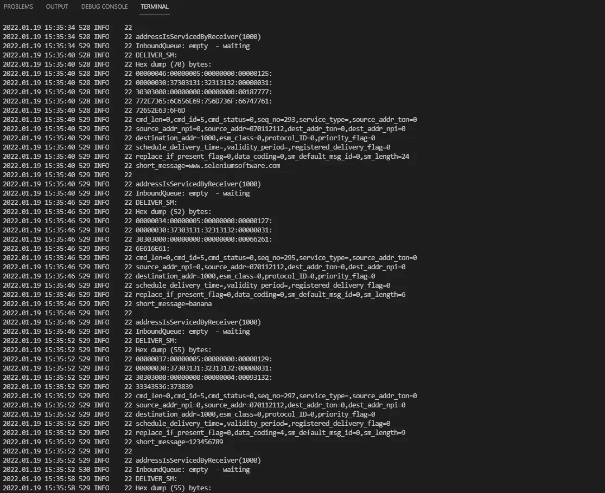

通过 Docker 日志查看日志

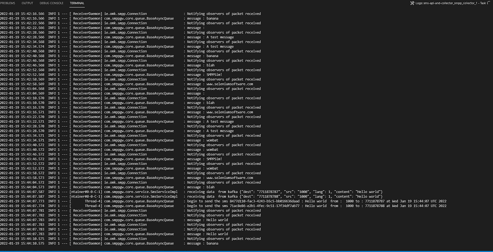

Spring Boot SMPP 收集日志

希望你能从这篇基础文章中学到一些东西。

对于这个已初始化的项目，还需要添加更多功能( **todo** ):

**API :**

*   认证验证:添加更安全和复杂的安全，如 JWT 或 Sha25 签名验证认证从 CP
*   为每个 APi 调用和其他重要事件添加日志文件或数据库日志
*   将 api 触发与 FastAPI 和重试机制分开
*   使用 RateLimit 或 Redis 的 TPS 控制

**SMPP 采集器控制台应用:**

*   为短信集成添加更多语言支持
*   添加基于短代码的路由和过滤属于特定
*   基于来自 SMPP 的错误代码添加更详细的错误消息

> [https://www . open market . com/docs/Content/APIs/v3 smpp/smpp-error-codes . htm](https://www.openmarket.com/docs/Content/apis/v3smpp/smpp-error-codes.htm)