# 简单的步骤—数据探索

> 原文：<https://blog.devgenius.io/simple-steps-data-exploration-dd986a5c0a66?source=collection_archive---------12----------------------->

有时当你得到一组新的数据时，你不知道如何开始你的数据探索。对于新手来说尤其如此。不要担心，编写这些代码，您将知道在您的数据探索之旅中下一步该去哪里。

# 读出数据

我将读取一个配置文件，这样我就不会向外界公开我的文件路径。但是你的文件路径应该看起来像‘C:/Users/username/…’注意，我们使用的是反斜杠而不是默认的 windows 正斜杠。(这在我刚开始的时候很困扰我)

```
import json
file_path = json.load(open('data sources.json'))['datasources']['Global Superstore']
```

你可以在这里得到数据。我们就用一个很普通的数据([全球超市](https://docs.google.com/spreadsheets/d/1o-KaA43TD6Q_w_vnyEOIzaR6xMTmR9nd/edit?usp=sharing&ouid=105166131516527752739&rtpof=true&sd=true))。

```
import pandas as pd
df = pd.read_excel(f'{file_path}/Global Superstore.xlsx')
df
```

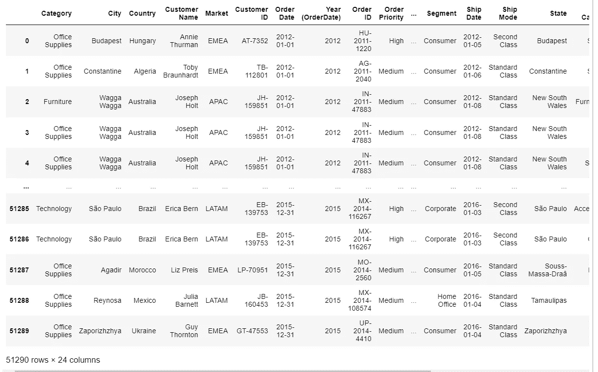

# 显示列和行

你想做的第一件事就是阅读原始数据，以便对它有一个大概的了解，或者至少知道你是否需要改变什么。事情是这样的，熊猫不会让你这么做，因为你看到的都是“……”横着竖着。这里有一个技巧，我们将改变设置，使它显示所有列和更多行(可能不是所有行)。

```
pd.set_option('max_columns', None)
pd.set_option('display.min_rows', 50)
df
```

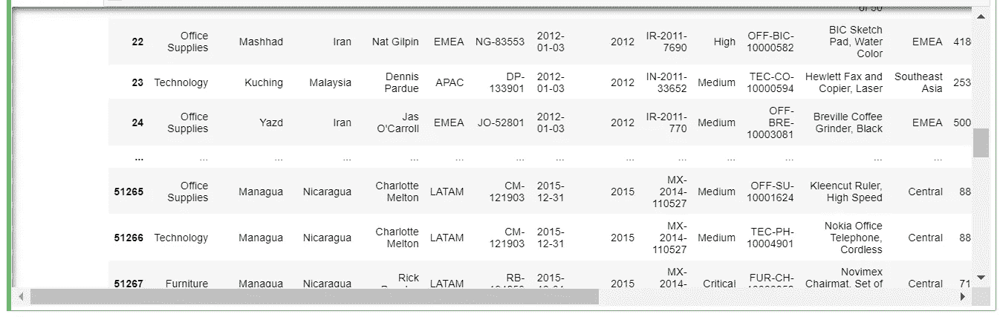

它显示前 24 行和后 24 行，同时显示所有列

请注意，这与只显示头部或尾部的 df.head()或 df.tail()不同。此选项有助于您同时检查和尾部，这在您拥有不同格式的多年数据时至关重要。

请注意 pd.set_option 是危险的，因为该选项适用于您的整个代码。为了向您展示一种更好的方法，让我们将它重置回默认值。

```
pd.reset_option('all')
df
```

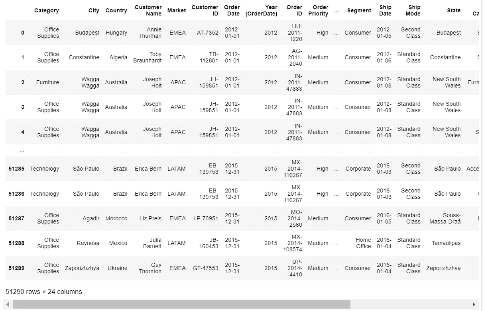

前 5 行和后 5 行，垂直和水平方向都有“…”

让我们这样做:

```
with pd.option_context('display.min_rows', 100,'display.max_rows', None, 'display.max_columns', None):
    display(df)
```

这被称为上下文管理器，它只将选项应用于其中的任何内容。缩进会定义里面的内容。

```
# Print df again to check if it will show all columns and 50 rows
df
```

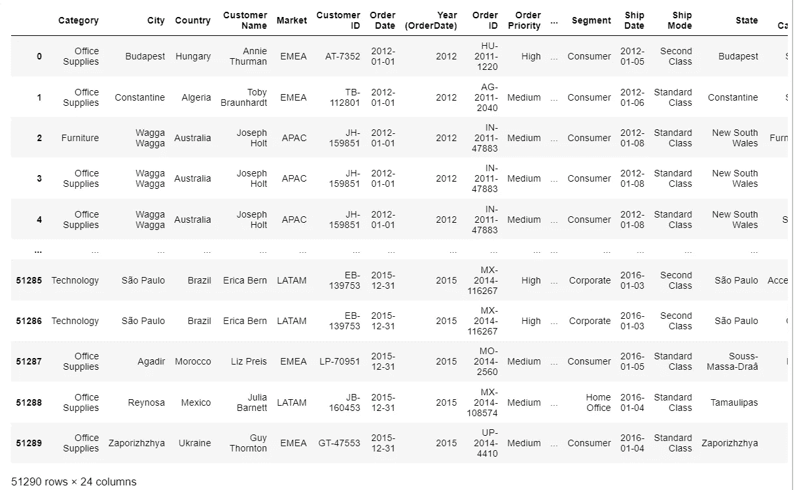

不受上下文管理器影响

# 列信息

在阅读了整个表格之后，您可能想浏览一下整个表格。就我个人而言，在这一点上我会使用 df.info()。

```
df.info()
```

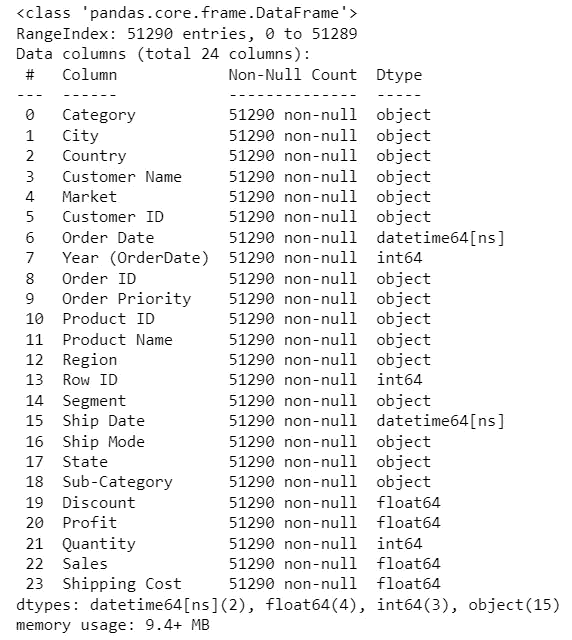

df.info()

阅读这条信息时需要注意一些事情。

1.  空值—如果您有一个 id 列(表的主键)，非空计数应该是其他列有多少空值的基准。不要担心目测，稍后我将向您展示如何轻松地检查空值。
2.  dtype——这非常重要，因为数字 id 可以(总是)被视为整数，而不是字符串(对象)
3.  列名—你可能想知道为什么我们最后才读第一件事？有一种更好的方法来检查你的列名。

# 列名

```
cols = df.columns.to_list()
cols
```

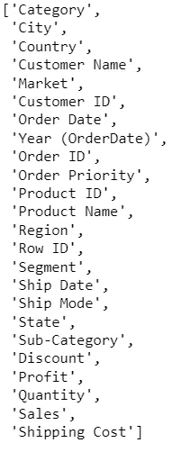

列

您并不真的需要 _list()，但是将它存储在一个列表中有助于您稍后过滤数据。

# 空值

显示所有列中的所有空值

```
df.isnull().sum()
```

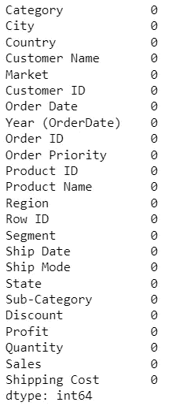

我们在这个数据中没有任何空值

# 数据分布

虽然直方图、箱线图和散点图对于理解数据分布非常有用，但我们还是把它们留到以后再说。现在我们只是用初学者的方式来理解数据分布。

```
df.describe()
```

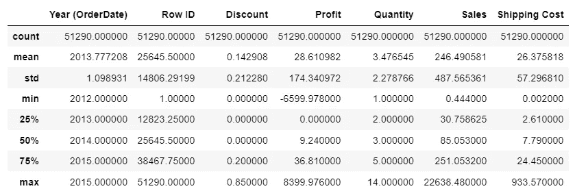

数字数据分布

`df.describe`仅适用于数字列。我们将检查分类列的唯一值。

```
df.nunique()
```

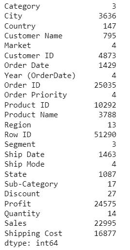

df.nunique()

这将显示表中所有列中唯一值的数量。我敢打赌，你的下一个问题将是什么是独特的价值观呢？嗯，给你~

```
df['Sub-Category'].unique()
```

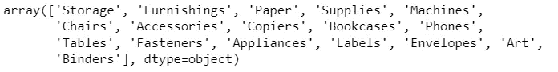

df['子类别']。唯一()

每个唯一值的行数。

```
df['Sub-Category'].value_counts()
```

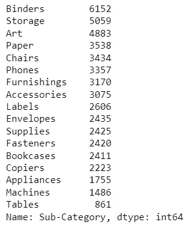

df['子类别']。值计数()

做完这些后，你是否觉得你已经准备好开始探索你一直想了解的数据了？开始做吧！如果这有助于您开始数据分析之旅，请在下面留下您的评论，当然，还有您想了解的其他内容。评论会上见。干杯！