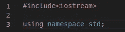
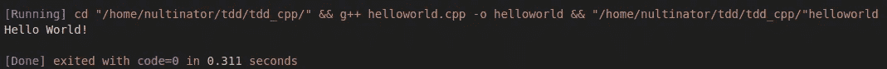

# Julia 和 C++中的简单 TDD

> 原文：<https://blog.devgenius.io/simple-tdd-in-julia-and-c-e71df9dc396a?source=collection_archive---------5----------------------->

我从 python 开始，在遇到限制后，我跳过了 Julia、Go 和 Rust 中的项目。最近，我一直在塞勒学院学习 C++课程。在学习所有这些不同的编译语言的同时，我还阅读了一些编程书籍，比如 Pete Goodliffe 的《成为一名更好的程序员》和 Emily Bache 的《编码 Dojo 手册》。在过去的一年里，我学到了很多，不仅仅是语法，还有结构、心态、耐心和纪律。

我想先谈谈我从上述两本书中学到的东西。虽然这些书没有教你编码，但是它们教你不仅要考虑你将来要写的代码，还要考虑你已经写的代码。这两位程序员都非常强调 TDD(测试驱动开发)。这个概念背后的主要思想是:

在写程序之前，先写一两个测试。 ***写的代码只够通过*** 的测试。通过它们之后，根据需要进行重构，并编写另一个测试。

这两位作者也非常强调反思。最重要的是，我们要审视并重构我们的旧代码，这样我们才能从错误中吸取教训，并作为开发人员更好地了解自己。将来，我会用我自己的代码做这件事，并在 medium 上发表。事不宜迟，让我们从一个使用经典的“Hello World”程序的例子开始。

**c++示例**

在你喜欢的任何文件夹中，创建一个“hello.cpp”文件。我们将从添加基本的依赖项开始，就像我们做任何事情一样。

现在是时候添加我们的第一个测试了，记住这一定是一个失败的测试。

运行它并…

等等，我们的程序怎么会通不过这个测试？如果您仔细观察，您会注意到，我们没有添加库来包含我们的测试功能。哦，讽刺的是…让我们改变这一点。

运行它…

好吧，有些进步，我猜是小步前进。

现在让我们添加一个真正的测试。

这个测试应该会产生这样的错误。

太好了，我们测试失败了，现在让我们添加代码使它通过。我们首先添加一个函数来打印字符串“Hello World！”。首先，我们需要添加 string 类。

现在我们可以定义我们的函数了。随你怎么定义，这是我的。

运行程序，应该会通过。

但是等等，我们没有打印到控制台，只是为了整理，让我们在 main 内部调用我们的函数，然后运行它。

成功。

**让我们在茱莉亚身上做同样的事情**

在 Julia 中，我们将使用 assert 宏。

测试以确保我们有测试

运行它

它跑了

运行它

呜哇！我们测试失败了

让我们定义我们的功能

运行它

测试通过

是时候出版了。

这是整个程序

运行它

现在你知道了。