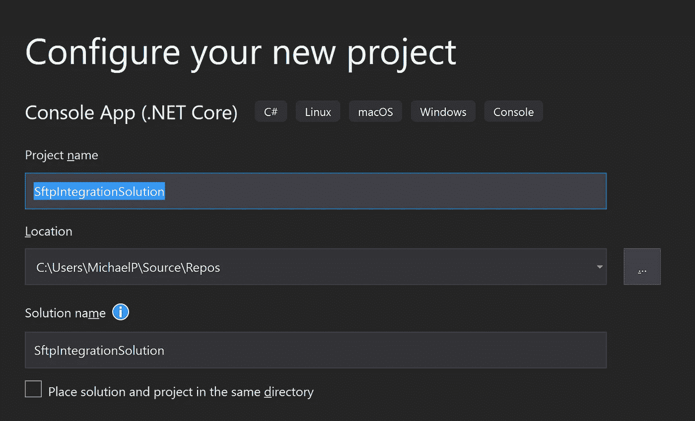
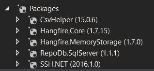
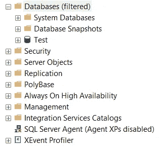
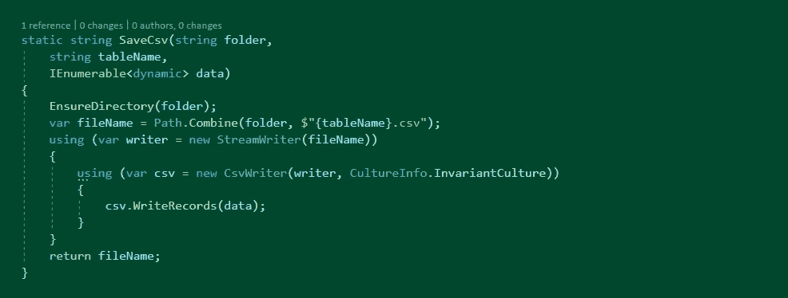
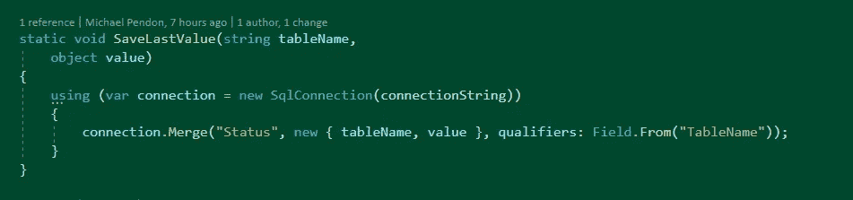
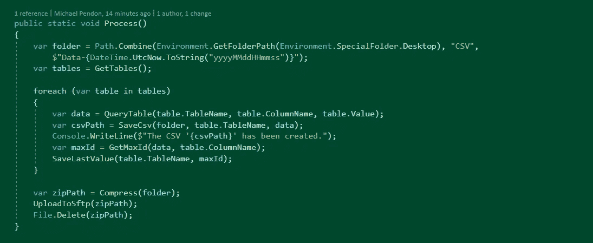

# 在中共享合作伙伴数据的简单方法。网络(通过 SFTP)

> 原文：<https://blog.devgenius.io/simple-way-to-share-partner-data-in-net-via-sftp-7447fcd6fb0b?source=collection_archive---------3----------------------->


由 [Austin Distel](https://unsplash.com/@austindistel) 在 [Unsplash](https://images.unsplash.com/photo-1557804506-669a67965ba0?ixlib=rb-1.2.1&ixid=eyJhcHBfaWQiOjEyMDd9&auto=format&fit=crop&w=1267&q=80) 拍摄的照片。

答阅读完本文后，您将熟悉如何以安全的方式将您的内部数据公开给外部消费者(即合作伙伴、供应商和/或任何类型的消费者)的实用性。

我们坚信，我们所采用的方法非常实用，而且“简单”,解决了与 SFTP 有关的一个重要问题。这可能对你 ***大有帮助，*** 因此，我们写了这篇文章。

这种解决方案完全在几个小时内完成，这在历史上是极其繁琐和痛苦的。

想想这些事情…

> 您编写了几行代码，并在很短的时间内完成了复杂的工作。该解决方案是动态的，可适应任何变化(模式、数据和/或数据流)。伙伴开心了！

**免责声明:**本文中的信息可能并不适用于所有情况，但是这种技术可以在您自己的解决方案中加以利用。任何建议和意见都可以讨论，但内容将仅限于我们的意图。

# 目标需求和场景

对您来说，了解本文的解决方案所解决的实际场景和问题非常重要。

*   数据库驻留在您的内部网络中(内部/云)。
*   您的消费者正在寻找原始数据(没有改变，也没有协调)。
*   您的消费者需要频繁交付数据。
*   您的消费者同意交付的文件格式(即:CSV 格式)。

此外，您的消费者同意对模式或数据/数据类型的任何更改，只要数据按照约定以频繁的方式到达。

# 我们的内部场景

为了让您了解这种方法已经解决的真实世界的问题/用例(就我们而言)，我们希望从一个高层次的角度来分享它。尽管如此，大部分的内容是可以概括的，可能对任何其他大型组织都是通用的。

我们在组织中与供应商(也就是供应商和原始设备制造商)合作。这些供应商正在“以多种方式并通过不同的接口”(即:Rest API、ODBC 访问、文件传输等)向我们交付数据。与任何其他组织一样，我们将数据保存在内部，它们是大数据。我们保存数据的方式是原始的，也是协调的，其中一些放在 SQL Server 上(内部)。

现在，需求是由[合作伙伴](https://en.wikipedia.org/wiki/Business_partner)触发的，其中我们是交付数据的一方，并充当供应商。请求是法规遵从性的一部分，交付起来有点关键。与上面的情况相同，但是这一次，我们是数据提供者。我们开发了各种流来公开数据，但是对于原始数据的 SQL Server 数据集(在一种情况下)，已经使用了这种方法。表和列的数量是不确定的，因为只要我们公开我们的数据源中的数据。

虽然 TBH 的解决方案由于时间压力(现实)是临时性的，但该解决方案解决了一个非常复杂的问题。它将一直运行，直到与合作伙伴就最佳方式(更好的基础设施和架构)达成一致并交付为止。当然，安全性和关键性是最重要的，数据非常敏感，因此任何交付失败(转移等。)可能会对组织造成巨大的损害。

在基础设施方面，甚至源数据库和 SFTP(镜像到外部)都驻留在内部网络上，但最终，我们在 AKS (Azure Kubernetes 服务)中部署了解决方案。我们已经权衡过，在这种临时方法中，建立一个新基础架构并不真正理想。

*我们不能透露任何与此相关的进一步信息。*

让我们开始吧…

# 什么是 SFTP？

SFTP 代表安全文件传输协议，它是一种网络级协议，提供安全可靠的文件访问、文件传输和文件管理。

我们建议你阅读这篇[文章](https://medium.com/@cspsprotocols247/what-is-sftp-secure-protocol-for-files-transfer-uses-tcp-port-22-f9eb345c1ceb)中关于 SFTP 的全部详细解释。

## 先决条件:

我们希望您具备以下条件。

*   上传文件的 SFTP 服务器(即:sftp.company.com)。
*   SFTP 服务器凭据(用户名/密码)。
*   SFTP 港(通常是 22)。

请注意，无论您(或您的组织)是否拥有 SFTP 服务器和凭据，或者它是否来自另一方，都没有必要，只要双方都同意它是数据的安全存放点。

## 本地 SFTP 服务器

如果您还没有 SFTP 服务器，但仍然渴望测试这个实现，那么您实际上可以在线下载一些免费的 SFTP 服务器(即: [FileZilla](https://filezilla-project.org/) 、 [Serv-U](https://www.solarwinds.com/free-tools/ftp-voyager-ftp-client-for-windows?CMP=BIZ-RVW-CMPRTCH-SW_WW_X_PP_PPD_FT_EN_SERMO_SW-FTPV-LM_19763_header_dd_d__post__19763) 等)。

下面的链接可能会有所帮助。

*   [https://www . comparitech . com/net-admin/best-free-sftp-ftps-servers/](https://www.comparitech.com/net-admin/best-free-sftp-ftps-servers/)
*   【https://www.pcwdld.com/10-best-free-sftp-servers 号
*   【https://www.sftp.net/servers 

或者，你可以自己去谷歌一下。

# 工具和库(。网)

在本节中，我们将解释。NET 工具和库，我们将被用来完成这项工作。

通过使用这些库，代码将变得短小精悍，同时也是动态的。因此，易于输送溶液，并且也易于操作。

*   [系统**系统。IO.Compression**](https://docs.microsoft.com/en-us/dotnet/api/system.io.compression?view=netcore-3.1) —与绑定的名称空间。NET 库能够压缩文件/文件夹。可以把它想象成您的解决方案中的一个文件 zip 库，它能够在发送到 SFTP 之前缩小文件/文件夹的大小。
*   [**系统。IO**](https://docs.microsoft.com/en-us/dotnet/api/system.io?view=dotnet-plat-ext-3.1) —捆绑包中的名称空间。NET 库，能够操作本地文件系统(创建、删除、重命名、移动和/或复制)。
*   [**Hangfire**](https://www.hangfire.io/) —用于调度频繁触发的后台作业的库。想想它的功能，您可以每小时、每天、每周或每月执行一次作业，甚至可以通过 CRON 计划进行动态配置。
*   [**RepoDB**](https://repodb.net/) —一个动态混合 ORM 库，用于以动态方式从数据库中检索数据。只需传递表名，就可以检索数据，而不用考虑模式和类型。
*   [**CSV Helper**](https://joshclose.github.io/CsvHelper/) —一个动态转换器库，用于将一个实体(类、动态或任何东西)转换成一个文件(CSV 格式)。它接受来自您的解决方案的任何输入，并将其转换并写入本地文件系统中的 CSV 文件。
*   [](https://github.com/sshnet/SSH.NET)**—一个简单易用的库，用于将文件从本地机器上传到目标 SFTP 服务器。可以把它看作是你的解决方案与 SFTP 服务器接口的桥梁，你所要做的只是简单地从你的本地文件系统传递文件的路径来调用一个方法。**

**安装这些库只需 2 分钟。**

# **实际实施**

**在本节中，我们将指导您逐步实施。我们将尽可能编写最短的代码来完成工作。该解决方案将用 C#编写，我们将使用的数据库是 SQL Server。**

**请遵循以下步骤…**

## **创建控制台应用程序**

**首先，创建一个控制台应用程序(。NET Core)项目/解决方案，命名为 *SftpIntegrationSolution* 。如果你用最新版本的就太好了。网芯。**

****

## **安装库**

**在软件包管理器控制台中，安装。上面提到的. NET 库。**

```
> Install-Package CsvHelper
> Install-Package RepoDb.SqlServer
> Install-Package SSH.Net
> Install-Package Hangfire.Core
> Install-Package Hangfire.MemoryStorage
```

**安装完成后，您的包引用应该如下所示。**

****

## ****创建数据库/表格****

**在您的 SQL Server Manage Studio 中，连接到一个本地实例并创建一个名为 **Test** 的数据库。**

****

**在新创建的数据库中，执行下面的脚本来创建必要的测试表。**

****人员表****

```
CREATE TABLE [dbo].[Person]
(
 [Id] [bigint] PRIMARY KEY CLUSTERED IDENTITY(1,1) NOT NULL,
 [FirstName] [nvarchar](64) NOT NULL,
 [LastName] [nvarchar](64) NOT NULL,
 [SSN] [nvarchar](128) NOT NULL,
 [CreatedDateUtc] [datetime2](5) NOT NULL
)
ON [PRIMARY];
GO
```

****信号表****

```
CREATE TABLE [dbo].[Signal]
(
 [Id] [bigint] PRIMARY KEY CLUSTERED IDENTITY(1,1) NOT NULL,
 [Value] [nvarchar](64) NOT NULL,
 [CreatedDateUtc] [datetime2](5) NOT NULL
)
ON [PRIMARY];
GO
```

****事件表****

```
CREATE TABLE [dbo].[Event]
(
 [Id] [bigint] PRIMARY KEY CLUSTERED IDENTITY(1,1) NOT NULL,
 [Type] [int] NOT NULL,
 [Value] [nvarchar](64) NOT NULL,
 [CreatedDateUtc] [datetime2](5) NOT NULL
)
ON [PRIMARY];
GO
```

****预加载测试数据****

**然后，执行[这里](https://github.com/mikependon/RepoDB.Tutorials/blob/master/Blogs/Medium/SftpIntegrationSolution/SftpIntegrationSolution/Database/Data.sql)的脚本，将初始行创建到新创建的表中(*人*、*信号*和*事件*)。**

## **状态表**

**该表将根据列和(该列的)最后一个复制值保存要处理的表的状态。您可能不需要这样做，因为您可以简单地将状态放在任何配置文件中，但是在本教程中，我们将使用这个表。**

**这样，您需要执行下面的脚本来创建*状态*表。**

```
CREATE TABLE [dbo].[Status]
(
 [TableName] [nvarchar](64) NOT NULL,
 [ColumnName] [nvarchar](64) NOT NULL,
 [Value] [nvarchar](128) NOT NULL
)
ON [PRIMARY];
GO
```

**并插入下面要复制的表。**

```
INSERT INTO [Status] (TableName, ColumnName, [Value]) VALUES ('Event', 'Id', 0);
INSERT INTO [Status] (TableName, ColumnName, [Value]) VALUES ('Person', 'Id', 0);
INSERT INTO [Status] (TableName, ColumnName, [Value]) VALUES ('Signal', 'Id', 0);
```

**注意，我们已经添加了 3 个表及其 qualifier 列作为该表的初始记录。这意味着本文中的所有示例将只处理这些表。**

# **读取数据集**

**由于动态是需求的一部分，并且 *RepoDB* 本身支持这些类型，因此，我们将使用动态，甚至不需要创建一个单独的模型。**

**首先，声明一个将处理数据库连接字符串的私有只读属性。**

****

**为 *RepoDB* 库添加一个引导程序方法。在 *Program.cs* 中，添加以下代码。**

****

**然后，从*状态*表中检索状态，以获得要复制的表的列表。**

****查询状态****

**在 *Program.cs* 中，添加以下代码行。确保使用关键字通过*引用 *RepoDb* 库。***

****

**结果集的类型应该是*expand object*，其中每一行包含以下值。**

*   **TableName 要复制的表的名称。**
*   **ColumnName —用作限定符的列的名称。**
*   **值-实际的最后复制值。**

**注意，上面提到的属性等同于我们在*状态*表中定义的列。**

**我们将迭代结果集(状态)的列表，并随后检索数据。检索到的信息也将是动态的。**

****查询表格****

**要查询数据，在 *Program.cs* 中添加以下几行代码。**

****

**与前面的调用相同，上面调用的结果将是动态的类型*expand object*。每一行将包含目标表的所有列，每一列的数据类型将由. NET 动态强制。检索的信息是自上次复制以来的最后 100 行，按合格列排序。**

> **因此，对数据和模式的任何更改都将包含在该场景中。因此，您不需要担心创建状态变化的监控。**

# **转换为 CSV**

***CsvHelper* 库也支持动态对象(即:*expand object*)，因此，它与 *RepoDB* 库是一个完美的组合，至少在这个场景中是这样。**

**在您的 *Program.cs* 中，添加以下代码。确保使用关键字通过*引用 *CsvHelper* 库。***

****

**上面的代码非常简单，只需确保本地系统中存在目标文件夹。它通过*系统的*目录*类创建一个不存在的文件夹。IO* 名称空间。**

**还有下面的代码。**

****

**其中 *SaveCsv* 方法接受动态对象列表(又名*expand object*)、作为实际 Csv 文件存放位置的参数 *folder* ，以及作为 CSV 文件实际文件名的参数 *tableName* 。同样，它使用 *CsvHelper* 库将这些文件保存为本地系统中的 CSV 文件。**

**注意，我们在这里接收的*expand object*列表是我们使用 *RepoDB* 库从数据库中查询的数据。**

> **在这里，来自 ORM 库的结果的任何类型的数据将由该库处理，这包括任何模式、数据甚至状态改变的要求。**

# **压缩 CSV 文件**

**下一步是在上传到 SFTP 服务器之前，在文件系统中压缩 CSV 文件。在这种情况下，我们将使用*系统的 *ZipFile* 类。IO .压缩*名称空间。**

**在 *Program.cs* 中，添加以下代码。**

****

**上面的代码很直接，因为我们只需右键单击文件夹，然后单击“发送到→压缩文件夹”。参数*路径*是放置 CSV 文件的文件夹位置。**

# **上传到 SFTP 服务器**

**需求中要做的最后一项是将压缩的 CSV 文件上传到 SFTP 服务器。这一次，我们将使用 SSH.Net 库来完成这项工作。**

**在 *Program.cs* 中添加以下方法。**

****

**上面的代码接受压缩文件夹的路径，并使用具有适当 SFTP 凭证的 *SftpClient* 类来上传文件。**

**请注意，如果 SFTP 服务器中还没有文件夹位置 *\\TopLevelFolder\Data* ，那么它将被创建。这是上传压缩文件的地方。在那里，重要的是确保用你自己的目录改变它。**

## **装饰上传百分比**

**当然，在某些情况下，zip 文件可能很大(大约 100 MB，甚至更大)，因此了解上传操作的进度非常重要。**

**在 *Program.cs* 中添加以下方法。**

****

**其中 *WriteProgress()* 方法接受以下内容。**

*   **值(ulong) —上载字节的当前长度。**
*   **streamLength (long) —文件的总大小，以字节为单位。**
*   **previousValue (ref double) —上次上传的字节长度。请注意，这是在 *ref* 上。**

**现在，在 *UploadFile()* 方法调用中，添加一个回调方法，并在其中调用 *WriteProgress()* 方法。见下文。**

****

# **保存状态**

**将最后处理的值保存回数据库是很重要的，这样数据传递的指针也是滚动的。**

**在 *Program.cs* 中，添加以下代码。**

****

**上面的代码只是将最后处理的值合并回数据库中的*状态*表。它使用*表名*列作为合并过程的限定符。**

**这里，自*系统。Linq* 本身不是动态的，因此我们需要从数据本身获取信息作为动态。在上面的方法之后添加下面的方法。**

****

**现在，一旦调用了提到的方法，状态指针也会根据实际的查询状态滚动。这样，我们就不会向消费者交付重复的数据。**

# **整合通话**

**现在，此时此刻，几乎一切都已就绪。我们所要做的就是创建一个方法来巩固我们上面所做的所有事情。**

**在 *Program.cs* 中，添加如下方法。**

****

**新创建的方法的名称是 *Process()* 。正在做的事情如下:**

*   **在桌面上创建一个名为 *CSV、*的文件夹，并在其中创建一个带有日期戳的文件夹*。***
*   **从*状态*表中检索所有要复制的表。**
*   **迭代所有检索到的表，然后根据表的最后状态查询表的数据。**
*   **将检索到的信息作为 CSV 文件保存在您的文件系统中，位置是在 *CSV* 文件夹内的日期戳文件夹下。CSV 文件的名称就是表名本身。**
*   **将最后处理的值保存回*状态*表。**
*   **压缩 *CSV* 文件夹。**
*   **将新创建的压缩 CSV 文件夹上传到 SFTP 服务器。**
*   **删除压缩的 CSV 文件夹。**

**当然，在这些过程之后，清理我们最近上传的文件/文件夹是很重要的。这只是为了避免文件系统中出现任何孤立的文件数据。**

**因此，请注意对*文件的调用。*系统的 Delete()* 方法。方法末尾的 IO* 命名空间。**

# **计划作业**

**作为一种装饰，我们可以让程序继续运行，只做它的工作。让我们给它添加一些调度，让它每小时运行一次。**

**在 *Program.cs* 中，在最后一行添加以下代码。**

****

**上面的代码简单地将方法 *Process()* 注册到 Hangfire *RecurringJob* 调度程序中，并让它每小时触发一次。**

**然后自举 *Bootstrap()* 方法里面的 Hangfire。**

****

# **引导和执行**

**我们差不多完成了，在 *Program.cs* 中，添加下面的代码。首先，将引导 *RepoDB* 和 *Hangfire* 库，然后配置作业调度程序。**

****

**代码现在已经完成，我们可以进行初始测试了。只需点击 *F5* 即可运行程序。**

**尽管死刑将在一小时后执行。要立即测试解决方案，您可以临时直接从 *Main()* 方法调用 *Process()* 方法(而不是 *ConfigureSchedules()* 方法)。见下文。**

****

**你会注意到，如果你转到你的二进制文件所在的位置，就会创建一个 *CSV* 文件夹，并被 CSV 文件填充。你还会注意到它们正在被压缩和删除。然而，甚至在文件被删除之前，在*控制台*窗口中，您会注意到表示 SFTP 实际上传状态的上传百分比。**

**解决方案的实际代码可以在[这里](https://github.com/mikependon/RepoDB.Tutorials/tree/master/Blogs/Medium/SftpIntegrationSolution)找到。你可以随时下载并使用它。**

****~瞧！到实际实现的教程现在完成了~****

# **技术和架构偏差**

**在当今时代，加上技术的出现，这似乎不是最值得推荐的方法，但我们再次向您分享了这种实用性，以便您在实现这些东西时有一个额外的选择。**

**在我们的案例中，只要不违反 it 安全性，我们就可以获得批准并部署解决方案。有人可能会建议“为什么不”只利用 Azure 服务进行交付，同样，背后的原因是 IT 人员直接与业务人员一起工作的时间压力，他们承受着来自组织合作伙伴的高压。此外，他们更喜欢通过原始方式交付**

**在技术观点中，所涉及的流程不能包装在共享的显式事务中，因此，由实现者来处理每个阶段中实现的原子性和/或酸性(ACID)。**

**另一方面，消费者容易受到与数据、模式和状态修改相关的任何问题的影响，因此向他们传达此解决方案的含义是很重要的。**

# **结论**

**十年前，我们需要编写几千行代码来完成同样的工作。今天，事情进展顺利，几乎所有的东西都是免费的。**

**使用市场上开放的现有库。在我们的例子中，我们很高兴选择了正确的库来满足我们业务的用例/场景和需求。**

**这个解决方案所涉及的库在每个阶段都很好地实现了自己的目的。它们被同等地使用和分发，并根据意图和目的做正确的工作。**

**我们希望这篇文章对您有所帮助，并希望看到您在实现自己的解决方案时使用了其中隐含的技术。感谢你们的阅读，先生们！**