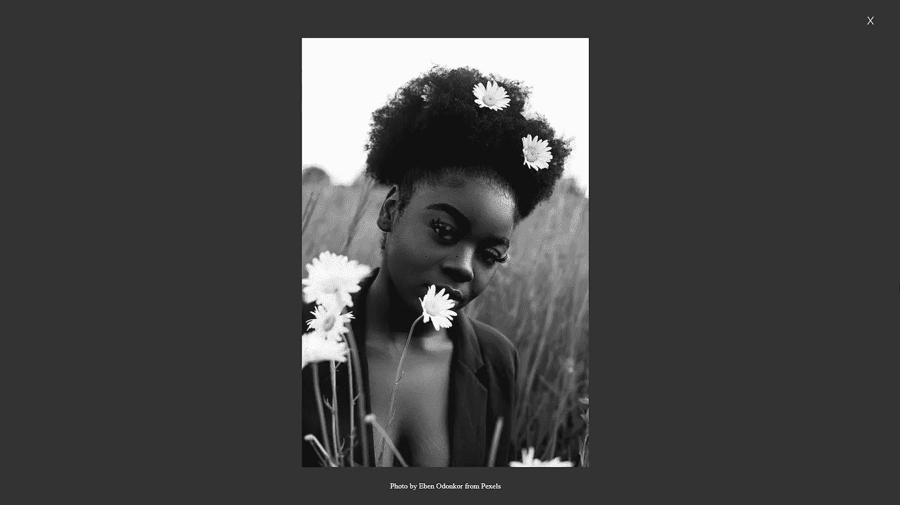

# 带有 CSS 和 JavaScript 的简单网站灯箱

> 原文：<https://blog.devgenius.io/simple-website-lightbox-with-css-and-javascript-24afc86d98b5?source=collection_archive---------8----------------------->

继续基于显示照片的网站(我们之前做了一个简单的幻灯片[，我们将看看如何创建一个简单的脚本来全屏显示图片。](https://medium.com/dev-genius/creating-a-simple-web-slideshow-with-html-and-javascript-b4feec8636ce)

让我们考虑一下我们想要什么功能。

*   全屏:当用户点击一个图像时，我们希望它在一个全屏窗口中打开一个更大的图像版本。
*   自动:我们不希望必须在每个图像上特别激活它。我们希望它自动应用到页面上的图像。
*   深色背景:许多图片在深色背景下看起来很棒，所以我们将图片预览后面的背景设为深色。
*   直观:我们想让用户容易理解，不想让他们觉得困在全屏中。浏览器已经显示了一条消息，但是我们想让用户容易地从全屏图像视图返回。


照片由[萨法尔·萨法罗夫](https://unsplash.com/@codestorm?utm_source=medium&utm_medium=referral)在 [Unsplash](https://unsplash.com?utm_source=medium&utm_medium=referral) 上拍摄

先说一些造型。

```
body { width:100%; height:100%; }
.row { display:flex; flex-wrap: wrap; }
.col { flex:1; }
#darkbox { width:99%; height:100%; position:absolute; top:0; left:0; background-color:#333; overflow: hidden; }
.imgsmall { max-width:300px; cursor:pointer; }
.imgfull { display:block; max-height:85%; margin-left:auto; margin-right:auto; position: relative; top: 50%; transform: translateY(-50%); }
.closebtn { position:absolute; top:2rem; right:2rem; width:1.5rem; height:1.5rem; style="cursor:pointer;" }
```

的。划船。col styles 是一个非常快速的 flexbox 设置，用于在页面上显示图像。如何显示你的图片由你决定，所以如果你不想的话，你可以不照着做。

`.imgsmall`是一种用于在页面上显示小图像的样式，而`.imgfull`将用于在我们的全屏视图中显示大图像。

`.imgfull`正在设置图像的最大高度为屏幕高度的 85%,我们使用左右边距来水平居中图像。为了垂直居中，我们使用了一个 css 技巧来将图像的顶部定位在屏幕高度的一半，然后将图像向上重新定位到其自身高度的一半。这使得图像垂直居中。

对于关闭按钮，我使用图像编辑工具创建了一个 64px 的正方形图像，并在白色文本中添加了大写的 X。我将它缩放到适合图片的大小，然后用透明背景保存为 png。(你可能看不到下图，因为它是白底白字。)


我关闭全屏视图的 X 图像。

样式设置完毕后，让我们继续处理 JavaScript 代码。

首先是图像。使用非常简单的 flexbox 样式，我添加了一些图像，就像这样。不过，您可以在页面上随意包含图像，所以请确保您已经为这段代码准备了一些图像。

```
<div class="row">
  <div class="col"></div>
  <div class="col"></div>
  <div class="col"></div>
  <div class="col"></div>
  <div class="col"></div>
 </div>
```

现在说说代码。

创建一个变量来存储我们正在查看的图像的 url。

```
var imgUrl = '';
```

接下来，让我们创建用于启动和关闭全屏查看器的函数。

```
function startFullScreen(img) {
  imgUrl = img.src;
  if (!document.fullscreenElement) {
   document.documentElement.requestFullscreen();
  }
 }

 function endFullScreen() {
  document.exitFullscreen();
 }
```

我们将调用`startFullScreen`并将我们点击的图像元素传递给它，以开始该图像的全屏视图。这将图像 src 设置为我们的`imgUrl`变量，然后请求浏览器进入全屏模式。稍后，我们将添加一个 eventListener，当我们切换到全屏模式或从全屏模式切换过来时，它将处理剩下的部分。`endFullScreen`功能只是告诉浏览器停止全屏模式。

现在，让我们添加一个 eventListener，它将捕获浏览器在全屏之间切换时触发的事件。当我们进入全屏模式时，我们将使用它来创建我们的“暗箱”元素，以及图像和关闭按钮，然后在离开全屏模式时再次删除它们。

```
document.addEventListener("fullscreenchange", function(e) {

  if (document.fullscreenElement) { // Create the darkBox
   var div = document.createElement("div");
   div.id = "darkbox";
   div.innerHTML = ' '; document.getElementById("main").style.background = '#333';
   document.getElementById("main").style.overflow = 'hidden';
   document.getElementById("main").appendChild(div); } else { // remove the darkbox and reset the page
   document.getElementById("main").style.background = 'white';
   document.getElementById("main").style.overflow = 'auto';
   var element = document.getElementById("darkbox");
   element.parentNode.removeChild(element); }
 }, false);
```

如你所见。当事件被触发时，我们检查它是否全屏。如果是，我们创建一个新的 div，并给它一个“暗箱”的 id。然后我们用 image 标签填充它，这个标签有一个 imgFull 类，imgUrl 作为 src。我们还使用我们创建简单的 X 图像添加了一个关闭按钮，并将其放置在右上角。我们还更改了主体的背景颜色，并将溢出设置为隐藏，以禁止滚动条显示。

如果我们要离开全屏，我们必须删除“暗箱”div 元素，并重置 body 标签。

最后，让我们添加一个自执行函数，它将在页面加载时运行，为我们自动将点击事件处理程序附加到页面上的图像。

```
(function() {

  imgelements = document.querySelectorAll("img");
  for(i = 0; i < imgelements.length; i++) {
   // add click event listener for all images on page
   imgelements[i].addEventListener("click", function(e) {
    var targetElement = event.target || event.srcElement;
    startFullScreen(targetElement);
   }, false);
  }
 })();
```

这里我们简单地使用`querySelectorAll`函数来获取页面上的所有图像。然后我们遍历结果，并为每个结果附加一个“click”event listener。当点击时，我们调用我们最初创建的`startFullScreen`函数，并将`targetElement`传递给它。这将设置`imgUrl`并请求全屏。

我们找到了。将代码添加到您的页面，刷新，您应该能够点击图像获得一个漂亮的全屏预览，看起来像这样。



我们刚刚创建的全屏“暗箱”图像浏览器的预览截图。

注:这张预览照片是由 [**Eben Odonkor**](https://www.pexels.com/@eben-odonkor-1531463?utm_content=attributionCopyText&utm_medium=referral&utm_source=pexels) 从 [**Pexels**](https://www.pexels.com/photo/grayscale-photo-of-woman-with-daisy-on-ear-2951142/?utm_content=attributionCopyText&utm_medium=referral&utm_source=pexels) 拍摄的

这还能改进吗？当然可以。在写这篇文章的时候，我想到了一些我们可以改进的方法，但是我相信你可能不得不这样做。我将在未来重新访问它，以进行这些改进，但现在我希望这对您有所帮助。