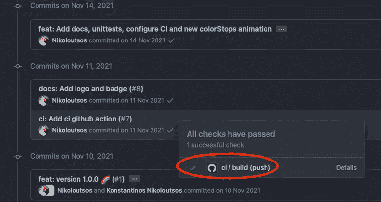
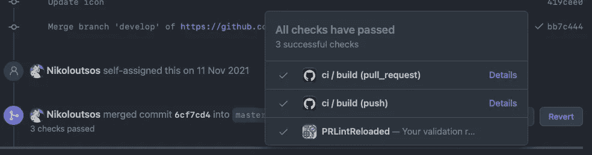
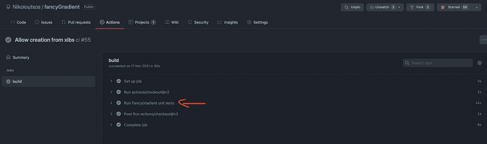
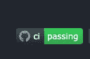

# 向 iOS 项目添加配置项的最简单方法

> 原文：<https://blog.devgenius.io/simplest-way-to-add-ci-to-ios-project-36f345ae3cb2?source=collection_archive---------3----------------------->

## 通过利用 Github 动作的力量


照片由[山姆·里恩](https://www.pexels.com/@sam-lion?utm_content=attributionCopyText&utm_medium=referral&utm_source=pexels)从[佩克斯](https://www.pexels.com/photo/glad-woman-with-cat-writing-in-planner-while-using-laptop-6002000/?utm_content=attributionCopyText&utm_medium=referral&utm_source=pexels)拍摄

我们都听说过 CI/CD 在 iOS 开发中的重要性。大多数大公司都希望你了解这一点，这不是偶然的。

老实说，当我第一次了解它的时候，我认为它是非常复杂的事情，我甚至不知道从哪里开始。我希望有这样一篇简单的文章。

我们将一起看看如何通过使用 **Github Actions** 来轻松地为您的项目设置您自己的 CI。是的，零成本！

> 它不会花你一分钱，因为它对 Github 公共项目是免费的。🔥

## 🤓要求:

*   Github 帐户
*   至少有一个单元测试
*   推送 iOS 项目的公共存储库

## 🙈CI 是什么？

每次新代码被放入存储库时，都应该有一个**连续的**方法来确保一切正常，没有任何功能中断。这是通过运行所有单元测试并期望它们成功来实现的。

> CI 代表持续集成，是将所有开发人员的工作安全可靠地合并到一个分支*(又名开发或主分支)*中的实践

因此，当有人将新代码放入存储库时，拥有 CI 的计算机就会被触发，然后开始测试一切。

## 💪为什么要用 CI？

我们生活在一个变化无常的世界里，一切都变化得如此之快。
我们的存储库变化也很快，我们需要一种方法来确保每次提交都通过所有测试，并且完全正常。

没有 CI，版本控制的想法就失去了它的价值，因为我们不知道哪些提交是健壮的和功能性的(通过所有测试)。CI 被证明可以提高开发人员的体验和生产力。

但最重要的是，我们向客户提供高质量的一流产品🎉

## 🚀让我们的 iOS 项目有 CI

在开始之前，让我们特别感谢 GitHub 团队给了我们提升❤️开发者体验的工具

**第 1 步—创建文件:**
首先在`[.github](https://github.com/Nikoloutsos/fancyGradient/tree/master/.github)/workflows/` 创建并推送一个新的 ci.yml 文件，如果您的 github 中没有这些文件夹，请创建它们

> 📒你知道吗？yml 文件代表另一种标记语言？

**第二步—配置文件:**
创建后，需要进行配置。(这将让 GitHub Action 知道何时运行什么)

*   这是您工作流程的名称，将显示在此处

> 📒如果省略`name`，GitHub 会将其设置为相对于存储库根目录的工作流文件路径。



*   `on → push → branches` 只在需要的分支上运行 CI。在这种情况下，主分支或开发分支上的新提交将触发 CI。
*   `on → pull_request → branches` 仅对那些将被合并到 master 或 develop 的 pr 运行 CI。
    现在你的公关将会有那些绿色的勾号✅.



*   `jobs → build → runs-on`
    你希望你的项目运行的 MAC-OS 版本。
*   `jobs → build → name`
    这是您为该步骤指定的名称，它显示在这里。



现在最重要的是。CI 如何知道如何运行我们项目的测试？让我们看看如何指导我们的 CI 做到这一点。👀👇👇

*   `jobs → build → steps → run` 这里我们说**运行⚡️的终端命令**在我们的例子中，我们需要在 iphone 12 mini 上运行所有测试。
    **XCode 命令行工具**为我们提供了一些有用的终端命令，用于与我们的项目进行交互。那就是构建、测试等等🔥！

```
xcodebuild -scheme {{Your_SchemeName}} test -destination "platform=iOS Simulator,name=iPhone 12 mini"
```

上述命令通过运行名为{{Your_SchemeName}}的方案的所有单元测试来测试该方案。

```
xcodebuild build-**for**-testing 
[-workspace <your_workspace_name>]
[-project <your_project_name>]
-scheme <your_scheme_name>
-destination <destination-specifier>
```

这里有一个关于这个命令语法的简短指南。`-workspace` 和`-project`是可选的。如果你想了解更多这方面的知识，请查看

[](https://www.appsdeveloperblog.com/run-xcode-unit-tests-from-the-command-line/) [## 从命令行运行 Xcode 单元测试——应用开发者博客

### 在本教程中，您将学习如何从命令行构建和运行 Xcode 单元测试。命令行工具…

www.appsdeveloperblog.com](https://www.appsdeveloperblog.com/run-xcode-unit-tests-from-the-command-line/) 

想象一下我们在终端上运行这个命令。除了在 Github 这边的不同机器上运行之外，都是一样的。

> 不要使用 XCode 命令行工具，你可以使用大多数公司大量使用的 **fastlane** 。它基本上提供了一个更简单的界面和更性感的输出。使用 fastlane，你可以用更少的写作获得更多。
> [https://fast lane . tools](https://fastlane.tools)

**第三步——推动你的改变**

就这样祝贺你🎉，您正式为您的 iOS 项目设置了第一个 CI。

## ❤️额外提示(在 github 上获得状态徽章)

这真的很简单，你所要做的就是修改你的 README.md 文件，并添加如下内容

```
[<OWNER>[/](https://github.com/Nikoloutsos/fancy-gradient/actions/workflows/ci.yml/badge.svg)<REPOSITORY>[/actions/workflows/ci.yml/badge.svg](https://github.com/Nikoloutsos/fancy-gradient/actions/workflows/ci.yml/badge.svg))]
```



如果您希望每个分支有不同的状态，请使用以下命令:

```

```

[https://docs . github . com/en/actions/monitoring-and-trouble shooting-workflows/adding-a-workflow-status-badge](https://docs.github.com/en/actions/monitoring-and-troubleshooting-workflows/adding-a-workflow-status-badge)

## ❓现在该怎么办？：

我希望你觉得这很有趣。单元测试和 CI 是给公司带来很多价值的事情之一，因为它们减少了手动测试并有助于构建高质量的产品。

大多数高薪工作都需要这种技能，这不是偶然的。很高兴在这里看到你，这意味着你关心成为一个更好的自己，毫无疑问，你很快就会得到回报🤩！

如果你喜欢读这篇文章，别忘了留下👏