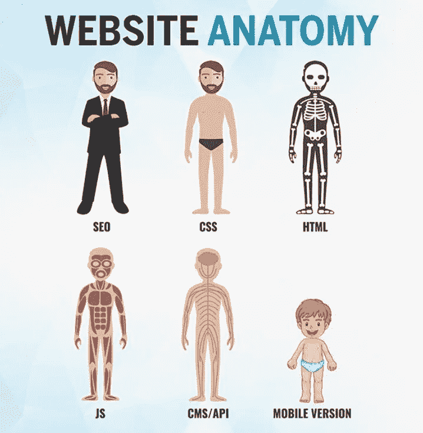

# Web 开发的简化方法。

> 原文：<https://blog.devgenius.io/simplified-approach-to-web-development-1699c523f5e0?source=collection_archive---------19----------------------->

在这篇短小精悍的文章中，我将指导你学习 Web 开发的完整过程，并让你成为更好的自己。

“在完成之前，它似乎总是不可能的”~纳尔逊·曼德拉

因此，2020 年开始你的网络开发之旅是一个奇怪的时间。这是一个有趣的二元世界，你们都比历史上任何时候都拥有更多的可用资源，矛盾的是，所提供的信息的绝对数量可以完全压倒一切。

你是一个初学者，对这个伟大的领域没有任何先验知识。所以 ***【无忧】*** 我来帮你解决这个条件。这篇文章是用简单易懂的语言写的。

> “取得成功的秘诀在于开始行动。”
> ——马克·吐温

抓紧了，让我们开始这个可怕的旅程。

# 2020-21 年的网络开发者

# 1)基本要求。

在开始 Web 开发之前，需要一些基本的工具包来让您的编码生活变得自由。这是一些基本的软件和硬件。

1.  **笔记本电脑还是台式机** :-从编码开始的基本必需品。
2.  **使用文本编辑器** :-文本编辑器是你编写所有代码的地方，终端是你执行代码的地方。作为一个开发者，这是你生活的地方。比如 [VS 代码](https://code.visualstudio.com/)， [Atom](https://atom.io/) ， [Sublime](https://www.sublimetext.com/) ， [Notepad++](https://notepad-plus-plus.org/downloads/) 。我个人用 VS 代码:)
3.  **网络浏览器** :- Chrome、Mozilla Firefox、雅虎等。
4.  **Git 和版本控制** :- Git 是用来保存代码和创建不同版本的工具。它将允许你与其他开发者合作。保存代码的最佳位置。

# 2)网站剖析

参考这张图片，你会了解这个网站的结构。

# 3)我们来编码吧！

Web 开发分为两个领域:-

a)前端 Web 开发。(网页设计师)

b)后端网页开发。(网络开发人员)

# 3 a)前端开发。

前端旅程的完整路线图。

# i) HTML5 和 CSS3

HTML5 和 CSS3 是任何网站的支柱。HTML5 提供了结构，而 CSS3(级联样式表)提供了样式，并帮助它们看起来更好，更具视觉吸引力。如果你想成为一名前端开发人员，那么你必须掌握这两个。

# ii)任何设计软件的基础

1.  Photoshop。
2.  瘸子。
3.  专业油漆店。

这对你有很大帮助。

# iii) JavaScript

面向对象编程的四大支柱是数据抽象、多态、封装和继承，就像 web 开发也有三大支柱一样，即 HTML5、CSS3 和 JavaScript。JavaScript 将赋予你的网页生命，使你的网站更具互动性和动态性。

~基础 JS(目前没有框架。)
~数据类型
~函数
~事件处理
~

在这之后，你可以阅读 JavaScript 提供的 7 个最好的库。

 [## JavaScript 提供的 7 个最佳库

### 对 JavaScript 提供的库的简短而全面的描述。

medium.com](https://medium.com/@adaksh5/7-best-libraries-offered-by-javascript-450ed0b73600) 

**一旦你熟悉了基本的 JavaScript，那么就从 JavaScript 前端框架(任何一个)开始吧。**

*   *有角度的*
*   *React JS*
*   *Vue JS*

# iv)停放您的网站！

恭喜你，网页设计师们，你现在已经掌握了 HTML5、CSS3 和 JavaScript 的基础知识，同时你也掌握了一项软技能(设计软件)。继续前进，创建一些令人敬畏的网站，在继续前进之前，也学习这些。

1.  了解 GIT。
2.  基本终端命令。
3.  嘘。
4.  获得一个托管帐户。(000 网络主机、主机等)
5.  了解 Cpanel。
6.  上传您的项目。
7.  注册域名并停放。

# v)网页设计师！抓住一些机会。

图片来自 Unsplash

*   为创业公司制作简单的网站。
*   构建 UI Web 应用程序。
*   做实习。
*   为一家公司工作。
*   成为一名自由职业者。

# vi)进一步发展前端？

尝试学习

*   引导程序
*   纯的
*   Zurb 基金会
*   物化 CSS
*   梅姐
*   骨骼

# 3 b)后端开发

后端旅程的完整路线图。

选择后端开发肯定是一个不错的选择。为此，你必须学习**服务器端脚本语言。**

PHP:- 忘掉人们对 PHP 的负面评价。这仍然是编写服务器端代码的最简单的方法。

Ruby on Rails:- Ruby 是另一种最适合 web 开发的强大语言。它有一个很棒的叫做 Rails 的框架，使得创建 Web 应用程序变得简单快捷。

**Python:-** 又一个牛逼的语言，充满了强大的框架和库。

**节点。JS:-** 强大而神奇的框架。

**JAVA:-** 高性能服务器端语言。

# ii)公司及其服务器端脚本语言。

**1.PHP**

*   脸谱网
*   Vox 媒体
*   特斯拉汽车公司

**2。Ruby on Rails**

*   爱彼迎（美国短租平台）
*   彭博
*   开源代码库

**3。Python**

*   照片墙
*   谷歌
*   网飞

**4。节点。JS**

*   贝宝
*   优步
*   商务化人际关系网

**5。JAVA**

*   埃森哲
*   扎兰多
*   直觉

# iii)既然你选择了后端，那就开始学习吧..

**关系数据库**

*   关系型数据库
*   一种数据库系统
*   MSSQL
*   MariaDB

**NoSQL 数据库**

*   MongoDB
*   CouchDB
*   卡桑德拉
*   重新思考 DB

**缓存**

*   Memcached
*   雷迪斯

**进一步提升您的游戏！！**

*   搜索引擎
*   GOF 设计模式
*   建筑模式
*   学习不同的测试技术

# iv)搁置您的应用程序！

现在你们对题目都有了很好的把握，知识也比以前多了，所以利用这些技术让你的 app 上线吧。

1.  专用服务器/VPS
2.  应用托管— Heroku、数字海洋、AWS
3.  部署工具
4.  Linux 命令行
5.  维护和更新

# v)网页开发者！抓住一些机会。

恭喜你，网络开发者，你有一些很好的机会在等着你。

图片来自 Unsplash

1.  创建 web 应用程序
2.  构建后端 API(应用程序编程接口)
3.  使用网络安全
4.  管理服务器和数据库
5.  申请工作
6.  开始自己的创业/生意
7.  成为自由职业者

# 4)此外，您还可以..

1.  多实践，多探索。
2.  建立你的档案。
3.  学习新的堆栈(均值、MERN 等)
4.  帮助和指导初学者(这也会增加你的知识)。
5.  做一些研究。
6.  要有生产力，每天都要学习。

# 5)基本项目实践

图片来自 Unsplash

*   致敬页面
*   个人投资组合
*   登录页面
*   音乐商店网站
*   制作一个餐馆网站
*   视差网站
*   技术文档和更多…

# 结束语:

感谢您到目前为止阅读本文。你可能认为有这么多东西要学，但是相信我，一旦你开始学习 Web 开发，你就会爱上它。

> 对知识的投资回报最高。

*再次感谢，祝你未来一切顺利！*

*如有疑问，可随时联系我寻求帮助。*

> 电子邮件:——adaksh5@gmail.com
> 
> LinkedIn:-[https://www.linkedin.com/in/akshat-srivastava-4812271a9/](https://www.linkedin.com/in/akshat-srivastava-4812271a9/)
> 
> github:-[https://github.com/akshat-fsociety](https://github.com/akshat-fsociety)

# #前端

# #后端

图像资源:

*   [*https://github.com/kamranahmedse/developer-roadmap*](https://github.com/kamranahmedse/developer-roadmap)
*   [*https://www.instagram.com/*](https://www.instagram.com/)