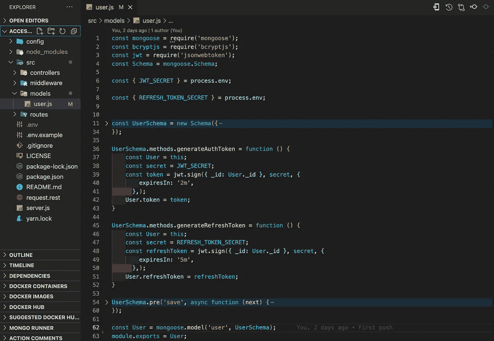
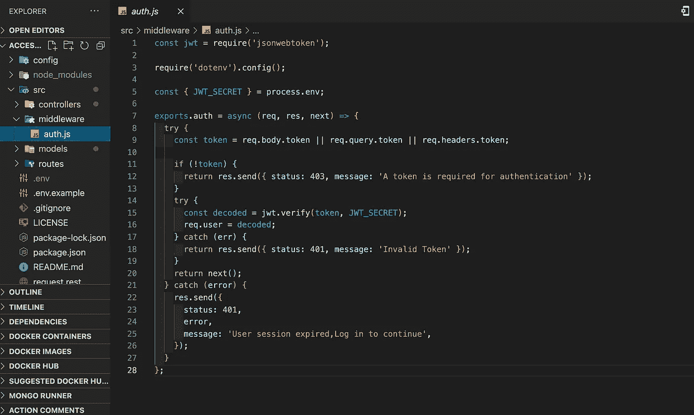

# Node Express MongoDB 后端服务器上访问和刷新令牌的简化实现

> 原文：<https://blog.devgenius.io/simplified-implementation-of-access-and-refresh-tokens-on-a-node-express-mongodb-backend-server-2b251975c21f?source=collection_archive---------1----------------------->

在本文中，我们将简化后端服务器上的访问和刷新令牌的实现，以验证和授权我们的用户访问服务上可用的端点

本演练的要求:

*   基本的节点和表达式知识
*   Mongoose ODM 和 MongoDB 的基础知识
*   JSON Web 令牌的基础知识

我们将跳过设置服务器，直接跳到令牌实现，本演练的参考资源库可以通过以下链接在 GitHub 上找到:[https://GitHub . com/mulubwa 17/Access _ Refresh _ tokens _ Node _ Express](https://github.com/Mulubwa17/Access_Refresh_tokens_Node_Express)

**第一步**

**定义我们的模式以创建数据库文档并生成我们各自的令牌**

在这一步中，我们在模型文档中定义了用户模式，并使用 mongoose 模式方法包含了令牌生成中间件，如下所示:

在上面的代码中:

*   我们首先导入启动模式所需的必要包
*   我们从我们的 ***导入我们的访问和刷新令牌。env*** 文件在我们项目的根目录下
*   我们定义我们的用户模式(检查存储库中的字段)
*   我们使用 mongoose 方法定义我们的访问令牌生成中间件，给它 2 分钟的到期时间
*   我们使用 mongoose 方法定义我们的刷新令牌生成中间件，给它 5 分钟的到期时间
*   我们导出要创建的模型并保存在我们的 mongo 数据库中

> 访问令牌的到期时间总是比刷新令牌的到期时间短

**第二步**

**定义访问令牌验证逻辑**

在这一步中，我们定义了通过检查访问令牌的到期日期来验证其有效性的逻辑。我们将它放在中间件文件夹中，因为我们需要将它导入到 routes 文件中来加密我们的端点。逻辑如下所示:

**第三步**

**在我们的认证/授权控制器中定义并导入我们的令牌中间件**

在这一步中，我们将把我们的模型中定义的令牌生成中间件导入到我们的控制器中，该控制器包含我们的身份验证/授权逻辑，如下所示:

我们有如上所示的授权登录代码，并在其中突出显示:

*   当我们成功登录时，我们导入并使用我们的 ***访问令牌生成*** 中间件来返回一个访问令牌
*   当我们成功登录时，我们导入并使用我们的 ***刷新令牌生成*** 中间件来返回一个刷新令牌

**第四步**

**在我们的授权/认证逻辑控制器**中定义我们的刷新令牌登录

在此步骤中，我们将定义我们的刷新令牌逻辑，当当前令牌过期时，它允许我们生成新的访问令牌。我们定义了身份验证/授权控制器中的逻辑，如下所示:

在上面的代码中:

*   我们要求在我们的请求体中从我们的登录获取一个刷新令牌
*   我们检查是否已经提供了 ***令牌串*** ，如果刷新令牌字段为空，则返回一个错误
*   我们验证刷新令牌的有效性，并通过引用存储在令牌有效负载中的用户信息(在本例中是用户的 id)来使用它找到拥有它的用户。
*   一旦找到用户，我们使用我们的模型中定义的令牌生成中间件启动一个新的 ***访问令牌*** ，并将新令牌返回给用户

**第五步**

**我们将授权/认证登录导出到我们的 routes 文件中**

在这一步中，我们将控制器的登录信息导入到 routes 文件中，并创建允许我们访问服务器的端点，如下所示:

在上面的代码中:

*   我们导入我们的控制器逻辑
*   我们从中间件文件夹中的 ***auth*** 文件导入令牌验证逻辑
*   我们定义端点，将它们链接到控制器文件中的特定逻辑
*   我们使用访问令牌将我们的 ***auth*** 中间件添加到我们想要消费的端点

> 在接下来的步骤中，我们将使用一个名为***【REST CLIENT】***的 Visual Studio 代码扩展来运行 Vs 代码中的端点

**第六步**

**使用访问令牌**

在这一步中，我们将尝试使用没有令牌的端点，然后通过登录并使用它来访问端点来生成令牌。

*   我们尝试列出服务器上没有访问令牌的所有用户，我们将返回一个错误，要求我们提供一个令牌，如下所示

*   我们登录以检索我们的访问和刷新令牌，这些令牌将用于消费我们的其他端点，并在会话到期时进行刷新，如下所示:

*   我们使用新获得的访问令牌来检索用户列表，如下所示:

*   2 分钟后，我们注意到我们的访问令牌已过期，我们需要获取一个新的令牌，过期的令牌会返回一个错误，如下所示:

**第 7 步**

**使用刷新令牌生成新的访问令牌**

在最后一步中，我们将使用登录时收到的刷新令牌来生成新的访问令牌，并继续使用我们的服务器，而不结束我们的会话

*   我们使用刷新令牌来生成新的访问令牌，如下所示:

*   我们使用新的访问令牌来使用我们的端点并继续我们的操作，如下所示:

## 现在，您已经成功地在服务器上实现了令牌认证。 ***快乐编码！！！！***