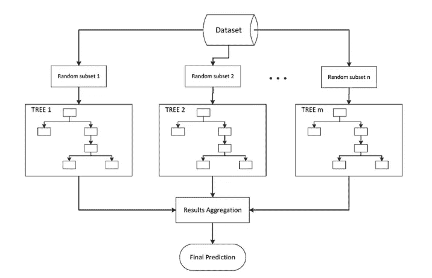
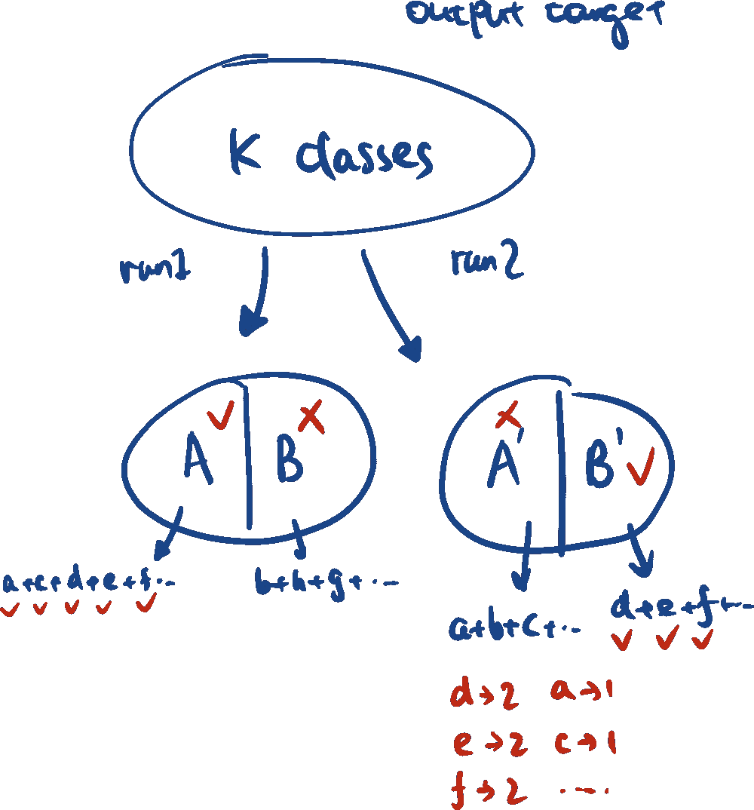

# 简化机器学习

> 原文：<https://blog.devgenius.io/simplified-machine-learning-66c7a47cde18?source=collection_archive---------29----------------------->

第四部分:使用主动回忆学习集成方法

肖恩·林在 [Unsplash](https://unsplash.com?utm_source=medium&utm_medium=referral) 上的照片

## 这次，让我们使用主动回忆技术来更有效地学习新概念

 [## 什么是主动召回，效果如何？

### 好吧，如果你相信宣传，主动回忆比阅读好，比强调好，听着就喜欢…

getatomi.com](https://getatomi.com/staffroom/what-is-active-recall-and-how-effective-is-it/) 

通过问自己以下问题，它鼓励我们积极地从大脑中检索信息。这种互动技术有助于我们将短期记忆中的知识转化为长期记忆。让我们开始吧…

# 从根本上说，什么是合奏？

> 分类器的集合是**一组分类器(因此分类假设)**，它们各自的决策以某种方式组合起来，以对新的例子进行分类。你可能认识的一些常见的合奏例子有*随机森林、AdaBoost、Bagging* 等。我们将在下一节详细讨论这些技术。

## 什么因素确保集成优于单个分类器？

1.  分类器集合中的各个分类器必须**彼此不一致**，因此，它们的误差可以相互抵消
2.  每个分类器以小于随机的速率产生**不相关的误差**(例如，对于二进制分类为 0.5)

## 是什么让合奏发挥作用？

1.  **统计维度:**与假设空间的大小相比，训练数据可能不够充分，集成方法对来自每个分类器的结果进行平均，并降低选择错误分类器的风险
2.  **计算维度:**在假设空间中从许多不同的起点运行搜索可以减少计算成本并避免陷入局部最优
3.  **代表性维度:**假设空间可能不包含真实的目标函数，分类器的加权组合可能能够到达假设空间之外

# 如何创建合奏？

创建合奏的方法可以分为四种类型:

## **1。通过子采样操作训练集:**

*   在**不同的训练样本子集**上运行几次学习算法，对于**不稳定的**学习算法*(例如决策树、神经网络)*工作良好

*包括以下技术:*

*   **Bagging(bootstrap replicate)**是这一类别下的典型集成方法，它使用原始训练集的 bootstrap replicate，类似于统计学中的 bootstrap 技术。

Bagging 算法

*   **交叉验证委员会**将训练数据集分成 n 个子集，每次丢弃其中一个子集形成训练时间，然后这样迭代构建 10 个训练数据集。程序类似于 *k 倍交叉验证*
*   **Bagging vs 交叉验证委员会** : bagging 分类器看起来更不一样，因为训练数据的差异更大，因此分类器彼此不一致
*   **增强**调整训练实例的概率分布。与 Bagging 和 Cross Validated 委员会相比，它更容易过度适应噪声。增压是基于以下原则创建的:

1.  希望生成的下一个假设在错误分类的例子上做得更好
2.  增加训练示例中**不正确**案例(而不是不正确假设)的权重，减少**正确**案例的权重
3.  通过每个假设的权重生成最终的集合假设(具有更多正确案例的 H 将具有更多权重)

AdaBoost 插图

## **2。操作输入功能**

*   操纵学习算法可用的输入特征集，当输入特征**高度冗余**时工作良好

*包括以下技术:*

*   **特征选择**:重采样选择多少特征来训练数据

## **3。操纵输出目标**

*   **纠错输出编码(ECOC)** :将 K 个输出标签划分成两个子集(A & B)并在 A 和 B 上学习一个分类器，然后迭代过程 L 次，每次**正确分类的类别得到一个投票**，最后投票最多的类别就是集成的预测

ECOC 插图

## 4.将随机性注入学习算法

*   算法用于学习训练集，但是具有随机设置的不同初始权重
*   *例如，人工神经网络中不同的初始权重*
*   *例如，在决策树中选择随机分割标准*

# 什么是随机森林？

> *随机森林是由许多决策树组成的分类算法。它使用* ***装袋和特征随机性*** *来创建一个* ***不相关的树的森林*** *，其由委员会的预测比任何单个树的预测更准确。*

> 随机森林=装袋+特征选择？

## 随机森林与装袋和特征选择有什么关系？

1.  **装袋:**从训练数据集中随机抽取森林，并创建子集训练样本，那些未被选择的数据称为袋外(OOB)样本，用于评估随机森林的性能
2.  **特征选择:**通过选择特征子集中的重要特征来生长树，子集选择的随机性增加了模型的多样性
3.  这两种方法用于构建森林中的每一棵树，然后通过迭代该树构建过程来形成随机森林

随机森林插图

*随机森林的重要性质:*

1.  **OOB(出袋)错误:**

*   可用于为每个节点找到随机选择的**个属性**的**最佳范围**
*   评估基于袋外样本的**错误预测实例数**
*   **OOB 误差估计:**多数票不等于真实类的次数比例，所有情况下的平均值

 [## 《随机森林》中的“出袋”(OOB)分数是多少？

### 这个博客试图解释 oob_score 的内部功能，当它在…

towardsdatascience.com](https://towardsdatascience.com/what-is-out-of-bag-oob-score-in-random-forest-a7fa23d710) 

**2。可变重要性:**

*   可变重要性对于特征选择过程是至关重要的
*   首先，取所有属性并**选择其中一个**并随机化属性值，学习一个集成
*   如果具有随机属性的学习集成与没有随机分配的属性值的一样好，则该属性不重要，因此**删除该属性**并运行迭代过程
*   如果两个属性高度相关，那么去掉其中一个可能不会有什么区别；如果把他们中的两个带出去，可能会产生巨大的变化

# 其他有用的资源

关于集合方法的更多信息…

 [## 随机森林.分类描述

### 本节给出了随机森林的简要概述以及关于该方法特性的一些评论。我们假设…

www.stat.berkeley.edu](https://www.stat.berkeley.edu/~breiman/RandomForests/cc_home.htm)  [## 了解随机森林

### 该算法如何工作以及为什么如此有效

towardsdatascience.com](https://towardsdatascience.com/understanding-random-forest-58381e0602d2)  [## 整体方法:装袋、助推和堆叠

### 理解集成学习的关键概念。

towardsdatascience.com](https://towardsdatascience.com/ensemble-methods-bagging-boosting-and-stacking-c9214a10a205) 

更多机器学习主题…

 [## 简化机器学习

### 第 3 部分:决策树

medium.com](https://medium.com/ai-in-plain-english/simplified-machine-learning-f5ca4e177bac)  [## 简化机器学习

### 第二部分:概念学习

medium.com](https://medium.com/ai-in-plain-english/simplified-machine-learning-d66b3f5fa901)  [## 简化机器学习

### 第 1 部分:机器学习简介

medium.com](https://medium.com/ai-in-plain-english/simplified-machine-learning-concepts-ep1-dd794ee7dd0c)