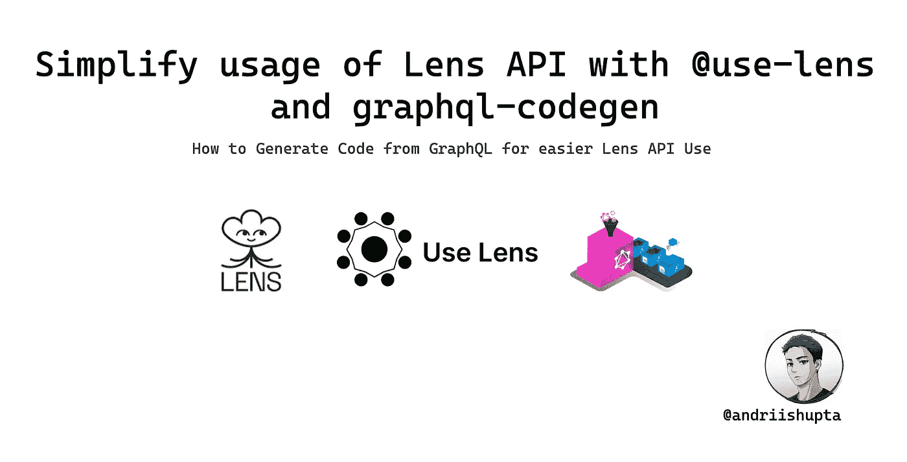
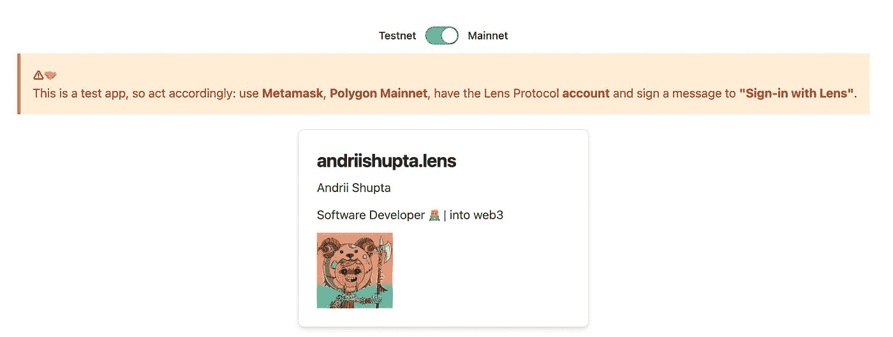
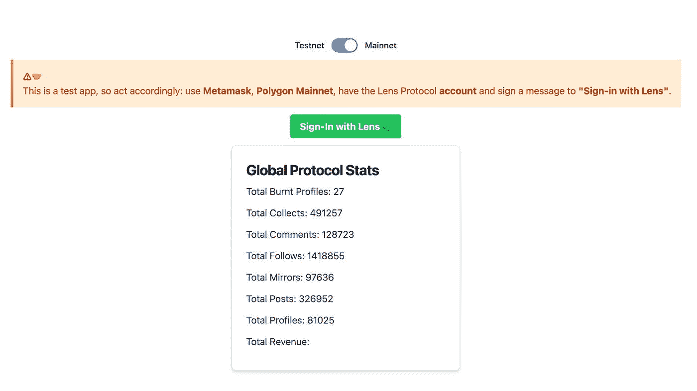

# 通过@use-lens 和 graphql-codegen 简化 Lens API 的使用

> 原文：<https://blog.devgenius.io/simplify-usage-of-lens-api-with-use-lens-and-graphql-codegen-62fbc43a0557?source=collection_archive---------13----------------------->



# 🔗链接

*   [andriishupta | Github](https://github.com/andriishupta)
*   [使用镜头| Github](https://github.com/use-lens/use-lens)
*   [镜头 API](https://docs.lens.xyz/)
*   [GraphQL 代码生成器](https://the-guild.dev/graphql/codegen)

# 📰发布于

*   [哈希节点💻](https://blog.andriishupta.dev/)
*   [中型✍️](https://andriishupta.medium.com/)
*   [开发社区👩‍💻👨‍💻](https://dev.to/andriishupta)

# 🤓介绍

最近，我使用 Lens API 构建了一些 playground 应用程序，并注意到了一个重复的任务:我为每个项目创建了 Lens API 查询和变异，并使用 [GraphQL 代码生成器](https://the-guild.dev/graphql/codegen)将 React hooks 用于 Apollo 客户端。

在第二次做同样的工作后，我决定创建一个更容易使用 Lens API 的库，这样可以节省我做实际工作的时间。

我从来没有创建过开源包，认为这样做是一种很棒的体验，即使只有我会使用它😅。

npm [@use-lens](https://www.npmjs.com/org/use-lens) 到目前为止包含 2 个包——*CLI*和 *react-apollo* 。在本文的后面，我将解释如何以及何时使用它们，同样的信息可以在 [repo 的 README.md](https://github.com/use-lens/use-lens/#-usage) 中找到。我将在文章的后面解释我是如何最好地使用`@use-lens/*`的。

此外，我非常喜欢 Lens 协议，所以我创建了 Github 组织 [Use Lens](https://github.com/use-lens) ，我计划在那里开发和发布一些基于 Lens 的工具、示例和应用程序。

# 技术

> Lens Protocol 是一个可组合的去中心化社交图，随时可供您构建，因此您可以专注于创建出色的体验，而不是扩展您的用户。
> 
> 拥有自己的内容。拥有你的社交图谱。拥有您的数据。

如果你已经读到这里——你知道什么是镜头 API，以及如何使用它。如果你是来检查`@use-lens`或者只是来检查如何生成 GraphQL 代码——在这里自学 Lens 协议和 API:

🌿 [docs.lens.xyz](https://docs.lens.xyz) 。

[GraphQL 代码生成器](https://the-guild.dev/graphql/codegen)——这是一个工具，它通过一个简单的 CLI 从您的 GraphQL 模式和操作中构建易于使用的代码，该 CLI 带有许多用于不同框架的插件:React、Next.js、Svelte、Vue with Apollo、URLQ 和其他——只要您能想到的。

# 🧑‍💻如何

# 用 [@use-lens/cli](https://github.com/use-lens/use-lens/tree/main/packages/cli) 生成

```
npm install --save-dev @use-lens/cli
use-lens generate %PACKAGE%
```

使用 npx

```
npx @use-lens/cli generate %PACKAGE%
```

这会将 Lens API 的基本文件复制到您的 repo 中，并运行`graphql-codegen`来生成代码。默认情况下，它会转到`src/lens-api/index.ts`。从这里，你可以调整`tsconfig.json`来使用`@use-lens`缩短，所以它会感觉像一个包的用法。更多关于如何做的信息[请点击](https://github.com/use-lens/use-lens/tree/main/packages/cli#optional-tsconfigs-paths)。

# 与`@use-lens/*`

简单的`npm install --save @use-lens/%PACKAGE%`并把它作为一个普通包使用。

```
import {
  GlobalProtocolStatsDocument,
  GlobalProtocolStats as GlobalProtocolStatsType,
  useGlobalProtocolStatsQuery,
  useGlobalProtocolStatsLazyQuery,
} from '@use-lens/react-apollo'
```

# 手动 GraphQL 代码生成器

默认的方法很简单，可以遵循正式文件[这里](https://the-guild.dev/graphql/codegen/docs/getting-started)

在高层次上:

*   安装`@graphql-codegen/cli`
*   为你的堆栈选择一个插件:例如， [react-apollo](https://www.the-guild.dev/graphql/codegen/plugins/typescript/typescript-react-apollo) 并安装它
*   获取您的 GraphQL 模式和文档
*   为`graphql-codegen`创建基本`codegen.yml`
*   运行`graphql-codegen`

在您的`codegen.yml`中，您应该指定模式、文档、保存位置和内容:

```
schema: schema.graphql # full schema; could be HTTP link
documents: documents.graphql # queries and mutations that you want to have
generates:
  ./src/my-api/index.ts: # where to save
    plugins:
      - typescript
      - typescript-operations
      - typescript-react-apollo # stack that you are going to use
```

# ⚠️警告

🌿[docs.lens.xyz/docs/introduction](https://docs.lens.xyz/docs/introduction):

> 这个 API 是测试版，还没有完成生产，这意味着我们可以在任何时候改变模式和端点，而不会警告或通知你。当这个 API 生产就绪时，我们将删除这个测试警告，并努力确保没有任何变化，除非需要对协议本身进行重大更改。

镜头 API 没有量产完成，`@use-lens/*`也是。请在生产时记住这一点。

# 推荐用途

如果你想用镜头 API 玩**——不要犹豫，安装一些`@use-lens/*`包——它会给你所有你需要的开始。**

如果你想让**有更多的控制权**——使用`@use-lens/cli`在本地生成代码。这将复制包中包含的基本文件，并运行`graphql-codegen`。

你可以用`codegen.yml`做更多的事情。

# 👨‍🏫与阿波罗客户互动

对于`@use-lens/react-apollo`，我准备了一个如何使用它的例子。

点击查看源代码



# 🤝镜头 API 文档

完整的镜头 api 文档集取自 [api-examples](https://github.com/lens-protocol/api-examples) ，这是一份显示如何使用镜头 API 的镜头协议报告。Lens API 文档中给出了相同(或相似)的查询示例。

# 📚摘要

如果你想使用 Lens API 看看它是什么——通过使用 [@use-lens](https://github.com/use-lens/use-lens) 或 [GraphQL 代码生成器](https://the-guild.dev/graphql/codegen)来简化你的开发者体验。

感谢阅读！🙇

*原发布于*[*https://blog . andriishupta . dev*](https://blog.andriishupta.dev/simplify-usage-of-lens-api-with-use-lens-and-graphql-codegen)*。*