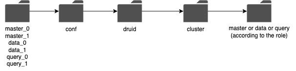

# 模拟 Druid 节点的多集群环境

> 原文：<https://blog.devgenius.io/simulating-multi-cluster-environment-for-druid-nodes-323a414e37c2?source=collection_archive---------9----------------------->

本文演示了如何在本地机器上设置生产环境和模拟安全特性。这些步骤将会很简单，并且包含更少的理论。参考资料链接相同的情况下，有人需要它。


# **在本地机器上安装德鲁伊**

[跟随此链接](https://druid.apache.org/docs/latest/tutorials/index.html)。如果您能够访问图 1 所示的页面，那么您的方向是正确的。


图 1:德鲁伊路由器仪表板

# 决定要运行的集群类型

现在我们应该决定我们需要模拟什么类型的环境。对于本文，让我们模拟 2 个主集群、2 个查询集群和 2 个数据集群。

现在你一定在下载了德鲁伊设置的地方看到了一个文件夹。该文件夹将如图 2 所示。将此特定文件夹视为一个群集。现在在相同的路径下复制这个文件夹。副本的数量应该等于您想要运行的集群的数量(在我们的例子中，是 6)。相应地重命名文件夹。


图片 2

现在你的文件夹结构应该如图 3 所示。


图 3

既然我们现在已经创建了 6 个节点(集群)，我们应该更改每个节点的端口，以便它们可以独立运行。要更改它们，请参考图 4。



图 4

**案例 A:主节点:**

对于主文件夹，在导航到图 4 之后的文件夹，并在最后打开主文件夹后，应该有一个名为*协调器过载的文件夹。*打开该文件夹，并在 runtime.properties 文件中更改端口。

**情况 B:数据节点:**

对于数据节点，在导航到图 4 之后的文件夹，并打开最后的数据文件夹后，应该有三个名为*historic、indexer 和 middleManager 的文件夹。*打开这些文件夹，在 runtime.properties 文件中更改端口。

**案例 C:查询节点:**

对于查询节点，在导航到图 4 之后的文件夹，并打开最后的查询文件夹后，应该有两个名为 *broker 和 router 的文件夹。*打开这些文件夹，并在 runtime.properties 文件中更改端口。

为方便起见，您可以遵循以下配置(更改端口，保持文件的其余部分不变):

## master_0:

```
druid.plaintextPort=8081 
```

## master_1:

```
druid.plaintextPort=7081
```

## 数据 _0:

```
historical:
druid.plaintextPort=4083

indexer:
druid.plaintextPort=4091

middleManager:
druid.plaintextPort=4091
```

## 数据 _1:

```
historical:
druid.plaintextPort=5083

indexer:
druid.plaintextPort=5091

middleManager:
druid.plaintextPort=5091
```

## 查询 _0:

```
broker:
druid.plaintextPort=3082

router:
druid.plaintextPort=8889
```

## 查询 _1:

```
broker:
druid.plaintextPort=2082

router:
druid.plaintextPort=8888
```

下一步是管理动物园管理员。您将需要两个动物园管理员来管理两个主节点。

通过以下链接下载 zookeeper:[https://zookeeper.apache.org/releases.html](https://zookeeper.apache.org/releases.html)对于本教程，我们将继续使用 3.7.1 版本，这是本文撰写时最新的稳定版本。

复制这个下载的 zookeeper 的内容，并制作这个文件夹的 2 个副本，然后重命名。新的文件夹结构应该如图 5 所示。


图 5

现在，我们应该更改动物园管理员的一些配置，如下所示:

## zookeeper_0/conf/zoo.cfg

```
tickTime=2000dataDir=/Users/ashutosh/Downloads/DRUID_AUTH_SIMULATION/zookeeper_0/logs (Absolute path where zookeeper_0 logs folder is present)clientPort=2181
```

## zookeeper_1/conf/zoo.cfg

```
tickTime=2000dataDir=/Users/ashutosh/Downloads/DRUID_AUTH_SIMULATION/zookeeper_1/logs (Absolute path where zookeeper_1 logs folder is present)clientPort=3181
```

设置好所有这些之后，运行不同终端中的所有节点并检查 [http://localhost:8888](http://localhost:8888) ，该链接应该会将您重定向到初始仪表板，但会有一些细微的变化，如图 6 所示。


图 6

注意:关于如何在 druid 集群节点中启用 TLS 的文章将很快上线，链接将附在本文中。

感谢阅读！！如果你有任何建议，请联系 ashutosh.garg.code@gmail.com

# 参考资料:

 [## 动物园管理员入门指南

### 本文档包含的信息可以帮助您快速开始使用 ZooKeeper。它主要面向开发人员…

zookeeper.apache.org](https://zookeeper.apache.org/doc/r3.3.3/zookeeperStarted.html#sc_RunningReplicatedZooKeeper) [](https://druid.apache.org/docs/latest/tutorials/index.html) [## 快速入门(本地)阿帕奇德鲁伊

### 该快速入门使用微型快速入门配置让您开始使用 Apache Druid，并向您介绍…

druid.apache.org](https://druid.apache.org/docs/latest/tutorials/index.html)  [## 动物园管理员入门指南

### 本文档包含的信息可以帮助您快速开始使用 ZooKeeper。它主要面向开发人员…

zookeeper.apache.org](https://zookeeper.apache.org/doc/r3.3.3/zookeeperStarted.html)