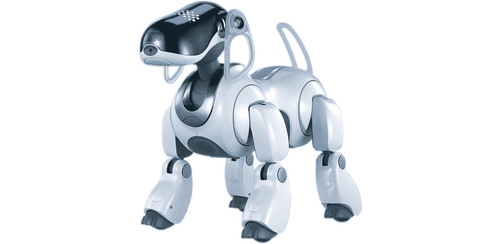

# 仿真无处不在！

> 原文：<https://blog.devgenius.io/simulation-is-everywhere-202ae0172a85?source=collection_archive---------3----------------------->

欢迎阅读我关于模拟的第二篇文章。如果你想阅读我关于什么是模拟的第一篇文章，[点击这里](https://medium.com/datadriveninvestor/simulation-being-similar-enough-7cc4379dfb49)！本文主要关注模拟在不同领域的应用。在我的下一篇文章[中，我将描述我们如何在 rideOS 使用模拟来改进我们合作伙伴的车队](https://blog.rideos.ai/experience-fleet-improvements-with-simulation)。

**TL；本文简介:模拟可以而且已经被广泛应用于各种领域。**

在我的上一篇文章中，我们了解了模拟是如何让一些东西“足够相似”的，我们主要考虑了两个领域:视频游戏和专业培训。除了这两个领域之外，模拟还被用于许多其他领域，我们将在本文中探讨更多。

索尼艾博 ERS-7 ，一只模拟狗。信用:[索尼](http://www.sony-aibo.com/aibo-models/sony-aibo-ers-7/)。

下面是一段[八哥呢喃](https://www.npr.org/sections/13.7/2017/01/04/506400719/video-swooping-starlings-in-murmuration)的视频，这是成千上万的八哥(一种鸟)以令人眼花缭乱的图案一起飞翔的时候。下面的视频是真实的椋鸟在现实世界中飞行，所以这些是模拟的😃

为什么我在一篇关于模拟的文章中展示的是真鸟的视频？有两个原因。首先，八哥的咒语迷人又美丽。第二，我不是唯一这么想的人。人工智能领域的其他人也对这种群集行为感兴趣，并试图找出如何在计算机上复制这种行为。

第一个，也可能是最著名的群集算法之一是克雷格雷诺兹于 1986 年提出的 Boids 模型。本质上，每个代理(或在这种情况下，模拟鸟)有 3 个基本规则，一个整体的群集行为出现。这 3 条规则是:分离(这样代理人就不会彼此靠得太近)，转向(这样代理人就可以朝着相似的方向前进)，以及内聚(这样代理人就不会彼此离得太远)。下面的视频演示了 2D 群集使用这些规则，以及避免一般障碍的附加规则。

如今，群集算法更加常见，甚至可以作为 Adobe After Effects 的一部分。

也许你想知道你是否在动画和表演中看到过羊群？[被*模拟*出现在大型综艺节目](https://ohiostate.pressbooks.pub/graphicshistory/chapter/19-2-flocking-systems/)。例如，以下《狮子王》中的场景是该剧最感人的部分之一，它也展示了群集现象。

蜂拥很可能是在踩踏事件开始时天空中的鸟类中使用的，但更重要的是，角马本身是用蜂拥算法模拟的。更多详情，请查看[狮子王电影笔记](http://www.lionking.org/text/FilmNotes.html)(搜索《惊跑》第二个实例)。

因此，模拟已被用于图形和动画！也有关于模拟的*节目，最著名的是[由](https://en.wikipedia.org/wiki/The_Matrix)[沃卓斯基姐妹](https://en.wikipedia.org/wiki/The_Wachowskis)制作的黑客帝国。《黑客帝国》被认为是变性人经历的寓言，也向许多人提出了另一个问题:什么是现实，我们是否生活在模拟中？我们不会在这里试图回答这个问题😉*

回到 Boid 算法，每个“代理”都是用 3 个规则独立模拟的。这种表现出复杂行为的独立智能体的概念经常被用于多智能体和多机器人的研究中，不出所料，仿真也在那里被广泛使用。

在卡耐基梅隆大学读本科和博士期间，我已经参与了[机器人世界杯](https://www.robocup.org/)好几年了。机器人足球赛的最终目标是:“[到 21 世纪中叶，一支完全自主的人形机器人足球队将赢得一场符合国际足联官方规则的足球比赛，对阵最近一届世界杯的获胜者。](https://www.robocup.org/objective#sthash.41WLnSfH.dpuf)”

RoboCup 有很多联赛，我参加过足球联赛(标准平台联赛和之前的四足联赛)，在 [RoboCup 标准平台联赛](https://spl.robocup.org/)的组委会和技术委员会任职。足球联盟专注于机器人作为一个团队与对方球队进行足球比赛，其中机器人自主行动，即没有人类的参与。下面是一个机器人足球赛 2D 模拟比赛的视频。

在 2D 模拟联赛中，球队 11 对 11(与人类球队相同)。模拟的是 2D，整个场地被模拟成类似于“真实”足球场的大小。模拟机器人运球和传球，以得分，类似于人类球员。

RoboCup 也有一个 3D 模拟联赛，3D 模拟机器人互相踢足球。这两个联赛的关键区别在于 3D 模拟联赛模拟 3 个维度，而 2D 模拟联赛模拟 2 个维度，顾名思义。

特别是，3D 模拟联盟中的环境被模拟成具有 3D 物理特性，因此要求机器人在球场上行走和踢球时保持平衡(这并不像听起来那么容易)。

让我们更进一步，到我参加的标准平台联盟(SPL)。在 SPL，两队机器人在踢足球。

您可能会注意到 SPL 中的真实机器人和 3D 模拟联盟中的模拟机器人之间的相似之处。两者都使用 [Nao 人形机器人](https://en.wikipedia.org/wiki/Nao_(robot))，虽然一个是在现实世界中，一个是模拟的。然而，[在模拟中学会的行为可以并且已经应用到真实的机器人](http://www.cs.utexas.edu/~AustinVilla/?p=nao)上。

此外，真正的机器人本身是对人类球员的模拟，因为最终，RoboCup 的研究是创造逼真的机器人足球运动员！因此，仿真已经广泛应用于科学研究，尤其是机器人学。

除了机器人研究之外，模拟也被广泛用于机器人研究。例如，在下面的视频中，模拟用于改进制造汽车的过程。

我们已经讨论了代理/机器人的模拟，以及汽车的模拟(或者至少是汽车的制造)。将这两者放在一起，我们进入了另一个我感兴趣的领域:模拟城市和交通！

我最喜欢的视频游戏之一是《城市:天际线》。在这个游戏中，你是一个城市的市长，建造道路，指定住宅区，商业区和工业区，建造学校，医院等设施。它类似于模拟城市这样的游戏，最终，这种游戏模拟了一个城市的发展，它的交通和人民。

《城市:天际线》是我喜欢的一款视频游戏，我们之前讨论过视频游戏中的模拟。此外,《城市:天际线》对城市中的交通进行了某种程度的真实模拟，这种模拟会随着城市的发展和道路网络的设计而发生变化。

接下来我们有[的交通模拟器](https://en.wikipedia.org/wiki/Traffic_simulation)，比如[的 Aimsun](https://www.aimsun.com/) 和[的 PTV Vissim](https://www.ptvgroup.com/en/solutions/products/ptv-vissim/) 。交通模拟器的目的是提供真实的交通模拟，以帮助现实世界的城市规划者和政府规划新的道路，并调查新道路和交通政策的影响。

当比较上面 Aimsun 的视频和 Cities: Skylines 的视频时，后者的图形更好，而前者更真实。哪个是“更好”的模拟？要看应用！可以说，Aimsun 更适合城市规划者，而《城市:天际线》更适合游戏玩家。不管什么用例，两者都使用模拟😄

如果我们将机器人和交通领域结合起来，我们会发现一个我非常关心的话题:[自动驾驶汽车](https://en.wikipedia.org/wiki/Self-driving_car)！我不会详细讨论[自动驾驶汽车如何工作](https://www.synopsys.com/automotive/what-is-autonomous-car.html)，有[许多文章可以让你阅读](https://www.wired.com/story/guide-self-driving-cars/)。

让我们首先考虑一般的模拟车辆。可以说，视频游戏(如《城市:天际线》)中的模拟车辆和交通模拟器(如 Aimsun)是在其模拟环境中“自动驾驶”的。然而，在许多这样的情况下，车辆具有完美的全球环境知识，即，它们完美地知道一切是什么和在哪里。在模拟环境中驾驶车辆，信息不完善，会是什么样子？下面是一些例子！

像以前一样，我们将从一个电子游戏开始！以上是[侠盗猎车手 V](https://en.wikipedia.org/wiki/Grand_Theft_Auto_V) 的一段游戏视频。游戏本身[陷入争议](https://en.wikipedia.org/wiki/Controversies_surrounding_Grand_Theft_Auto_V)，但它对城市和车辆的模拟足够逼真，以至于[一些自动驾驶车辆研发人员& D 想用它作为模拟器来训练自动驾驶算法](https://www.forbes.com/sites/aarontilley/2017/10/04/grand-theft-auto-v-the-rise-and-fall-of-the-diy-self-driving-car-lab/#7d79f2017d7a)。

当人们玩侠盗猎车手等游戏时，他们是在模拟的环境中驾驶模拟的车辆。车辆模拟也用于专业培训，要么在完全虚拟的环境中，要么在混合的环境中，就像下面的视频。

这里我们有一辆覆盖着屏幕的实体巴士来模拟驾驶体验。公交车模拟器是用来[训练人如何在马路上开公交车](https://www.kxxv.com/story/37186649/waco-transit-using-new-bus-simulator-to-improve-training-program)的，比在马路上训练安全多了。

现在让我们考虑自动驾驶车辆的模拟！一种常见的方法是在完全虚拟的环境中模拟车辆，其中模拟车辆的所有传感器输入，自动驾驶软件的输出在虚拟环境中起作用。这里有一个使用 [Udacity 的自动驾驶汽车模拟器](https://github.com/udacity/self-driving-car-sim)的视频，为了用[卷积神经网络(CNN)](https://en.wikipedia.org/wiki/Convolutional_neural_network)训练一个自动驾驶算法。

自动驾驶车辆模拟并不总是必须是虚拟环境中的虚拟车辆。自动驾驶车辆模拟也可以在真实环境下用实车来做！

上面的视频显示了 Waymo 的自动驾驶车辆在他们的测试赛道上行驶。上面的情况是一个模拟，因为最终，他们是在*模拟*真实世界的情况，比如另一个司机在一个四向停车的十字路口超车。这种模拟试图在真实世界中复制可能难以测试或测试起来很危险的场景，因此在可重复的模拟环境中这样做更安全。

总之，模拟可以并且已经被用于各种领域，从视频游戏、专业培训、动画、研究、机器人、城市规划和自动驾驶汽车。还有更多的领域也在使用模拟，但这里没有涉及，由此可见模拟在我们的日常生活中是多么普遍！

在我的下一篇文章中，[我将描述我们如何在 rideOS 使用模拟来帮助我们的合作伙伴改进他们的车队！](https://blog.rideos.ai/experience-fleet-improvements-with-simulation)