# SAS 模拟

> 原文：<https://blog.devgenius.io/simulations-in-sas-some-random-stuff-c5bc66303b37?source=collection_archive---------0----------------------->

## 一些随机的东西

我喜欢模拟数据！让我们先解决这个问题。模拟提供了大量测试统计理论、数据、模型以及最重要的选择的方法。如果您不知道模型如何运行，或者它的假设是什么，那么您最好自己模拟数据。

你想知道一个模型是否对违规有鲁棒性吗？模拟数据。

你想知道不同的模型如何处理不同的数据集吗？模拟数据。

你想接近一个统计模型的边界还是它的基本理论？模拟数据。

诚然，学习曲线很陡。对于那些刚接触模拟的人来说——我指的是自下而上的模拟——最简单的方法是从线性模型开始，该模型处理假设误差为*同分布* : [独立同分布随机变量](https://en.wikipedia.org/wiki/Independent_and_identically_distributed_random_variables)的模型。通俗地说，这些都是严重依赖于正态分布的模型。

现在，在我的工作中，我已经——并且仍然在——和 [SAS](http://www.sas.com) 一起工作。即使没有额外的 IML 软件包，它允许交互式矩阵类型的编程，该程序在其模拟数据的能力是复杂的。尤其是分层嵌套数据。

下面，你会发现几个随机的模拟例子，展示了要模拟的代码和我认为重要的图表。请注意，这只是一小批随机的例子，尽管它们中的大多数覆盖了实验或分析设计的更多部分。

基于**均匀分布**使用 SAS 数据步骤模拟 1000 次观察的代码。误差是同分布的，这意味着它们来自于**正态分布**。

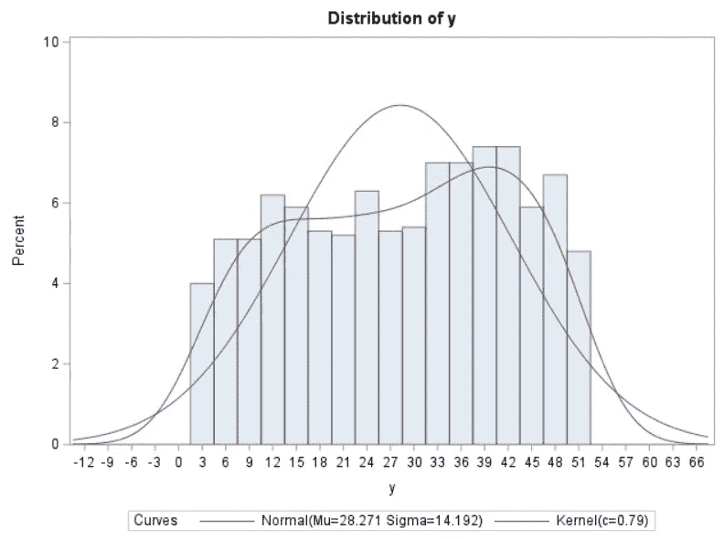

模拟数据图，显示了 SAS 认为最符合数据的理论**正态分布**的叠加，以及来自内核的结果。后者是你根据数据的积分得到的分布。它不遵循给定的分布，只是数学理论。

SAS 数据步骤模拟二项式数据，然后使用 **PROC LOGISTIC** 进行分析。这里，您看到使用数组创建了两个解释变量(x1 & x2)。一个来自**均匀分布**，另一个来自**正态分布**。那很好。重要的是 Y 变量遵循**二项式分布**。我们通过使用来自**伯努利分布**(N = 1 的二项式分布)的模拟来做到这一点。eta 是线性预测值，mu 是概率标度上的数据。

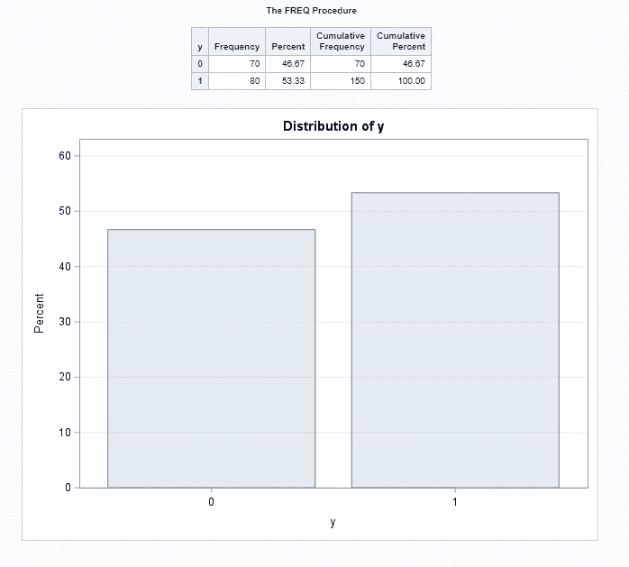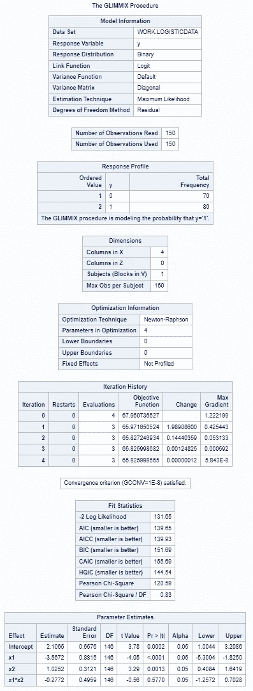

始终通过绘制原始数据和来自模型的结果来检查您的结果是否有意义。因为我们知道**PROC logistics**使用**二项式分布**，所以我们期望模型返回 x1 & x2 变量，这些变量是我们首先包含在模拟中的。

使用**泊松分布**对数据集进行模拟。泊松是模拟自然右偏计数数据的一种很好的方法。除了 mu 参数不同之外，它与前面的示例基本相同。这是因为泊松分布仅使用一个值来定义其形状——λ。在泊松过程中，λ决定了数据的均值和方差。

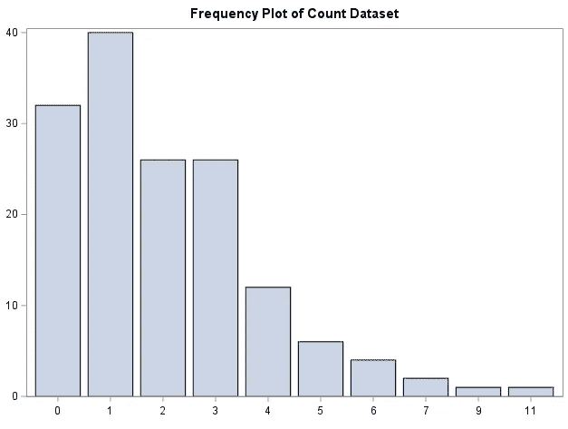

对我来说看起来像是一个**泊松分布**，是右偏的并且充满了计数数据！(ps。在特定的λ值下，泊松将失去它的外观，并且更趋向于正态分布)。

模拟显示 frequentist**1 型错误**在比较两组的 T 检验中的比率。第 1 类误差最广为人知的是确定可接受的 p 值的值，或当试图定义“显著”与“非显著”效应时您愿意接受的**假阳性率**。注意:这只是一个模拟，模拟可以用于任何事情。这不是一个频率主义者对贝叶斯的辩论。

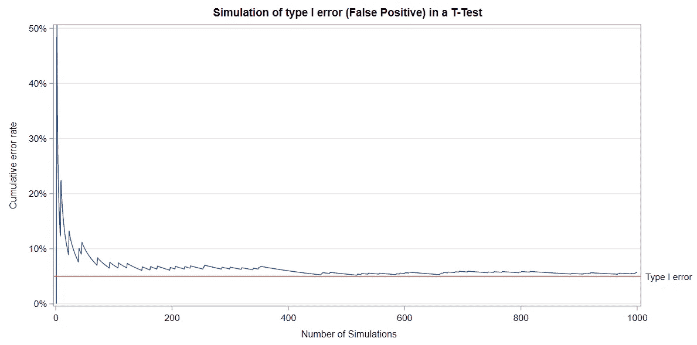

如您所见，模拟次数对累积误差率有明显影响，接近模拟中设置的**类型 1 误差**。这应该给一些思考！

用于创建五种互不相同的假设处理的模拟代码。创建这样的数据集是 **SAS 数据步骤**真正派上用场的地方。

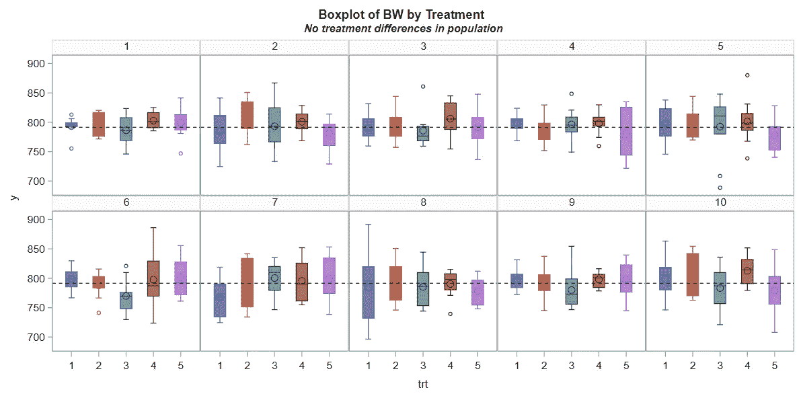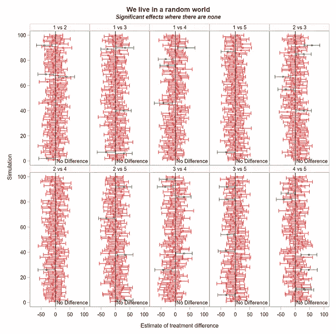

虽然这些处理本质上没有区别，但是因为我们通过模型的误差部分包含了它，所以存在差异。由于我们将**1 型错误**(假阳性率)设置为 5%，所以在比较治疗时，人们看到差异时不应感到惊讶。这些差异不是“真实的”。

模拟包含两个因素(蛋白质和水分)的数据，每个因素包含两个水平(低和高)。这是一个 2*2 阶乘。让我们假设变量是相互作用的。

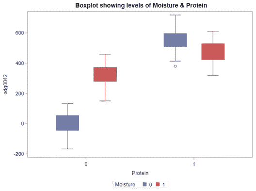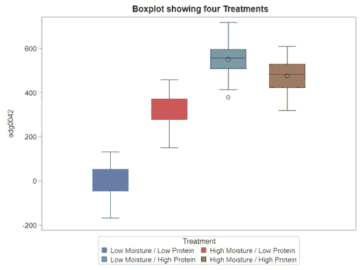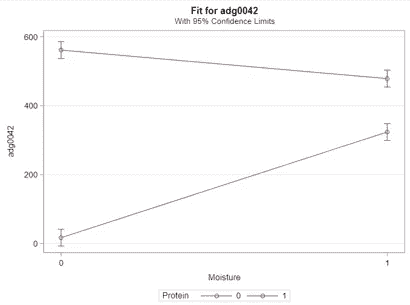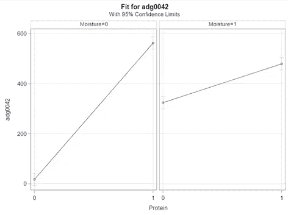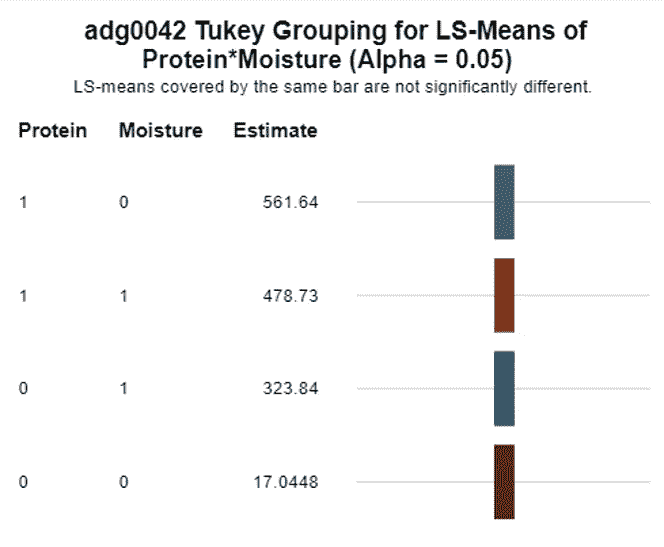

SAS 的可视化和模型输出( **PROC MIXED** )显示了 2*2 因子的主效应和交互效应。

模拟显示了一个**随机完全区组设计**，包含两个误差方差相等的处理。

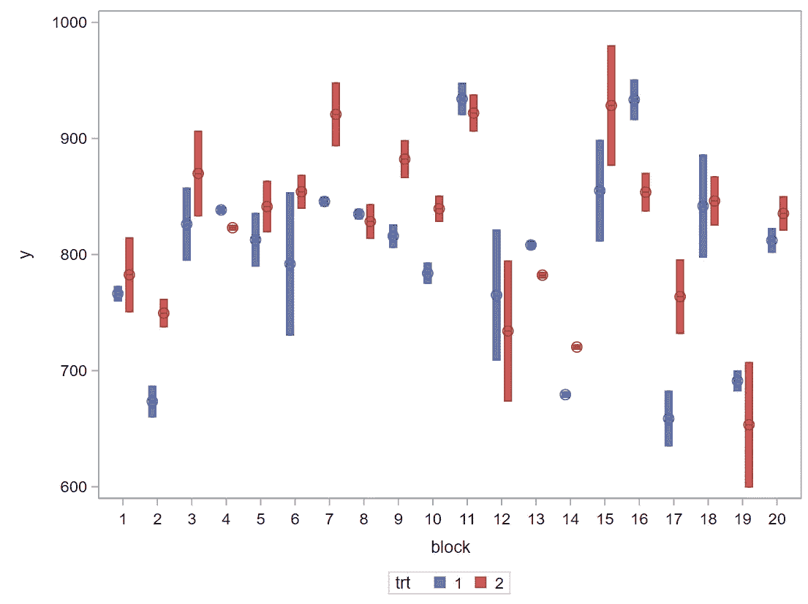

块之间的差异越多，您可以在您的**混合模型**中包含的解释差异就越多。这很好！

代码模拟一个更高级的**随机完全区组设计**，包含三个嵌套层次——区组、围栏、动物。因此，观察值线性依赖于处理平均值+区块方差+围栏方差+动物方差(这里是模型的误差部分)。值得注意的是，我模拟了基于所包括的动物数量的每个处理中的平均值和方差的变化。

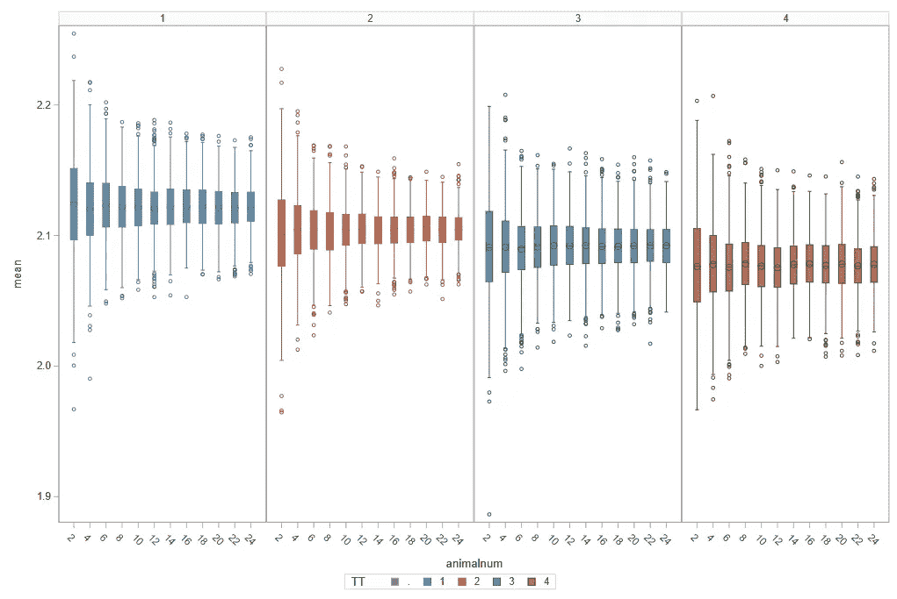

模拟显示了处理之间的边际(总体)差异，以及作为样本量增加的函数的减少的方差。像往常一样，平均值在模拟中非常稳健。

模拟一条 **Gompertz 曲线**，该曲线被大量用于模拟人类和动物的生长。这种模拟是非常令人震惊的，因为人们可以很容易地使用 Gompertz 公式，并创建一个变量之间会相互变化的网格。但是，为了方便使用，我使用了如上所示的路线。

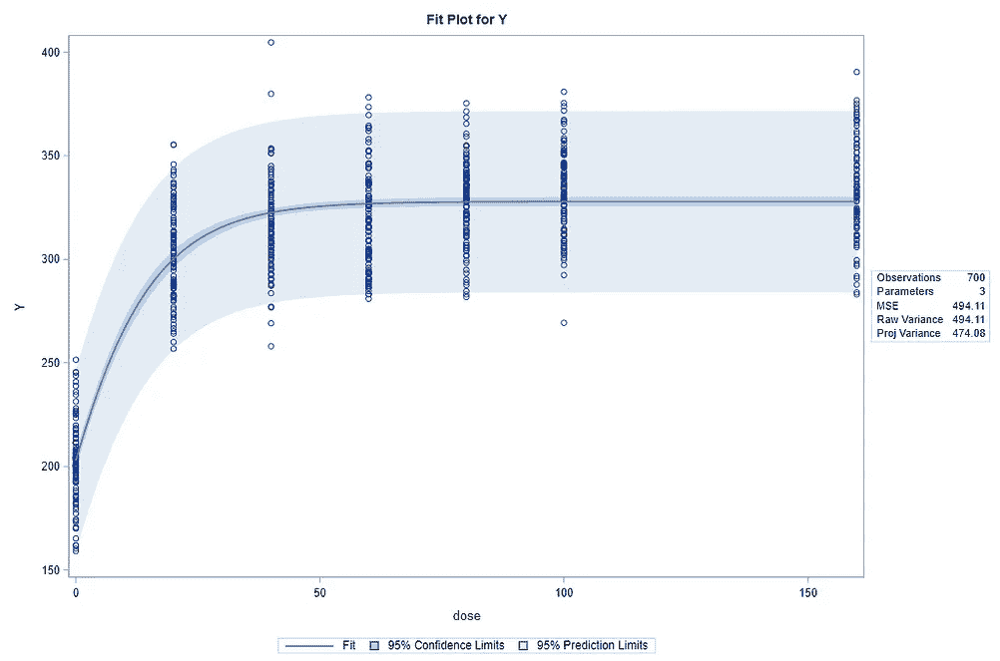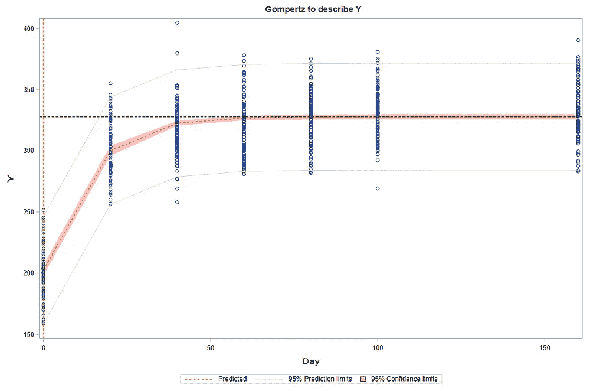

结果显示了通过 **PROC NLIN** 的 Gompertz 曲线。

适合 **Gompertz** 分析的嵌套设计模拟。使用上面的数组，我可以将每个治疗与一系列变量联系起来，以绘制 Gompertz 曲线并模拟结果。我发现使用数组不是很直观，但肯定可以提高模拟的自动化水平。

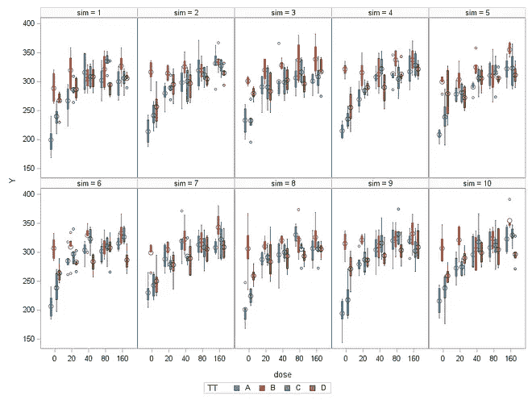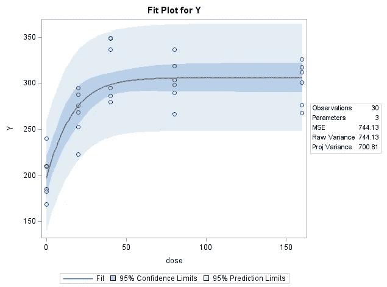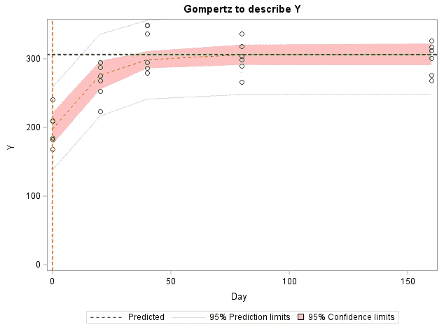

显示十次模拟中嵌套设计的结果，以及来自 **PROC NLIN** 的结果。

另一个很好的方法是测试模型假设或模型度量的可用性。最广为人知但被滥用的度量是 **R 平方**，它为建模者提供了模型所解释的方差的百分比。它的无用性很容易通过多项式函数来模拟和量化。

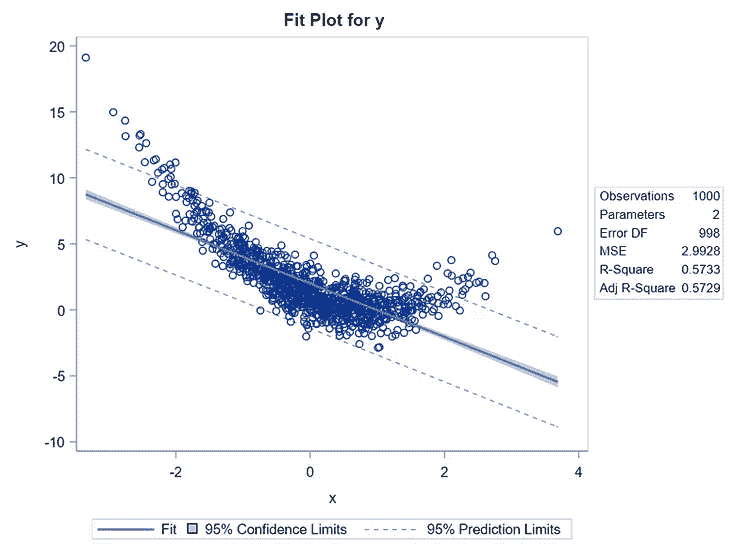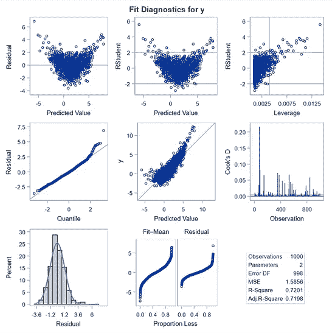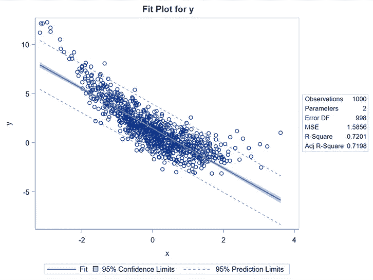

多项式很好地显示了散点图尾部的偏差如何不影响 R 平方的值，但肯定会搞乱任何误差或校准图。

显示 **PROC IML** 工作方式的例子。正如你所看到的，这是一个不同的设置，肯定需要一些习惯。一旦熟悉了它，您就可以通过提高速度和灵活性来获得稳定的投资回报。在这里，我模拟了来自 t 分布的基于不同自由度的 100 个观察值，并将其与来自正态分布的观察值配对。

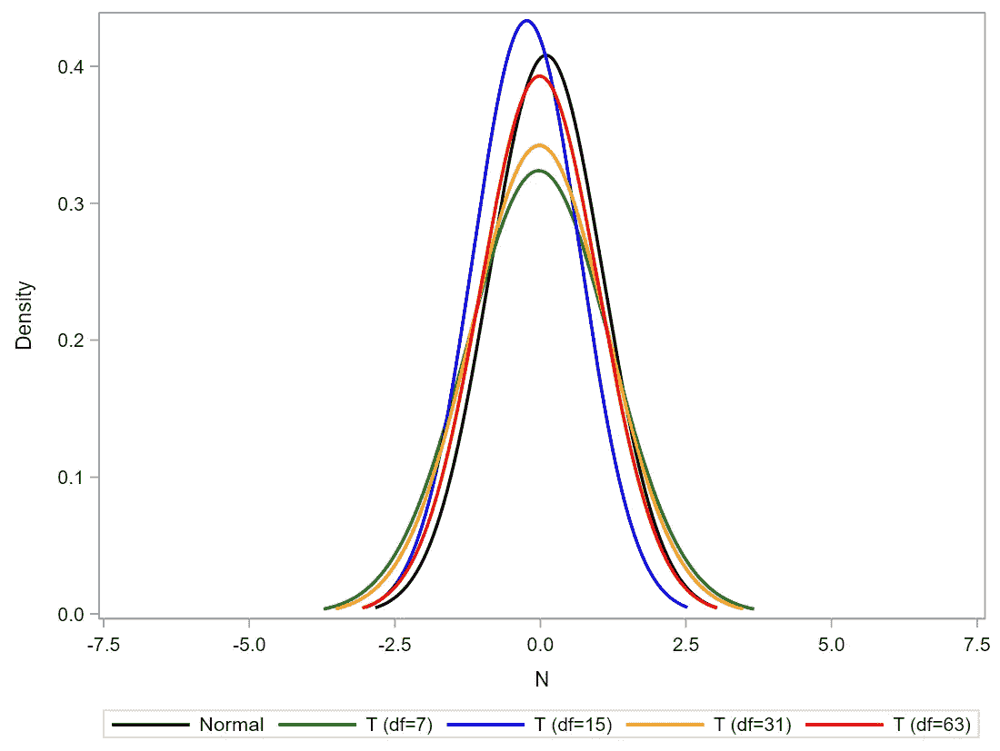

我拥有的自由度越多，t 分布就越符合正态分布。

通过 **PROC IML** 进行模拟，创建一个包含九个处理、11 个区块和两个时间点的数据集。随着时间的推移，源自同一来源的观察结果通常是相关的。模拟这些数据的一种方法是从**多元正态分布**中提取数据。这就是我在这里所做的。初始模拟之后的大部分代码都忙于以正确的格式形成数据集，以便在 **PROC MIXED** 中进行分析。

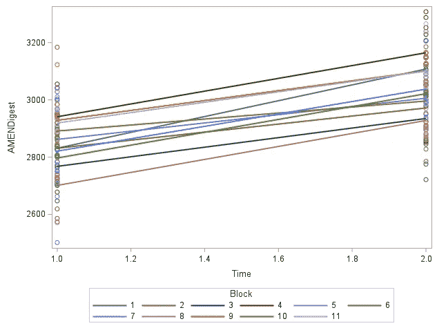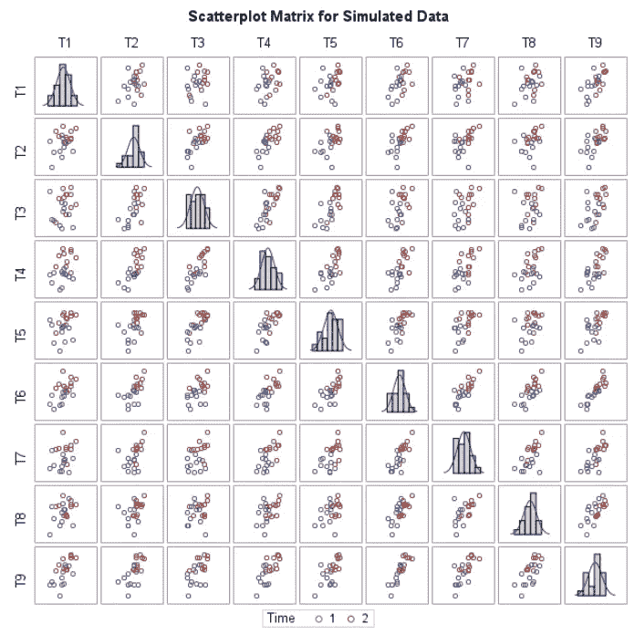

图像显示了不同时间、不同处理和不同区块的观察结果之间的联系。

我希望上面的示例为您提供了一些有用的例子，让您了解 SAS 中的模拟是如何工作的。正如您现在可能已经发现的那样，这里显示的例子是随机的，我编写它们的方式也远非完美。请随时改进它们！