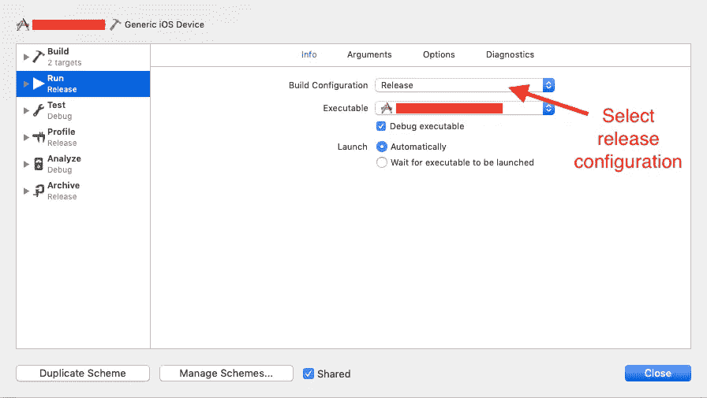

# iOS 模拟器版本

> 原文：<https://blog.devgenius.io/simulator-build-for-ios-842c8106ca27?source=collection_archive---------1----------------------->

本文介绍了面向 iOS 的模拟器构建。首先，我们需要澄清什么是模拟器构建以及我们为什么使用它。一个人的思想力量与☕️喝的咖啡量成正比，所以在我们开始之前，请喝一杯☕️咖啡。


## 为什么我们需要模拟器🙇

*   可以在模拟器上完成的快速测试。
*   给客户的简单演示。
*   脸书应用提交评论。

## 先决条件

*   最新 Xcode
*   申请的临时证书

## **让我们开始**

首先，我们用 CLI 创建一个 React 本机应用程序。您可以直接从 Xcode 创建 iOS 项目。现在我们为我们的应用程序生成 build。这里，我们的项目在 react native 中，因此我们在应用程序目录终端中运行以下命令。
**注意:-** 如果你的项目是原生 iOS 那么忽略这一步。

```
react-native bundle --entry-file index.js --platform ios --dev false --bundle-output ios/main.jsbundle --assets-dest ios
```

如何为 iOS 应用程序生成模拟器版本？有两种方法，

1.  使用 Xcode
2.  使用命令行

## **使用 Xcode**

这里我们正在创建一个发布版本，所以首先我们需要从 Xcode 中选择发布配置。按照设置构建配置的步骤，
Xcode->Product->Scheme->Edit Scheme->选择发布配置



选择构建配置

按(command + B)构建应用程序。为建设成功而祈祷。构建成功完成后，右键单击文件导航器中产品文件夹下的应用程序名称，然后选择“在 Finder 中显示”。这将打开模拟器构建的文件夹。模拟器构建是一个扩展名为`.app`的容器。复制`.app`文件并粘贴到新创建的文件夹中。

## **使用命令行**

模拟器构建可以通过命令行创建。只需打开终端，转到应用程序目录并运行以下命令。

```
xcodebuild -sdk iphonesimulator
```

该应用程序是在 Xcode 工作空间中开发的。
例如 **sampleApp.xcworkspace** 使用下面的命令

```
xcodebuild -workspace sampleApp.xcworkspace -scheme sampleApp -sdk iphonesimulator -configuration Release
```

等等，我们需要一杯咖啡，☕️，因为我想不起命令了。在这里，许多问题浮现在脑海中。所以我们先试着清除它。

```
xcodebuild -workspace **[ProjectName]**.xcworkspace -scheme **[ProjectName]** -configuration **[BuildType]**Note: 
- **[ProjectName]** name of workspace(xcworkspace)
- **[BuildType]**   is Debug or Release
```

等待构件创建成功🙇。构建已成功完成，然后我们可以从

```
~/Library/Developer/Xcode/DerivedData/**[ProjectName]**-**[BuildHash]**/Build/Products/**[BuildType]**-iphonesimulator/**[ProjectName]**.app**In our case path look like :-**~/Library/Developer/Xcode/DerivedData/**sampleApp**-**frateghkqdqoqgaixsbpginewyoo**/Build/Products/**Release**-iphonesimulator/**sampleApp**.app
```

复制`.app`文件并粘贴到一个新创建的文件夹中。现在我们的构建已经准备好了。

现在我们做最后一步来创建一个模拟器，

```
ditto -ck --sequesterRsrc --keepParent **[source]/appName.app** **[destination]/appName.zip**Note:
 - **[source]** Path where we store .app file
 - **[destination]** Path where we want to save our app's zip file
```

在这里，我将两个文件夹都设置在桌面上，这样我们命令看起来就像

```
ditto -ck --sequesterRsrc --keepParent /Users/userName/Desktop/TestBuild/sampleApp.app /Users/userName/Desktop/SimulatorBuild/sampleApp.zip
```

[同上](https://www.real-world-systems.com/docs/ditto.1.html)用于复制目录层次结构，创建和提取档案，将一个或多个源文件或目录复制到目标目录。

该命令在目标文件夹中生成一个 zip 文件。现在，实现这个 zip 文件夹，以便我们得到一个`.app`文件。我们的构建已经为测试做好了准备。但是我们如何测试它呢？别担心，我们有 ios-sim 卡。它用于在 iOS 模拟器中的指定路径启动应用程序。首先，我们需要在我们的系统中安装。

```
npm install -g ios-sim
```

现在，它已经可以使用了。

```
ios-sim -d **[DeviceName]** launch **[Source]**Note:
 - **[source]** Path where we achieve new .app file
 - **[****DeviceName****]** Device name in which we want to test our buildWe can get all device name in our system using this command.
**ios-sim showdevicetypes****In our case path look like :-**ios-sim -d iPhone-6s launch /Users/userName/Desktop/SimulatorBuild/sampleApp.app
```


哇，我们构建成功运行了🙌。喝一杯 coffee☕️，享受代码。