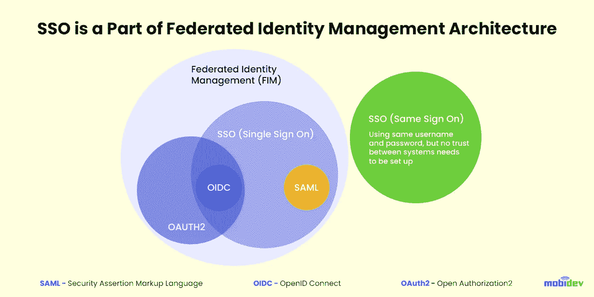
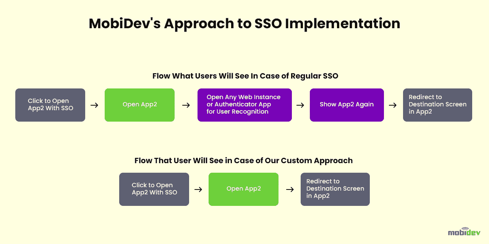

# 企业应用程序的单点登录实现

> 原文：<https://blog.devgenius.io/single-sign-on-implementation-for-enterprise-applications-ea51086d0548?source=collection_archive---------10----------------------->

公司在转向单点登录(SSO)实施时经常面临困难。他们中的许多人都停留在第一步，试图找出 SSO 的好处、实现的最佳实践、类型、协议和其他基本的东西。我决定阐明单点登录的意义，分享 MobiDev 的经验，甚至为在移动应用程序之间以最方便的方式使用 SSO 重新发明轮子。

**单点登录(SSO)** 是一种身份验证的技术方法，允许用户使用一套凭据登录多个应用程序和网站。该技术基于在应用程序(称为服务提供商)和访问管理系统之间建立可靠的关系。服务提供商和访问管理系统共享带有标识数据的证书，在 SSO 的情况下，标识数据采用包括电子邮件、用户名或其他数据的令牌的形式。

**简单来说，使用单点登录，用户在应用程序之间切换时不需要重新输入用户名和密码。**

# 单点登录的类型有哪些？

SSO 是[联合身份管理](https://www.techtarget.com/searchsecurity/definition/federated-identity-management) (FIM)架构的一部分。

# 单点登录使用什么协议？

用于 SSO 实现的协议有安全断言标记语言(SAML)、Web 服务联合(WS-Fed)、OpenID 连接(OIDC)、轻量级目录访问协议(LDAP)和 Kerberos。

# 单点登录优势

根据研究和市场，全球单点登录市场预计到 2027 年将达到 22 亿美元。然而，公司担心与一次点击访问相关的潜在安全威胁，他们认为 SSO 实现是简化对其应用程序的访问并改善用户体验的一种手段。

单点登录的好处不止于此，还包括以下几点:

*   减少密码疲劳—用户只需记住一个密码
*   高效的 B2B 协作——B2B 合作关系随着[联合单点登录](https://www.ibm.com/docs/sk/cip?topic=access-federated-sso-overview)而繁荣，因为用户可以轻松访问不同公司提供的服务
*   通过更快的登录来提高生产力
*   高采用率—单点登录增加了用户更频繁地打开应用程序的可能性

**主要缺点**是如果单点登录失败，用户无法访问任何相关系统。至于复杂，被认为是有条件的下行。

安全性可以单独列出。

**一方面**，拥有一套凭证的 SSO 意味着在出现安全漏洞的情况下，攻击者可以访问帐户和链接的系统、应用程序和数据，并且攻击者在公司内的足迹会增加。

**另一方面**，SSO 减少了攻击面的数量，因为用户每天登录一次，只使用一套凭证。如果您将 SSO 与基于风险的身份验证(RBA)结合起来，识别异常行为，并要求用户通过额外的验证，则可以实现更高的安全级别。

# 企业应用程序的 SSO 实现最佳实践

SSO 很难实现吗？问题的一般观点是这样的:对于遗留解决方案来说，SSO 部署是一项复杂而耗时的任务，但是基于云的 SSO 是不同的。让我分享一下我们的经验，这将有助于了解企业应用程序中的单点登录。

直到最近，为本地应用程序设置联邦 SSO 还是一项复杂的挑战。开发人员有两种选择可以使用 SSO 在应用程序中显示内容:将用户从应用程序切换到系统浏览器，然后返回或显示应用程序内 webview，以便直接在应用程序中呈现 html 内容。这些选项对用户来说不方便，或者它们有安全和隐私问题。

第三种选择的出现——SFSafariViewController(IOs 9+)和 Chrome 自定义标签(Android)增加了一个 web 控制器，提供了原生系统浏览器的所有优势——这让开发者受益匪浅。

我们的经验与使用不同版本的 NativeScript 构建的两个移动应用程序之间的 SSO 实现有关— **app1** 和 **app2** 。但事实上，所描述的 SSO 方法对于本地和跨平台应用程序都是相同的。

**App1** 是移动的，而 **app2** 暗示了移动和 web 的结合，在这种情况下，向新版本的过渡预计会出现问题。通过 OpenID Connect (OIDC)客户端进行授权的身份提供者在应用程序中很常见，这有助于启动。我们有三个选项可供选择:WebView、系统浏览器和 InAppBrowser。

# 1.单点登录实现方法:带有 COOKIE 共享的 WEBVIEW

登录第一个应用程序基于 [WebView](https://developer.android.com/reference/android/webkit/WebView) ，而登录第二个应用程序使用混合应用程序世界中众所周知的 [InAppBrowser](https://cordova.apache.org/docs/en/3.1.0/cordova/inappbrowser/inappbrowser.html) ，带有 Android 的 Chrome 自定义标签和 iOS 的 safari services/AuthenticationServices。

该研究揭示了在规定的条件下实现 SSO 的三个可用选项，尽管它们对日志记录意味着相同的事情— WebView(应该设想共享 cookies)。

WebView 嵌入在应用程序的本机屏幕中(就像它是 web 中的 iFrame 一样)，这可以被视为该方法的优势，因为登录期间的导航对于用户来说看起来很自然。动画和风格在整体画面中并不突出。

使用 WebView 进行日志记录的主要问题是与页面加载相关的回调延迟。为了解决这个问题，开发人员提出了他们自己的想法，如何准确地理解登录表单(网页)何时被加载，他们可能会隐藏指示器。否则，它将显示在已经加载的登录屏幕上，或者在屏幕加载之前隐藏。该故障可能会导致提交到 App Store 的应用程序的审核出现问题。在 Android 上访问 cookies 也有问题，如果不打开使用 SSO 的外部链接，很难设置一个通用登录。

# 2.单点登录实现方法:系统浏览器

使用系统浏览器可能是一个可靠的解决方案，但这意味着离开应用程序并打开浏览器来填写登录表单。带有登录信息的选项卡在浏览器中保持未关闭状态，并会累积。但是，这种方法很容易实现，因为一切都与 web 上的工作方式相同，两个应用程序都将在相同的环境中打开一个登录表单，使用 OIDC 客户端用来验证用户的相同 cookies，并正确设置两个应用程序的服务器标识。在系统浏览器的情况下，一切运行顺利，没有延迟，但对用户来说不舒服。

Microsoft Authenticator 不被认为是 SSO 实现解决方案，因为要登录，用户应该离开一个应用程序，在第二个应用程序中授权，然后在第一个应用程序中确认授权，依此类推。委婉地说，它对用户来说不方便，甚至比系统浏览器还糟糕。

# 3.SSO 实现方法:INAPPBROWSER

Android 中的标签和 iOS 中的服务可以在系统中定制为带有平台动画和外观的本地弹出窗口。它们跟踪重定向，如果登录输入正确，就会被关闭。在 WebView 的情况下没有问题，尽管如果设计不同于本地平台的组件，登录表单看起来与应用程序分离。这是在移动应用程序中实现 SSO 的一种推荐且安全的方法。

经过反复试验，我们决定选择 InAppBrowser。它有一个共同的沙箱，在一个应用程序中有 cookies，所以如果你应用它，然后打开其中的其他 web 链接，用户应该通过 SSO 登录，这意味着根本不会出现问题。但是在两个不同的应用程序中，这些沙箱会有所不同，您需要以某种方式从一个沙箱中获取信息，并将其放入另一个沙箱中，以实现应用程序之间的 SSO。

对于这样的共享过程，我们在 iOS 中应用了钥匙串存储，在 Android 中应用了安全存储，因为它们都可以在设备上安全地存储数据。他们可以为一个应用程序或几个受信任的应用程序隔离商店，但这需要在每个移动应用程序中执行额外的配置步骤。

配置了共享存储之后，我们就可以在两个应用程序之间进行数据交换了。一个在 localStorage api 中再现输入-输出方法的附加包装器允许我们为 OIDC 客户端 UserManager 引入公共本地存储。

# MobiDev 实现单点登录的方法

对于大多数应用程序来说，实现这些步骤就足够了，在这些应用程序中，身份提供者最初是为应用程序之间的 SSO 而配置的，但是由于这存在一些困难，我们必须进一步“重新发明轮子”。

回到 OIDC 客户端，我应该提到它有几个不同的流程，用于使用用户名和密码登录、双因素身份验证和其他功能。但是，SSO 和会话更新需要所谓的代码流，在用户输入凭据后，返回的不是会话令牌，而是必须与会话数据交换的对象代码，即:

*   会话令牌(Session token 用于访问应用程序 API)
*   令牌的寿命
*   用于刷新会话的令牌(refreshToken 用于刷新会话令牌)
*   令牌的寿命

要配置令牌生命周期，应使用身份服务器。和往常一样，sessionToken 持续数小时或数天，refreshToken 持续数周或数月。长期 refreshToken 可用于在移动应用程序中使用生物特征进行登录。一种算法如下:

1.  生物特征读取
2.  吃点新鲜的
3.  获取新的会话令牌
4.  让用户访问应用程序

这种令牌更新不会被应用程序用户注意到，因为它并不意味着打开浏览器、WebView 或 InAppBrowser 窗口，令牌的简单更新就是授予用户对应用程序的访问权限。所描述的方法使登录运行顺畅，并在两个应用程序中使用。

根据文档，在移动应用程序之间使用 SSO，无论哪种方式，都需要打开浏览器 WebView，InAppBrowser，它将登录，并在关闭后打开第二个应用程序。我们努力创造更方便的东西，并找到适合每个人的解决方案。

# 深层链接和进一步行动

解决方案在于通过深度链接功能从另一个应用程序打开一个应用程序(深度链接将用户直接发送到特定的应用程序内位置)——然后神奇的事情就发生了。

**App1** 打开深度链接， **app2** 使用深度链接打开。在点击打开深度链接之前， **app1** 生成一个唯一的令牌并存储在两个应用的公共存储器中，然后将相同的令牌作为参数插入深度链接并处理点击。这种方法是出于安全目的而实现的。没有其他人可以访问这个共享存储，也不可能通过从外部使用深层链接登录并自动进入另一个应用程序。

生成的唯一令牌包括时间戳、用户名、安全和验证用户数据所需的数据以及防止猜测的随机内容，时间戳定义了令牌的有效期。

获得与令牌的深层链接， **app2** 解析令牌，将其与共享存储中的令牌进行比较，然后检查用户身份。从创建令牌开始的时间应该大约是一秒钟。仅在此之后， **app2** 通过 refreshToken 获得一个新令牌，该令牌使用应用程序的生物特征登录，并在深度链接中添加的屏幕上重定向用户。

仅当 **app2** 拥有有效(未过期)的刷新令牌并且启用了生物识别登录时，此功能才有效。否则，用户仍然需要手动输入数据，就好像令牌或用户名不匹配一样。打开浏览器或 WebView 的默认 SSO 流程也有同样的缺点。登录后，仍然可以将用户直接发送到所需的应用程序屏幕。

每个应用程序都有自己的设置和 id，这些设置和 id 在 identity server 的系统中是唯一的。所有的更改将仅由 UI 团队完成，并且该解决方案将与任何具有代码流的身份提供者一起工作。

总之，公司正在集中投资建立单点登录，而实现方法是由他们的需求驱动的。

由 [MobiDev](https://mobidev.biz/services/web-application-development) 的 JavaScript 小组负责人 Andrii Sulymka 撰写。

*全文原载于*[*https://mobidev . biz*](https://mobidev.biz/blog/single-sign-on-sso-implementation-benefits-enterprise)*，基于 mobi dev 技术研究。*