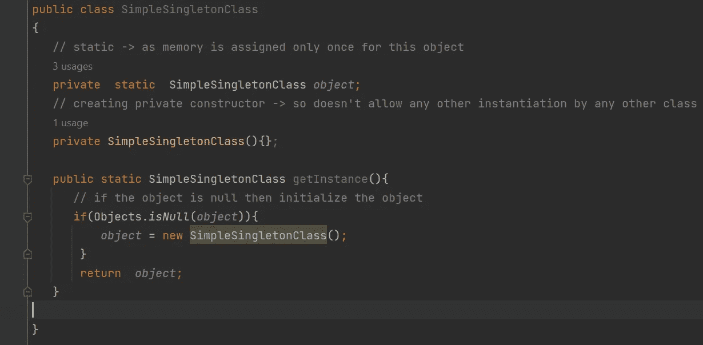
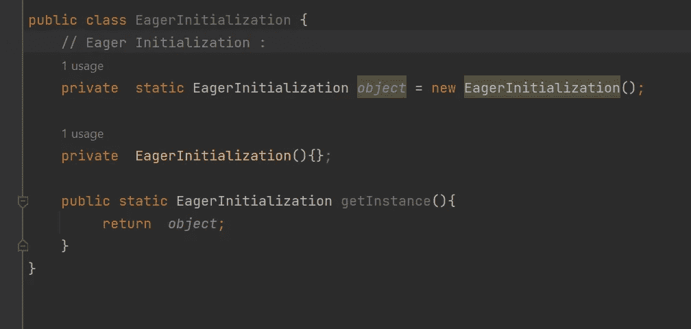
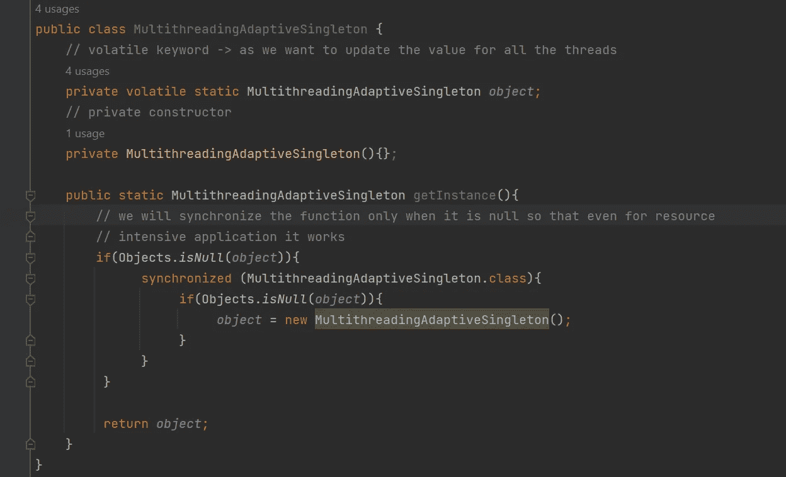
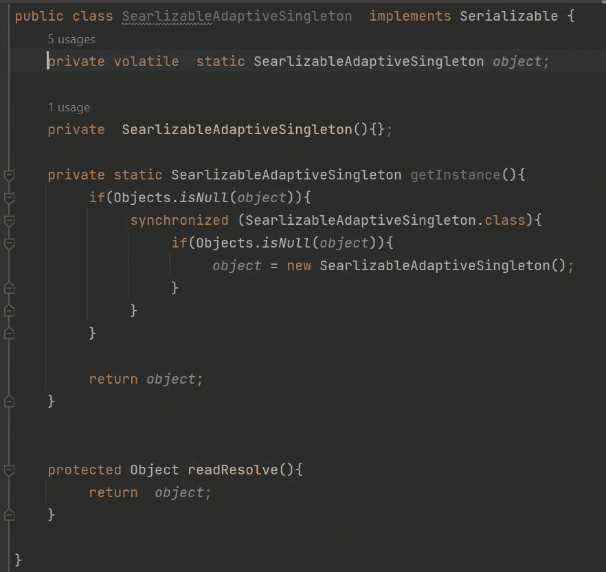
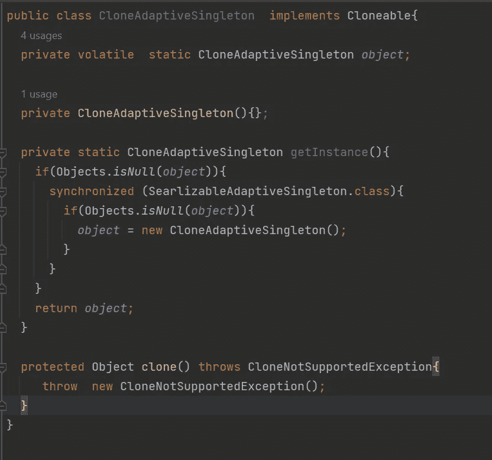
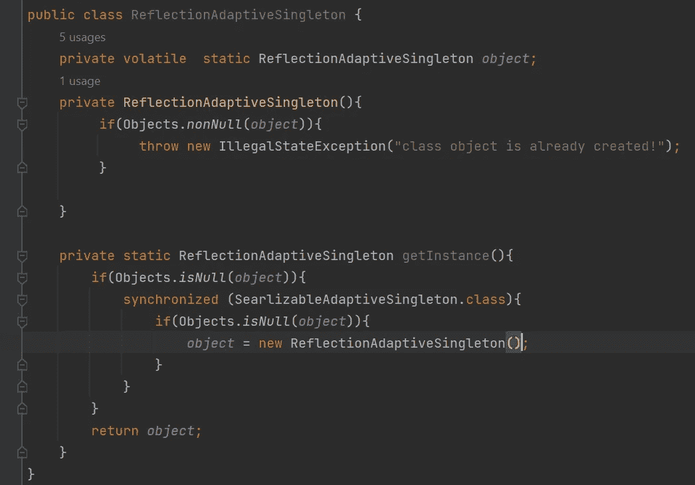

# 单一设计模式

> 原文：<https://blog.devgenius.io/singleton-design-pattern-582709d578af?source=collection_archive---------11----------------------->

# 基本概述:

单例设计模式用于创建一个类的单个实例并重用它。

使用单例设计模式，我们可以节省大量的内存，因为我们只创建了一个类的实例。

## 简单的单例类:

为了创建一个简单的单例类，我们需要两件基本的东西:

1.  私有构造函数:因为我们不希望任何其他类创建 singleton 类的实例。
2.  **静态函数:**我们使用静态函数，因为它的内存只被分配一次，使用它我们返回我们创建的对象

## 简单单例类的不同初始化方式:

*懒惰初始化:*



简单单例类

*急切初始化:*



急切初始化

**急切初始化的优点:**

1.  类的实例是在类加载时创建的
2.  我们不会有任何线程安全问题
3.  我们依靠 JVM 在装入类时创建类的唯一实例。

**急切初始化的缺点:**

1.  即使我们不使用它，实例也会被创建
2.  没有异常处理的方法
3.  如果单例类没有使用大量资源，则工作正常

# 简单单例类的问题:

我们创建的 singleton 类对于简单的场景工作良好，但是当我们包含

*   多线程操作
*   反序列化
*   克隆
*   反射

它不像创建类的单个实例的概念那样工作。

## 解决与多线程相关的问题:

现在，如果两个或多个线程正在处理这个类，而我们不能应用急切初始化，因为这将是一个资源密集型类，那么我们将不得不同步我们的函数，以便只允许一个线程访问类函数

这样我们拥有单个实例的概念就不会被违反。

因此，我们将做以下更改，以便为多线程优化我们的 singleton 类。

> 双重检查锁定

1.  **使用 Volatile 关键字创建实例:**

Volatile 关键字**用于通过不同的线程**修改变量的值。它也用于使类线程安全。这意味着多个线程可以毫无问题地同时使用这些类的一个方法和实例。

2.**使用同步:**

使用同步，我们将允许我们的类是线程安全的，因为只有一个线程可以使用 singleton 类。

此外，我们将只同步我们的函数时，我们的对象是空的，因为之后没有必要同步，因为每个线程，我们将传递相同的值。



线程安全单例类

## 解决与**反序列化**相关的问题:

当我们序列化一个对象并再次反序列化它时，会生成不同的哈希代码值，即创建不同的类对象。因此，在对象序列化/反序列化的情况下，我们的 Singleton 原则也发生了变化。

为了解决这个问题，我们用 Serializable 接口实现了我们的类

我们实现了 [readResolve ()](https://docs.oracle.com/javase/7/docs/platform/serialization/spec/input.html#5903) 方法



可序列化的安全单例类

## 解决与克隆相关的问题:

我们可以在 java 中使用 clone 函数来克隆一个类的实例。

但是这将违反我们的单例原则，因为我们不想要任何其他副本

因此为了摆脱这种情况，我们用可克隆的接口实现我们的类，并抛出[cloneotupportdexception()](https://docs.oracle.com/javase/8/docs/api/java/lang/CloneNotSupportedException.html)



克隆自适应单例类

## 解决与反思相关的问题:

在反射期间，我们在运行时创建实例的副本

所以这违反了我们的单身原则，需要处理。

为了避免反思，我们抛出了一个异常[illegalsstatexception](https://docs.oracle.com/javase/7/docs/api/java/lang/IllegalStateException.html)。

所以基本上，如果我们的对象已经被创建，那么我们抛出这个异常



现在，我们终于涵盖了我们的对象可能被复制或者可能出现在不同情况下的所有情况

因此，我们最终的完全单例类将是:

```
package org.example.singleton;

import java.io.Serializable;
import java.util.Objects;

public class CompleteSingleton implements Cloneable , Serializable {
    //volatile static object
    private volatile static CompleteSingleton *object*;
    // private Constructor throwing IllegalStateException
    private CompleteSingleton(){
         if(Objects.*nonNull*(*object*)){
              throw new IllegalStateException("object already created!");
         }
    }
   // Synchronized Function for Getting Object
    private static CompleteSingleton getInstance(){
         if(Objects.*isNull*(*object*)){
              synchronized (CompleteSingleton.class){
                   if(Objects.*isNull*(*object*)){
                        *object* = new CompleteSingleton();
                   }
              }
         }
         return *object*;
    }
    // readResolve() method to avoid object creation during Serialization / De Serialization
    protected Object readResolve(){
        return  *object*;
    }

   // throwing CloneNotSupportedException so that cloning is not supported
    protected Object clone() throws CloneNotSupportedException{
        throw  new CloneNotSupportedException();
    }

}
```

所以基本上总体上，我们可以说一个完整的单例类

1.  易失性静态对象
2.  引发 IllegalStateException 以避免在反射期间复制对象的私有构造函数
3.  当对象为空时，使用同步块来初始化函数，这样就不会出现多线程问题
4.  readResolve()方法，以避免在序列化/反序列化期间创建对象
5.  函数的作用是:抛出 CloneNotSupportedException，这样就不会发生实例的克隆