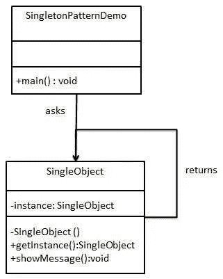

# 单一设计模式

> 原文：<https://blog.devgenius.io/singleton-design-pattern-fbcd5ccf8f1c?source=collection_archive---------8----------------------->

# 概观

Singleton 是最简单的设计模式之一，它属于 creational 模式。singleton 的思想是创建一个类，这个类只创建一个将一直被使用的对象。该类将提供一个方法来访问同一个对象，而不必实例化它。



[https://www . tutorialspoint . com/design _ pattern/singleton _ pattern . htm](https://www.tutorialspoint.com/design_pattern/singleton_pattern.htm)

# 履行

以下代码是用 Java 编写的。

```
public class Singleton {
   // It is static so it will be the same instance
   // It is private so it will only be accessible through the getter
   // Constructor is called to instantiate a new instance
   private static Singleton instance = new Singleton(); // Constructor is private so no new instances can be instantiated
   private Singleton(){} // Getter method to get instance
   public static Singleton getInstance(){
      return instance;
   } // Print method
   public void showMessage(){
      System.out.println("Hello World!");
   }
}
```

单例类的基本思想是将构造函数私有，这样它就不能被调用来实例化类外的新实例。单例类应该有一个单例类的静态实例。它不必是私有的，也不必有一个 getter 方法来访问它。如果你有一个 getter 方法，它也必须是静态的。

```
public class Demo {
   public static void main(String[] args) {
      // Error because constructor is private
      // Singleton object = new Singleton();

      // Access the instance of singleton
      Singleton object = Singleton.getInstance();

      // show the message
      object.showMessage();
   }
}
```

看上面的代码，构造函数不能被调用，因为它是一个私有方法。所以访问实例的唯一方法是使用类 getter 方法来访问实例。将它赋给一个变量后，你可以像使用任何其他对象一样使用它。

# 结论

singleton 的主要思想是一个类只有一个实例。如果你只需要一个实例，你应该考虑使用 singleton。使用 singleton 的一个例子是日志记录。