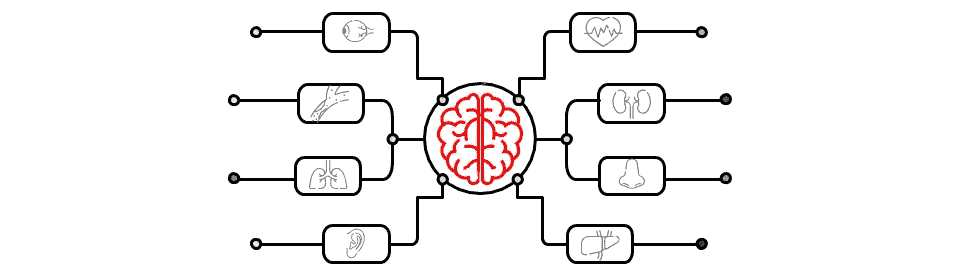

# 现代 C++中的单例设计模式

> 原文：<https://blog.devgenius.io/singleton-design-pattern-in-modern-c-faa90630fe30?source=collection_archive---------21----------------------->



在软件工程中，创造性的设计模式处理对象创建机制，也就是说，试图以适合情况的方式创建对象。对象创建的基本或普通形式会导致设计问题或增加设计的复杂性。在这篇关于创造性设计模式的文章中，我们将看看在编程面试中最讨厌的&最常被问到的设计模式。这是现代 C++中的单一设计模式，批评它的可扩展性和可测试性。我还将介绍与 Singleton 完全相反的 Multiton 设计模式。

> */！\:这篇文章最初发表在我的博客上。如果你有兴趣接收我的最新文章，* [*请报名参加我的简讯*](http://eepurl.com/gDNybv) *。*

顺便说一句，如果你还没有看过我关于创造性设计模式的其他文章，那么下面是列表:

1.  [**工厂**](http://www.vishalchovatiya.com/factory-design-pattern-in-modern-cpp/)
2.  [**建造者**](http://www.vishalchovatiya.com/builder-design-pattern-in-modern-cpp/)
3.  [**原型**](http://www.vishalchovatiya.com/prototype-design-pattern-in-modern-cpp/)
4.  [**单胎**](http://www.vishalchovatiya.com/singleton-design-pattern-in-modern-cpp/)

您在这一系列文章中看到的代码片段是简化的，而不是复杂的。所以你经常看到我不使用像`override`、`final`、`public`(同时继承)这样的关键字，只是为了让代码紧凑&(大部分时间)在单一标准屏幕尺寸下可消耗。我也更喜欢`struct`而不是`class`，只是为了节省代码行，有时不写`public:`，也故意忽略[虚析构函数](http://www.vishalchovatiya.com/part-3-all-about-virtual-keyword-in-c-how-virtual-destructor-works/)，构造函数[，复制构造函数](http://www.vishalchovatiya.com/all-about-copy-constructor-in-cpp-with-example/)，前缀`std::`，删除动态内存。我也认为自己是一个务实的人，希望用尽可能简单的方式，而不是标准的方式或使用术语来传达一个想法。

***注:***

*   如果你是在这里被直接绊倒的，那么我建议你浏览一下[什么是设计模式？](http://www.vishalchovatiya.com/what-is-design-pattern/)一、哪怕是鸡毛蒜皮的小事。相信会鼓励你对这个话题进行更多的探索。
*   您在本系列文章中遇到的所有这些代码都是使用 C++20 编译的(尽管我在大多数情况下使用了 C++17 之前的[现代 C++](http://www.vishalchovatiya.com/21-new-features-of-modern-cpp-to-use-in-your-project/) 特性)。因此，如果你没有获得最新的编译器，你可以使用[https://wandbox.org/](https://wandbox.org/)，它也已经预装了 boost 库。

# 目的

> **创建一个&在任何时间点一个类只有一个实例。**

*   Singleton 设计模式确保一个类只有一个实例，并提供对该实例的全局访问点。当只有一个对象需要协调整个系统的动作时，这很有用。
*   因此，从本质上讲，单例设计模式只不过是指定一个生命周期。

# C++中的单例设计模式示例

*   所以使用单例设计模式的动机是相当明显的。我们系统中的一些组件只需要有一个实例。例如，一个从构造函数加载到内存中的数据库&然后给出关于其内容的信息。一旦它被加载，你真的不想要一个以上的实例，因为没有意义。
*   您还想防止您的客户/API 用户制作那个[对象](http://www.vishalchovatiya.com/inside-the-cpp-object-model/)的任何额外副本。下面是 C++中单例设计模式的一个简单例子。

```
/* country.txt 
Japan
1000000
India
2000000
America
123500
*/
class SingletonDatabase {
    std::map<std::string, int32_t>  m_country; SingletonDatabase() {
        std::ifstream ifs("country.txt"); std::string city, population;
        while (getline(ifs, city)) {
            getline(ifs, population);
            m_country[city] = stoi(population);
        }
    }public:
    SingletonDatabase(SingletonDatabase const &) = delete;
    SingletonDatabase &operator=(SingletonDatabase const &) = delete; static SingletonDatabase &get() {
        static SingletonDatabase db;
        return db;
    } int32_t get_population(const std::string &name) { return m_country[name]; }
};int main() {
    SingletonDatabase::get().get_population("Japan");
    return EXIT_SUCCESS;
}
```

*   从设计的角度来看，这里需要注意以下几点:
*   私有构造函数
*   删除了[复制构造函数](http://www.vishalchovatiya.com/all-about-copy-constructor-in-cpp-with-example/) & [复制赋值运算符](http://www.vishalchovatiya.com/2-wrong-way-to-learn-copy-assignment-operator-in-cpp-with-example/)
*   静态对象创建和静态访问方法

# 单例的可测性问题

*   我们有了单例数据库，假设我们决定使用这个数据库来做一些研究，我们实际上创建了一个名为`SingletonRecordFinder`的新类，它将从参数中提供的城市名称集合中找到总人口，如下所示。

```
struct SingletonRecordFinder {
    static int32_t total_population(const vector<string>&   countries) {
        int32_t result = 0;
        for (auto &country : countries)
            result += SingletonDatabase::get().get_population(country);
        return result;
    }
};
```

*   但是让我们假设我们决定要测试`SingletonRecordFinder`，这是所有问题出现的地方。

```
vector<string> countries= {"Japan", "India"}; // Strongly tied to data base entries
TEST(1000000 + 2000000, SingletonRecordFinder::total_population(countries));
```

*   不幸的是，因为我们与真实的数据库紧密相连，没有办法替代这个数据库。我必须使用来自实际文件的值。当稍后这些条目改变时，您的测试将开始失败，因为您可能没有更新代码。这将是一个持续的问题。
*   此外，这不是一个单元测试，而是一个集成测试，因为我们不仅要测试我们的代码，还要测试一个不是好设计的生产数据库。
*   当然有一个更好的方法来实现这个特殊的构造，这样我们仍然可以使用单例，但是如果需要的话，我们可以用一些我们自己的虚拟数据来提供单例实现的替代方案。

# 依赖注入的单例设计模式

*   我们在测试`SingletonRecordFinder`时遇到的问题是，我们本质上依赖于数据库如何提供数据的细节，因为我们直接依赖于单例数据库，事实上它是单例的。
*   所以我们为什么不在接口或抽象类上使用一点点[依赖注入](https://en.wikipedia.org/wiki/Dependency_injection)！

```
struct Database { // Dependency 
    virtual int32_t get_population(const string& country) = 0;
};class SingletonDatabase : Database {
    map<string, int32_t>    m_countries; SingletonDatabase() {
        ifstream ifs("countries.txt"); string city, population;
        while (getline(ifs, city)) {
            getline(ifs, population);
            m_countries[city] = stoi(population);
        }
    }public:
    SingletonDatabase(SingletonDatabase const &) = delete;
    SingletonDatabase &operator=(SingletonDatabase const &) = delete; static SingletonDatabase &get() {
        static SingletonDatabase db;
        return db;
    } int32_t get_population(const string &country) { return m_countries[country]; }
};class DummyDatabase : public Database {
    map<string, int32_t>    m_countries;
public:
    DummyDatabase() : m_countries{{"alpha", 1}, {"beta", 2}, {"gamma", 3}} {}
    int32_t get_population(const string &country) { return m_countries[country]; }
};/* Testing class ------------------------------------------------------------ */
class ConfigurableRecordFinder {
    Database&       m_db;  // Dependency Injection
public:
    ConfigurableRecordFinder(Database &db) : m_db{db} {}
    int32_t total_population(const vector<string> &countries) {
        int32_t result = 0;
        for (auto &country : countries)
            result += m_db.get_population(country);
        return result;
    }
};
/* ------------------------------------------------------------------------- */int main() {
    DummyDatabase db;
    ConfigurableRecordFinder rf(db);
    rf.total_population({"Japan", "India", "America"});
    return EXIT_SUCCESS;
}
```

*   由于依赖注入即`Database`接口，我们的以下两个问题都得到了解决:

1.  我们已经完成了适当的单元测试，而不是集成测试，
2.  现在我们的测试类并没有直接绑定到 Singleton。所以没有必要根据数据库的变化一遍又一遍地改变我们的单元测试。

# 多音设计模式

*   Multiton 是 singleton 的变体，但与它没有直接联系。请记住，singleton 阻止您拥有额外的实例，而 Multiton 设计模式设置了某种键-值对，并限制了实例创建的数量。

```
enum class Importance { PRIMARY, SECONDARY, TERTIARY };template <typename T, typename Key = std::string>
struct Multiton {
    static shared_ptr<T> get(const Key &key) {
        if (const auto it = m_instances.find(key); it != m_instances.end()) { // C++17
            return it->second; 
        }
        return m_instances[key] = make_shared<T>();
    }private:
    static map<Key, shared_ptr<T>>  m_instances;
};template <typename T, typename Key>
map<Key, shared_ptr<T>>     Multiton<T, Key>::m_instances; // Just initialization of static data member struct Printer {
    Printer() { cout << "Total instances so far = " << ++InstCnt << endl; }private:
    static int InstCnt;
};
int Printer::InstCnt = 0; int main() {
    using mt = Multiton<Printer, Importance>; auto main = mt::get(Importance::PRIMARY);
    auto aux = mt::get(Importance::SECONDARY);
    auto aux2 = mt::get(Importance::SECONDARY); // Will not create additional instances
    return EXIT_SUCCESS;
}
```

*   如您所见，我们有三台打印机，即主打印机、二级打印机和三级打印机，它们的访问和实例化由`Multiton`控制。我希望代码的其余部分是不言自明的。

# 单体设计模式的好处

1.  单例设计模式对于应用程序配置非常有帮助，因为配置可能需要全局访问，并且应用程序配置的未来扩展可以整合在一个位置。
2.  该类的第二个常见用途是更新旧代码以在新架构中工作。由于开发人员可能已经自由地使用了全局变量，将它们转移到一个类中并使其成为单例，可以作为将程序内联到更强的面向对象结构的中间步骤。
3.  单体设计模式还增强了可维护性，因为它提供了对特定实例的单点访问。

# 常见问题汇总

**单例设计模式有什么不好？**

*   Singleton 对象在应用程序的生存期内保存状态。这对测试是不利的，因为你可能最终会遇到测试需要排序的情况，这对于单元测试来说是一个大禁忌。为什么？因为每个单元测试都应该相互独立。
*   单例对象导致代码紧密耦合。这使得猜测测试场景下的预期结果变得相当困难，正如我们在上面的数据库示例中看到的那样。但是你可以通过使用依赖注入和单例设计模式来克服它。
*   想象一下这样一种情况，有一个并发应用程序从应用程序的每个部分访问 Singleton 对象，如果使用互斥体或任何其他同步原语，它只是混合了一些东西或减慢了它的速度。

**实现单体设计模式的正确方法是什么？**

实现 singleton 的正确方法是依赖注入，所以不要直接依赖于 Singleton，你可以考虑依赖于一个抽象(比如一个接口)。我也鼓励你使用同步原语(比如互斥、信号量等)来控制访问。

**什么时候应该使用单例设计模式？**

*   通常，Singleton 用于硬件接口使用限制。例如，打印机的数量是有限的，所以在这种情况下，使用 singleton 或 multiton 设计模式来管理访问。
*   单例设计模式也广泛应用于管理配置或属性文件以管理访问。
*   我们可以将缓存用作单例对象，因为它可以有一个全局引用点，并且对于所有将来对缓存对象的调用，客户端应用程序将使用内存中的[对象](http://www.vishalchovatiya.com/memory-layout-of-cpp-object/)。

[有什么建议、疑问或者想说](http://www.vishalchovatiya.com/contact-2/) `[Hi](http://www.vishalchovatiya.com/contact-2/)` [？减轻压力，只需点击一下鼠标。](http://www.vishalchovatiya.com/contact-2/) 🖱️