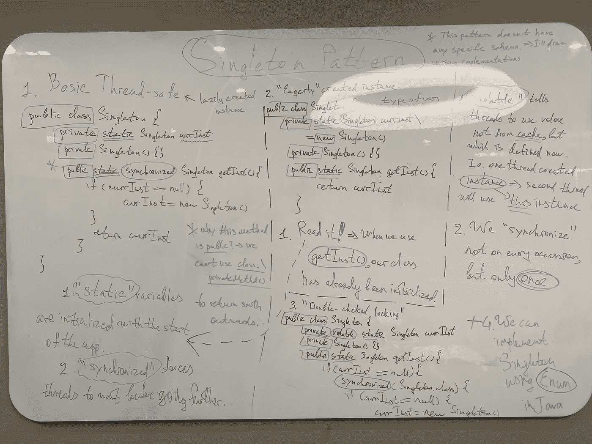

# 独一无二的对象的单例模式

> 原文：<https://blog.devgenius.io/singleton-pattern-for-one-of-a-kind-objects-java-a63c774d9d4?source=collection_archive---------7----------------------->

欢迎回到设计模式系列！👻这是一组文章，我决定发起传播他们的知识👀

不要错过我在该系列中的其他文章:

*   策略模式:[https://medium . com/toward sdev/strategy-pattern-for-independent-algorithms-kot Lin-70 ed 24 c 7 BD 8 b](/towardsdev/strategy-pattern-for-independent-algorithms-kotlin-70ed24c7bd8b)
*   观察者模式:[https://medium . com/toward sdev/observer-pattern-for-loose-coupling-kot Lin-f5ab 804609 bb](/towardsdev/observer-pattern-for-loose-coupling-kotlin-f5ab804609bb)
*   装饰者模式:[https://medium . com/toward sdev/decorator-decorator-pattern-for-object-composition-kot Lin-7 CEC 92 cbaf 7b](/towardsdev/decorator-decorator-pattern-for-object-composition-kotlin-7cec92cbaf7b)
*   工厂模式:[https://medium . com/dev-genius/factory-patternS-to-hide-instantiation-kot Lin-D5 f 01 cf 01921](https://medium.com/dev-genius/factory-patterns-to-hide-instantiation-kotlin-d5f01cf01921)

如果你想更深入地研究模式的世界，请不要吝啬这本书:[https://www . oreilly . com/library/view/head-first-design/9781492077992/](https://www.oreilly.com/library/view/head-first-design/9781492077992/)

结构:

*   介绍
*   问题
*   设计遵循的原则:`null` **本文中的**
*   额外部分
*   最终解决方案代码(在本文中，它不同于以前的代码)
*   图画

**前言:【https://wickedlysmart.com/head-first-design-patterns/】正如我上面提到的，在本文中我不会使用我自己的代码，而是本书作者提供的 Java 代码:。为什么这样你会在 article✌️的主要部分找到它**

# 单一模式

## 介绍

当你开始在不同的程序中编写软件时，你会发现相同的模式可能会以稍微不同的方式实现。举例？

*   **Singleton** 在 Java 中使用`static`，但在 Kotlin 中它只是`object`，而在 Python 中它利用了`metaclass`及其周围的东西
*   **适配器**(模式将在下一篇文章中出现)有两个主要实现:它在 Java 中使用*组合*(由于缺少*多重继承*)和在 Python 中使用*多重继承*(尽管没有人限制您使用*组合*)

我想强调的是，不同语言的概念是一样的，但是实现可能是 vary☝️

> 这就是为什么大师们证明:“不要死记硬背实现，而是要理解超越一种语言的概念”

## 问题

想象一下，你有一个程序，它有多个线程，缓存和类似的东西。我们不希望他们互相混杂。

想到的可能的解决方案？

*   使用`global` **变量**
*   使用`static`

让我们马上剖析这些例子:

1.  `global`不是一个好主意，因为它们通常在应用程序启动时被初始化。因此，如果一个是**资源密集型**应用程序导致从不使用它- >浪费宝贵的资源👎🏼
2.  在某些情况下，将所有东西都声明为`static`可能是一种选择，但是它有一个很大的缺点。哪一个？与初始化顺序相关的细微错误，因此过度使用`static`可能会导致难以发现的问题

`=>`为了拯救我们，开发了**单例模式**来确保身份(唉，并不总是这样，但我会在**额外部分**中提到它)

它利用私有和公共的构造函数和心爱的`static`关键字。

让我向你展示达到模式最终状态的步骤👨🏻‍💻：

1.  为了使类适合实例化，我们需要`public constructor`:

`public ExampleOfClass`

2.为了使一个类对外部世界不可见，我们将它转储到前面的公共类中，并使它:

`private ExampleOfInnerClass`

3.为了初始化这个内部类，我们肯定需要调用一些方法。使用`static`使其可从`public`构造器访问:

`public static ExampleOfInnerClass getInstance()`

4.为什么将`static`用于**单例**变量，例如:

`private static Singleton uniqueInstance`

阅读以下关于[堆栈溢出](https://medium.com/u/d53dd768d047?source=post_page-----a63c774d9d4--------------------------------)的帖子:[https://stackoverflow.com/a/26993425/16543524](https://stackoverflow.com/a/26993425/16543524)

毕竟，让我们观察单例模式的最终代码，并讨论 it🛠的可能修改

## 额外部分

但首先，让我说一点题外话:

*   什么是`static`？我不是一个重 JVM 的家伙，但可以解释一下:这个词告诉 JVM，当应用程序启动时，它应该用这个关键字**初始化(或只是记住)变量。**
*   记住**单例**不是简单的*为了模式而模式*的东西。它里面可以有很多种方法。
*   当另一个线程/资源访问 **Singleton** 时，它检查方法:实例是否已经初始化？如果你不明白我对 about🧐的说教，请看下一节的`getInstance()`方法
*   该模式违反了**实**中的 S:**单一责任原则**。

> 类应该只做一件事，不要与各种

*   那么，**单例**不就是**松耦合**吗

最后两个项目符号并不意味着该模式在某种程度上是低劣的。它经常因此受到批评，但这就是世界的真相:我们并不总是坚持最佳实践🤷‍♂️

*   科特林没有成熟的**单例模式**，也就是说，它只是一个简单的`object`。这就是为什么我决定用 Java 解释一切
*   当我们有多个类装入器& **单例类**时，可能会出现**单例类**的问题。解决方案？自己指定类装入器。

## **最终解决方案代码**

首先，让我们看看基本的 **Singleton** ，然后我们会考虑改善它的方法

正如我在之前的文章中所描述的:

*   `public class Singleton` 构造器使类对外部世界可访问
*   `private Singleton`构造函数使类对外部世界不可见
*   `public static Singleton getInstance()`允许`public class Singleton`访问该方法
*   `private static Singleton uniqueInstance`同样的帖子在[栈溢出](https://medium.com/u/d53dd768d047?source=post_page-----a63c774d9d4--------------------------------):[https://stackoverflow.com/a/26993425/16543524](https://stackoverflow.com/a/26993425/16543524)

你会想:有什么可以改进的？老实说，总体结构保持不变，但是要应用一些小的变化(它们带来的重要性范围并不小)。

如果我们有多个线程，它们同时访问单个的会怎么样？- >当每个线程都可能进入这个类时会引起骚动，在和`if (uniqueInstance == null)`之后**它们都将创建自己的实例。因此它引起了许多麻烦😰**

怎么才能修好？

1.  在`getInstance()`方法中使用`synchronized`关键字。这将导致线程等待，直到另一个解锁方法。

遵守代码:

关注`synchronized`

2.“热切创造”的独生子女

首先看看代码，然后我会一步一步地解释他们是如何做到的:

回忆一下`static`的解释？同样，当 app 被初始化时，JVM 开始了解所有的`static`。这里，我们的`static`变量调用方法来创建一个**单例**实例`=>`当我们进一步使用该方法时，变量将已经被初始化。

3.DCI:双重检查锁定

你知道`synchronized`的骗局吗？它会消耗大量资源，如果它很关键，我们有一个解决方案:

因此，在这种方法中，如果两个线程发现自己在 `if (uniqueInstance == null)`之后**，代码阻塞变量，然后进行第二次检查(为什么？- >暂时请等待🙏)，如果还是`null`，初始化变量。所以，你可以拥有 questions❓:**

*   为什么要第二次检查？因此，两个线程通过了第一个`if`检查。然后，我们通过`synchronized`进行阻挡。第一个线程已结束初始化，第二个线程开始运行。但是在第二次`if`检查中:实例已经存在- >不需要创建它。当实例没有实现时，我们只使用一次`synchronized`。
*   什么是`violate`？它告诉**线程**在变量的当前值中查找(在我们的例子中，它在类内部)，但是不在线程的**缓存**中查找(在那里变量可能没有被初始化)

‼️Danger‼️:这种方法在 Java 5 之前是行不通的

4.我们也可以用 Java Enum 做 **Singleton** ，但是我将在本文中跳过它。

## **图纸**💫

在照片中你可以看到我的涂鸦🙄我画了各种实现，做了几点注释。

> 如果你没有得到什么，留下评论，我会来解释

## 结尾部分📣

> **单例模式**的学术定义:它确保类只有一个实例。此外，它还提供了一个**全局访问点**

今天就这些了。查看我在该系列中以前的文章👋

你可以找到我:

*   领英:[www.linkedin.com/in/sleeplesschallenger](http://www.linkedin.com/in/sleeplesschallenger)
*   GitHub:[https://github.com/SleeplessChallenger](https://github.com/SleeplessChallenger)
*   leet code:[https://leetcode.com/SleeplessChallenger/](https://leetcode.com/SleeplessChallenger/)
*   电报:@无眠挑战者