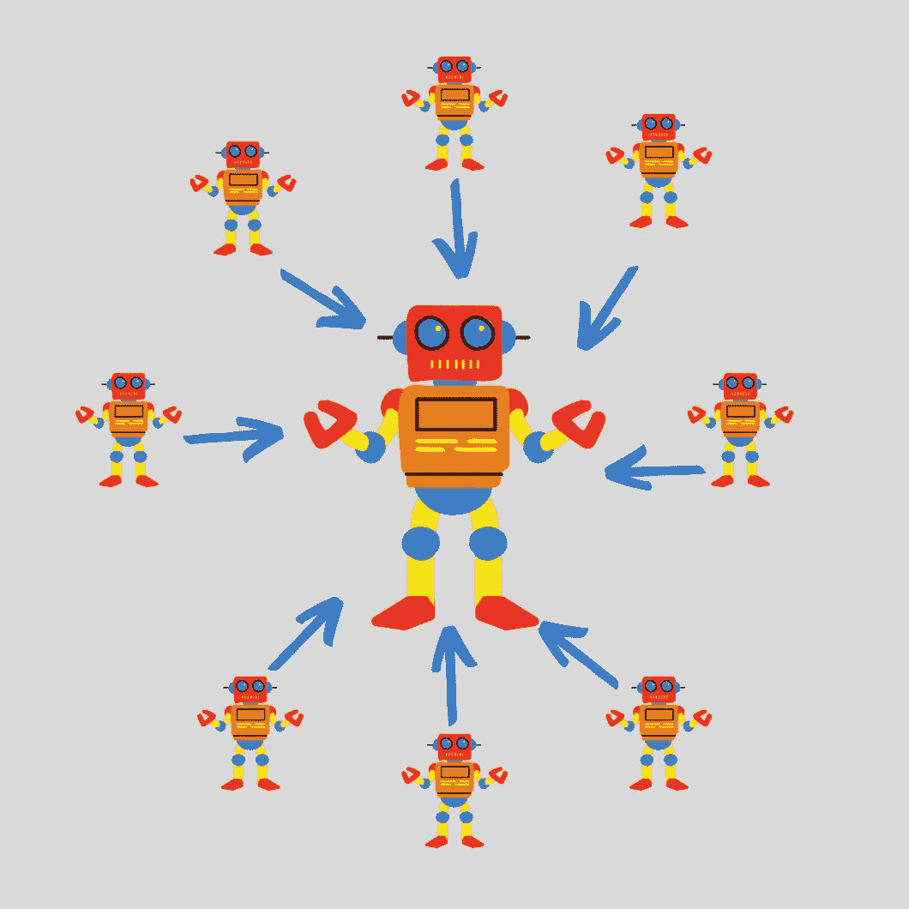
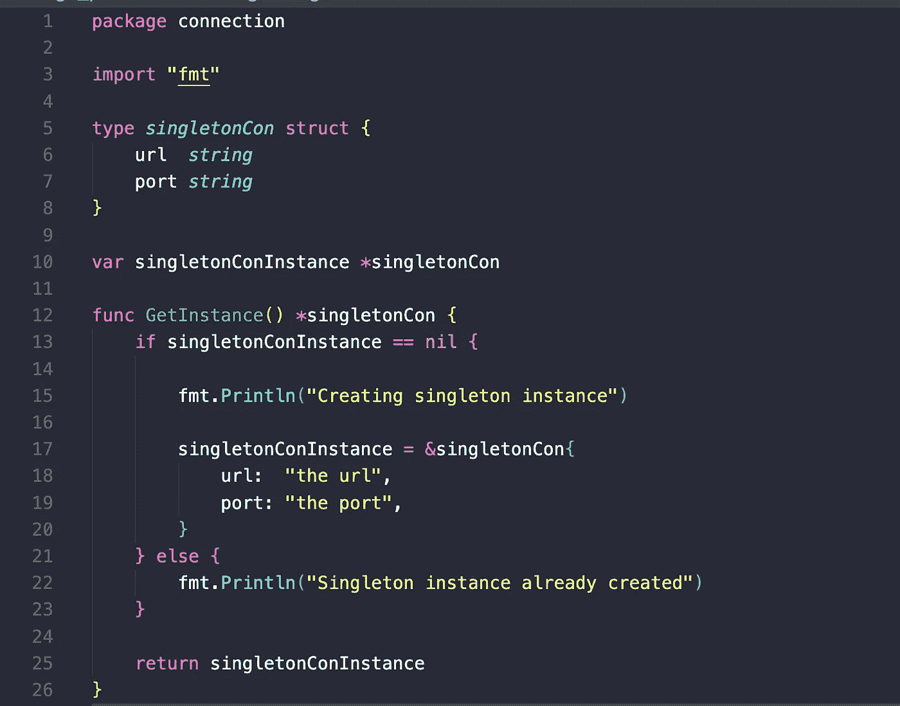
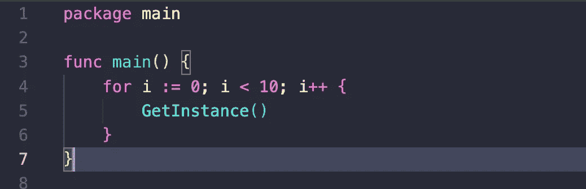
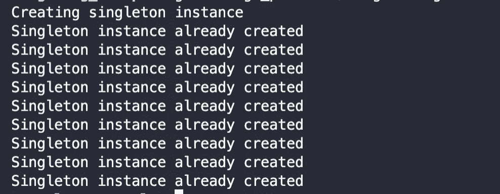

# Go 中的单例模式

> 原文：<https://blog.devgenius.io/singleton-pattern-in-go-538d999d752c?source=collection_archive---------3----------------------->

Singleton 是一种创造性的模式，它允许在整个执行过程中确保只有一个来自“struct”类型的实例。

为了保持相同的引用，使用 Golang 指针更容易实现单例模式。

示例:

*在下面的代码中定义了一个包，其中包含一个名为****sigleton _ connection . go****的文件。文件内部定义了一个与“单例模式”相关的逻辑，由:*组成

*   私有 struct 类型，本例中为***singletonCon****。*
*   指向 ***singletonCon*** 类型的私有变量。
*   一个执行其余魔术的函数， **GetInstance** 。该函数将用于验证***singleton con****是否已经初始化，如果为假，则设置该值，如果为真，在这种情况下，我们打印一条消息。*

*下面的代码运行"****【getInstace()****"函数，以便在每次迭代中得到一个连接实例。*

*在控制台输出中，我们可以看到只有第一次迭代创建了连接实例。*

# 附加说明

在学习了如何用 Golang 实现这个模式之后，在结束本文之前，让我给你一些额外的信息，我将提到一些优点和缺点，以及这个模式如何与其他模式相关联。

## 与其他模式的关系

*   一个 Facade 通常可以被转换成一个 Singleton 模式，因为在大多数情况下一个 Facade 对象就足够了。

## 利弊

*   你可以确定一个类只有一个实例。
*   帮助获得该实例的全局访问点。
*   Singleton 对象只有在第一次被需要时才会被初始化。

*   它违反了单一责任原则。该模式同时解决了两个问题。
*   单例模式可以掩盖糟糕的设计，例如，当程序组件彼此知道太多的时候。
*   不是线程安全的，所以编写代码时要确保只为所有线程创建一个实例。

> 注:
> 本文与你能在此找到的“Golang 中的设计模式”系列相关[https://medium . com/@ josueparra 2892/Desing-Patters-in-Golang-24a 142 d2c 91](https://medium.com/@josueparra2892/desing-patters-in-golang-24a142d2cc91)