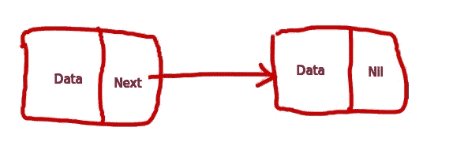

# GoLang 中的单链表

> 原文：<https://blog.devgenius.io/singly-linked-list-in-golang-bb90a96c9933?source=collection_archive---------9----------------------->

大家好。在过去的几个月里，我一直在尝试 golang，这是非常有趣的学习。我正在分享一个实现链表的代码片段。

众所周知，链表是一种包含值和指向下一个值的指针(或指向下一个值的位置)的数据结构。只要堆空间没有用完，链表可以动态增长。一个链表看起来大概是这样的:



我的漂亮链表

现在让我们看看如何在 golang 中实现这个简单的单链表，我们将在其中插入新值并打印它们。

```
type Node struct {
 Data int
 Next *Node
}
```

这是非常常见的节点定义。第一行声明`Node`是用户定义的数据类型。它包含两个字段`Data`和`Next`。关于结构，需要了解的几件事是:

1.  这些是复合数据类型。
2.  可以包含不同类型的值。
3.  这些值被称为*字段*。

现在让我们看看如何添加一个节点:

```
func (n *Node) AddNode(data int) {
 newNode := Node{data, nil}
 iter := n
 for iter.Next != nil {
  iter = iter.Next
 }
 iter.Next = &newNode
}
```

第一行将函数`AddNode`声明为类型`*Node`。`n *Node`被称为*接收器*。`AddNode`接受`int`类型的参数。`newNode := Node{data, nil}`定义了一个`Node`类型的变量`newNode`，并用两个值`data`和`nil`初始化。接下来的 4 行在链表中为`newNode`对象找到一个合适的位置，并把它放在那里。

通过用接收方`n *Node`声明`AddNode`，我们确保了`AddNode`只能用`*Node`类型的变量来调用。简单来说，这就是 golang 定义成员函数的风格。

让我们看看如何显示这些值:

```
func (n *Node) PrintNode() {
 iter := n
 for iter != nil {
  fmt.Println(iter.Data)
  iter = iter.Next
 }
}
```

我们已经用`n *Node`接收器声明了`PrintNode`。它迭代通过`n`指向的`Node`打印每个`Data`。现在让我们看看主要方法:

```
func main() {
 newNode := Node{10, nil}
 newNode.AddNode(20)
 newNode.AddNode(30)
 newNode.AddNode(40)
 newNode.PrintNode()
}
```

正如我们所见，`AddNode`和`PrintNode`必须使用`Node`类型的变量(或接收器)来调用。如果我们尝试在没有任何接收器的情况下调用`AddNode`,将会导致以下错误:

```
func main() {
 newNode := Node{10, nil}
 newNode.AddNode(20)
 newNode.AddNode(30)
 newNode.AddNode(40)
 AddNode(10) //Will result in compilation error
 newNode.PrintNode()
}go build -o linkedlist.out linkedlist.go./linkedlist.go:34:2: undefined: AddNode
```

完整代码可在此处获得[https://gist . github . com/sandeep-sarkar/dc6a 04884638 f 04 DDA 9 f 852 e 7735 CAE 9](https://gist.github.com/sandeep-sarkar/dc6a04884638f04dda9f852e7735cae9)

目前就这些。希望你喜欢它。请随意发表评论。这将有助于我提高。