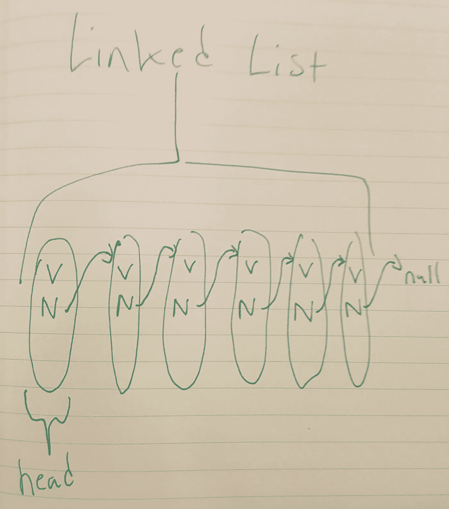
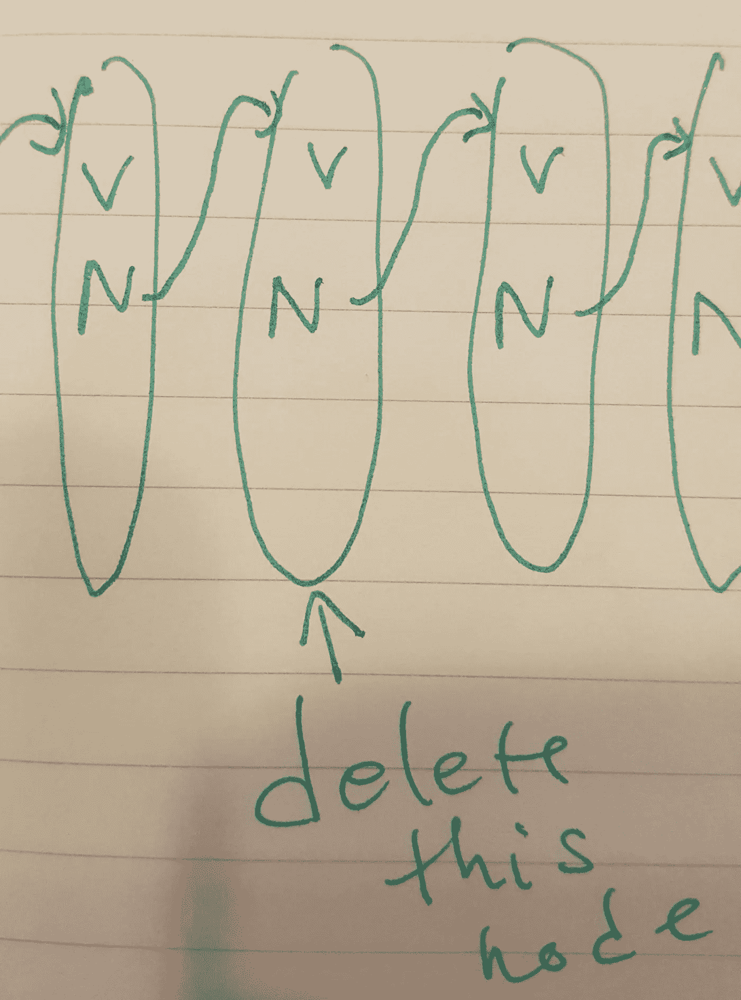
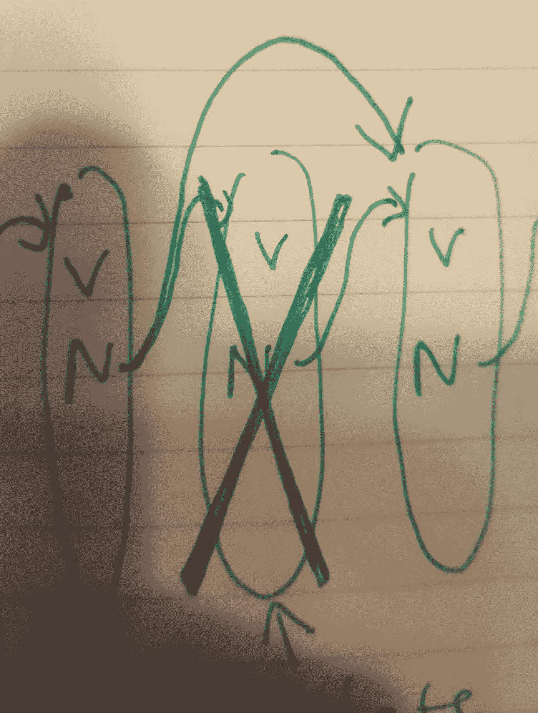
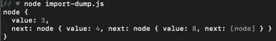
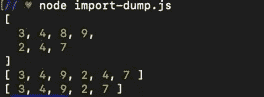

# 单链表—打字稿

> 原文：<https://blog.devgenius.io/singly-linked-list-typescript-90e5bb24f221?source=collection_archive---------0----------------------->


索尔马兹·哈塔米安在 [Unsplash](https://unsplash.com?utm_source=medium&utm_medium=referral) 上的照片

我将讲解如何在 typescript 中创建一个单链表。首先我会给你看代码，然后我会解释它是如何工作的(用图片)

如果您只想获取并使用这段代码，您可能需要省略每个类(node，LinkedList)前面的“export”。我在我的 typescript 存储库中为我的环境设置了它，但是您不需要它来处理单个文件中的列表。

```
export class node {value:number;next:node|null;constructor(value:number) {this.value = value;this.next = null;}}export class LinkedList {head:node|null = nullconstructor() {this.head = null;}appendNode:Function = (value:number) => {if (this.head == null) {this.head = new node(value)} else if (this.head.next == null) {this.head.next = new node(value)} else {*//    finding the tail*let a:node|null = this.head.nextwhile (a.next) {a = a.next}a.next = new node(value)}}deletePosition:Function = (position:number) => {if (this.head == null) {return "The list is empty"} else if (position == 1) {this.head = this.head.next} else {let counter:number = 2let a:null|node = this.headwhile (a.next && counter != position) {a = a.nextcounter += 1}a.next = a.next.next}}putAllValuesInArray:Function = () => {let output: any[] = []if (this.head == null) {return "The list is empty"} else if (this.head.next == null) {return this.head.value} else {let c:node|null = this.head.nextwhile (c.next) {output.push(c.value);c = c.next;}output.push(c.value)return output}}findTail:Function = () => {if (this.head== null) {return "The list is empty"} else if (this.head.next == null) {return this.head} else {let a:node|null = this.head.nextwhile (a.next) {a = a.next}return a}}}
```

我做东西的第一步总是把它画出来，或者做一个计划。这将有助于你理解它，并让你在这个过程中不至于迷失方向。

单链表是一种至少有两个并行对象的数据结构，每个对象都有几个属性。每个对象可以包含任意数量的包含值的属性，但是为了使这个列表正确，我们需要在每个对象中至少有一个属性指向列表中的下一个对象。

一开始就有两件事需要考虑。您可以有多个列表，每个列表将包含许多节点对象。因此，最简单的开始方法之一就是为列表和节点创建一个新类。

```
class node {}class LinkedList {
}
```

现在我要画出一个单链表的样子，这样我们就可以直接让它工作了。



所以我们知道我们将会有一些对象包含一些值和另一个指向列表中下一个对象的属性。列表的尾部将指向 null。

此外，这不是必需的，但一般来说，跟踪列表的头部是一种好的做法。这样做会使列表中的一些特征更容易实现。

```
class node {value: number
next: node | nullconstructor (value:number) {
this.value = value;
this.next = null}}class linkedList {head: node | nullconstrctor () {
this.head = null}}
```

基本上，节点中的每个下一个属性都只能是 null 或另一个节点。

每个列表的每个头值都只能是 null 或另一个节点。

(现在)制作一个没有值的节点是没有意义的。

在这个特殊的例子中，我让每个值只能是一个数字，因为我喜欢数字。

你可以用列表做很多事情，但是数据结构最起码的功能是添加值或者删除值。这就是我今天要讲的全部内容。我的列表中有一些额外的函数，比如“将所有的值放入一个数组中”,只是因为这是一种简单的方法来按顺序查看所有的值，并仔细检查我的 append/delete 函数是否正常工作。

所以，看看我们的图，以及到目前为止我们的类，我们可以看到，我们可以简单地实例化 list 类的一个新成员，它将有一个指向 null 的头。新的节点成员将有一个值和一个指向 null 的下一个属性。

让我们继续添加一个节点。

首先，我们检查头部是否为空(因为填充的列表必须总是有一个头部。)如果 head 为空，那么我们只需实例化一个新的节点成员，并将 head 转换为我们的新节点。

为了做到这一点，我们简单地把这个:

```
if (this.head == null) {this.head = new node(value)
}
```

在我们的追加节点函数中。

但是，如果我们的头部是一个节点，我们需要遍历列表找到尾部，然后确保尾部的下一个属性指向新的节点。

```
else {*// finding the tail*let a:node|null = this.head.nextwhile (a.next) {a = a.next}// assigning the new node to tail.nexta.next = new node(value)}
```

跟踪事物的一个简单方法(你应该认识到这是一个常用的工具)是设置一个 tracker 变量，然后在你循环的时候改变这个 tracker 变量。

在这种情况下，我说变量“a”要么是一个节点，要么为空。当 a.next 仍然是一个节点时，将“a”赋给列表中的下一个节点。一旦 a.next 为空，我们就会知道“a”已经被赋给了列表中的最后一个节点。(参考我们的图纸。在简单的单链表中，最后一个 node.next 总是指向“null”。)因为“a”是列表的尾部，而 a.next 是 null，所以循环将中断，程序将继续计算块中的最后一条语句。

块中的最后一条语句将把一个新节点分配给 a.next。

嘣，我们的新节点被附加上了，这一点也不难。

**删除一个节点**

你猜怎么着？根据我的经验，附加节点通常是数据结构实现中比较容易的一半。

那么我们来说说删除一个节点。在删除节点时，您可以检查很多东西。您可以按值删除或按位置删除，甚至删除一系列节点。没关系。用于删除有问题的节点的基本概念总是相同的。

这个过程涉及到将指针从前一个节点改变到下一个节点。再次让我们回到我们的图纸，因为这将使这更容易理解。



我们正在删除的节点仍然有一个指向下一个节点的“next”属性，这并不重要，因为当我们遍历列表时，前一个节点的“next”属性将简单地跳过我们正在删除的节点，从而使它不可访问。

删除函数看起来几乎和追加节点函数一样。在本例中，我是按位置而不是值或其他任何东西来删除节点的。

首先，我们需要查看列表是否为空。

```
if (this.head == null) {return "The list is empty"}
```

然后，如果我们删除列表中的第一个节点，我们只需遵循我们的指针改变逻辑，使列表的头实际上是第二个节点，从而使第一个节点不可访问。

```
else if (position == 1) {this.head = this.head.next} 
```

最后，遍历列表，直到我们在我们想要的位置，然后改变相对属性指向我们想要的节点，以使被删除的节点不可访问。

```
else {let counter:number = 2let a:null|node = this.headwhile (a.next && counter != position) {a = a.nextcounter += 1}
if (counter == position) {a.next = a.next.next
}}
```

基本上，我们遍历列表，使用和以前一样的“a”跟踪变量。此外，我使用一个“计数器”变量来跟踪我们在列表中的位置。

基本上，这个 while 循环将一直迭代，直到它到达列表的末尾，或者直到它找到我们正在寻找的位置。

关于这一点，可能看起来有点混乱，因为我们实际上是在迭代时检查下一个节点的位置，因为为了改变适当的 next 属性，我们需要能够以某种方式找到前一个节点。实现这一点最简单的方法是调整“计数器”的起始值，这样 while 循环将在目标节点之前中断一个节点。

我们可以通过输入一些函数调用并在命令行中查看结果来测试我们的列表，以确保它正常工作。

```
newList.appendNode(3);newList.appendNode(4);newList.appendNode(8);newList.appendNode(9);newList.appendNode(2);newList.appendNode(4);newList.appendNode(7);*console.log(newList.head) //=> node { value: 3, next: node { value: 4, next: node { value: 8, next: [node] }}}*console.log(newList.putAllValuesInArray()) *// => [ 3,4,8,9,2,4,7 ]*newList.deletePosition(3)console.log(newList.putAllValuesInArray()) *// => [ 3,4,9,2,4,7 ]*newList.deletePosition(5)console.log(newList.putAllValuesInArray()) *// => [ 3,4,8,9,4,7 ]*
```

在这里，我用一些值填充我的列表。然后我告诉它 console.log 列表，这样我就可以看到基本结构是否正确。然后我调用删除函数，并使用我的数组函数来确保它删除了正确的位置。(请记住，我的位置从 1 开始，所以不要假设它与数组索引相同)



我们的基本列表结构似乎是正确的。



它似乎在删除我们希望它删除的位置。列表中的第三个位置是“8”，删除 8 后的第五个位置是第二个 4。

今天到此为止。请记住，这个列表纯粹是功能性的(至少是功能性的),如果你够聪明的话，它很容易被打破，但这应该足以让你开始。