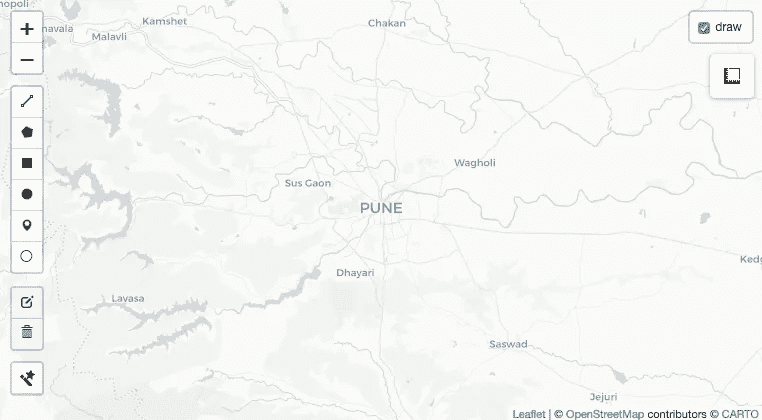
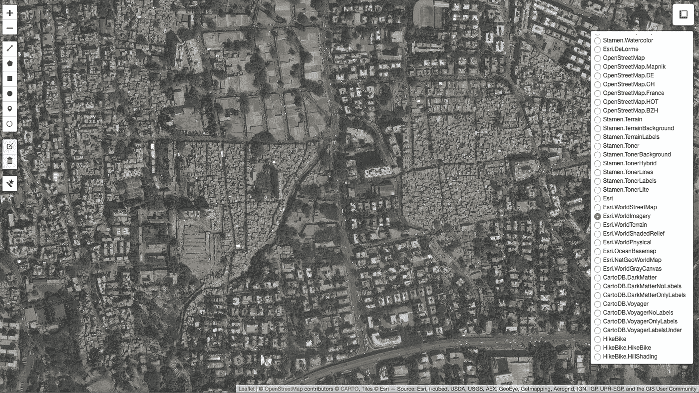
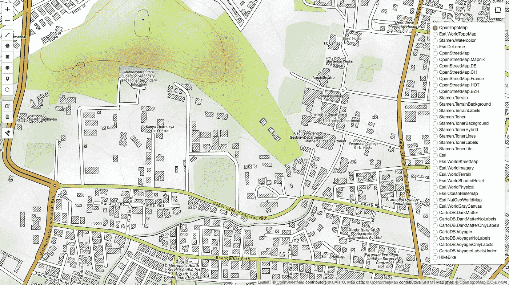
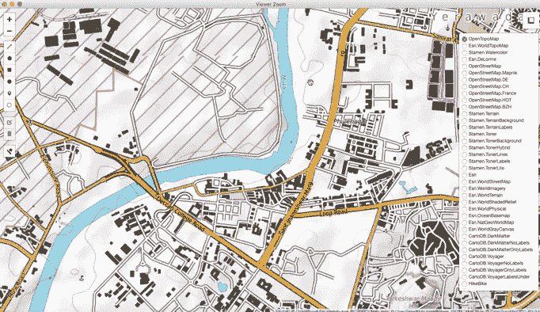
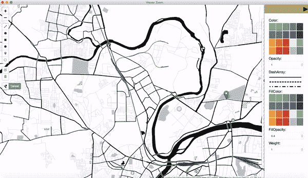
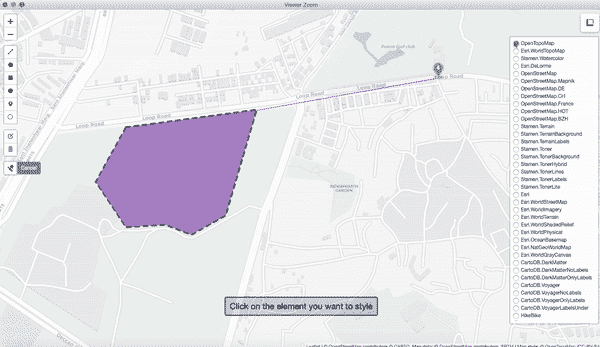
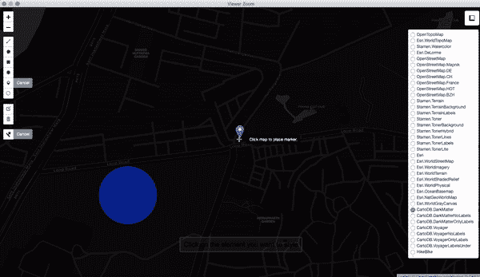
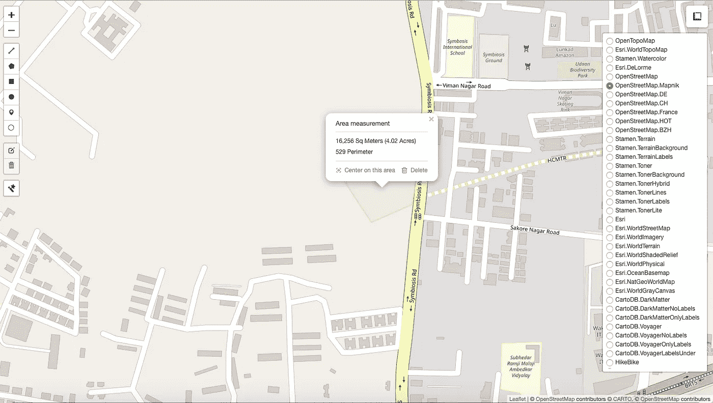

# 现场分析仪

> 原文：<https://blog.devgenius.io/site-analyser-3a659227f776?source=collection_archive---------2----------------------->

## 建筑智能

## 用 R 语言制作的建筑师场地分析工具

> “我将我的建筑视为城市的一部分，在我的设计中，我试图让它们成为负责任和有贡献的公民。”—西萨·佩里

[安德鲁·尼尔](https://unsplash.com/@andrewtneel?utm_source=unsplash&utm_medium=referral&utm_content=creditCopyText)在 [Unsplash](https://unsplash.com/s/photos/maps?utm_source=unsplash&utm_medium=referral&utm_content=creditCopyText) 上拍照

**场地分析**是预设计流程的一部分，被定义为对我们计划设计空间的一块土地的地理、气候、历史和法律的详细研究。它包括获取关于地形、周围树木、街道、与主要地点的连通性、天气、气候和污染的信息，然后分析这些给定的数据或信息。

## **现场分析**包括 3 个重要步骤:

*   *研究阶段*
*   *分析阶段*
*   *合成阶段*

每当我们完成选址时，我们必须始终分析和检查地点和邻近地区，例如特定区域的绿地、车辆数量(这可能是空气和噪音污染的原因)、地点的犯罪率、离最近的餐馆、咖啡馆、学校、综合商店、药店、蔬菜市场、健身房、诊所和公园的距离。

图为[托比亚斯](https://unsplash.com/@tbshg?utm_source=unsplash&utm_medium=referral&utm_content=creditCopyText)在 [Unsplash](https://unsplash.com/s/photos/maps?utm_source=unsplash&utm_medium=referral&utm_content=creditCopyText)

所以我创建了一个工具，使用编程进行网站分析。我用 R 语言编写了这个工具，使用了它的一个流行包*“传单”*。这个工具给了我一个离线定位站点的优势，我可以在地图上绘制任何形状来显示和定义我的站点，它给了我站点中心的面积、周长和经度&纬度，我可以使用不同的颜色和不透明度来突出显示站点，我可以在地图上锁定任何位置，我可以获得污染细节，它给了我大约 40 个地图提供商选项(如 OpenStreetMap、ESRI、CartoDB 等)。)来选择。

使用 **addMeasure()** ，添加测量工具。可以在此指定面积和长度的主要和次要单位。还可以指定测量完成前后多边形的颜色。

地图准备好了！

选择 ESRI 提供商，并选择卫星地图来获取有关人工和自然特征的信息

OpenTopoMap 提供物理特征的相关信息

这个工具给了我 40 张地图可供选择，像地形图、地貌图、等高线图、水彩图、深色图、灰色图、自行车密度图、天气和温度图。这些是顶级地图提供商提供的地图。

使用多边形绘制工具创建场地，然后放置位置标记

改变多边形和边界线的颜色，指定多边形不同的不透明度值，自定义图标及其颜色

测量工具也可以用来测量距离

指定周长和面积，单位为米，辅助单位为英亩

这是一个简单的工具，有许多功能，也很容易，尽管可以增加更多的复杂性。我创建它是因为我认为我可以做一个简单易用的免费工具，而不是使用任何网站分析软件的付费版本。