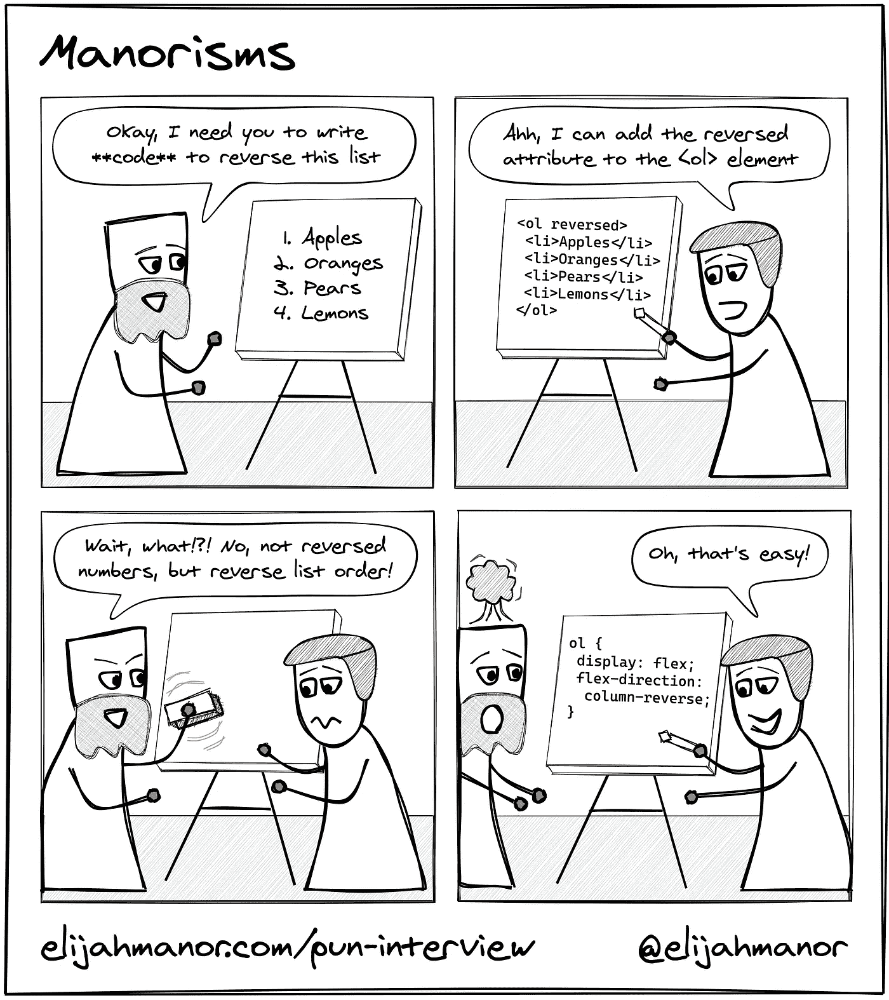

# 确定编码面试的心理框架的六个步骤

> 原文：<https://blog.devgenius.io/six-steps-of-mental-framework-to-nail-a-coding-interview-3a27810f3e22?source=collection_archive---------1----------------------->

## 深呼吸。这会有用的。

(六步心智框架书出来了！[在这里抢一份](https://gracehuang.gumroad.com/l/coding-interview)！)



漫画作者[以利亚庄园](https://elijahmanor.com/blog/pun-interview)——《技术访谈》

现在你已经在 HackerRank 和 LeetCode 上练习了数周的数百个编码问题。当面试官最后透露编码问题的时候，你还在紧张。一瞬间，你几乎迷路，不知道从何说起。突然，你注意到 45 分钟的时钟一直在滴答作响，于是你的大脑再次一片空白。

我去过那里，我知道那种感觉。

在我的职业生涯中，我面试过数百名软件工程师候选人，为大型科技公司工作，也为我自己的公司 Roxy 招聘。我发现优秀的面试候选人有一些共同点——他们有一个一致的思维框架来在有限的时间内解决问题。这个心智框架几乎可以在所有编码问题中重复使用。

在这篇文章中，我将带你经历心理框架的 6 个步骤。在每一步，我将使用这个编码面试问题“将数字转换成英语单词”，来说明如何在编码面试中应用这个框架。

# 第一步。写下问题(1 分钟)

很多时候面试官只是口头描述一下问题，但是你需要写下来。**这有助于你内化这个问题是什么。同时，你可以用它来“强迫”面试官确认你的理解。**这就是写作的力量。

如果是电话面试，可以在在线共享编辑器(比如 CollabEdit)上把整个问题打下来。如果你在白板上做，把它写在黑板上。

万一你写下的和面试官想要你做的不一样，他们应该在你的解决方案偏离问题太多之前让你知道。

> 写一个函数把给定的数字转换成英语单词。比如输入是 123，输出是“一百二十三”。

# 第二步。澄清问题空间(5 分钟)

面试官呈现给你的问题是完整的，这是非常罕见的。是的，你没看错。一些边缘情况可能会遗漏定义。问题的范围可能比听起来要大得多。问题陈述通常是陷阱中的诱饵。

**面试官想看你是否轻易做出假设，是否能沟通需求差距，是否能做出良好的判断。**

例如，对于数字问题，这里有一个问题列表，你可以问来澄清-

> 1.输入数字的范围是什么？0?1–999?1–999,999?
> 2。输入可以是负数吗？
> 3。输入可以是分数吗？
> 4。输出是否有破折号？如《二十三》
> 5。输出在百和其余之间有“与”吗？例如“一百三十一”

面试官一直在等你澄清问题，所以他们会提供具体的答案，比如-

> “范围将是 1 到 999”
> “仅正整数”
> “无破折号”
> “否”和“字”

不幸的是，我遇到的 10 个候选人中有 5 个不能澄清问题并立即跳到代码上。最终的解决方案肯定会受到影响。即使候选人后来意识到缺少案例，并试图将它们修补到逻辑中，到那时代码可能看起来不漂亮或不干净。

# 第三步。写下测试案例(5 分钟)

等等！我们还没有开始编码。但是，对了，在编写一行代码之前，你应该列出所有的测试案例，包括常见案例和极端案例。在编码之前准备好测试用例实际上比你想要构建的实际产品需求描绘了一幅更好的图画。它物化了问题空间。

这里是*所有*示例问题的可能测试用例类型—

```
1…9 → one…nine
10…19 → ten…nineteen
20, 30,…90 → twenty, thirty,…ninety
21 → twenty one
100 → one hundred
101…109 → one hundred one…one hundred nine
110…119 → one hundred ten…one hundred nineteen
120 → one hundred twenty
123 → one hundred twenty three
200 → two hundred
999 → nine hundred ninety nine
```

首先，从一个数字到单词，你需要一本字典。从上面的测试案例中，您可以获得本词典所需的唯一单词的详尽列表。当你列举所有可能的情况时，你的大脑开始获得一些模式。

很多考生根本不考。很多考生最后都考了。很多考生只考好的案例。我见过的只有少数人在编码前就开始了详尽的测试用例列表。

# 第四步。描述并写下算法(15 分钟)

一些面试官可能会要求你详细说明你将如何解决问题，或者在编码前描述算法。有些人可能只是看你会怎么做——你会直接去编码，还是在编码前准备好一个清晰的解决方案？

从我对过去所有候选人的观察来看，那些立即跳到代码的人可能要么没有及时解决问题，要么有一个难以遵循的工作解决方案。只有那些在实现之前就有了清晰想法的人才能用精确可读的代码解决问题。

**根据测试用例，用适当的数据结构和算法设计一个解决方案。**

你可能会注意到，在例子中，在数字 20 之前，所有的单词都是独一无二的单词，比如“一”、“五”、“十”和“十三”。20 后有格局组合独特词。这是我算法的初稿-

> 1.为所有独特的单词(一…十，十一…十九，二十，三十，四十，…九十)创建一个字典。检查边界:< 1 和> 999
> 3。查简单独特的单词:< 20
> 4。查单词:如果是，查字典；否则，什么也不做
> 5。查十:如果是十，查字典；否则，什么也不做
> 6。查百位:如果是百位，查字典，加“<空格>百位”；否则，什么也不做
> 7。把所有的单词放在一起

条条大路通罗马**。**多种方式解决一个问题。我注意到上面的解决方案并不流畅，因为在英语中，首先是数百个单词，然后是十个和一个。我立即注意到我需要做第 6 项，然后是第 5 项和第 4 项，如下所示

> 1.为所有独特的单词(一…十，十一…十九，二十，三十，四十，…九十)创建一个字典。检查边界:< 1 和> 999
> 3。查简单独特的词:< 20
> 4。查百位:如果是百位，查字典查这个词，加上“<空格>百位”；否则，什么也不做
> 5。查十:如果是十，查字典；否则，什么也不做
> 6。查单词:如果是，查字典；否则，什么也不做
> 7。把所有的单词放在一起

有趣的是，一本关于为什么华尔街的明星工程师(通常是俄罗斯人)如此擅长在面试中解决问题的书也提到了类似的过程。然而，这是独特历史的结果。

> 俄罗斯人素有华尔街最佳程序员的美誉，Serge 认为他知道为什么:他们被迫学习计算机编程，却没有无尽的计算机时间。
> 
> 许多年后，当 Serge 有足够的时间使用电脑时，他仍然在把新程序输入机器之前，先在纸上写出来。“在俄罗斯，电脑上的时间是以分钟计算的，”他说。“当你写一个程序时，你只有一小段时间让它运行。因此，我们学会了以最小化调试量的方式编写代码。所以在你把它写在纸上之前，你必须想很多。。。。计算机时间的可用性创造了这种工作模式，在这种模式下，你只要有一个想法，把它打出来，可能十次就把它擦掉了。优秀的俄罗斯程序员往往在过去的某个时候有过这种经历——使用电脑时间有限的经历。”
> 
> ——迈克尔·刘易斯。*闪电侠:华尔街的反抗*

# 第五步。开始编码(5 分钟)

在你完成了前面所有的步骤后，实际的编码是最简单的部分。基于你在第四步中提出的算法，你把它转换成代码。在这一点上应该不会花太多时间，代码会非常容易理解。头脑清晰也是一种自信的提升。

我花了 5 分钟的时间键入下面所有的代码，并让它运行起来。

# 第六步。测试(5 分钟)

在您完成代码之后，是时候使用您在步骤 3 中提供的测试用例来测试您的代码了。

如果你还没有意识到，你是否能解决编码问题并不是唯一被评估的事情，但是你的整个性能包从一开始就被评估了——沟通、需求收集、数据结构、算法和测试。它们反映了一名工程师日复一日的重要职能。

现在你可以去 LeetCode，选择一个随机编码问题，用这个 6 步心智框架再试一次。

如果你有问题或者有兴趣关注我的其他话题， [**关注我这里的**](https://twitter.com/imgracehuang) 。

如果你喜欢阅读这样的故事，并想支持我成为一名作家，可以考虑报名成为一名媒体成员。每月 5 美元，你就可以无限制地阅读媒体上的故事。如果你用我下面的链接注册，我会赚一点佣金。

[](https://imgracehuang.medium.com/membership) [## 通过我的推荐链接——黄芝琪加入 Medium

### 阅读黄芝琪的每一个故事(以及媒体上成千上万的其他作家)。您的会员费直接支持…

imgracehuang.medium.com](https://imgracehuang.medium.com/membership)