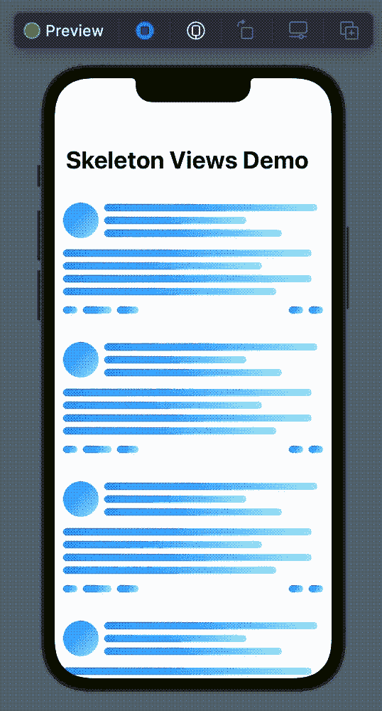

# SwiftUI 中的框架占位符视图

> 原文：<https://blog.devgenius.io/skeleton-placeholder-views-in-swiftui-c6ef78f1aca8?source=collection_archive---------5----------------------->

## 在 SwiftUI 中构建现代加载占位符视图

由[茱莉亚·沃克](https://www.pexels.com/it-it/@julia-volk?utm_content=attributionCopyText&utm_medium=referral&utm_source=pexels)在[派克斯](https://www.pexels.com/it-it/foto/vacanza-donna-creativo-scuro-6155894/?utm_content=attributionCopyText&utm_medium=referral&utm_source=pexels)拍摄

现代应用程序喜欢被动，允许用户完全控制导航和交互，所以最讨厌的事情之一是被一个丑陋的半透明黑色视图挡住，中间有一个加载微调器，等待几秒钟下载内容…

我们日常使用的几乎所有著名应用程序基本上都是由一个非常简单的用户界面构成的:一个无穷无尽的条目列表，不停地滚动…

想想像 Instagram、脸书、LinkedIn 这样的应用……它们都有相同的模式:你打开一个屏幕，你会看到一个行列表，所有的行或多或少都有相同的元素。

从线框蓝图中得知，在过去的某个地方，某个时间点，一个不知名的被照亮的 UX 设计师开始使用**占位符单元格**代替那些可怕的加载视图……用户期望在那里找到一些单元格，所以让我们在那里放一些类似的东西！占位视图诞生了。

放置一个占位符，就像用于文本字段的占位符一样，这是非常聪明的，但它仍然没有传达一种加载的感觉，所以另一位 UX 设计师在视图中添加了动画…你猜怎么着？**骷髅图**诞生了！

由于 SwiftUI ，构建一个现代骨架视图非常简单。只需几行代码和一点小技巧，我们就可以为我们的应用程序创建这个高级 UX 功能。

首先，让我用一小段视频向你们展示我们将要编码的内容:

如您所见，我已经创建了一个由占位符动画单元格组成的列表。

这个 UI 的代码非常简单，我敢说是最小的。当然，在你的 app 里，你会添加更多的条件。例如，只有当您从服务器获取数据时，才会显示骨架视图。

关于这个简单的结构没什么好说的，所以让我们传递到`SkeletonRow`。

*   第 3–4 行:渐变的起点和终点在这里定义。动画将使用移动渐变。我几乎每次都用对角线渐变来营造更大的运动感。
*   第 6 行:我为渐变选择了两种颜色，在资产目录中定义。那些颜色只是两种深浅不同的蓝色。
*   第 10 行:所有视图都封装在一个`VStack`中。请注意组成这个框架的三个视图，这里称之为 T1，但在后面的`struct`中定义为 T1。即使我对视图的实现一无所知，这种方法也能让我写出真正干净易读的代码。SwiftUI 代码很容易堵塞，所以需要格外小心。
*   第 15 行:动画是在这里创建的，视图一出现在屏幕上就开始动画。
*   第 16 行:这是避免大量动画和`NavigationViews`出现奇怪行为的一个小技巧。把一切都放在主线上，你就没有惊喜了！
*   第 18 行:渐变的起点在这里被改变。价值观由你决定。随心所欲的改变它们，找到你喜欢的或者对你的 app 有好处的就可以了。你甚至可以改变 endingPoint 的值，这就是为什么我在第 4 行使用了`@State var`。
*   第 24 行:渐变`View`在这里定义，在任何地方使用。这是第 17 行动画改变的视图。

其余的`var views`只是简单的视图。为了简单起见，我使用了硬编码的尺寸值…在一个真实的应用程序中，我强烈建议你使用`GeometryReader`来根据设备尺寸计算正确的帧。

如果你有兴趣了解更多，更多关于 SwiftUI 中的动画，我强烈建议你看看这本很棒的互动书籍:

 [## SwiftUI 动画大师(iOS 16)

### 从初学者到大师，了解本“视频”书如何使用最有效的方法来教授 SwiftUI 动画…

www.bigmountainstudio.com](https://www.bigmountainstudio.com/animations-16/jz1m0) 

仅此而已！我在这里展示的只是一个简单的实现，我相信有了这些基础知识，您可以创造出令人惊叹的东西！

我希望你喜欢这篇文章，如果你喜欢，请鼓掌。
如果这篇文章对你有用，请随意[给我一杯咖啡](https://www.buymeacoffee.com/dy59tqxn794)并允许我创造更多酷的内容和文章。

享受你的编码！