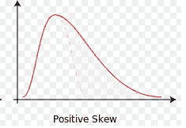
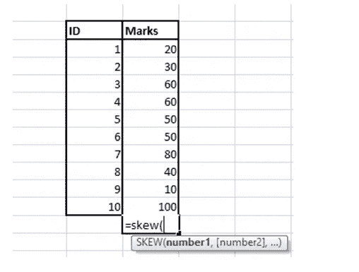
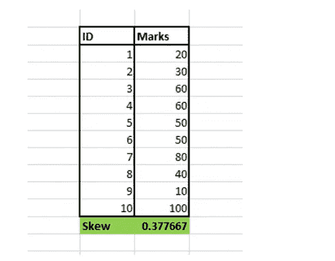
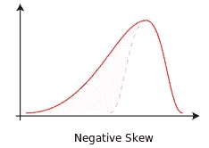
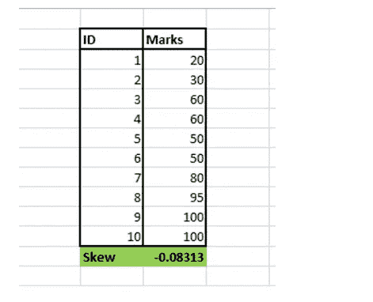
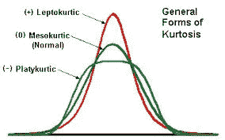

# 数据科学中的偏度和峰度

> 原文：<https://blog.devgenius.io/skewness-and-kurtosis-in-data-science-aa795ba4b453?source=collection_archive---------0----------------------->

## 你的数据有多接近正态分布？

在 [Unsplash](https://unsplash.com/s/photos/christmas-tree?utm_source=unsplash&utm_medium=referral&utm_content=creditCopyText) 上由 [Darya Tryfanava](https://unsplash.com/@darya_tryfanava?utm_source=unsplash&utm_medium=referral&utm_content=creditCopyText) 拍摄的照片

> **“现实偏于对称，略有时代错位”**
> 
> **豪尔赫·路易斯·博尔赫斯**

## 介绍

数据偏斜是数据科学家在实时案例研究中经常面临的重要挑战之一。除了某些业务场景之外，大多数实时实验都需要任何预定义数据分布中的数据，这在没有经历数据清理过程的情况下是非常罕见的。在本文中，我们将讨论违反对称数据分布背后的术语和直觉，以及如何使用不同的数学度量来评估它。

## 目录

1.  偏斜度的定义
2.  偏斜的类型(右偏斜和左偏斜)
3.  正态分布中的一些重要情况
4.  峭度
5.  峰度的类型
6.  当数据有偏差时应遵循的方法

## 定义

偏斜度是衡量数据分布对称与否的指标。

如果一个分布或数据集在中心的左右两个点看起来相同，则称之为对称的。

## 偏斜的类型

偏斜度通常分为两大类

**右偏或正偏**

**左偏或负偏**

## 右偏斜度

右偏分布在数轴上有一个右向的长尾，这样所有数据点的总内在价值的平均值最终会上升。

举个例子，

考虑下面的场景，包括学生在测试中得分不同的频率(满分为 100)。X 轴显示学生的分数，Y 轴显示在测试中获得特定分数的学生人数(频率)。

右偏分布的例子。图片取自维基百科— [网址](https://en.wikipedia.org/wiki/File:Negative_and_positive_skew_diagrams_(English).svg)

我们可以看到这里的数据不是正态分布的。虽然大多数学生的分数在 0-50 之间，但只有极少数高分者的分数在 80-100 左右，从而提高了总分布的平均值。

> 这给出了一个总的想法，虽然考试非常艰难，但有极少数成绩非常好的学生，他们可以被认为是异常值，因为他们能够在考试的总体趋势下取得好成绩，这对大多数学生来说是困难的。

因为这里的尾部更长，并且向分布的右侧变平；它通常被称为右偏分布。

在 MS Excel 中，通过一个名为“偏斜”的度量标准来计算偏斜的类型是非常容易的。

用 MS Excel 举例说明

用 MS Excel 举例说明

对于正确的偏斜度，这个度量将总是产生一个正数作为输出。

## 左偏斜度

左偏分布在数字线上的左方向将具有长尾，使得所有数据点的总内在值的平均值将最终下降。

左偏分布的例子。图片取自维基百科— [网址](https://en.wikipedia.org/wiki/File:Negative_and_positive_skew_diagrams_(English).svg)

对于为右偏分布解释的同一个例子，我们可以稍微改变这个场景来演示左偏分布。在这里，我们可以看到大多数学生都是高分者，他们的分数都在 60 分以上，只有极少数学生的分数很低。

> 这给出了一个总的想法，尽管测试非常容易，但有极少数成绩很差的学生可以被认为是异常值，因为他们不能在测试的总趋势下取得好成绩，这对大多数学生来说并不困难。

用 MS Excel 举例说明

与右偏斜分布相反，这里偏斜度将为负。这是因为分布的尾部沿着分布的左侧变平，所以它被称为左偏分布。

## 正态分布中的一些重要场景-

*   **对于右偏分布，**

**均值> =中值> =众数**

> 在这里，均值将被高估，因为尾部在右侧变得越来越平越来越长(均值向高值延伸主要是由数字线右侧的异常值引起的)。
> 
> 由于分布左侧的大数据频率，该模式将较低。

*   **对于左偏态分布**

**众数> =中值>=平均值**

> 这里，均值将被低估，因为尾部在左侧变得更平更长(均值向低值的延伸主要是由数字线左侧的异常值引起的)。
> 
> 由于分布右侧的大数据频率，该模式将更高。

*   **对于完美的正态分布，偏斜度为零。**

> 这里，均值将等于中值和众数。
> 
> 这意味着**均值=中值=众数**。

虽然这种情况使计算变得更容易，但在现实世界中，数据很少会完全呈正态分布。

## 峭度

峰度是平的或有峰的特征。它是对数据在正态分布中是重尾还是轻尾的一种度量

峰度百分位数系数

**Ku=Q / (P90 — P10)**

在哪里，

**Q=四分位偏差**

**P90=第 90 百分位**

**P10=第 10 百分位**

较大的峰度值通常意味着分布的尾部比正态分布的尾部更接近极值。这可能导致距离平均值 6 或 7 个标准偏差的长度。类似地，如果峰度值非常低，分布的尾部将比正态分布的尾部更短(小于 3 个标准差)。

较大的峰度值通常被认为风险较大，因为如果应用于任何机器学习算法，数据可能倾向于给出异常值，作为与均值距离较大的结果。

## 峰度的类型

就统计学而言，峰度有三种类型-

**中 kurtic**

**轻音 kurtic**

**鸭嘴兽**

## 常态峰的

这种分布的尾部通常类似于正态分布。

## 频率分配曲线的尖顶峰度

这种分布会有很长很细的尾巴。这意味着有更多的机会出现异常值。

## 低峰态的

这种分布将非常低，并围绕中心尾部伸展，这意味着大多数数据点都非常接近平均值。

下图将提供更好的理解

峰度的类型。(图片提供— [网址](https://mvpprograms.com/help/images/KurtosisPict.jpg))

**数据偏斜时该怎么办？**

解释和分析有偏差的数据是非常困难的。同样，正态分布(对称)或接近对称的数据点集合更易于计算，也更有可能产生更好的推论。因此，对于数据科学家来说，减少偏斜成为数据清理过程中的一个重要部分。

我们可以对数据进行一些变换，这样数据的信息将被保存，同时数据将被绘制成一条对称曲线。虽然这种转换是根据数据的特征决定的，但下面是一些数据转换过程。

取每个数据点的**平方根**并重新绘制。

取每个数据点的**立方根**，重新绘制。

取每个数据点的**对数**重新作图。

取每个数据点的**倒数**并重新绘制。

## 结论

大多数参数统计检验期望数据处于特定的分布，以进行假设创建和检验。此外，正态分布的重要性不需要特别提及其在数据科学和统计学中的重要性。对于任何愿意学习统计学基础知识的初学者来说，对数据分布及其对称性和重要性的数学表示的深入理解是必不可少的。

我相信你至少对偏度和峰度原理背后的数学原理有了直观的理解。

您可以通过以下平台与我联系-

1.  [Quora](https://www.quora.com/profile/Sanjay-Kumar-563?q=sanjay%20kumar)
2.  [领英](https://www.linkedin.com/in/sanjay-nandakumar-8278229b/)
3.  Gmail—sanjayjsw05@gmail.com

## 参考

1.  Arnold，B. C .和 Groeneveld，R. A .，“ [**测量关于模式**](https://www.jstor.org/stable/2684808) 的偏斜度”，《美国统计学家》，49，34–38 页。(1995)
2.  Balanda，K. P .和 MacGillivray，h . l .,“[**峰度:一个批判性评论”，《美国统计学家**](https://www.jstor.org/stable/2684482?seq=1) ，42，111–119(1988 年)

**感谢阅读！！！**