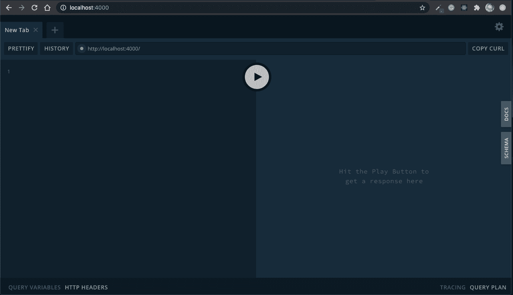

# 带有 React |语义 UI | GraphQL | PostgresSQL 的松弛克隆(第 2 部分)

> 原文：<https://blog.devgenius.io/slack-clone-with-react-semantic-ui-graphql-postgressql-part-2-a392fefd1603?source=collection_archive---------4----------------------->


Volodymyr Hryshchenko 在 [Unsplash](https://unsplash.com?utm_source=medium&utm_medium=referral) 上拍摄的照片

之前，我们复习了 PostgreSQL 的介绍和安装。你可以在这里找到那篇文章

今天，我们将快速设置我们的 Graphql 服务器。

# 文件夹设置

让我们从在一个你方便的地方创建一个文件夹开始。我把我的文件夹叫做聊天室。完成后，在文本编辑器中打开这个项目(我的是 VScode)。

# 初始化项目

在您的终端(项目文件夹内)中运行此命令，启动您的项目。

```
npm init -y
```

一旦你看到文件夹中的`package.json`文件，我们就可以开始了。接下来，我们需要安装我们将在后端使用的包。

# 安装软件包

在您的终端中运行此命令(在项目文件夹中)

**依赖关系:**

```
npm i apollo server graphql pg pg-hstore sequelize bcrypt
```

在一行中这样做将为您安装所有这些软件。

**依赖关系:**

```
npm i --save--dev nodemon sequelize-cli
```

现在，您可能想知道这些包到底是做什么的？好问题。

# 包装说明

*   **apollo server** 在我们的后端设置一个 Graphql 服务器。
*   graphql 允许我们设置查询和变异，并在应用程序中定义端点。
*   **pg** 和 **pg-hstore** 处理我们的 PostgreSQL。pg-hstore 将我们的 JSON 数据转换成 hstore 格式。(后台工作)。
*   sequelize 是我们将用来创建模型的 ORM。它用来把我们的模型变成数据库的表格。
*   nodemon 允许我们保持服务器一直运行
*   sequelize-cli 是一个命令行界面，我们将使用它来轻松地生成模型和其他东西。

本文中我们要做的最后一件事是设置 apollo 服务器。

# Apollo 服务器设置

在您的`package.json`文件中，确保将您的主入口点设置为`server.js`,如下所示

```
"main" : "server.js"
```

现在，在根项目文件夹中创建`server.js`文件。

在顶部，将这些文件导入`server.js`。

```
const { ApolloServer } = require("apollo-server");
const typeDefs = require("./graphql/typeDefs");
const resolvers = require("./graphql/resolvers");
```

我们包括了 apollo 服务器，这样我们就可以启动并运行服务器，我们需要创建另外两个文件。

`typeDefs`和`resolvers`是我们需要传递到 apollo 服务器的文件，以使我们的 Graphql 工作。

这些文件很重要，`typeDefs`将会有定义我们的端点应该是什么样子的代码。根据我们在`typeDefs`中定义的方式，`resolvers`将拥有返回这些端点数据的代码。(简而言之)

让我们创建这些文件。他们现在将是简单的，只是让我们开始。

在根项目文件夹中，创建一个`graphql`文件夹。在这个文件夹中创建一个`typeDefs.js`文件和一个`resolvers.js`文件。

在`typeDefs.js`内部创建这个`const { gql } = require("apollo-server");`

`module.exports = gql`
type Query {
sayHi: String
}
`;`

我们需要将我们的类型定义包装在一个`gql`模板中，然后导出这些类型，这样我们就可以在我们的 Graphql 服务器中访问这些端点。

稍后我们将深入探讨它们是如何工作的，这样我们就可以在我们的 apollo 服务器中导入一些东西。接下来让我们做解析器。

```
module.exports = {
  Query: {
    sayHi: () => "HI!!!"
  }
};
```

这个`sayHi`查询具有我们在类型中定义的确切名称。这是因为它们是相同的(稍后再深入探讨)。

让我们回到我们的`server.js`文件，传入那些`typeDefs`和`resolvers`文件，同时启动我们的 apollo 服务器。

```
const server = new ApolloServer({
  typeDefs,
  resolvers
});server
  .listen(4000, () => {
    console.log(`🚀 Server ready at port 4000`);
  })
  .catch(err => console.log(err, "err running server"));
```

我们初始化我们的服务器，传入我们的类型和解析器，最后在`localhost:4000`启动我们的服务器

在我们对此进行测试之前，我们需要运行一个脚本来用`nodemon`启动它。转到`package.json`，在你的脚本中，创建一个这样的

```
"dev": "nodemon server.js"
```

要启动它，请运行

```
npm run dev
```

如果一切顺利，您应该看到您的 Graphql 服务器像这样运行。



总的来说，你的`package.json`和`server.js`最后应该是这个样子。

package.json

```
{
  "name": "chatroom",
  "version": "1.0.0",
  "description": "",
  "main": "server.js",
  "scripts": {
    "dev": "nodemon server.js"
  },
  "keywords": [],
  "author": "",
  "license": "ISC",
  "dependencies": {
    "apollo-server": "^2.16.1",
    "bcrypt": "^5.0.0",
    "graphql": "^15.3.0",
    "pg": "^8.3.3",
    "pg-hstore": "^2.3.3",
    "sequelize": "^6.3.4",
  },
  "devDependencies": {
    "nodemon": "^2.0.4",
    "sequelize-cli": "^6.2.0"
  }
}
```

server.js

```
const { ApolloServer } = require("apollo-server");
const typeDefs = require("./graphql/typeDefs");
const resolvers = require("./graphql/resolvers");const server = new ApolloServer({
  typeDefs,
  resolvers
});server.listen(4000, () => {
  console.log(`🚀 Server ready at port 4000`);
});
```

这就是这一个人的全部。接下来，我们将开始让我们的数据库连接到我们的项目。直到那时😄

附注:如果你无法启动 Graphql 服务器，请随时告诉我，我很乐意帮忙😄 👍