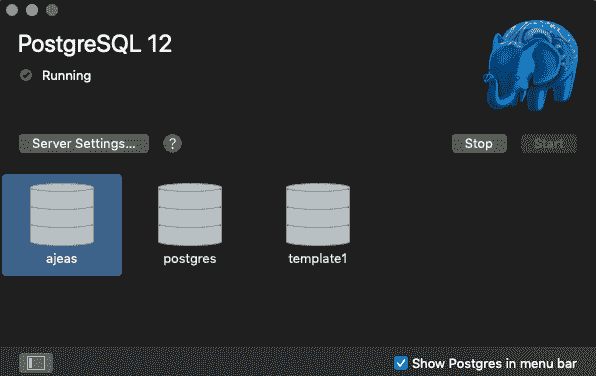
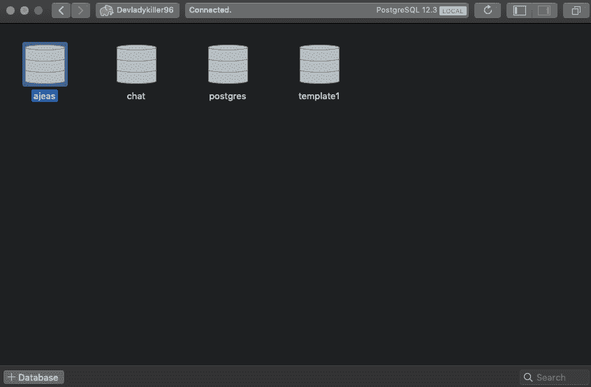
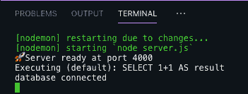
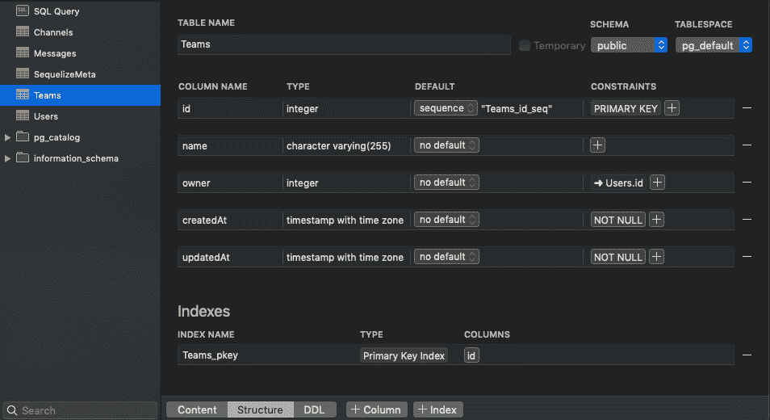
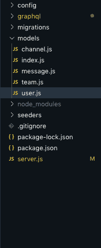

# 带有 React |语义 UI | GraphQL | PostgresSQL 的 Slack 克隆(第 3 部分)

> 原文：<https://blog.devgenius.io/slack-clone-with-react-semantic-ui-graphql-postgressql-part-3-f42515446c80?source=collection_archive---------11----------------------->

## 之前，我们设置了我们的 Graphql 服务器。你可以在这里找到那篇文章。


Volodymyr Hryshchenko 在 [Unsplash](https://unsplash.com?utm_source=medium&utm_medium=referral) 上拍摄的照片

今天，我们将着手启动我们的数据库。

我建议看我上一篇文章的安装视频，看看如何启动 Postgres 服务器。然后，我将通过一个名为 Postico 的 GUI 应用程序创建数据库，而不是通过命令行。然而，这只是我的一个偏好。您可以继续观看视频来学习命令行方式。

# 启动服务器并创建数据库

仅供参考:在与数据库交互时，一定要运行 Postgres 服务器。默认情况下，这些是他们给你的数据库。



# 使用 Postico 与数据库交互

当您第一次开始时，它会要求您连接到您试图使用的数据库/服务器。只需按照这些指示，连接到你在 Postgres 上运行的同一个服务器。完成后，创建一个名为 Chat 的数据库。我点击了下面的“+数据库”按钮来创建一个新的。



当它在顶部显示“已连接”时，那是您连接到的数据库。

# 在项目中配置我们的数据库。

既然我们已经设置了数据库，现在是时候在项目中配置所有这些了。在根项目文件夹的终端中，运行命令

```
npx sequelize init
```

该命令将创建一个 config 文件夹，其中有一个`config.json`文件，该文件包含一些默认的数据库连接信息，您需要更改这些信息，以便与您之前创建的数据库相匹配。它应该看起来像这样

```
/** config/config.js */
{
  "development": {
    "username": "ajeas",
    "password": "",
    "database": "chat",
    "host": "127.0.0.1",
    "dialect": "postgres"
  },
  "test": {
    "username": "root",
    "password": null,
    "database": "database_test",
    "host": "127.0.0.1",
    "dialect": "postgres"
  },
  "production": {
    "username": "root",
    "password": null,
    "database": "database_production",
    "host": "127.0.0.1",
    "dialect": "postgres"
  }
}
```

“用户名”将是你的名字，默认密码是一个空字符串，“数据库”将是聊天，并确保使“方言”Postgres(告诉我们使用哪个数据库，如果你想，你可以放一个不同的，如 MySQL。但是，我们现在使用 Postgres)忽略测试和生产。

# 使用序列创建模型(表)

配置完数据库信息后，就该通过命令行创建我们的第一个模型了。运行这段代码来生成一个用户模型(代表一个注册用户)。

```
npx sequelize model:generate --name User --attributes username:string,email:string,password:string
```

这将用我们需要指定数据类型的`username`、`email`和`password`字段(列)创建我们的用户模型(表)，这就是为什么我们在最后添加了`:string`。你的模型应该是这样的

```
const { Model } = require("sequelize");
module.exports = (sequelize, DataTypes) => {
  class User extends Model {
    /**
     * Helper method for defining associations.
     * This method is not a part of Sequelize lifecycle.
     * The `models/index` file will call this method automatically.
     */
    static associate() {
      // define association here }
  }
  User.init(
    {
      username: DataTypes.STRING,
      email: DataTypes.STRING,
      password: DataTypes.STRING
    },
    {
      sequelize,
      modelName: "User"
    }
  );
  return User;
};
```

它还将创建一个迁移文件夹和一个代表我们在数据库中的表结构的`xxxxxxxx-create-user.js`文件。每次创建模型时，都会在 migrations 文件夹中附加一个迁移文件。(还创建了一个我们在本系列中不会用到的 seeder 文件夹，所以现在可以忽略它。)

在我们进入其他部分之前，让我们在启动服务器时连接到数据库。添加这是`server.js`文件

```
/** add this */
const { sequelize } = require("./models");server.listen(4000, () => {
  console.log(`🚀 Server ready at port 4000`);
  // Connecting to Database/** add this */
  sequelize
    .authenticate()
    .then(() => {
      console.log("database connected");
    })
    .catch(err => console.log(err));
});
```

它使用序列和我们的`config.js`文件连接到我们的数据库。重启服务器(`npm run dev`)，现在你应该在终端中看到这个



现在，让我们创建我们需要的其他模型。运行与之前相同的命令，创建一个`Team`、`Channel`、`Message`模型

仅供参考:这些命令将在模型文件夹中为您创建文件

```
npx sequelize model:generate --name Team --attributes name:stringnpx sequelize model:generate --name Channel --attributes name:string,public:booleannpx sequelize model:generate --name Message --attributes text:string
```

您的所有模型应该看起来与用户模型图像相似。在将模型迁移到数据库之前。我们需要在他们之间建立关系。

# 模型关系(关联)

我们将使用`belongsToMany`和`belongsTo`关系，我们必须在每个模型文件中手动完成。

“一个**用户**可以属于 slack 中的许多团队”，这将使他们通过一个名为`member`(我们将在后面创建)的不同表链接在一起，该表向`member`表添加了一个外键。(仅供参考，我对关系数据库和关系还是新手。所以我用我能理解的最好的方式来解释:)。

```
/** User model */
static associate({ Team }) {
  // define association here
  this.belongsToMany(Team, {
     through: "member",
     foreignKey: "userId"
  });
}
```

“一个**团队**可以属于许多用户，它属于一个特定的用户”，用不同的外键链接到同一个`member`表。`belongsTo`没有创建另一个表，它只是向`team`添加了一个外键。外键`owner`将是拥有团队的用户(模型)的“id”。

```
/** Team model */
static associate({ User }) {
   // define association here
   this.belongsToMany(User, { through: "member", foreignKey:       "teamId"});
   this.belongsTo(User, { foreignKey: "owner" });
}
```

“一个**消息**属于一个频道，它属于一个用户”，给消息添加两个外键。外键`channelId`将是消息所属通道的“id ”,外键`userId`将是创建该消息的用户(模型)的“id”。

```
/** Message model */
static associate({ Channel, User }) {
   // define association here
   this.belongsTo(Channel, { foreignKey: "channelId" });
   this.belongsTo(User, { foreignKey: "userId" });
}
```

最后，我们的渠道模型。“一个渠道属于一个团队”，因为没有团队我们无法创建渠道`teamId`外键是该渠道所属团队(模型)的“id”。

```
/** Channel model */
static associate({ Team }) {
   // define association here
   this.belongsTo(Team, { foreignKey: "teamId" });
}
```

现在，让我们将它迁移到数据库中，这样它将具有相同的结构。运行此命令进行迁移。

```
npx sequelize db:migrate
```

如果一切顺利，您应该会在终端上看到一条类似于`xxxxxxxxxxx-create-user.js migrated`的消息以及其他迁移文件。

确保连接到您的聊天数据库，check-in Postico，您现在应该可以看到添加了所有外键的所有表。



到目前为止，您的文件夹结构应该是这样的



这是所有这一个乡亲，请随时让我知道，如果你在这个过程中有任何问题，这是一个很大的工作量，所以我很乐意帮助如果你卡住了。干杯！