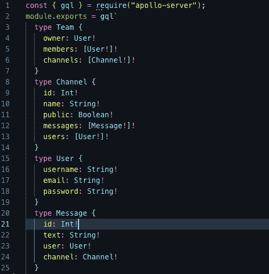
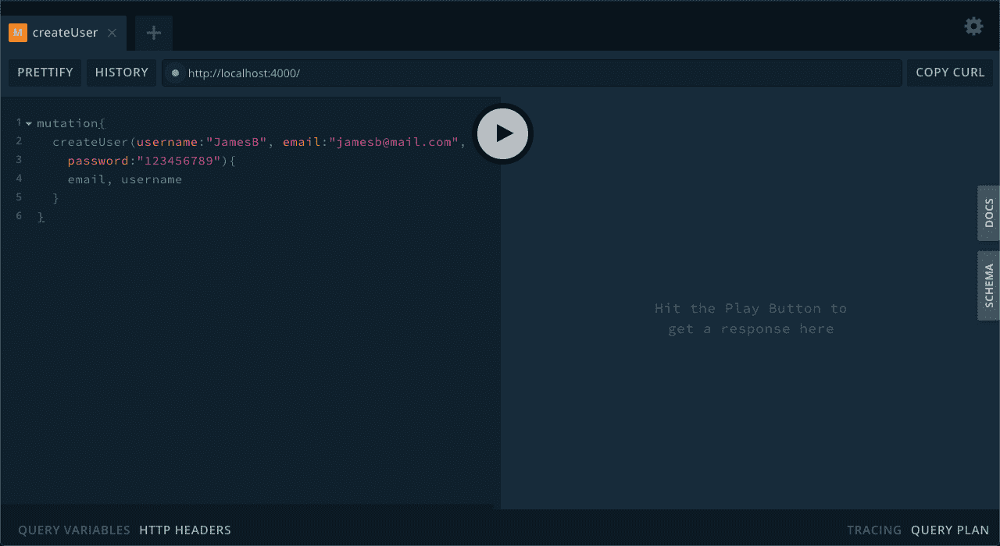
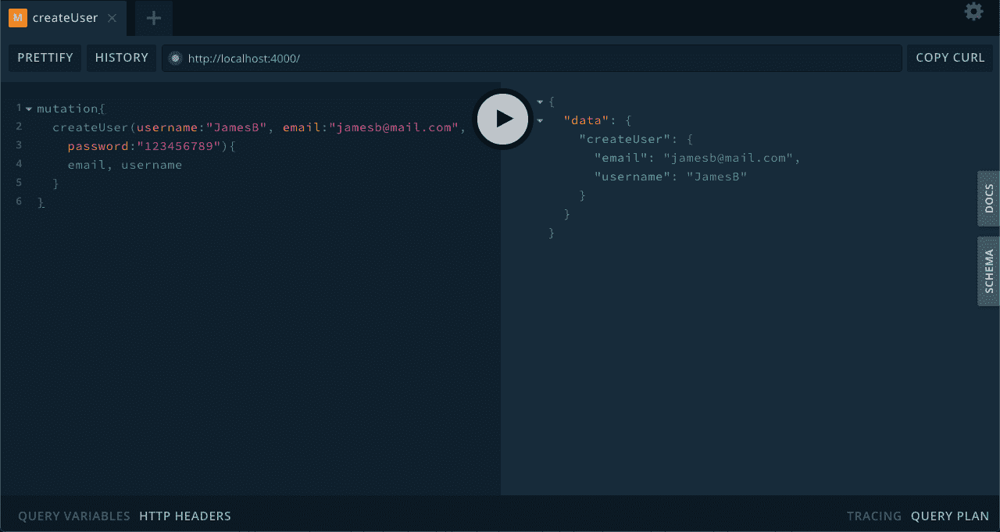
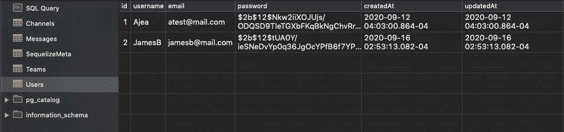
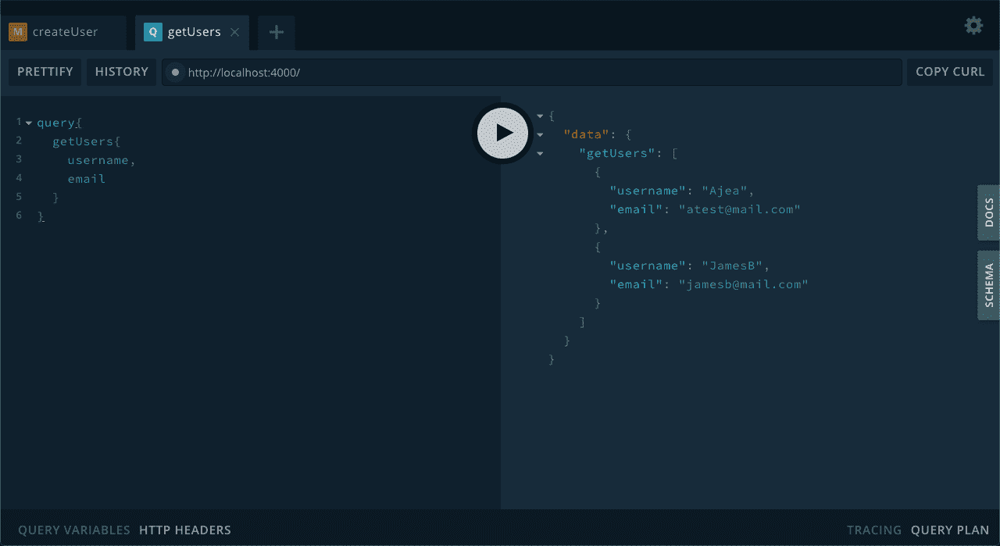
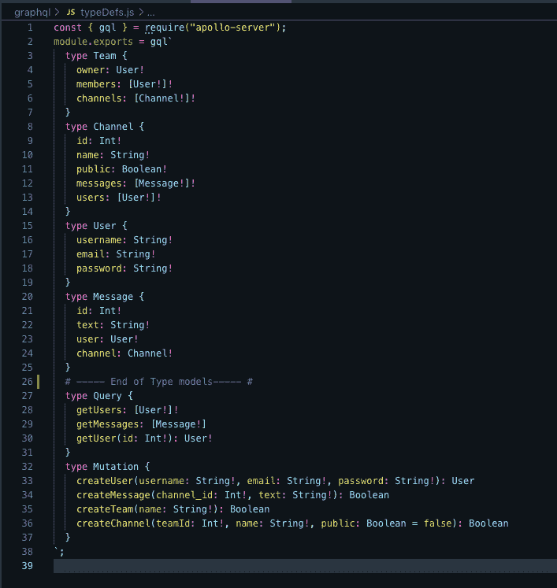
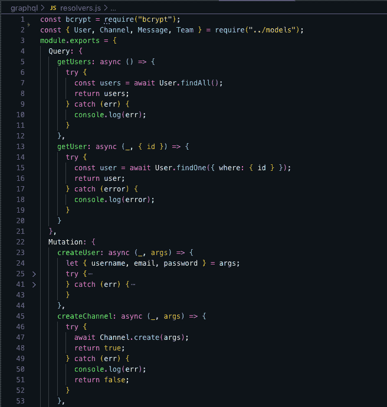
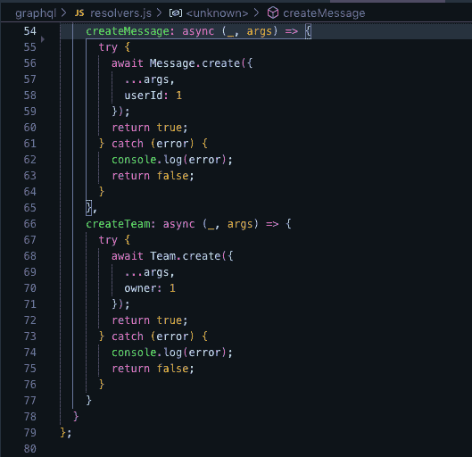

# 带有 React |语义 UI | GraphQL | PostgresSQL 的松弛克隆(第 5 部分)

> 原文：<https://blog.devgenius.io/slack-clone-with-react-semantic-ui-graphql-postgressql-part-5-1ef5ccb967c1?source=collection_archive---------6----------------------->

## 之前，我们讨论了 GraphQL 的工作原理。你可以在这里找到那篇文章。


沃洛季米尔·赫里先科在 [Unsplash](https://unsplash.com?utm_source=medium&utm_medium=referral) 上拍摄的照片

今天，我们将开始创建我们的 Graphql 查询和变异。

打开`typesDefs.js`文件。我们需要做的第一件事是规划出我们的数据将会是什么。我们知道我们需要一个`User`对象来表示我们项目中的一个用户，所以让我们从这里开始。

# 类型

删除我们的`typeDefs.js`文件中之前的代码，并替换为 this = >

```
const { gql } = require("apollo-server");
module.exports = gql`
  type User {
    username: String!
    email: String!
    password: String!
  }
`
```

接下来，当用户需要创建团队时，我们需要创建一个`Team`对象

```
const { gql } = require("apollo-server");
module.exports = gql`
  type Team {
    owner: User!
    members: [User!]!
    channels: [Channel!]!
  }
`
```

我们需要`Channels`的加入

```
const { gql } = require("apollo-server");
module.exports = gql`
  type Channel {
    id: Int!
    name: String!
    public: Boolean!
    messages: [Message!]!
    users: [User!]!
  }
`
```

最后，我们需要能够发送和接收`Messages` = >

```
const { gql } = require("apollo-server");
module.exports = gql`
  type Message {
    id: Int!
    text: String!
    user: User!
    channel: Channel!
  }
`
```

让我们仔细看看这些类型。

*   创造它的团队？(业主道具)，队伍里有谁？(members prop)，和这个团队有什么渠道关联？(频道道具)。
*   我们需要知道一个用户，哪个用户正在创建团队和渠道(电子邮件，用户名，密码道具)。
*   一个频道是哪个频道(id 道具)，频道叫什么名字？(名道具)，会是公的还是私的？(公共道具)，有哪些消息(消息道具)，并列出该频道的用户(用户道具)。
*   一条信息哪条信息？(id 道具)，消息说什么？(文本属性)，哪个用户发送了该消息(用户属性)，最后该消息属于哪个频道(频道属性)

最后你的`typeDefs.js`应该是这样的= >



现在，让我们定义我们的查询(获取端点)和突变(POST、PUT、DELETE 端点)

不过，在`typeDefs.js`文件中，让我们添加我们的查询

```
type Query {
    getUsers: [User!]!
    getMessages: [Message!]
    getUser(id: Int!): User!
  }
```

这些是我目前掌握的情况。突变看起来像= >

```
type Mutation {
    createUser(username: String!, email: String!, password: String!): User
    createMessage(channel_id: Int!, text: String!): Boolean
    createTeam(name: String!): Boolean
    createChannel(teamId: Int!, name: String!, public: Boolean = false): Boolean
  }
```

仅供参考，我们只需要传递我们需要使用的参数。正如你所看到的，我们所有的突变都涉及到为现在创造一些东西。

我们现在只是定义它，让我们用解析器返回一些真实的数据，从使用`createUser`变异创建一个用户开始。

# 下决心者

转到`resolvers.js`文件并创建一个`createUser`变异*记住，命名很重要，它需要与您定义的类型查询的名称相同*

```
const bcrypt = require("bcrypt");
const { User } = require("../models");
module.exports = {
  Mutation: {
      createUser: async (_, args) => {
        let { username, email, password } = args;
        try {
        // 1\. Check if user exist in DB
        const getUser = await User.findOne({ where: { email: email } });
        if (!getUser) {
          // 2\. Hash user password
          password = await bcrypt.hash(password, 12);
          // 3\. store user in DB
          const user = await User.create({
            username,
            email,
            password
          });
          return user;
        } else {
          throw Error("User already exist");
        }
      } catch (err) {
        return err;
      }
    }
};
```

我们正在做的是用通过 args(析构数据)传递给我们的数据创建一个用户。我们使用 Sequelize 中的用户模型在数据库中创建一个用户。我希望剩下的评论能帮助你理解发生了什么。

让我们在操场上测试这个端点。让您的服务器运行并转到 localhost:4000。

调用`createUser`突变应该是这样的= >



您可以指定类型，查询或变异。然后你选择终点。如果成功，它应该返回一个用户并在数据库中创建一个用户= >



现在检查数据库。



仅供参考，忽略第一个用户，这是我之前做的测试。但是你可以看到 JamesB 是用散列密码创建的，这很棒。

让我们创造其余的突变。创建团队、渠道和信息。

```
const bcrypt = require("bcrypt");
const { Channel, Message, Team } = require("../models");
module.exports = {
  Mutation: {
    createChannel: async (_, args) => {
      try {
        await Channel.create(args);
        return true;
      } catch (err) {
        console.log(err);
        return false;
      }
    },
    createMessage: async (_, args) => {
      // const channel = Channel.findOne({where: {id: args.channel_ids}})
      try {
        await Message.create({
          ...args,
          userId: 1
        });
        return true;
      } catch (error) {
        console.log(error);
        return false;
      }
    },
    createTeam: async (_, args) => {
      try {
        await Team.create({
          ...args,
          owner: 1
        });
        return true;
      } catch (error) {
        console.log(error);
        return false;
      }
    }
  }
};
```

现在我们的查询= >

```
const bcrypt = require("bcrypt");
const { User } = require("../models");
module.exports = {
  Query: {
    getUsers: async () => {
      try {
        const users = await User.findAll();
        return users;
      } catch (err) {
        console.log(err);
      }
    },
    getUser: async (_, { id }) => {
      try {
        const user = await User.findOne({ where: { id } });
        return user;
      } catch (error) {
        console.log(error);
      }
    }
  },
}
```

现在我们有了用户，让我们使用我们的`getUsers`查询来获取用户。



它返回的正是我们所说的，太好了。简而言之，这些是我们将从前端调用的端点。

总的来说，你的`typeDefs.js`文件应该看起来像这样= >



和`resolvers.js`文件



这就是这一个，希望这不是太令人震惊。在这个系列文章达到我目前在这个项目中的位置之前，我还有几篇文章要写。所以在那之前，如果你有任何问题或者我错过了什么，请告诉我:)