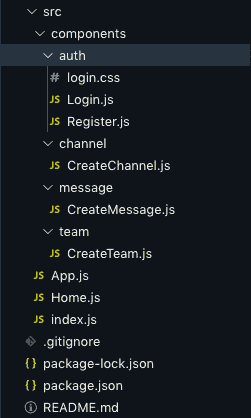

# 带有 React |语义 UI | GraphQL | PostgresSQL 的 Slack 克隆(第 6 部分)

> 原文：<https://blog.devgenius.io/slack-clone-with-react-semantic-ui-graphql-postgressql-part-6-90324ebd76f2?source=collection_archive---------8----------------------->

## 之前，我们创建了 Graphql 查询和变异。你可以在这里找到那篇文章


沃洛季米尔·赫里先科在 [Unsplash](https://unsplash.com?utm_source=medium&utm_medium=referral) 上拍摄的照片

今天，我们将从后端退一步，用 Apollo 客户端来设置我们的前端。

# 创建 React 项目

为了简单起见，我将为我的前端准备一个不同的文件夹。

```
cd desktop
mkdir chatroom_front
cd chatroom_front
```

在 chatroom_front 文件夹中创建一个 react 项目，不要给它命名。

```
npx create-react-app .
```

当然，这需要一些时间:)

# 项目清理

删除所有的`test`文件。因此，任何带有`.test.js`扩展名的文件都可以删除。还要去掉，`logo.svg`，`serviceWorkers.js`和`setupTests.js`

# 安装软件包

首先，让我们安装我们需要的所有包。

```
npm i @apollo/client graphql react-hook-form semantic-ui-css semantic-ui-react react-router-dom
```

*   [**@ apollo**](https://hashnode.com/@apollo)**/client**用于连接/通信到后端的 Apollo 服务器
*   **graphql** 使我们能够在 frontend-react-hook-form 验证包中使用钩子为我们的表单调用查询和变异(个人偏好，不是必需的)
*   **semantic-ui-css** 和 **semantic-ui-react** 用于我们的 ui。
*   **react-router-dom** 用于在我们的应用中进行路由。

# 设置 Apollo 客户端

让我们准备好阿波罗。在`src` > `index.js`里面加上这个

```
import { ApolloClient, InMemoryCache, ApolloProvider } from "@apollo/client";const client = new ApolloClient({
  uri: "http://localhost:4000/graphql",
  cache: new InMemoryCache()
});ReactDOM.render(
  <ApolloProvider client={client}>
    <App />
  </ApolloProvider>,
  document.getElementById("root")
);
```

我们正在导入`ApolloClient`，它建立了我们与后端 apollo 服务器的连接，我们需要将`uri`传递给我们想要连接的后端 apollo 服务器。`ApolloProvider`是让我们的应用程序访问所有东西的包装器，然后我们传入`client`。

现在，让我们也在这个文件中添加语义 CSS 样式。

```
import "semantic-ui-css/semantic.min.css";
```

所以，最后，你的`index.js`文件现在应该是这样的= >

```
import React from "react";
import ReactDOM from "react-dom";
import "semantic-ui-css/semantic.min.css";
import App from "./App";
import { ApolloClient, InMemoryCache, ApolloProvider } from "@apollo/client";const client = new ApolloClient({
  uri: "http://localhost:4000/graphql",
  cache: new InMemoryCache()
});ReactDOM.render(
  <ApolloProvider client={client}>
    <App />
  </ApolloProvider>,
  document.getElementById("root")
);
```

# 迄今为止的项目结构

目前，我有一个简单的设置。我有我们需要的所有表单组件。

在`src`目录中，创建一个`Home.js`组件。

```
import React from "react";const Home = () => {
  return <div>Auth or Slack</div>;
};export default Home;
```

如果没有登录，这个组件将呈现验证页面(将在一分钟内创建),如果我们登录，它将呈现 Slack 组件。

在`src`目录下创建一个组件文件夹。在`src` > `components`里面，添加以下这些文件夹= >

```
src > components > auth
src > components > channel
src > components > message
src > components > team
```

现在，这些文件夹将有表单组件。

*   src > components > auth > Login.js 和 Register.js 和 login.css
*   src >组件>通道>创建通道. js
*   src >组件>消息> CreateMessage.js
*   src >组件>团队> CreateTeam.js

在`src` > `App.js`文件中，让我们为这些组件添加路线。

```
import React from "react";
import { BrowserRouter as Router, Switch, Route } from "react-router-dom";
import Login from "./components/auth/Login";
import Register from "./components/auth/Register";
import CreateTeam from "./components/team/CreateTeam";
import Channel from "./components/channel/CreateChannel";
import Home from "./Home";

function App() {
  return (
    <div className="App">
      <Router>
        <Switch>
          <Route exact path="/" component={Home} />
          <Route path="/login" component={Login} />
          <Route path="/register" component={Register} />
          <Route path="/create-team" component={CreateTeam} />
           <Route path="/create-message" component={CreateMessage} />
          <Route path="/create-channel" component={CreateChannel} />
        </Switch>
      </Router>
    </div>
  );
}
export default App;
```

这里没有什么特别的，只是一些基本的路由设置。最后，我们的文件应该是这样的= >

src >组件>验证>登录. js

```
import React from "react";

const Login = () => {
  return <div>login</div>;
};
export default Login;
```

src >组件> auth > Register.js

```
import React from "react";

const Register = () => {
  return <div>register</div>;
};
export default Register;
```

src >组件>通道>创建通道. js

```
import React from 'react'

const CreateChannel = () => {
    return (
        <div>
            create channel
        </div>
    )
}
export default CreateChannel;
```

src >组件>消息> CreateMessage.js

```
import React from "react";

const CreateMessage = () => {
  return <div>im the create message component</div>;
};

export default CreateMessage;
```

src >组件>团队> CreateTeam.js

```
import React from 'react'

const CreateTeam = () => {
    return (
        <div>
            create team 
        </div>
    )
}

export default CreateTeam
```

最后，你的文件夹结构应该是这样的。



这就是这一个人的全部。在下一篇文章中，我们将使用语义和 react-hook-form 来完成`login`和`register` UI。敬请期待！😃

仅供参考`login.css`文件是空的，所以不用担心👍