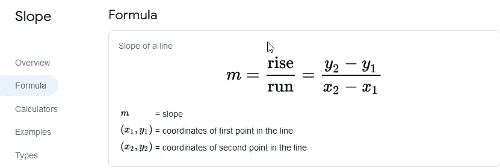

# 斜率公式和斜率点公式

> 原文：<https://blog.devgenius.io/slope-formula-and-slop-point-formula-16f2496dbb86?source=collection_archive---------3----------------------->

## 带 Cinemachine 推车的移动电梯

为了使我的电梯适用于基于真实世界建筑的电梯，各楼层间隔均匀，我可以为每个楼层添加停靠点。我只需要第一个航点和最后一个航点在正确的地方。然后，我可以使用斜率和点斜率公式来获得地板在路径上的位置。

我必须确定我需要什么信息，以及如何将它可视化。我将使用 2D 图来形象化这一点。在这种情况下，Y 将是位置单位，我有 2 个必须转换的单位，归一化(0–1)和距离(0-距离的长度， *17.99999* )。

x 将会是你想要的楼层数。为了正确工作，点的数量需要与楼层的数量相同或更多，并且楼层应该均匀分布，路点不需要均匀分布。

给定以下信息，我需要求解 y，因为这是我需要设置为期望位置的数字。

# 倾斜

为了使用点斜率，首先我需要得到斜率。这将根据我要使用的元素数量而变化。我的例子中唯一的常数是 0–1。

把我的值放进公式里，我就能在两种情况下解出 M。

注意，不管 y1 和 x1 都是 0，我可以把它简化为 y 最大值除以 x 最大值。

# 点斜率

把我的值放入公式中，我现在可以求解这两种情况下的 y。

请注意，无论 y1 和 x1 是 0，我都可以将其简化为 y = m *航路点索引。

# 完成移动到地板方法

现在我需要做的就是使用斜率点来得到我想要的位置。对于 Y 最大值，我使用路径的最大值，使用选定的位置单位，对于 X 最大值，我使用路径的最大位置。对于最小值，我使用各自的最小值。

使用距离，归一化的工作原理是一样的。

这与路点的位置不一致。0°处的路点和最后一个路点是需要在正确位置经过的路点。

将第一个和最后一个路径点用在错误的位置。

## 使用仅具有起点和终点位置以及沿途多层的位置。

要有一个起点和一个终点，并且多个楼层间隔相等，我需要做的就是将 xMin 改为 1，将 xMax 改为楼层数。

在 unity 使用 3 层楼进行测试。

## 不同位置的多个楼层。

要添加多个楼层并停在它们的透视点，我需要将楼层号转换到与该楼层号对应的位置。传入的楼层号应对应一个航路点号，航路点从 0 开始，是路径单位。为了转换楼层数，我减去 1，得到正确的路点数。为了将它转换到正确的位置，我使用 Cinemachine 的内置方法 [**从路径本地单位**](https://docs.unity3d.com/Packages/com.unity.cinemachine@2.1/api/Cinemachine.CinemachinePathBase.html) **。**

然后，我添加一个检查，看看是否有 2 个以上的路点。如果没有，我就用斜率法来设定位置。

现在我有了一部功能齐全的移动电梯，不管它是如何设置的，它都能正确地停在正确的楼层。

