# 尺寸缓慢变化

> 原文：<https://blog.devgenius.io/slowly-changing-dimensions-55645ff716be?source=collection_archive---------5----------------------->

照片 1

SCD——缓变尺寸由[金博尔 T5**于 1995 年**推出。理论上维度应该是静态的，但实际上它们往往不是。在我们构建数据仓库之前，我们应该仔细思考并与他人( **IT 团队、业务用户**)协商**可能会改变**维度表**中的**。](https://pl.wikipedia.org/wiki/Ralph_Kimball)

**SCD 有 **4** 种类型:**

## **类型 0:原始**

该解决方案的特点:

*   假设不会有任何变化(通常是日期表)
*   这些表中的值被称为“原始值”,您可以确定它们不会改变

带日期的示例表:

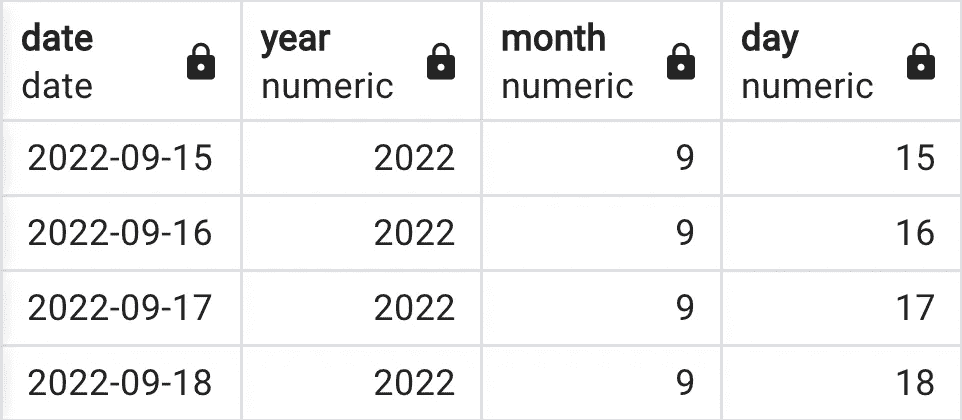

日期表

## 类型 1:覆盖

该解决方案的特点:

*   新值会覆盖旧值
*   变更历史未知

让我们看看下面的例子:

1.  **产品表**初始状态

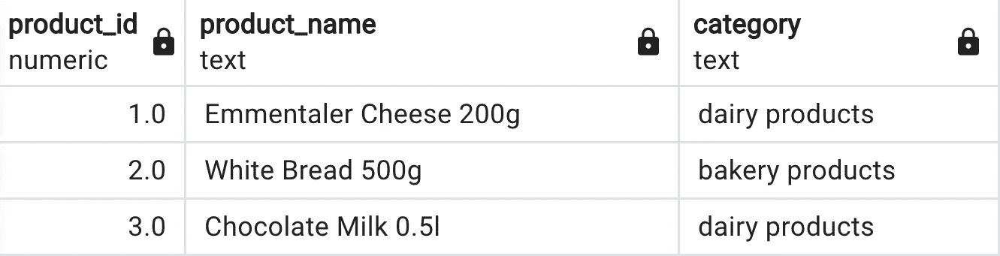

产品表

2.新的要求来了——产品**巧克力奶 0.5** 现在将有一个新的名字——**甜巧克力奶 0.5 升**，类别也需要改变，它将不再是**乳制品**而是**糖果。**

3.**应用更改后的产品表**:

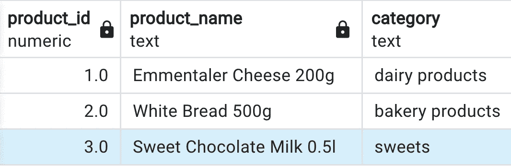

变更后的产品表

此解决方案的潜在问题:

*   如果我们在 BI ( **Tableau，Power BI 等中有一些**可视化。)**汇总数据—(汇总每个类别的收入、每个类别的平均收入等。)他们会受到影响。乳制品的总价值将会降低，而糖果的总价值将会提高。**
*   一些 SQL 查询可能会中断。假设您有一个 sql 视图，**在**product _ name = Chocolate Milk 0.5l**上过滤**一些值。但是名为**巧克力牛奶 0.5l** 的产品已经不存在了。这可能会在进一步的数据分析/数据处理中导致错误。

## 类型 2:新行

该解决方案的特点:

*   向维度表添加附加行
*   保留表中的更改历史
*   给出了最大范围的可能性
*   抵抗频繁和不可预测的变化

在这种情况下，产品表将保留两列**巧克力奶 0.5l** 和类别**乳制品**以及新添加的列**甜巧克力奶 0.5l** 和类别**糖果**。像这样:

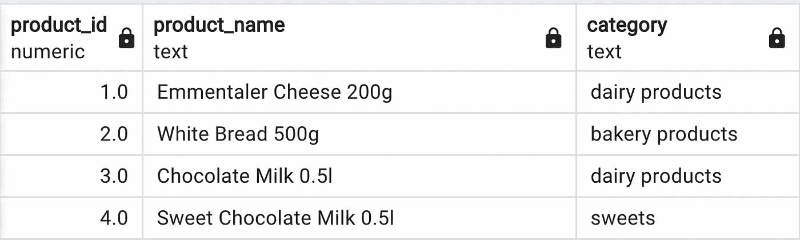

产品表

这种方法的缺点是什么？让我们看看下面的**事实表。**

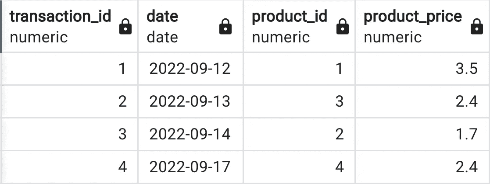

事实表

id 为 2 的交易用于类别为**乳制品**的**巧克力牛奶 0.5l** ，id 为 **4** 的交易用于新类别为**糖果的**甜巧克力牛奶 0.5l** 。**像这样:

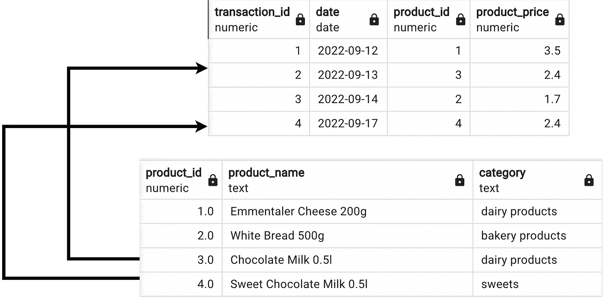

事实和产品

在这种情况下，将维护两种状态下的产品信息。

但是正如您可能注意到的，这种解决方案并不理想。让我们再来看看这张表:

产品表

你觉得这里有什么问题吗？算独特产品呢？基本上，如果我们计算列 **product_name** 中的唯一值，我们将得到 4，但这不是真的，我们有 **3 个唯一产品。**

为了统计独特的产品，我们需要添加一个名为 **product_key** 的新列

该列将为**自然关键字**，**追加关键字**为当然 **product_id** 已经存在于**表中。S** QL 键类型超出了本文的范围，但是如果你想获得更多信息，这里有内容丰富的文章。

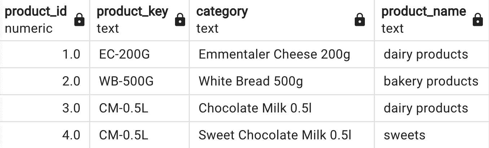

带有产品密钥的产品表

现在，为了获得列 **product_key** 中的唯一元素计数，我们将使用以下查询:

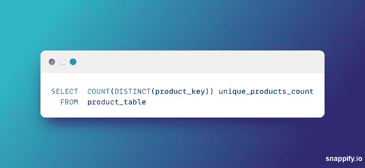

示例查询

我们能做得更好吗？我们当然可以。

用我们现在的方法:

产品表

我们无法确定当前正在使用哪个 product_id。对此的解决方案可能是添加 **2 个额外的列:**

*   *添加日期* —添加产品的日期
*   *exp_date* —删除/更改产品的日期

所以这个表现在看起来像这样:

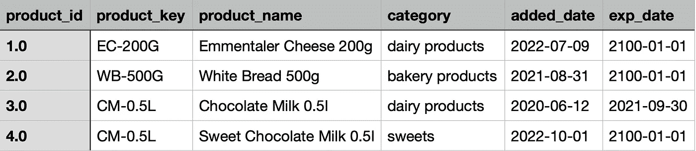

产品表添加日期/到期日期

如果产品目前正在使用中，添加过期日期(此处称为 exp_date)作为未来的某个**日期**被认为是**最佳实践**，此处为 2100–01–01。

除了使这个表更容易使用之外，我们还可以添加一个名为 **is_current** 的列，例如，它将存储布尔值 True/False，所以它看起来像这样:

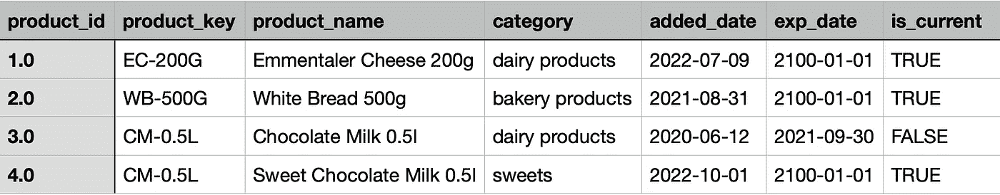

带有 is_current 的产品表

## 类型 3:附加属性

该解决方案的特点:

*   我们添加了**额外的列**，而不是像类型 2 那样添加额外的行
*   用于一次重大且可预测的变更
*   这种解决方案不适合频繁的或者不可预测的变化——在这种情况下是类型 2 规则。
*   最不频繁类型

3 型相当少见，但不代表不能用。让我们看一下这个例子。查看下面的地区表:

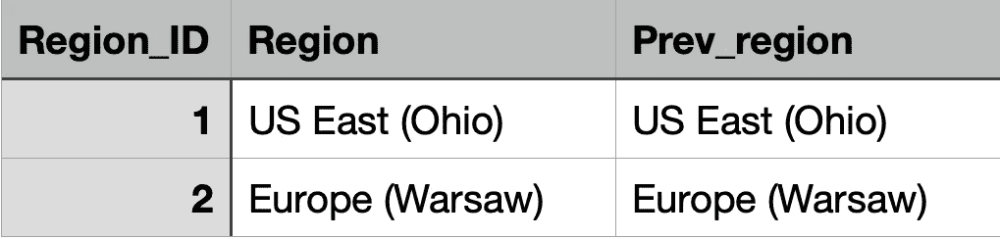

初始状态的区域

如你所见，有两个独特的区域——美国东部(俄亥俄州)和欧洲(华沙)。让我们想象一下，业务经理已经决定他们需要重组区域结构。欧洲的新区域将被创建——**欧洲(柏林)**，它在此之前是**欧洲(华沙)**的一部分。我们的区域表将如下所示:

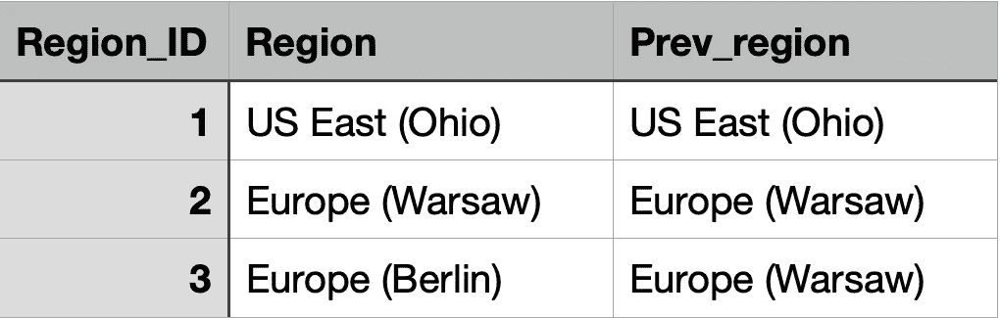

欧洲地区(柏林)

因此，现在区域的历史得到了维护——如果我们想要在重组没有发生的情况下分析数据，我们可以很容易地使用列 **Prev_region** 中的值。

*注意:*您还可以添加**多个属性**(列)来维护历史记录——但是保留数百个属性并不是一个好主意，在这种情况下，您应该考虑不同的方法。

## 总结:

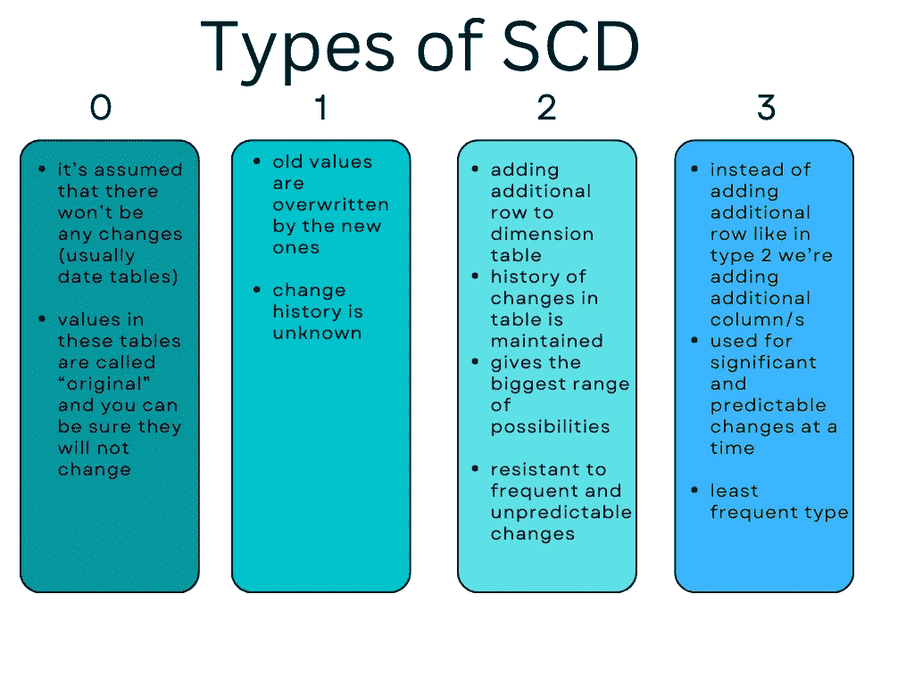

对比图表

**对于大多数情况，类型 2** 应该是我们的**默认方法**，无论如何，您可以混合实例 1 和 2 的 SCD 类型。只是先和业务用户讨论一下，这样你就知道有哪些用例了。

## 进一步阅读:

以下是一些绝对值得一看的资料来源:

Ralph Kimball 的《数据仓库工具包:维度建模完全指南》

[数据仓库——尼古拉·舒勒的终极指南](https://www.udemy.com/course/data-warehouse-the-ultimate-guide/)伟大历程