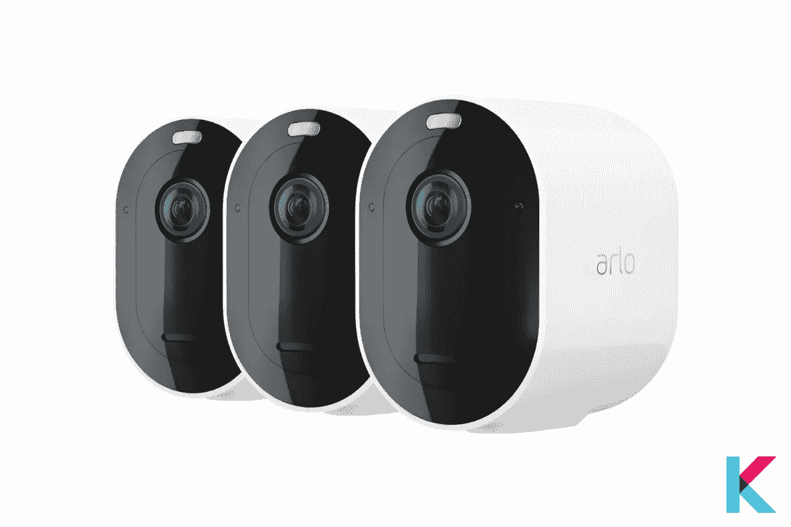

# 智能家居技术

> 原文：<https://blog.devgenius.io/smart-home-technology-82e802c016cb?source=collection_archive---------5----------------------->

近年来，智能设备的数量急剧增加。此外，人们可以在任何地方使用一台设备，通过智能手机或其他联网计算机远程操作任何东西。

然而，我们无法想象随着智能设备的出现，智能家居的未来会给我们带来什么。它带来的可能性是无限的。虽然，智能家居设备数量的增长趋势揭示了一件确定的事情。也就是说，我们比以往任何时候都有更多的智能家居硬件选择。

*   什么是智能家居技术
*   2021 年最佳家用设备
*   智能家居如何工作
*   智能家居技术的利与弊

# 什么是智能家居技术？

[智能家居技术](https://kodmy.com/smart-home-technology/)通常指连接到独立远程控制网络的任何一组设备、系统或电器。

可以在任何地方通过智能手机或其他联网计算机远程操作。它也被称为家庭自动化。家电、家庭娱乐系统、家庭安全系统和环境控制设备都是智能家居技术的例子。

此外，计算机和智能手机连接到互联网，时钟、扬声器照明、气候、娱乐系统和电器由家庭自动化系统控制。当连接到互联网时，家庭设备是物联网(IoT)的重要组成部分。

我们经常认为语音助手是我们自己构建智能家居的起点。它们为家庭成员或室友之间提供了一种简单的交流方式。我们最佳智能家居产品清单上的许多产品，但不是全部，将与多个语音助手一起工作。以下是你可能会考虑购买的一些最好的智能家居产品。

# 2021 年最佳智能家居技术解决方案

使用众多智能家居产品解决方案中的一种，您可以监控从照明和温度到锁和家庭保护系统的任何东西。它包括家庭安全系统、智能照明解决方案、智能插头、家庭自动化系统、智能扬声器和显示器、家庭娱乐系统和环境控制系统。下面列出了一些[最佳家居智能解决方案](https://kodmy.com/best-smart-home-devices/)。

# 智能家居安全系统

智能家庭安全系统允许您通过智能手机和应用程序监控和控制您的家庭安全设备。此外，该系统连接到您的 WiFi、Z-Waves 和 Zigbee 无线协议。它包括门锁、烟雾/一氧化碳探测器、水传感器、室内和室外监控摄像头以及智能家居报警安全系统等设备。这里有几个智能家居安全系统的设备。

*   **按视频门铃 3 加**

这是智能门铃的第三个版本。它引入了改进的运动检测功能。它能让你看到门口的任何人并与之交谈。当它按下时，你会通过智能手机应用程序收到警报。是的。它会通知你任何的运动检测。它还有 160 度的视野。

*   **爱洛 Pro 4 聚光灯**

Arlo Pro 4 聚光灯摄像头是我们观看外面发生的事情的首选，而不必离开您的沙发。这种高分辨率、耐气候的监控摄像机可以捕捉动态镜头，同时还可以照亮在你房子里移动的任何东西。

如果你喜欢[比较爱洛相机和其他相机](https://kodmy.com/compare/smart-security-cameras?modelList=arlo-pro-3-spotlight,eufy-security-indoorcam)，你可以在这里找到最好的比较。

你可以从亚马逊购买之前版本的爱洛 Pro 4 聚光灯相机。

*   **Wyze 智能锁**

Wyze 智能锁是智能门锁领域最好的低成本智能家居门锁。这是非常简单的使用和设置。此外，它使用插件网关连接到您的 WiFi 网络。太神奇了！你可以用你的智能手机控制它。我认为它是你口袋里最好的智能锁。

如果你喜欢[比较 Wyze 智能锁和其他智能锁](https://kodmy.com/compare/smart-door-locks?modelList=wyze-lock,schlage-smart-lock)，你可能会在这里找到最好的比较。

你可以从亚马逊购买这款 Wyze 智能锁。

*   **响铃报警安全套装(5 件)**

对于那些寻求标准安全的人来说，报警安全套件是最实惠的解决方案之一。它很容易安装。此外，您可以接收运动通知并远程控制您的系统。他们对这些功能不收取额外费用。它支持 Alexa、Ring 和其他亚马逊设备。我认为这是智能家居安全新手入门的好地方。

你可以从亚马逊购买这个警报安全套件。

# 智能照明解决方案

智能照明解决方案比以往任何时候都多。所以，你必须为你的家选择最好的智能灯。只需简单请求您最喜爱的语音助手，您就可以用声音点亮您的家。以下是几款最适合你的智能照明产品。

*   **Wyze 灯泡**

Wyze 灯泡是我们见过的最具性价比的智能白色 LED 灯泡。你可以用手机控制，不用集线器，也可以用亚马逊 Alexa 或者谷歌助手，用语音控制。此外，它有 9.5 瓦和高达 800 流明。有一个 Wyze 应用程序可以设置和控制你的灯泡。

如果你想[比较 Wyze 智能灯泡和其他智能灯泡](https://kodmy.com/compare/smart-lights?modelList=wyze-bulb,lifx-mini-bulb)，你可能会在这里找到最好的比较。

你可以[从亚马逊](https://amzn.to/3o1ALQn)购买 Wyze 灯泡彩色灯泡。

*   **飞利浦色调白色和彩色氛围入门套件**

飞利浦色调白色和彩色氛围入门套件是最好的智能灯泡入门套件。它包括两个或四个可调光的彩色灯泡和一个集线器。可以配合 Google Assistant、Alexa、IFTTT、Smart things 等使用。如果你选择这款智能灯泡，它可以为你的家增添一份美丽。

你可以[从亚马逊](https://www.amazon.com/gp/product/B07XH4KDR5/ref=as_li_tl?ie=UTF8&camp=1789&creative=9325&creativeASIN=B07XH4KDR5&linkCode=as2&tag=kodmy-20&linkId=4eefd05eb1d08d488ad32ce908ee18e8)购买这款飞利浦色调白色和彩色 LED 智能按钮入门套件。

*   **环形 Pathlight 太阳能**

环形 pathlight Solar 是著名的户外智能灯。你可以用这款神奇的智能路灯照亮你的道路。它在回家的路上发出高达 80 流明的白光。当连接到 bridge 时，您可以使用该应用程序自定设置、向您的手机发送通知以及设定日程安排。它也适用于 Alexa。

# 智能厨房电器

如果你对厨房电器自动化感兴趣，是时候选择最好的厨房电器了。使用这些智能小工具，你可以让你的厨房更加安全。市场上有许多可用的电器，如三星家庭集线器冰箱、Anova 烹饪精密炊具、自动皂液机和智能马克杯。下面给你介绍几款智能家居厨房电器。

*   **东芝 ML 智能台面微波炉**

这是一个奇妙的智能微波炉，带有 LED 腔灯和节能生态模型。你可以使用语音或应用程序控制烤箱。当达到最佳加热效果时，它会通过湿度传感器自动调节。烤箱上有一个开/关按钮。所以，你可以在烹饪完成后停止哔哔声。

*   **汉密尔顿海滩智能咖啡机**

如果您想以热咖啡开始新的一天，这个咖啡机是您的绝佳选择。你可以用语音命令来控制咖啡机。你可以说，“Alexa，给我弄杯热咖啡”。然后，它为你煮咖啡。是你最舒适的智能厨房电器。

你可以从亚马逊购买这款汉密尔顿海滩智能咖啡机。

*   **三星家庭集线器冰箱**

三星 Family Hub 冰箱是三星最新推出的智能设备。太棒了。你可以给你的冰箱发短信，查看冰箱购物清单，还可以查看它们的保质期。它集成了 PC、屏幕和相机。因此，您可以使用这款智能冰箱安排活动或特殊日子。

# 智能插头和插座

市场上有许多智能插头和插座。你最好知道最适合你家的智能家居插头和插座。

*   **Kasa 智能 Wi-Fi 户外插头**

泳池泵和天井灯非常适合转换成智能家居设备，也可以用手机监控室外智能插头。你可以使用手机或 Alexa 和谷歌语音命令来独立操作两台设备。

你可以从亚马逊购买这款 TP-Link Kasa 智能户外插头。

*   **Wemo WiFi 智能插头**

Wemo WiFi 智能插头是物理控制按键智能插头中的最佳选择。它可以与 Alexa 和谷歌助手等所有主要的智能助手配合使用。此外，它还可以与 HomeKit 和 IFTTT 技术配合使用。

你可以[从亚马逊](https://amzn.to/3ulk3Nb)购买这个 Wemo WiFi 智能插头。

*   **ConnectSense 智能插座**

如果您想为咖啡机、灯具和电视等小型家用电器增加一些智能，ConnectSense Smart Outlet 2 是一个绝佳的选择。

你可以[从亚马逊](https://amzn.to/3xbghaC)购买这个 ConnectSense 智能墙壁插座。

# 智能扬声器和显示器

智能扬声器是一种语音激活的无线设备，集成了您最喜爱的语音助手。此外，智能显示器与智能扬声器相结合。因此，您可以获得更多功能，如视频通话、YouTube、网飞等。

*   **亚马逊 Echo Dot 第四代**

亚马逊 Echo Dot 第四代是 Alexa 推出的蓝牙音箱。它可以直接控制智能家居设备，使用 If This Then That (IFTTT)。它有一个球形，令人尊敬的低音，比以前的 echo 智能扬声器更好的音频质量。你可以从 Alexa 获得帮助来播放新闻、播放音乐、查看天气以及控制你的智能家居设备。

如果你想[比较亚马逊 Echo Dot 第四代与其他智能音箱](https://kodmy.com/compare/smart-speakers?modelList=echo-dot-4th-gen,google-home-mini)，你可能会在这里找到最好的对比。

你可以从亚马逊购买亚马逊 Echo Dot 第四代。

*   **Sonos One**

Sonos One 兼容普通语音助手和，在音量方面。是智能用户中著名的无线多室音箱。此外，它还提供了更好的音质。我觉得用 Sonos one 来启动你的 Sonos 系统是一个不错的选择。

*   **谷歌巢枢纽**

谷歌的 Nest Hub 智能显示屏对你来说是个不错的选择。它配有反应灵敏的触摸屏，可以与谷歌助手配合使用。它可以帮助你检查你的日历是什么，或者寻求食谱方面的帮助。有一个控制面板屏幕。它可以帮助您轻松控制和整理智能家居设备。

# 机器人吸尘器和拖把

如果你不喜欢清洁、扫地和吸尘，机器人吸尘器和拖把是一个很好的解决方案。你可以放松，然后 iRobot 会为你做一切。

*   **iRobot Roomba i7+**

这是最好的真空与智能映射功能。它与 Alexa 智能助手和 WiFi 配合使用。有时候，你可能忘了用吸尘器打扫房间。现在你可以放松了，不用担心你的家。使用 CleanBase 自动污物处理功能，它可以自行清空长达 60 天。

如果你想[对比 iRobot Roomba i7+真空和其他真空](https://kodmy.com/compare/smart-robot-vacuums?modelList=irobot-roomba-i7-plus,roborock-s7-robot-vacuum)，你可以在这里找到最好的对比。

你可以从亚马逊购买这款 iRobot Roomba i7+机器人吸尘器。

# 智能娱乐设备

你的娱乐系统想要迈出第一步。因此，我们必须随时了解我们周围有哪些可用的娱乐设备。您可以轻松地将设备连接到智能手机或平板电脑。

*   **罗技和谐家居枢纽**

罗技 Harmony Home Hub 是一款基于智能手机控制的时尚设备。您可以控制多达 8 个家庭娱乐和其他自动设备。您还可以控制扬声器的播放和屏幕上的内容。

你可以通过下面的链接从亚马逊购买这个罗技和谐精英遥控器，集线器和应用程序。

# 智能家居如何工作

智能家居中的所有设备都是相互连接的。此外，他们可以从一个位置进行控制，如智能手机、平板电脑、笔记本电脑或游戏机。一个家庭自动化系统可以控制门锁、电视、恒温器、家用电脑、照相机、灯，甚至像冰箱这样的电器。

这种智能家用电器具有自学能力。它可以让它们了解主人的时间表，并根据需要做出改变。带照明控制的智能住宅允许房主减少用电量，节省能源成本。

# 智能家居技术的利与弊

**优点**

随着智能家居技术变得更加经济实惠和易于使用，有一些非常酷的选择可以让你的家焕然一新。

安装智能家居技术设备对房主来说很方便。房主只需一台电脑，通常是智能手机或平板电脑，就可以监控电器、恒温器、照明和其他功能，而不是使用多种设备。通过始终在线的连接和通知系统方便地保护您的家庭和财产，使消费者能够快速响应意外情况，从 Wi-Fi 烟雾报警器到自动关闭的插头。

当用户连接到便携式计算机时，他们可以获得关于他们家中问题的警报和更新。例如，智能门铃使房主能够看到上门的访客并与之互动，即使他们不在场。用户可以调节内部温度、照明和电器。作为安装智能系统费用的交换，房主可以省下一大笔钱。

智能恒温器和智能照明将通过自动切换或关闭来帮助您节约能源。智能系统将帮助你停止运行空调或让车库里的灯整夜亮着。同样，从任何地方应门。当有人敲门时，智能门铃和门锁会向你的智能手机发送通知。

**缺点**

虽然智能家居提供了舒适和成本节约，但它也不是没有缺点。技术的制造者和消费者继续受到安全威胁和缺陷的困扰。例如，熟练的黑客可以访问智能家居的联网设备。

在这种情况下，确保使用强密码保护智能设备和装置，在可能的情况下使用加密，并且仅将可信装置连接到个人网络，这些都是减少这种攻击可能性的方法。

如前所述，安装智能技术的成本从无线系统的几千美元到有线系统的数万美元不等。这是一个很高的代价，特别是考虑到家庭中的每个人都有可能需要一个陡峭的学习曲线来适应这个系统。