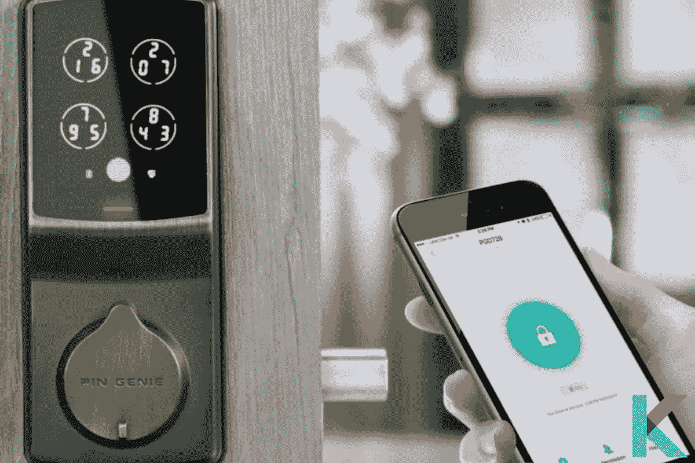
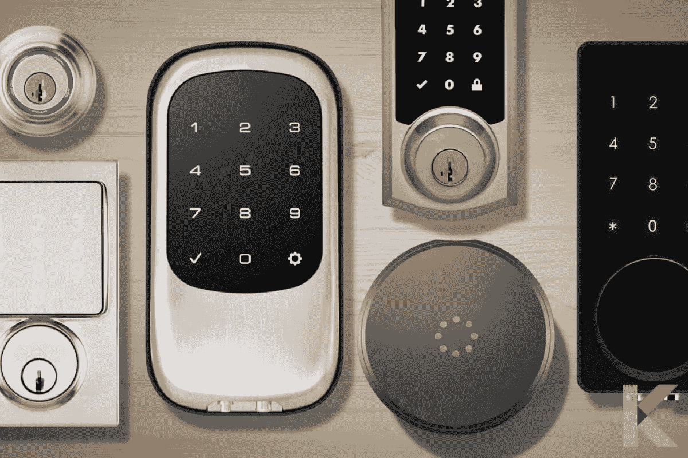
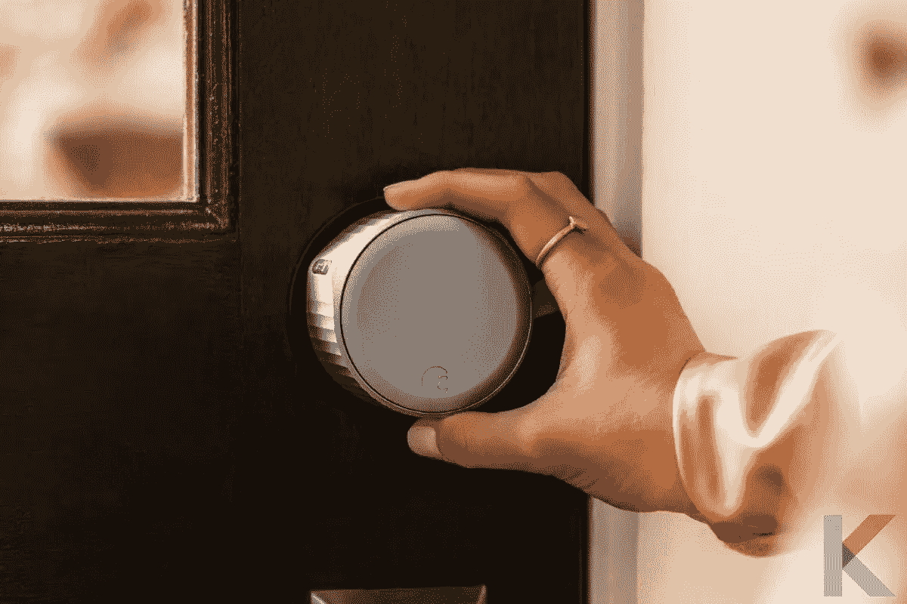
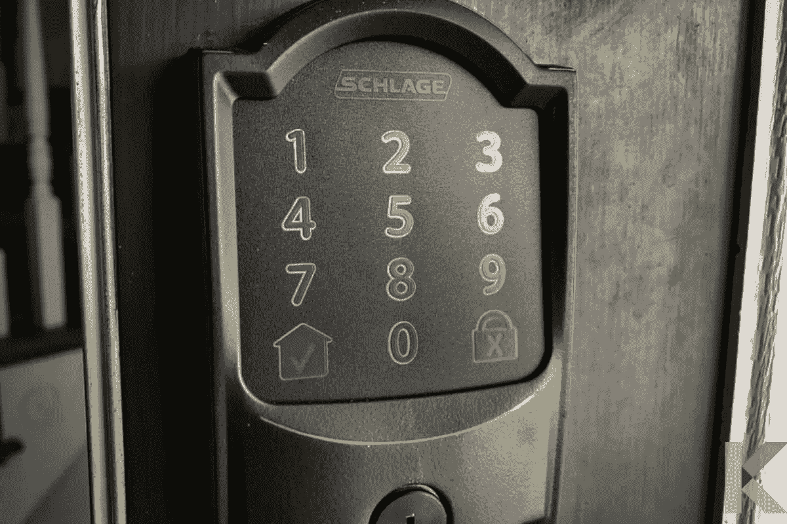
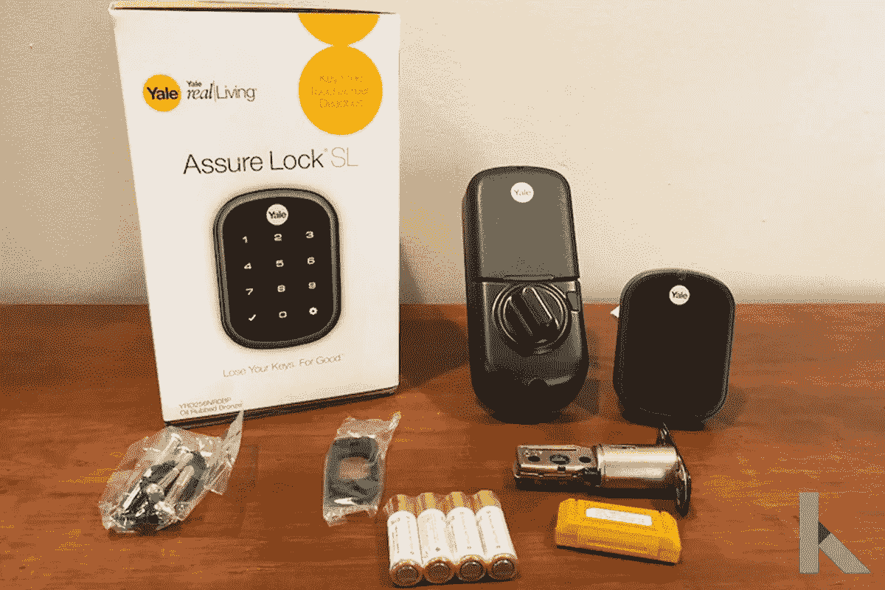
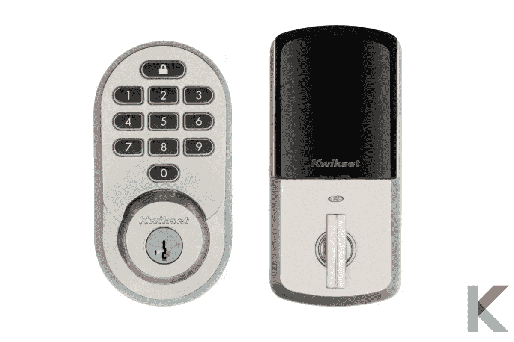
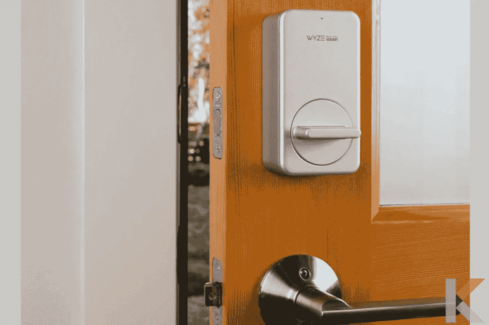
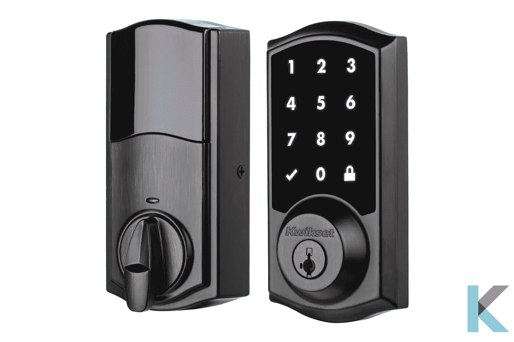
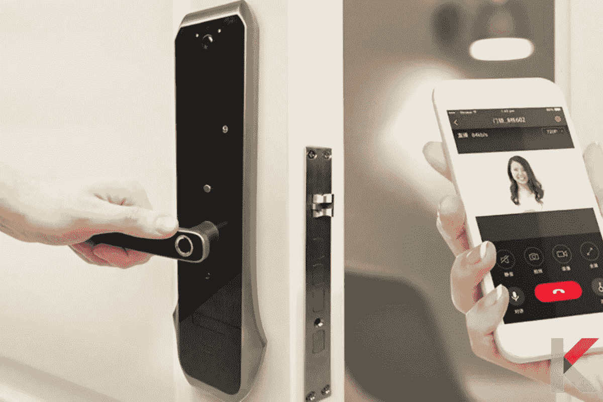
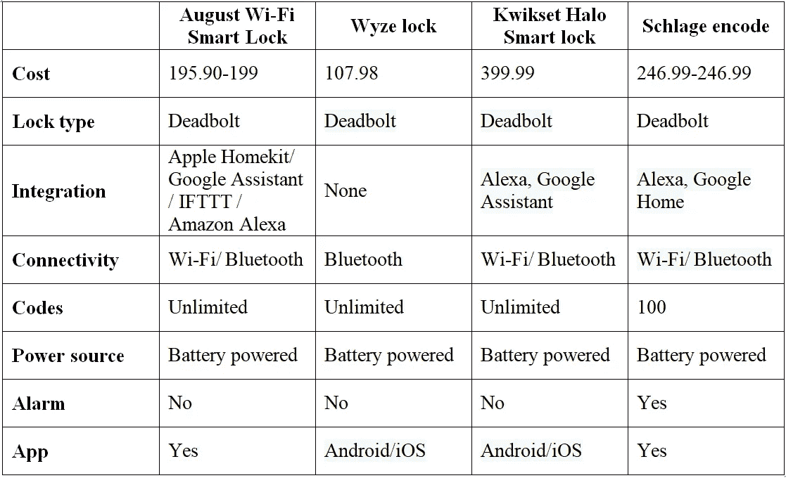

# 智能生活智能锁 2021

> 原文：<https://blog.devgenius.io/smart-lock-for-a-smart-life-2021-46ccfa7c6ffb?source=collection_archive---------9----------------------->

传统的锁很快就会被淘汰。我们现在可以用几十种智能锁解决方案来更安全地保护我们的家。它提供了保护和灵活性，允许您控制从您的智能手机进入您的家。是的。设置起来比你想象的要容易。以下是你需要了解的智能锁，以及 2021 年最好的智能锁。

# 什么是智能锁？

[智能锁](https://kodmy.com/smart-lock-for-smart-life/)将一把普通的锁改造成你家的无钥匙进入门锁。它是一种电子锁，当它从授权设备接收指令时，操作锁定和解锁功能。它还使用无线协议和加密密钥来执行这个过程。

它需要两个组件才能像传统锁一样正常工作。钥匙和锁或者硬件和软件是这两者的两个组成部分。但是，这种钥匙不同于传统的物理钥匙。它就像一个来自智能家居中心、表链或智能手机的加密信号

此外，智能锁可以通过移动应用程序远程控制，以允许或拒绝访问。它有一个内置的 Wi-Fi 链接，支持访问警报和摄像头等监控功能，以显示谁在请求访问。一些智能锁可以与[智能门铃](https://kodmy.com/ring-video-doorbell-3-plus/)结合使用，让用户看到谁在门口以及他们什么时候在那里。

# 智能锁的功能

许多都带有蓝牙和 Wi-Fi 连接，让您可以非常轻松地访问远程功能。然而，智能锁有很多功能。让我们看看它们是什么。

*   **提供基于 app 的远程控制**

大多数智能门锁都带有 iOS 和 Android 应用程序，允许你从手机上远程控制锁，监控谁来谁往，并在发生任何异常情况时接收警报。

*   **连接 Wi-Fi 进行实时监控**

Wi-Fi 连接允许您查看实时进出日志，因此您总是知道谁在何时进出了您的家。对于希望确保孩子安全放学回家的父母来说，这是一项至关重要的功能。

*   **使用蓝牙连接**

通过连接您的智能手机并在您靠近时打开门，蓝牙连接允许您的智能锁识别您的身份。

*   **利用多种无钥匙进入选项**

用你的智能手机接近解锁，用你的智能手机远程解锁，为任何需要进入你家的人定制密码，以及语音命令都是无钥匙进入的可能选择。

*   **创建临时或永久进入密码**

任何智能锁都允许您为访客、清洁服务、遛狗者、维护服务以及您的家庭成员生成永久或临时的入口代码，

*   **实施访问限制**

对于每个输入代码，设置访问限制。此外，限制条件可以包括一周中的指定天数和小时数，以确保代码持有者只能在这些时间内进入您的家中。

*   **允许自动锁定设置**

您可以使用自动锁定选项，安排您的智能锁在门没有上锁的情况下自动锁门一段时间。

*   **提醒会发送到您的智能手机**

如果有人试图闯入或篡改智能锁，您会在智能手机上收到通知。

*   **与您智能家居的互联网连接集成**

解锁后，将其链接到已连接的智能家居，以激活其他智能家居设备。例如，当车门解锁时，将智能灯设置为打开。

*   **将视频门铃与智能锁同步**

为了增加安全性，请将智能锁连接到视频门铃和任何室内摄像机。此外，任何进入您家中的人都可以被看到或记录下来。

详见: [***苹果家用钥匙兼容锁***](https://kodmy.com/apple-home-key-compatible-locks/) 。

# 2021 年 6 款最佳智能锁

最好的智能锁可以与其他[智能家居设备](https://kodmy.com/best-smart-home-devices/)通信，允许您在进门时打开智能灯并调节恒温器。您甚至可以要求 Alexa、Siri 或 Google Assistant 在您出门的时候锁门，如果您将它连接到这些服务的话。下面将介绍 2021 年最佳智能锁。

*   **8 月份无线智能锁**

八月的无线智能锁比原来的小 45%。它还配有内置的无线网络，无需安装奥古斯特连接桥将您的锁连接到家庭网络。

它有一个简单的安装过程和功能，如门的感觉。此外，它还与大量其他智能家庭系统兼容，比如 [Alexa](https://kodmy.com/the-best-alexa-compatible-devices-in-2021/) 和 Google Assistant。

如果您想将奥古斯特 Wi-Fi 智能锁与其他锁进行比较，请访问[奥古斯特智能锁功能比较 2021](https://kodmy.com/compare/smart-door-locks?modelList=august-smart-lock,wyze-lock) 。

快一点！ [**现在从亚马逊获得 8 月 Wi-Fi 智能锁**](https://amzn.to/3AFXDZv) **。**

*   **西勒奇编码**

西勒奇编码是我们挑选的最好的带警报的智能锁，因为它会发出震耳欲聋的声音。

西勒奇编码是手动、钥匙代码和遥控锁的完美结合，它还支持亚马逊钥匙，允许亚马逊送货人员在他们来的时候打开门，并将你的产品存放在房子里。由于这一特点，它们不太可能被偷。

如果你喜欢比较西勒奇编码智能锁与其他锁，你可以找到[西勒奇编码智能锁功能比较 2021](https://kodmy.com/compare/smart-door-locks?modelList=schlage-smart-lock,kwikset-halo-smart-lock) 。

快一点！ [***从亚马逊***](https://amzn.to/3CHQHLW) **获取** ***西勒奇编码智能锁。***

*   **耶鲁真人向 SL 保证**

耶鲁 Real Living Assure SL 是目前最好的智能锁之一，因为它支持众多智能家居标准。你可以用你的智能手机或智能扬声器来操作它，如[亚马逊 Echo](https://kodmy.com/alexa-smart-home-devices/) 、[谷歌 Nest Mini](https://kodmy.com/google-nest-mini-setup-and-reviews/) 或谷歌 Nest Hub Max，无论你有一部顶级 iPhones 或 Android 手机。耶鲁是锁和家庭安全领域的知名品牌。此外，这是一个设计良好，时尚的锁，易于安装。

快一点！ [***现在从亚马逊获得耶鲁 Assure Lock SL 带 Z-Wave***](https://amzn.to/3zXNoP6)。

*   **快速光环**

Kwikset Halo 智能锁可以用智能手机或键盘轻松打开和锁上您的门。但是，如果你有一个出租的房产，如果你担心有人制作了许多副本，这可能是一个问题。

这就是我们欣赏 Kwikset Halo 的原因，它包括一个非常容易操作的锁。此外，这款锁可以直接连接到你的 Wi-Fi 网络，兼容 Alexa 和 Google Assistant，并在其触摸屏上集成了一些优秀的防盗功能。

快一点！ [***从亚马逊***](https://amzn.to/3m8h5In) 获得 Kwikset Halo 智能锁。

*   **Wyze 智能锁**

Wyze 以生产一些最好的低成本智能家居设备而闻名。它是该公司的第三款产品，也是最便宜的智能锁。它的设置和使用都很简单，而且与 Wyze 的其他产品配合得很好。然而，在我们进行评估时，它不支持任何其他智能家居系统，如 Alexa 或谷歌助手。

如果你喜欢比较 Wyze 智能锁与其他锁，你可以找到 [Wyze 智能锁功能比较 2021](https://kodmy.com/compare/smart-door-locks?modelList=wyze-lock,august-smart-lock) 。

快一点！ [***现在从亚马逊获得 Wyze 智能锁***](https://amzn.to/3o1ALQn) 。

*   **Kwikset Premis**

Kwikset Premis 是苹果 HomeKit 生态系统用户的最佳智能锁之一，因为它与苹果的智能家居环境无缝连接。您可以使用钥匙、密码或智能手机将 Premis 连接到您的家中。它还有多种风格和表面处理可供选择。

如果它有 HomeKit 功能，你可以使用 Siri 或 Premis 应用程序来控制它，但你还需要一个 HomeKit 集线器，如 HomePod 迷你或 Apple TV。

查看更多: [***苹果 Home 键 iOS 15 给你的智能家居带来的新功能***](https://kodmy.com/apple-home-key/) 。

# 买智能锁要看什么？

在寻找智能锁时，有几件事情需要考虑。

*   **锁的类型**:智能锁有插销式和杠杆式两种。前者旨在取代现有的插销，而后者将锁和开门杆合二为一。
*   设计:你的智能锁应该和房子的其他部分相配。大多数锁有几种类型和表面，包括黄铜、银和青铜。
*   **安全**:智能锁自带一个或多个进入选项；你喜欢哪个就看你自己了。
*   **钥匙**:有些智能锁有一个经典的钥匙孔，就像普通的锁一样。有些甚至可以重新键控，使过渡更容易。
*   键盘:最流行的访问方式；大多数智能锁允许你创建和管理几十个，如果不是几百个的话。
*   虚拟钥匙:这个功能允许你发送一个虚拟代码给其他人，然后他们可以使用他们手机上的智能锁应用打开你的门。您可以控制这些代码的有效期。
*   **指纹识别器**:现在一些智能锁集成了指纹识别器，所以你不必记住密码或钥匙就能进入；只需将手指放在阅读器上就可以进入。
*   **连接**:智能锁必须连接到您的家庭网络才能被远程控制和监控。
*   **设置**:一些智能锁取代了你现有的插销，而另一些智能锁安装在你现有的插销上，允许你维护你的钥匙。

# 智能锁:它们值多少钱？

你首先要考虑的是更换现有锁的成本。毕竟，智能锁比普通锁要贵得多。有一些 100 美元左右的智能锁，但如果你想要一把可以从任何地方控制的、具有语音命令和推送警报等功能的锁，你必须花更多的钱。

总的来说，门锁和插销为用户提供了不同程度的安全性和便利性。智能锁的价格取决于品牌、型号和功能。下面是一些最好的智能锁的对比。你可以随心所欲地选择最好的智能锁。

**我们的选择**

考虑到智能锁的成本，Wyze 锁是你的最佳选择。是我见过最便宜的智能锁。自动锁定和解锁系统，访问日志，电子钥匙和集成的门传感器只是 Wyze 锁的几个有吸引力的功能。

西勒奇感应锁是我们的下一个选择，它也是一款优秀的智能锁。这是一个支持 HomeKit 的模型，其外观和功能与西勒奇连接几乎相同。还提供了 Wi-Fi 适配器，它提供了亚马逊 Alexa 和谷歌助手的兼容性，同时删除了 HomeKit 的兼容性。

在本文中，您可以了解智能锁比较、智能锁 google、智能锁应用程序、智能锁前门、带摄像头的智能锁等等。