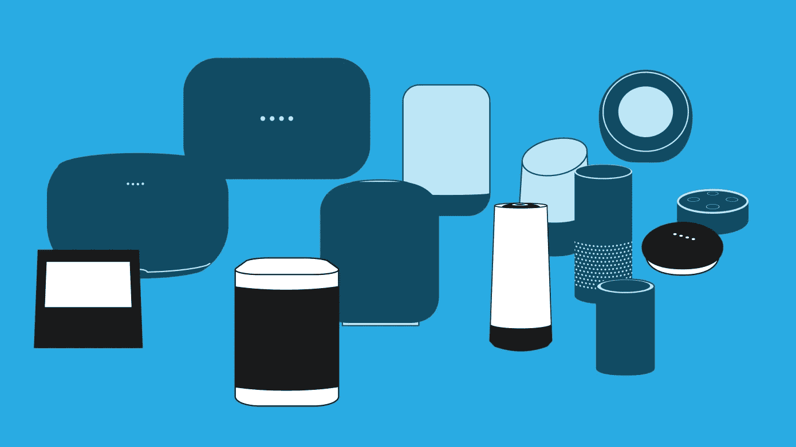

# 智能扬声器及其内部技术——第 1 部分

> 原文：<https://blog.devgenius.io/smart-speakers-and-the-tech-inside-part-1-32c65d2fce82?source=collection_archive---------6----------------------->

我从事智能音箱开发已经有一段时间了，并且是智能音箱及其技术的超级粉丝，我需要放下我的研究，从工具软件、扬声器配置、个人体验和开发者生态系统开始，介绍主要品牌设备上使用的各种技术。

图片由 techcrunch.com 提供

消费者体验的稳步发展简化了人们与小工具的交互方式，这使得我们从使用旋钮控制器到按钮(按键)，再到基于触摸传感器，最终到基于语音的控制器。由于计算速度的飙升和 ML & AI 技术研究的进步，为一种称为语音 UX 的尖端消费者体验打开了大门。

什么是智能音箱？

> 这当然是一个有一些智慧的演讲者。当用户对它说话时，它能理解…当然它能听你说话…它有一个内置的角色，被称为语音助手。不同的公司给它起了不同的名字，就像我们都是人，只是名字不同而已。毕竟是一个品牌标识:-)它可以跟你说话，它可以回答你的问题，它可以笑，唱歌太像人类了。

上面的定义是一个非常外行的术语。在开始时，我承诺我会对它内部的技术进行深入研究，让我们拆掉扬声器，看看有什么组件可以像人一样工作。

首先，它有耳朵…是的，就像人类一样，它有耳朵…不仅限于两个，它可以有多达 8 个。从技术上讲，它有几个麦克风，称为麦克风阵列，可以从 2 到 8 不等。主要基于设备形状因素，该麦克风阵列可以圆形、直线或三角形方式放置。

好吧，它有耳朵，这意味着它在听我们说话，这并不意味着它必须回答，直到它被调用。我说的对吗？为什么有人会对你周围的人聊天作出回应，除非有人特别叫你的名字，说些什么或问些什么。哦，你是说它有名字？…是的…它有一个名字。当你问她名字的时候，她会回答你。有意思……在语音助手技术中，这个名字被称为热门词/触发词。

> 音频 DSP 内部的一小块固件，以及预先训练的机器学习模型。来自麦克风通道的音频数据将被连续地馈送到 ML 模型中，以确定用户是否在说热词。音频数据经过各种预处理步骤，以考虑幅度最高的数据，因为我们有多个通道(我猜这就是所谓的波束形成)，同时在音频采集期间放大增益并滤除噪声。

一旦检测到热词，用户的语音将被传输到应用程序/服务器，以进一步理解用户的意图/问题并做出回应。

关于热词 ML 模型预训练的几点思考

具有不同音量水平、性别声音的触发词的许多音频样本被收集并被馈送到像 LSTM/CNN 这样的 ML 算法中用于训练。更多详情可点击此处[https://www . tensor flow . org/tutorials/sequences/audio _ recognition](https://www.tensorflow.org/tutorials/sequences/audio_recognition)。有许多开源框架可以用来创建自己的触发词。

现在大脑和耳朵都已经安装好了，我给你一些时间来体验这项技术，让我们很快见面，在我接下来的系列文章中了解整个软件组件套件。直到那时，快乐阅读，享受语音聊天。