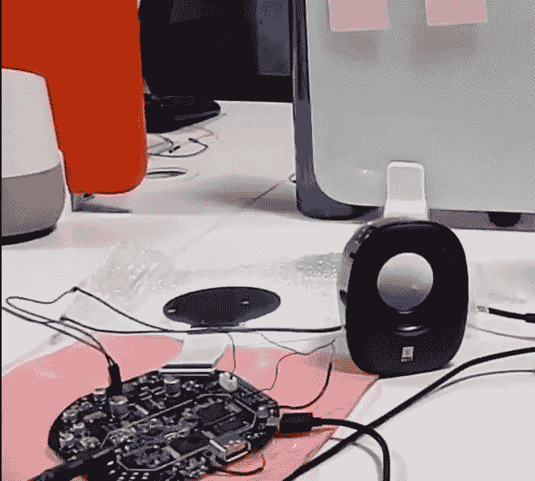
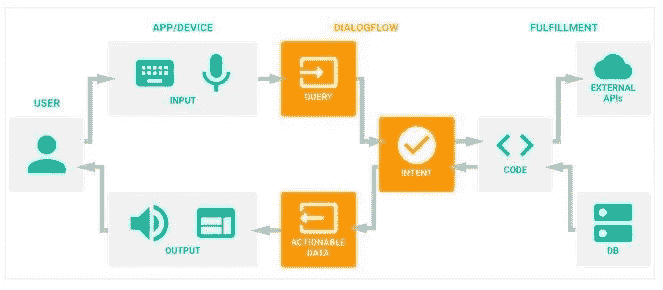

# 智能扬声器及其内部技术——第二部分

> 原文：<https://blog.devgenius.io/smart-speakers-and-the-tech-inside-part-2-9d144d44e6e?source=collection_archive---------8----------------------->

这是智能音箱和科技内幕系列的第二篇文章。如果您还没有阅读，我建议您浏览第[部分 1](https://medium.com/@kramudu/smart-speakers-and-the-tech-inside-part-1-32c65d2fce82) 并回到这里。

为了让这个故事更有趣和互动，我想把它作为我的朋友 Rishi Teja 先生(RT)和我(Siva)之间的对话。他读了第一部分，并对了解智能扬声器的内部工作原理很感兴趣。

RT: Siva 我读完第一部分后非常着迷，很想知道

> 当用户与智能音箱交互时会发生什么？
> 
> 单个软件组件中会发生什么？
> 
> 这个小小的软件是如何找出用户在说什么并回应用户的呢？

放松 RT，我能感觉到你的好奇心，相信我，任何精通技术的人探索周围的事物都是很自然的。在接下来的几分钟里，放松自己，我将带你去坐过山车，感受一下所有这些*你所要求的就是你所得到的*事情是如何真正发挥作用的，并体验从金属到云的旅程。享受旅程…

Siva:一旦用户说出热门词汇(Ok Google，Alexa)，扬声器就会检测到触发信号(如第 1 部分所述),并开始捕获音频样本。

Siva:捕获的音频将通过多条音频管道进行处理，如噪音过滤、波束形成和放大，以产生最佳音频样本。

Siva:提取的音频样本被传输到 ASR(自动语音识别)云服务，将语音转换成几乎等同的文本。(例如:[谷歌 ASR](https://cloud.google.com/speech-to-text/docs/basics) ，亚马逊转录，Nuance ASR)。

Siva: ASR 文本被发送到 NLU(自然语言理解)服务，如[谷歌对话流](https://cloud.google.com/dialogflow/docs)，亚马逊 Alexa。让我们考虑一下这个讨论的对话流程。

Siva:现在对话流开始行动，它采用语音查询的文本等价物，将其规范化，并在预训练的 ML 模型(NLP)上运行推理，以获得问题的确切类别。

RT:这个类别是关于什么的？

Siva:训练一个 ML 模型就像教数学模型某些模式(输入)和反应(输出),直到它学习并以一种自然的方式对它未来看到的所有相似模式做出反应。我可以通过多种方式询问天气详情。天气怎么样？还是天寒地冻还是看天气预报？。所有这些模式都可以归为一类，叫做“天气”。比如怀斯。

RT:这不就是一个技能吗？

绝对的。你击中了要害。它有一个角色，技能也是。这是你可以衡量哪种服务最好的方法之一。技能越多，体验越好。

回到正题，NLU 指出了分类的意图。现在，为了找出问题的答案(实现)，DialogFlow 与外部服务进行交互，如天气预报、电影预订、食品订购服务等，或者它可以简单地从其答案数据库中提取相关答案。

希瓦:一旦满足给了你答案……RT 已经加入了……让我猜猜……

RT:因为答案是文本形式的，所以用 TTS 翻译成语音(Siva 给出了线索..Lol)即文本到语音，并最终在扬声器上播放。

湿婆:哇..真快。你是个博学的人。就是这个！！

[https://www . research gate . net/figure/Google-dialog flow-Agent-architecture _ fig 1 _ 326922722](https://www.researchgate.net/figure/Google-Dialogflow-Agent-architecture_fig1_326922722)

> NLU 平台将用户的问题转化为意图。意图一词指的是“用户做某事的意图”。

RT:哦，湿婆…这是一个迷人的旅程。

我知道这次惊险之旅后你需要休息一下。让我们在接下来的系列文章中深入了解更多细节..在那之前保持兴奋。