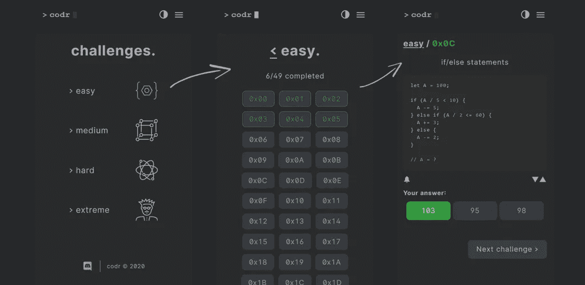

# 服务人员更智能的缓存

> 原文：<https://blog.devgenius.io/smarter-caching-with-service-workers-76672bd24000?source=collection_archive---------21----------------------->

如果你曾经开发过一个 web 应用程序，你一定面临过让它离线工作的挑战。在这篇教程中，我分享了我最近如何让 Codr 离线工作的经验。



Codr 是一个针对[编码谜题和挑战](https://nevolin.be/codr/)的 web app，但是你不需要写任何代码就能成功。初学者学习代码的好工具，专家的放松疗法。

我们的栈是 NodeJS，后端是 Express，前端是 html/js/jquery。要让一个 webapp 离线工作，你需要使用一个服务工作者(又名 web worker)。它是浏览器中一个独立的线程，专门用于某个网站。如果你以前从未使用过服务人员，先去谷歌/Youtube 上学习一些初学者教程。

一个网站通常有两种类型的内容，静态和动态。静态内容是图片、css、html、javascript 等文件。另一方面，动态内容是从 web 服务器加载的，例如实时统计数据、博客评论等。离线用户应该能够访问所有静态内容，并在适当的时候显示一些离线状态消息:“要访问此页面，请联机”。

在 Codr，我们有不需要在线连接的练习挑战/谜题。练习题的数量是有限的，每个练习题都存储在一个单独的文件中，因此很容易被缓存。但对于排名模式，我们坚持在线，因为这些是动态生成的，并保持奖励系统公平合理。

注意:有几个不错的现成解决方案，比如 Google 的 Workbox，可以满足您的离线缓存需求。但是我需要一个定制的解决方案来满足我的特定需求。

我们的服务器列出了需要缓存的所有文件，并将其插入到服务工作者脚本的顶部:

```
const assetsToCache = <%- assetsToCache %>
// note I am using EJS templates
```

所有基本的服务工作者教程都向您展示了如何缓存文件，但是很少有人解释如何强制缓存更新。一种解决方案是稍微更改您的服务工作者文件，这样浏览器将触发更新并对文件进行完整的重新缓存。但是，如果 100 个文件中只有 1 个发生了变化，那该怎么办呢？重新下载其他 99 个文件也有点傻，对吧。

在我的后端，我为每个缓存文件生成一个哈希/校验和(使用 bcrypt)。我的资产结构是这样的:

```
const assetsToCache = [
  {file: '/codr/views/home.html', checksum: 'XYZ123'},
  ...
]
```

有了这样的结构，我可以使用 IndexedDB 存储(客户端)来跟踪所有缓存的文件及其校验和。因此，每当服务工作者触发更新时，它将只重新缓存已更改的文件(其中校验和不同)。以下是我的服务人员的(几乎)完整代码:

```
importScripts('./js/localforage.min.js');
// I am using localforage for IndexedDB accessself.addEventListener("install", function(event) {
    console.log("installing");
    self.skipWaiting();
    event.waitUntil(procDB());
});async function procDB() {
    const cache = await caches.open(CACHE_NAME);
    for (const entry of assetsToCache) {
        const value = await localforage.getItem(entry.file)
        if (!value || value !== entry.checksum) {
            console.log('caching: ' + entry.file)
            await cache.add(entry.file)
            await localforage.setItem(entry.file, entry.checksum)
        } else {
            // console.log('skip re-cache: ' + entry.file)
        }
    }
}
```

编码快乐！:)